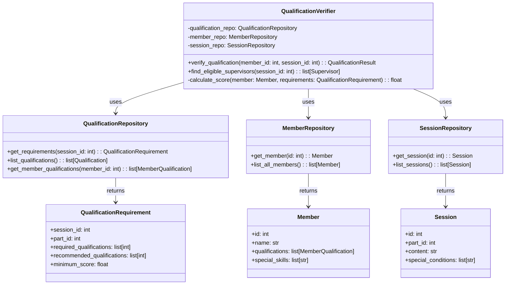
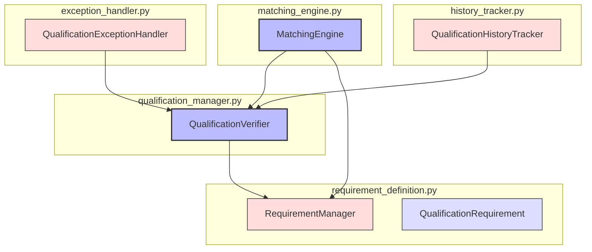

# ALGO-ROT-001.1: 監督資格検証アルゴリズム実装

## 概要
練習表自動生成システムにおける監督資格検証機能を実装します。各パートやセッションに対して適切な監督資格を持つメンバーを特定し、監督候補者リストを作成する機能を開発します。

## 詳細
- 監督資格のモデル化と管理システム実装
- パート・練習内容に対する監督資格要件の定義機能
- メンバーの保有資格と練習セッションの要件マッチング
- 資格の自動更新と履歴管理機能
- 資格要件と例外管理システム

## 依存関係
- 親タスク: ALGO-ROT-001
- BACK-DB-001.1: ユーザー・メンバー管理テーブルの設計と実装
- BACK-DB-001.2: パート・練習内容テーブルの設計と実装

## 参照ファイル
- [設計書/09_アルゴリズム詳細_2_交代最適化.md](../../../../設計書/09_アルゴリズム詳細_2_交代最適化.md)
- [設計書/13_監督資格要件.md](../../../../設計書/13_監督資格要件.md)

## 成果物
- 監督資格検証アルゴリズム実装コード
- アルゴリズムのテストケース
- 資格管理インターフェース
- 実装ドキュメント
- 使用方法ガイド

## ステータス
- [ ] 未開始
- [ ] 進行中
- [ ] レビュー中
- [ ] 完了

## 担当者
未割り当て

## 主要機能
1. **資格モデル管理**
   - 監督資格の定義と分類
   - 資格レベルと難易度の管理
   - 資格間の依存関係定義
   - 資格の有効期限管理

2. **資格要件定義**
   - パートごとの監督資格要件設定
   - 練習内容に応じた資格要件マッピング
   - 特別セッションの資格要件定義
   - 緊急時の資格要件緩和条件

3. **資格マッチング**
   - メンバーの保有資格データベース管理
   - 練習セッションとの資格要件照合
   - 適格者の検出アルゴリズム
   - 監督候補者リストの生成

4. **資格履歴管理**
   - 資格取得状況の追跡
   - 資格更新と期限管理
   - 資格使用履歴の記録
   - 資格取得促進システム

5. **例外管理**
   - 一時的な資格付与機能
   - 特別承認プロセス
   - 資格要件緩和条件の定義
   - 非常時の代替監督者選定

## 設計図

### クラス図


## 実装アプローチ
### 監督資格検証アルゴリズム概要
1. **前処理フェーズ**
   - メンバーデータと資格情報のロード
   - パート・練習内容の要件定義ロード
   - 練習セッションデータの取得
   - 特別条件の確認

2. **資格検証フェーズ**
   - 各練習セッションの資格要件分析
   - 全メンバーの資格情報と照合
   - 適格者の特定とランク付け
   - 条件付き適格者の特定

3. **候補者リスト生成**
   - 各セッションの監督候補者リスト作成
   - 優先順位付けと評価
   - 代替候補者の特定
   - 特別条件下での候補者拡張

4. **結果検証フェーズ**
   - 候補者リストの妥当性確認
   - 未カバーセッションの特定
   - 条件緩和による候補者再検索
   - 最終的な候補者リストの確定

## アルゴリズム詳細
### コアアルゴリズム
```
監督資格検証アルゴリズム:
1. 全練習セッションと全メンバーのデータ取得
2. 各練習セッションについて:
   a. パートと練習内容から資格要件を特定
   b. 特別条件の確認と要件調整
   c. 必須資格と推奨資格のリスト作成
3. 各メンバーについて:
   a. 保有資格の確認と有効性検証
   b. 各セッションの資格要件との照合
   c. 適合度スコアの計算
4. 各セッションごとに:
   a. 適格者リストの作成
   b. 優先順位によるソート
   c. 代替候補者の特定
5. 全セッションの監督候補者マップを返却
```

### 資格適合度計算
```
資格適合度計算:
1. 基本スコア = 0点
2. 必須資格評価:
   a. 全ての必須資格を保有: +100点
   b. 一部の必須資格を保有: 比率に応じて0-99点
   c. 必須資格なし: -100点（除外）
3. 推奨資格評価:
   a. 推奨資格を保有: +10点/項目
4. 経験評価:
   a. 同様のセッション監督経験: +20点
   b. 関連セッション監督経験: +10点
5. 特殊条件評価:
   a. 特別指定監督者: +30点
   b. パート専門性適合: +15点
6. 最終スコア = 合計点数
```

## 実装予定ファイル
以下は実装予定の全ファイルのリストです。各ファイルの役割と目的を簡潔に記載します。

- `src/algorithm/rotation/qualification_manager.py` - 資格管理機能
- `src/algorithm/rotation/requirement_definition.py` - 要件定義機能
- `src/algorithm/rotation/matching_engine.py` - マッチングエンジン
- `src/algorithm/rotation/history_tracker.py` - 履歴追跡機能
- `src/algorithm/rotation/exception_handler.py` - 例外処理機能
- `src/algorithm/rotation/types.py` - 型定義
- `src/algorithm/rotation/constants.py` - 定数定義
- `src/algorithm/rotation/utils/validation_utils.py` - 検証ユーティリティ関数
- `src/algorithm/rotation/config/qualification_config.py` - 資格設定
- `tests/algorithm/rotation/test_qualification_manager.py` - 資格管理機能テスト
- `tests/algorithm/rotation/test_matching_engine.py` - マッチングエンジンテスト

## 実装ファイル構成詳細
### `src/algorithm/rotation/qualification_manager.py`
**目的**: 資格検証の中核機能を実装し、各メンバーの資格が特定のセッション要件に合致するかを判定する

**クラス/インターフェース**:
- `QualificationVerifier`: 資格検証の主要クラス
  - **継承/実装**: なし
  - **主要メソッド**: 
    - `verify_qualification(member_id: int, session_id: int) -> QualificationResult` - メンバーの資格をセッション要件と照合
    - `find_eligible_supervisors(session_id: int) -> list[Supervisor]` - 特定セッションの監督候補者を抽出
    - `calculate_score(member: Member, requirements: QualificationRequirement) -> float` - 適合度スコアを計算
  - **依存クラス**: `QualificationRepository`, `MemberRepository`, `SessionRepository`

### `src/algorithm/rotation/requirement_definition.py`
**目的**: 各パートや練習内容に必要な資格要件を定義・管理する

**クラス/インターフェース**:
- `RequirementManager`: 資格要件管理クラス
  - **継承/実装**: なし
  - **主要メソッド**: 
    - `get_session_requirements(session_id: int) -> QualificationRequirement` - セッションの資格要件を取得
    - `define_requirement(part_id: int, qualifications: list[str]) -> None` - パート別資格要件を定義
  - **依存クラス**: `DatabaseConnector`

- `QualificationRequirement`: 資格要件データモデル
  - **継承/実装**: なし
  - **主要メソッド**: なし（データモデル）
  - **依存クラス**: なし

### `src/algorithm/rotation/matching_engine.py`
**目的**: 監督候補者とセッションの最適なマッチングを行うアルゴリズムを実装

**クラス/インターフェース**:
- `MatchingEngine`: マッチングエンジンクラス
  - **継承/実装**: なし
  - **主要メソッド**: 
    - `generate_matches(sessions: list[Session], members: list[Member]) -> list[SupervisorAssignment]` - 最適な監督者割り当てを生成
    - `optimize_assignments(assignments: list[SupervisorAssignment]) -> list[SupervisorAssignment]` - 割り当てを最適化
  - **依存クラス**: `QualificationVerifier`, `RequirementManager`

### `src/algorithm/rotation/history_tracker.py`
**目的**: 監督資格の履歴と使用状況を追跡・記録する

**クラス/インターフェース**:
- `QualificationHistoryTracker`: 資格履歴管理クラス
  - **継承/実装**: なし
  - **主要メソッド**: 
    - `record_usage(member_id: int, qualification_id: int, session_id: int) -> None` - 資格使用を記録
    - `get_usage_history(member_id: int) -> list[QualificationUsage]` - 資格使用履歴を取得
  - **依存クラス**: `DatabaseConnector`

### `src/algorithm/rotation/exception_handler.py`
**目的**: 監督資格例外処理（一時的資格付与、特別承認など）の管理を行う

**クラス/インターフェース**:
- `QualificationExceptionHandler`: 資格例外処理クラス
  - **継承/実装**: なし
  - **主要メソッド**: 
    - `grant_temporary_qualification(member_id: int, qualification_id: int, expiry: datetime) -> None` - 一時的資格を付与
    - `check_special_approval(member_id: int, session_id: int) -> bool` - 特別承認を確認
  - **依存クラス**: `QualificationVerifier`, `DatabaseConnector`

## ファイル間クラス連携図
