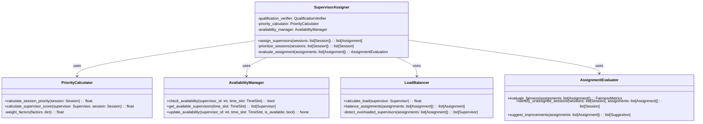
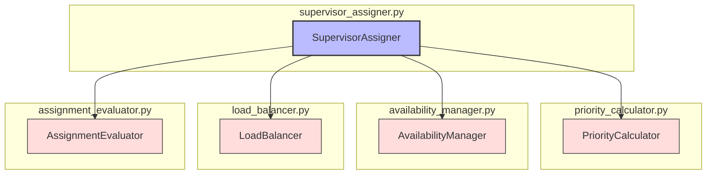

# ALGO-ROT-001.2: 基本監督割り当てアルゴリズム実装

## 概要
練習表自動生成システムにおける基本監督割り当てアルゴリズムを実装します。監督候補者リストから各練習セッションに最適な監督者を割り当て、初期的な監督スケジュールを作成する機能を開発します。

## 詳細
- 監督割り当ての優先順位付けシステム実装
- 公平性と効率性を考慮した基本割り当てロジック
- 監督者の利用可能性確認機能
- 初期割り当て結果の評価機能
- 監督未割り当てセッション処理機能

## 依存関係
- 親タスク: ALGO-ROT-001
- ALGO-ROT-001.1: 監督資格検証アルゴリズム実装
- BACK-DB-001.3: スケジュール管理テーブルの設計と実装

## 参照ファイル
- [設計書/09_アルゴリズム詳細_2_交代最適化.md](../../../../設計書/09_アルゴリズム詳細_2_交代最適化.md)
- [設計書/14_監督割り当て方針.md](../../../../設計書/14_監督割り当て方針.md)

## 成果物
- 基本監督割り当てアルゴリズム実装コード
- アルゴリズムのテストケース
- 公平性評価指標の実装
- 実装ドキュメント
- 使用方法ガイド

## ステータス
- [ ] 未開始
- [ ] 進行中
- [ ] レビュー中
- [ ] 完了

## 担当者
未割り当て

## 主要機能
1. **優先順位システム**
   - 監督割り当ての優先度計算
   - パート・練習内容に応じた重み付け
   - 監督者の専門性と適合度評価
   - 特別セッションの優先処理

2. **基本割り当てエンジン**
   - グリーディアルゴリズムによる初期割り当て
   - 負荷分散を考慮した割り当て戦略
   - 監督者の希望と可能性の組み合わせ
   - スケジュール全体の最適化

3. **利用可能性管理**
   - 監督者の可用性データベース管理
   - 時間的競合の検出
   - 不在情報との連携
   - 利用可能監督者の絞り込み

4. **割り当て評価**
   - 割り当て結果の公平性評価
   - 監督者の負担度計算
   - 未割り当てセッションの分析
   - 改善可能箇所の特定

5. **例外処理**
   - 監督者が足りないセッションの処理
   - 代替監督者の検索
   - 要件緩和による再割り当て
   - 特別対応セッションのフラグ付け

## 設計図

### クラス図


## 実装アプローチ
### 基本監督割り当てアルゴリズム概要
1. **前処理フェーズ**
   - 練習セッションと監督候補者データのロード
   - 監督者の利用可能性情報の取得
   - 優先順位パラメータの設定
   - 評価指標の初期化

2. **割り当てフェーズ**
   - 各セッションの優先度計算と順序付け
   - セッションごとに最適監督者を選択
   - 割り当て後の利用可能性更新
   - 監督負担度の追跡

3. **評価フェーズ**
   - 割り当て結果の公平性評価
   - 未割り当てセッションの特定
   - 監督者の負担バランス確認
   - 問題箇所のマーキング

4. **調整フェーズ**
   - 未割り当てセッションの処理
   - 過負荷監督者の負担軽減
   - 代替監督者の割り当て
   - 最終的な初期監督スケジュールの作成

## アルゴリズム詳細
### コアアルゴリズム
```
基本監督割り当てアルゴリズム:
1. 全練習セッションと監督候補者のデータ取得
2. 各セッションの優先度を計算しソート
3. 各セッションについて（優先度順）:
   a. 利用可能な監督候補者をフィルタリング
   b. 候補者の適合度スコアを計算
   c. 監督負担度を考慮してスコア調整
   d. 最高スコアの候補者を選択
   e. 選択した監督者の利用可能性を更新
   f. 監督負担度を更新
4. 割り当て結果の評価:
   a. 未割り当てセッションの特定
   b. 監督者の負担バランス分析
5. 調整処理:
   a. 未割り当てセッションへの代替監督者検索
   b. 過負荷監督者の負担軽減
6. 最終的な監督割り当てスケジュールを返却
```

### 監督者選択スコア計算
```
監督者選択スコア計算:
1. 基本スコア = 資格適合度スコア（0-100点）
2. 専門性評価:
   a. パート専門監督者: +25点
   b. 関連パート経験: +10点
3. 負担度調整:
   a. 低負担監督者: +20点
   b. 中負担監督者: +0点
   c. 高負担監督者: -30点
4. 連続性評価:
   a. 同日の監督割り当て済み: +15点（移動コスト削減）
   b. 連続セッション監督: -10点（疲労考慮）
5. 希望度:
   a. 希望セッション: +20点
   b. 希望曜日/時間: +10点
6. 最終スコア = 合計点数
```

## 実装予定ファイル
以下は実装予定の全ファイルのリストです。各ファイルの役割と目的を簡潔に記載します。

- `src/algorithm/rotation/supervisor_assigner.py` - 監督割り当て機能
- `src/algorithm/rotation/priority_calculator.py` - 優先度計算機能
- `src/algorithm/rotation/availability_manager.py` - 利用可能性管理
- `src/algorithm/rotation/load_balancer.py` - 負荷分散機能
- `src/algorithm/rotation/assignment_evaluator.py` - 割り当て評価機能
- `src/algorithm/rotation/models.py` - データモデル定義
- `src/algorithm/rotation/utils/scoring_utils.py` - スコア計算ユーティリティ
- `src/algorithm/rotation/config/assignment_config.py` - 割り当て設定
- `tests/algorithm/rotation/test_supervisor_assigner.py` - 監督割り当てテスト
- `tests/algorithm/rotation/test_load_balancer.py` - 負荷分散テスト

## 実装ファイル構成詳細
### `src/algorithm/rotation/supervisor_assigner.py`
**目的**: 基本監督割り当てのコア機能を実装し、各セッションに最適な監督者を割り当てる

**クラス/インターフェース**:
- `SupervisorAssigner`: 監督割り当て主要クラス
  - **継承/実装**: なし
  - **主要メソッド**: 
    - `assign_supervisors(sessions: list[Session]) -> list[Assignment]` - 監督者を各セッションに割り当て
    - `prioritize_sessions(sessions: list[Session]) -> list[Session]` - セッションの優先順位付け
    - `evaluate_assignment(assignments: list[Assignment]) -> AssignmentEvaluation` - 割り当て結果を評価
  - **依存クラス**: `QualificationVerifier`, `PriorityCalculator`, `AvailabilityManager`, `LoadBalancer`

### `src/algorithm/rotation/priority_calculator.py`
**目的**: セッションと監督者の優先度・適合度を計算する

**クラス/インターフェース**:
- `PriorityCalculator`: 優先度計算クラス
  - **継承/実装**: なし
  - **主要メソッド**: 
    - `calculate_session_priority(session: Session) -> float` - セッションの優先度を計算
    - `calculate_supervisor_score(supervisor: Supervisor, session: Session) -> float` - 監督者の適合度スコアを計算
    - `weight_factors(factors: dict) -> float` - 複数要素の重み付け計算
  - **依存クラス**: なし

### `src/algorithm/rotation/availability_manager.py`
**目的**: 監督者の利用可能性を管理し、時間的競合を検出する

**クラス/インターフェース**:
- `AvailabilityManager`: 利用可能性管理クラス
  - **継承/実装**: なし
  - **主要メソッド**: 
    - `check_availability(supervisor_id: int, time_slot: TimeSlot) -> bool` - 監督者の利用可能状態を確認
    - `get_available_supervisors(time_slot: TimeSlot) -> list[Supervisor]` - 時間枠で利用可能な監督者を取得
    - `update_availability(supervisor_id: int, time_slot: TimeSlot, is_available: bool) -> None` - 利用可能性を更新
  - **依存クラス**: `DatabaseConnector`

### `src/algorithm/rotation/load_balancer.py`
**目的**: 監督者間の負荷を計算し、バランスを最適化する

**クラス/インターフェース**:
- `LoadBalancer`: 負荷分散クラス
  - **継承/実装**: なし
  - **主要メソッド**: 
    - `calculate_load(supervisor: Supervisor) -> float` - 監督者の現在負荷を計算
    - `balance_assignments(assignments: list[Assignment]) -> list[Assignment]` - 割り当てのバランスを最適化
    - `detect_overloaded_supervisors(assignments: list[Assignment]) -> list[Supervisor]` - 過負荷監督者を検出
  - **依存クラス**: なし

### `src/algorithm/rotation/assignment_evaluator.py`
**目的**: 割り当て結果の公平性と効率性を評価し、改善点を特定する

**クラス/インターフェース**:
- `AssignmentEvaluator`: 割り当て評価クラス
  - **継承/実装**: なし
  - **主要メソッド**: 
    - `evaluate_fairness(assignments: list[Assignment]) -> FairnessMetrics` - 公平性指標を計算
    - `identify_unassigned_sessions(sessions: list[Session], assignments: list[Assignment]) -> list[Session]` - 未割り当てセッションを特定
    - `suggest_improvements(assignments: list[Assignment]) -> list[Suggestion]` - 改善提案を生成
  - **依存クラス**: なし

## ファイル間クラス連携図
