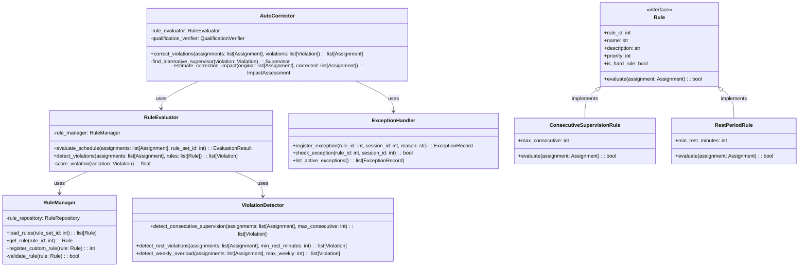

# ALGO-ROT-001.3: ルールベース制約適用アルゴリズム実装

## 概要
練習表自動生成システムにおける監督割り当てのルールベース制約適用アルゴリズムを実装します。監督割り当てに関する様々なルール（連続監督制限、休息時間確保、特定条件の遵守など）を強制し、公平で持続可能な監督スケジュールを実現する機能を開発します。

## 詳細
- 監督割り当てルールのモデル化と管理システム実装
- ルール違反の検出と評価機能
- ルール適用の優先順位付けシステム
- ルール違反の自動修正アルゴリズム
- ルール例外の管理と承認機能

## 依存関係
- 親タスク: ALGO-ROT-001
- ALGO-ROT-001.2: 基本監督割り当てアルゴリズム実装
- BACK-DB-001.5: 不在管理テーブルの設計と実装

## 参照ファイル
- [設計書/09_アルゴリズム詳細_2_交代最適化.md](../../../../設計書/09_アルゴリズム詳細_2_交代最適化.md)
- [設計書/15_監督ルール一覧.md](../../../../設計書/15_監督ルール一覧.md)

## 成果物
- ルールベース制約適用アルゴリズム実装コード
- アルゴリズムのテストケース
- ルール違反検出・評価機能
- 自動修正メカニズム
- 実装ドキュメント
- 使用方法ガイド

## ステータス
- [ ] 未開始
- [ ] 進行中
- [ ] レビュー中
- [ ] 完了

## 担当者
未割り当て

## 主要機能
1. **ルールモデリング**
   - 監督割り当てルールの定義と分類
   - ルール優先順位とセグメント化
   - カスタムルールの追加メカニズム
   - ルール適用条件の定義

2. **ルール評価エンジン**
   - 割り当て結果に対するルール適用
   - ルール違反の検出アルゴリズム
   - 違反の重大度スコアリング
   - ルール間の競合解決

3. **制約適用機能**
   - 連続監督制限の強制
   - 休息期間確保ルールの適用
   - 特定曜日・時間の割り当て制限
   - パート間のバランス制約適用

4. **違反修正機能**
   - ルール違反の自動修正
   - 最小変更による問題解決
   - 代替監督者の検索と再割り当て
   - 修正の影響範囲評価

5. **例外管理**
   - ルール例外の申請と承認プロセス
   - 一時的なルール緩和メカニズム
   - 特別条件下での例外処理
   - 例外履歴の記録と分析

## 設計図

### クラス図


## 実装アプローチ
### ルールベース制約適用アルゴリズム概要
1. **前処理フェーズ**
   - 初期割り当て結果のロード
   - 適用ルールセットの特定
   - 評価パラメータの設定
   - 監督者データの補完

2. **評価フェーズ**
   - 全割り当てに対するルール評価
   - 違反の検出と分類
   - 違反の重大度スコアリング
   - 問題箇所のマーキング

3. **修正フェーズ**
   - 重大度に基づく違反の優先順位付け
   - 各違反に対する修正戦略の選択
   - 代替監督者の検索と割り当て
   - 修正後の再評価

4. **再最適化フェーズ**
   - 修正後のスケジュール評価
   - 新たな問題箇所の特定
   - ソフトルールの最適化
   - 最終的なルール準拠スケジュールの作成

## アルゴリズム詳細
### コアアルゴリズム
```
ルールベース制約適用アルゴリズム:
1. 初期監督割り当てスケジュールを取得
2. 適用ルールセットをロード
3. 全割り当てに対するルール評価:
   a. 各ルールに対して違反チェック
   b. 違反の重大度計算
   c. 問題箇所の特定
4. 重大度順に違反を処理:
   a. 違反タイプに応じた修正戦略選択
   b. 代替監督者の検索
   c. 再割り当ての実行
   d. 修正後の再評価
5. ルール違反が解決するまで反復処理
6. 最終的なルール準拠スケジュールを返却
```

### 主要ルールリスト
```
監督ルール一覧:
1. ハードルール（絶対遵守）:
   a. 連続監督禁止: 同じ日に3セッション以上連続で監督しない
   b. 最小休息時間: 監督セッション間に最低1時間の休息
   c. 週間上限: 1週間に10セッション以上監督しない
   d. 不在時監督禁止: 登録された不在時間に監督割り当てしない

2. ソフトルール（望ましい）:
   a. パートバランス: 複数パートを公平に監督
   b. 曜日分散: 特定曜日に集中しない
   c. 時間帯分散: 朝/昼/夕の時間帯で分散
   d. 希望考慮: 監督希望日時を優先
   e. 専門性活用: 得意パートの監督を優先
```

## 実装予定ファイル
以下は実装予定の全ファイルのリストです。各ファイルの役割と目的を簡潔に記載します。

- `src/algorithm/rotation/rule_manager.py` - ルール管理機能
- `src/algorithm/rotation/rule_evaluator.py` - ルール評価機能
- `src/algorithm/rotation/violation_detector.py` - 違反検出機能
- `src/algorithm/rotation/auto_corrector.py` - 自動修正機能
- `src/algorithm/rotation/exception_handler.py` - 例外処理機能
- `src/algorithm/rotation/rules/base_rule.py` - 基本ルールクラス
- `src/algorithm/rotation/rules/consecutive_rule.py` - 連続監督ルール
- `src/algorithm/rotation/rules/rest_period_rule.py` - 休息期間ルール
- `src/algorithm/rotation/config/rule_config.py` - ルール設定
- `tests/algorithm/rotation/test_rule_evaluator.py` - ルール評価テスト
- `tests/algorithm/rotation/test_auto_corrector.py` - 自動修正テスト

## 実装ファイル構成詳細
### `src/algorithm/rotation/rule_manager.py`
**目的**: 監督割り当てルールを管理し、ルールセットの読み込みと更新を行う

**クラス/インターフェース**:
- `RuleManager`: ルール管理クラス
  - **継承/実装**: なし
  - **主要メソッド**: 
    - `load_rules(rule_set_id: int) -> list[Rule]` - ルールセットを読み込む
    - `get_rule(rule_id: int) -> Rule` - 特定のルールを取得
    - `register_custom_rule(rule: Rule) -> int` - カスタムルールを登録
    - `validate_rule(rule: Rule) -> bool` - ルールを検証
  - **依存クラス**: `RuleRepository`

### `src/algorithm/rotation/rule_evaluator.py`
**目的**: 監督スケジュールに対してルールを適用し、違反を評価する

**クラス/インターフェース**:
- `RuleEvaluator`: ルール評価クラス
  - **継承/実装**: なし
  - **主要メソッド**: 
    - `evaluate_schedule(assignments: list[Assignment], rule_set_id: int) -> EvaluationResult` - スケジュールを評価
    - `detect_violations(assignments: list[Assignment], rules: list[Rule]) -> list[Violation]` - 違反を検出
    - `score_violation(violation: Violation) -> float` - 違反の重大度をスコア化
  - **依存クラス**: `RuleManager`, `ViolationDetector`

### `src/algorithm/rotation/violation_detector.py`
**目的**: 監督スケジュールの様々なルール違反パターンを検出する

**クラス/インターフェース**:
- `ViolationDetector`: 違反検出クラス
  - **継承/実装**: なし
  - **主要メソッド**: 
    - `detect_consecutive_supervision(assignments: list[Assignment], max_consecutive: int) -> list[Violation]` - 連続監督違反を検出
    - `detect_rest_violations(assignments: list[Assignment], min_rest_minutes: int) -> list[Violation]` - 休息時間違反を検出
    - `detect_weekly_overload(assignments: list[Assignment], max_weekly: int) -> list[Violation]` - 週間上限違反を検出
  - **依存クラス**: なし

### `src/algorithm/rotation/auto_corrector.py`
**目的**: 検出されたルール違反を自動的に修正する

**クラス/インターフェース**:
- `AutoCorrector`: 自動修正クラス
  - **継承/実装**: なし
  - **主要メソッド**: 
    - `correct_violations(assignments: list[Assignment], violations: list[Violation]) -> list[Assignment]` - 違反を修正
    - `find_alternative_supervisor(violation: Violation) -> Supervisor` - 代替監督者を検索
    - `estimate_correction_impact(original: list[Assignment], corrected: list[Assignment]) -> ImpactAssessment` - 修正の影響を評価
  - **依存クラス**: `RuleEvaluator`, `QualificationVerifier`, `ExceptionHandler`

### `src/algorithm/rotation/exception_handler.py`
**目的**: ルール例外を管理し、特別な条件下での例外処理を行う

**クラス/インターフェース**:
- `ExceptionHandler`: 例外処理クラス
  - **継承/実装**: なし
  - **主要メソッド**: 
    - `register_exception(rule_id: int, session_id: int, reason: str) -> ExceptionRecord` - 例外を登録
    - `check_exception(rule_id: int, session_id: int) -> bool` - 例外の存在を確認
    - `list_active_exceptions() -> list[ExceptionRecord]` - 有効な例外を一覧表示
  - **依存クラス**: `DatabaseConnector`

## ファイル間クラス連携図
```mermaid
graph TD
    subgraph "rule_manager.py"
        RM[RuleManager]
    end
    
    subgraph "rule_evaluator.py"
        RE[RuleEvaluator]
    end
    
    subgraph "violation_detector.py"
        VD[ViolationDetector]
    end
    
    subgraph "auto_corrector.py"
        AC[AutoCorrector]
    end
    
    subgraph "exception_handler.py"
        EH[ExceptionHandler]
    end
    
    subgraph "rules/"
        BR[BaseRule]
        CR[ConsecutiveRule]
        RPR[RestPeriodRule]
    end
    
    RE --> RM
    RE --> VD
    AC --> RE
    AC --> EH
    RM --> BR
    BR <|-- CR
    BR <|-- RPR
    
    classDef main fill:#bbf,stroke:#333,stroke-width:2px;
    classDef util fill:#fdd,stroke:#333,stroke-width:1px;
    classDef model fill:#ddf,stroke:#333,stroke-width:1px;
    
    class RE,AC main;
    class RM,VD,EH util;
    class BR,CR,RPR model;
``` 