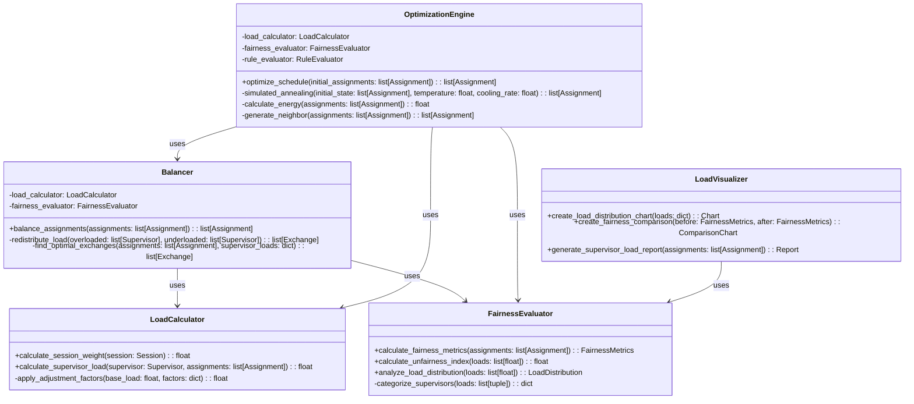
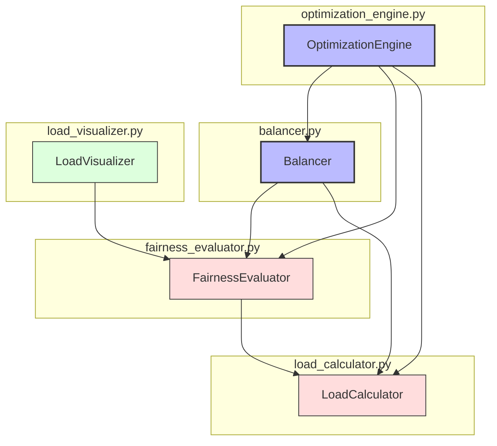

# ALGO-ROT-001.4: 監督者負荷均衡化アルゴリズム実装

## 概要
練習表自動生成システムにおける監督者負荷均衡化アルゴリズムを実装します。監督割り当てにおける監督者間の負担を均等化し、公平性を確保しながら効率的な監督スケジュールを実現する機能を開発します。

## 詳細
- 監督負荷の計算と評価システム実装
- 負荷均衡化のための最適化アルゴリズム開発
- 監督者特性（経験、希望など）を考慮した負荷調整
- 異なる練習セッションの「重み」を考慮した公平性評価
- 負荷均衡化の効果評価と可視化機能

## 依存関係
- 親タスク: ALGO-ROT-001
- ALGO-ROT-001.2: 基本監督割り当てアルゴリズム実装
- ALGO-ROT-001.3: ルールベース制約適用アルゴリズム実装

## 参照ファイル
- [設計書/09_アルゴリズム詳細_2_交代最適化.md](../../../../設計書/09_アルゴリズム詳細_2_交代最適化.md)
- [設計書/16_監督負荷計算方式.md](../../../../設計書/16_監督負荷計算方式.md)

## 成果物
- 監督者負荷均衡化アルゴリズム実装コード
- アルゴリズムのテストケース
- 負荷計算と評価システム
- 均衡化効果の視覚化ツール
- 実装ドキュメント
- 使用方法ガイド

## ステータス
- [ ] 未開始
- [ ] 進行中
- [ ] レビュー中
- [ ] 完了

## 担当者
未割り当て

## 主要機能
1. **負荷計算システム**
   - 監督セッションの重み付け計算
   - 監督者ごとの総負荷算出
   - 練習内容・時間帯による負荷調整
   - 期間ごとの負荷分散評価

2. **公平性評価機能**
   - 監督者間の負荷バランス測定
   - 不公平度指標の定義と計算
   - 負荷分布の統計的分析
   - 監督者群の階層化とバランス評価

3. **均衡化アルゴリズム**
   - 局所的な負荷再分配ロジック
   - 監督交換による負荷均衡化
   - 段階的な最適化処理
   - 監督者特性を考慮した均衡化

4. **最適化処理**
   - シミュレーテッドアニーリング手法の適用
   - 局所最適解からの脱出戦略
   - 多目的最適化（公平性とルール遵守）
   - 最適化パラメータの自動調整

5. **効果評価機能**
   - 均衡化前後の比較分析
   - 公平性指標の改善度測定
   - ルール遵守度と公平性のトレードオフ評価
   - 可視化レポート生成

## 設計図

### クラス図


## 実装アプローチ
### 負荷均衡化アルゴリズム概要
1. **前処理フェーズ**
   - 監督割り当て結果と監督者データのロード
   - 練習セッションの重み付け計算
   - 初期負荷分布の計算
   - 不公平度の計算と評価

2. **分析フェーズ**
   - 過負荷/過少負荷監督者の特定
   - 負荷再分配の機会探索
   - 交換可能な割り当ての特定
   - 最適化目標の設定

3. **最適化フェーズ**
   - シミュレーテッドアニーリングの初期化
   - 割り当て交換の反復試行
   - 負荷分布の段階的改善
   - ルール違反の回避

4. **評価フェーズ**
   - 最適化結果の評価
   - 公平性指標の計算
   - 改善度の測定
   - 最終的な均衡化スケジュールの生成

## アルゴリズム詳細
### コアアルゴリズム
```
監督者負荷均衡化アルゴリズム:
1. 監督割り当て結果と監督者データを取得
2. 各監督者の初期負荷を計算:
   a. セッションごとの重み付け評価
   b. 監督者ごとの総負荷集計
   c. 負荷分布の統計分析
3. シミュレーテッドアニーリング最適化:
   a. 初期温度と冷却スケジュールの設定
   b. 各イテレーションで:
      i. ランダムな割り当て交換を試行
      ii. 新しい負荷分布を計算
      iii. 不公平度を評価
      iv. 改善または確率的に悪化を許容
   c. 温度を下げながら反復
4. 最適化結果の評価:
   a. 最終的な負荷分布計算
   b. 不公平度改善の確認
   c. ルール違反の確認
5. 最終的な均衡化スケジュールを返却
```

### 負荷計算方式
```
監督負荷計算:
1. 基本負荷 = 監督セッション数
2. 重み調整:
   a. 難易度係数: 初心者指導=1.5, 通常=1.0, 簡易=0.7
   b. 時間帯係数: 早朝/夜間=1.2, 日中=1.0
   c. 曜日係数: 週末=1.1, 平日=1.0
   d. 長さ係数: 2時間以上=1.3, 1-2時間=1.0, 1時間未満=0.8
3. 監督者特性調整:
   a. 経験係数: ベテラン=0.9, 中堅=1.0, 新人=1.2
   b. 希望一致: 希望セッション=0.8, 非希望=1.2
4. 計算式:
   基本負荷 × 難易度係数 × 時間帯係数 × 曜日係数 × 長さ係数 × 経験係数 × 希望一致係数
```

## 実装予定ファイル
以下は実装予定の全ファイルのリストです。各ファイルの役割と目的を簡潔に記載します。

- `src/algorithm/rotation/load_calculator.py` - 負荷計算機能
- `src/algorithm/rotation/fairness_evaluator.py` - 公平性評価機能
- `src/algorithm/rotation/balancer.py` - 負荷均衡化エンジン
- `src/algorithm/rotation/optimization_engine.py` - 最適化エンジン
- `src/algorithm/rotation/load_visualizer.py` - 可視化機能
- `src/algorithm/rotation/models/assignment_models.py` - 割り当てモデル
- `src/algorithm/rotation/config/load_factors.py` - 負荷係数設定
- `src/algorithm/rotation/utils/optimization_utils.py` - 最適化ユーティリティ
- `tests/algorithm/rotation/test_load_calculator.py` - 負荷計算テスト
- `tests/algorithm/rotation/test_balancer.py` - 均衡化テスト

## 実装ファイル構成詳細
### `src/algorithm/rotation/load_calculator.py`
**目的**: 監督セッションや監督者の負荷を計算し、様々な要素を考慮した重み付けを行う

**クラス/インターフェース**:
- `LoadCalculator`: 負荷計算クラス
  - **継承/実装**: なし
  - **主要メソッド**: 
    - `calculate_session_weight(session: Session) -> float` - セッションの重み（負荷）を計算
    - `calculate_supervisor_load(supervisor: Supervisor, assignments: list[Assignment]) -> float` - 監督者の総負荷を計算
    - `apply_adjustment_factors(base_load: float, factors: dict) -> float` - 調整係数を適用
  - **依存クラス**: なし

### `src/algorithm/rotation/fairness_evaluator.py`
**目的**: 監督割り当ての公平性を評価し、様々な指標を計算する

**クラス/インターフェース**:
- `FairnessEvaluator`: 公平性評価クラス
  - **継承/実装**: なし
  - **主要メソッド**: 
    - `calculate_fairness_metrics(assignments: list[Assignment]) -> FairnessMetrics` - 公平性指標を計算
    - `calculate_unfairness_index(loads: list[float]) -> float` - 不公平度指標を計算
    - `analyze_load_distribution(loads: list[float]) -> LoadDistribution` - 負荷分布を分析
    - `categorize_supervisors(loads: list[tuple]) -> dict` - 監督者を負荷カテゴリに分類
  - **依存クラス**: `LoadCalculator`

### `src/algorithm/rotation/balancer.py`
**目的**: 監督者間の負荷バランスを最適化する

**クラス/インターフェース**:
- `Balancer`: 負荷均衡化クラス
  - **継承/実装**: なし
  - **主要メソッド**: 
    - `balance_assignments(assignments: list[Assignment]) -> list[Assignment]` - 割り当てを均衡化
    - `redistribute_load(overloaded: list[Supervisor], underloaded: list[Supervisor]) -> list[Exchange]` - 負荷を再分配
    - `find_optimal_exchanges(assignments: list[Assignment], supervisor_loads: dict) -> list[Exchange]` - 最適な交換を特定
  - **依存クラス**: `LoadCalculator`, `FairnessEvaluator`

### `src/algorithm/rotation/optimization_engine.py`
**目的**: 高度な最適化アルゴリズムを用いて割り当てを最適化する

**クラス/インターフェース**:
- `OptimizationEngine`: 最適化エンジンクラス
  - **継承/実装**: なし
  - **主要メソッド**: 
    - `optimize_schedule(initial_assignments: list[Assignment]) -> list[Assignment]` - スケジュールを最適化
    - `simulated_annealing(initial_state: list[Assignment], temperature: float, cooling_rate: float) -> list[Assignment]` - シミュレーテッドアニーリングを実行
    - `calculate_energy(assignments: list[Assignment]) -> float` - 状態のエネルギー（コスト）を計算
    - `generate_neighbor(assignments: list[Assignment]) -> list[Assignment]` - 近傍状態を生成
  - **依存クラス**: `LoadCalculator`, `FairnessEvaluator`, `RuleEvaluator`

### `src/algorithm/rotation/load_visualizer.py`
**目的**: 負荷分布や均衡化効果を視覚的に表現する

**クラス/インターフェース**:
- `LoadVisualizer`: 負荷可視化クラス
  - **継承/実装**: なし
  - **主要メソッド**: 
    - `create_load_distribution_chart(loads: dict) -> Chart` - 負荷分布チャートを作成
    - `create_fairness_comparison(before: FairnessMetrics, after: FairnessMetrics) -> ComparisonChart` - 均衡化前後の比較チャートを作成
    - `generate_supervisor_load_report(assignments: list[Assignment]) -> Report` - 監督者負荷レポートを生成
  - **依存クラス**: `FairnessEvaluator`

## ファイル間クラス連携図
