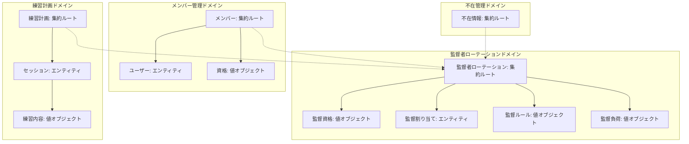
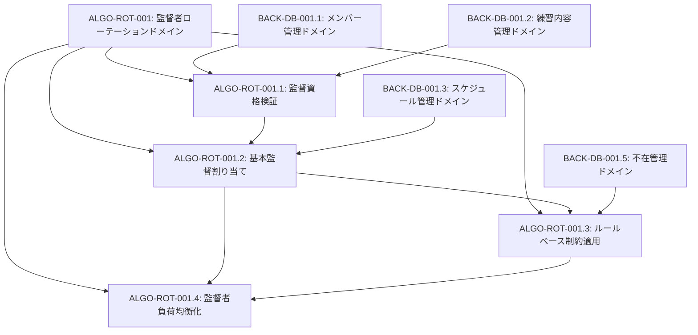
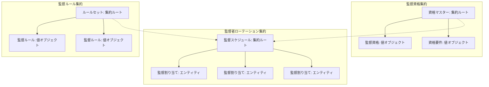
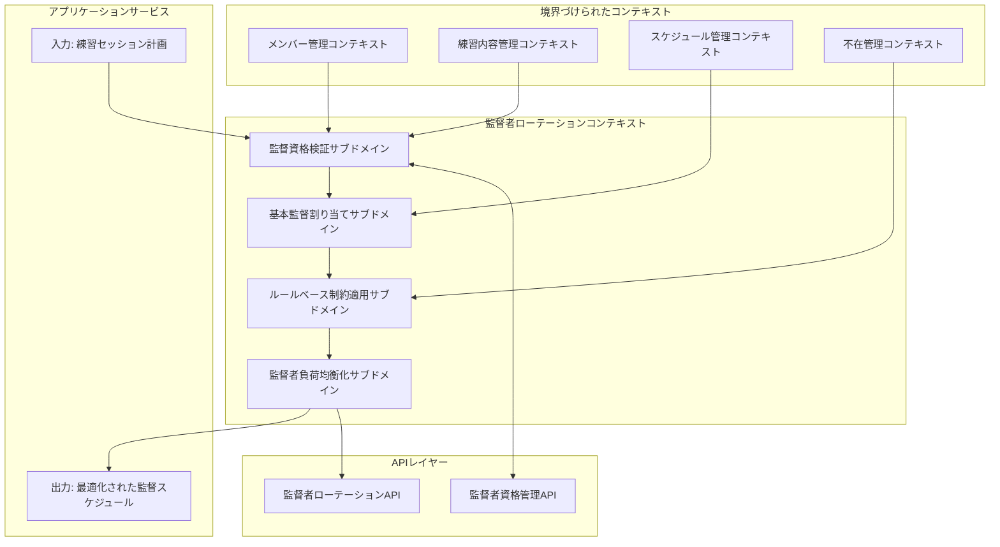
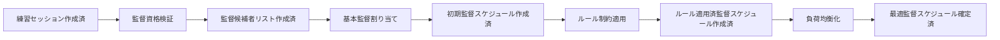

# ALGO-ROT-001: 監督者ローテーション基本アルゴリズム

## ドメインの概要
練習表自動生成システムにおける監督者の公平なローテーションを実現するドメインロジックを実装します。このドメインは、練習セッションごとに適切な監督者を割り当て、負荷の均等化と練習の質の確保を両立させることを目的としています。

## ドメインモデルと境界づけられたコンテキスト

## ユビキタス言語

| 用語 | 定義 |
|------|------|
| 監督者 | 練習セッションを監督する資格を持ったメンバー |
| 監督資格 | 特定のパートや練習内容を監督できる能力の公式認定 |
| 監督負荷 | 監督業務にかかる精神的・時間的負担を数値化したもの |
| 練習セッション | 特定の日時・場所・内容で行われる練習の単位 |
| 監督ルール | 監督者の割り当てに関する制約や条件 |
| 監督割り当て | 監督者と練習セッションの関連付け |

## サブドメイン構成

## サブドメイン詳細

### ALGO-ROT-001.1: 監督資格検証
**ドメイン責務**: 各パートやセッションに対して適切な監督資格を持つメンバーを特定し、監督候補者リストを作成します。

**ドメインサービス**:
- 監督資格ドメインサービス（資格と要件の照合）
- 資格要件ファクトリー（パート・練習内容ごとの要件設定）
- 資格マッチングサービス（メンバーと練習セッションの照合）
- 資格履歴リポジトリ（資格取得状況の永続化）
- 例外処理ポリシー（一時的資格付与、特別承認）

**ステータス**: 未開始

### ALGO-ROT-001.2: 基本監督割り当て
**ドメイン責務**: 監督候補者リストから各練習セッションに最適な監督者を割り当て、初期的な監督スケジュールを作成します。

**ドメインサービス**:
- 監督優先度ドメインサービス（監督割り当ての優先度計算）
- 監督割り当てファクトリー（初期割り当て生成）
- 監督者可用性サービス（監督者の可用性検証）
- 割り当て評価サービス（公平性評価、未割り当て分析）
- 例外処理ポリシー（監督者不足時の処理）

**ステータス**: 未開始

### ALGO-ROT-001.3: ルールベース制約適用
**ドメイン責務**: 監督割り当てに関する様々なルール（連続監督制限、休息時間確保など）を適用し、公平で持続可能な監督スケジュールを実現します。

**ドメインサービス**:
- 監督ルールファクトリー（ルールの生成）
- ルール評価サービス（違反の検出・スコアリング）
- 制約適用サービス（連続監督制限、休息期間確保など）
- 違反修正サービス（自動修正、代替監督者検索）
- 例外管理ポリシー（ルール例外の申請・承認）

**ステータス**: 未開始

### ALGO-ROT-001.4: 監督者負荷均衡化
**ドメイン責務**: 監督割り当てにおける監督者間の負担を均等化し、公平性を確保しながら効率的な監督スケジュールを実現します。

**ドメインサービス**:
- 監督負荷計算サービス（セッションの重み付け、総負荷算出）
- 公平性評価サービス（負荷バランス測定、不公平度計算）
- 負荷均衡化サービス（負荷再分配、監督交換）
- 最適化アルゴリズム（シミュレーテッドアニーリング等）
- 効果評価サービス（均衡化前後の比較分析）

**ステータス**: 未開始

## コマンド・クエリ責務分離（CQRS）

### コマンド（書き込み操作）
- 監督者割り当てコマンド
- 割り当て最適化コマンド
- ルール適用コマンド
- 資格登録コマンド

### クエリ（読み取り操作）
- 監督資格照会クエリ
- 監督スケジュール照会クエリ
- 負荷バランス照会クエリ
- ルール違反照会クエリ

## 集約と整合性境界

## 開発コンテキスト図

## 進捗管理

| サブドメイン | ステータス | 担当者 | 開始日 | 完了予定 | 実際の完了日 |
|------------|-----------|--------|-------|---------|------------|
| ALGO-ROT-001.1 | 未開始 | 未割り当て | - | - | - |
| ALGO-ROT-001.2 | 未開始 | 未割り当て | - | - | - |
| ALGO-ROT-001.3 | 未開始 | 未割り当て | - | - | - |
| ALGO-ROT-001.4 | 未開始 | 未割り当て | - | - | - |

## イベントストーミング

## 課題・リスク

- 複雑なドメインルールに対するモデリングの適切性
- ドメイン間の整合性確保と結合度の管理
- パフォーマンスとドメイン表現力のトレードオフ
- 特殊ケース処理のためのドメインルールの拡張性

## レビューポイント

- ドメインモデルの表現力と現実世界の対応
- 境界づけられたコンテキスト間の関係と整合性
- 集約設計の適切性と整合性境界
- コードの保守性と拡張性
- ドメインルールのテスト可能性

## リファレンス

- [設計書/09_アルゴリズム詳細_2_ローテーション最適化_1.md](../../設計書/09_アルゴリズム詳細_2_ローテーション最適化_1.md)
- [設計書/13_監督資格要件.md](../../設計書/13_監督資格要件.md)
- [設計書/14_監督割り当て方針.md](../../設計書/14_監督割り当て方針.md)
- [設計書/15_監督ルール一覧.md](../../設計書/15_監督ルール一覧.md)
- [設計書/16_監督負荷計算方式.md](../../設計書/16_監督負荷計算方式.md) 