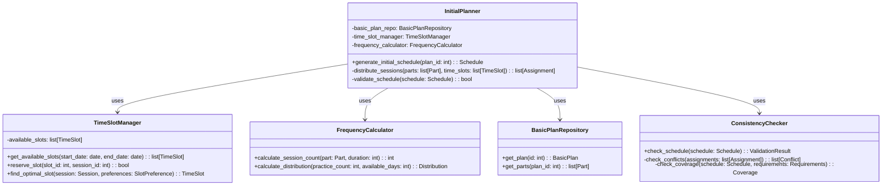

# ALGO-SCHED-001.1: 基本計画からの初期割り当てアルゴリズム実装

## 概要
練習表自動生成システムの核となる初期スケジュール生成アルゴリズムを実装します。基本計画から練習セッションを適切な日時に割り当て、初期的な練習スケジュールを作成する機能を開発します。

## 詳細
- 基本計画データの解析ロジックの実装
- 練習頻度と優先順位に基づく日時割り当て
- タイムテーブル（時間割表）生成アルゴリズム実装
- パート別の練習頻度要件を満たす割り当てロジック
- 初期スケジュールの整合性検証機能

## 依存関係
- 親タスク: ALGO-SCHED-001
- BACK-DB-001.2: パート・練習内容テーブルの設計と実装
- BACK-DB-001.3: スケジュール管理テーブルの設計と実装

## 参照ファイル
- [設計書/09_アルゴリズム詳細_1_スケジュール生成.md](../../../../設計書/09_アルゴリズム詳細_1_スケジュール生成.md)

## 成果物
- 初期スケジュール生成アルゴリズム実装コード
- アルゴリズムのテストケース
- 実装ドキュメント
- パフォーマンス評価レポート
- 使用方法ガイド

## ステータス
- [ ] 未開始
- [ ] 進行中
- [ ] レビュー中
- [ ] 完了

## 担当者
未割り当て

## 主要機能
1. **基本計画解析**
   - 計画パラメータの抽出と解釈
   - 基本練習スケジュールの理解
   - パート情報と練習要件の解析
   - 優先順位と制約条件の抽出

2. **日時割り当て戦略**
   - 練習の頻度に基づく日時分散
   - 曜日と時間帯の最適配置
   - パート別の優先日時の考慮
   - 全体の練習バランスの維持

3. **タイムテーブル生成**
   - 時間枠の定義と管理
   - セッション間の間隔設定
   - 同時セッションの配置ロジック
   - 時間枠の効率的な埋め方

4. **練習頻度調整**
   - パート別の練習回数目標達成
   - パート間の練習バランス維持
   - 重要度に基づく頻度調整
   - シーズンや特定期間の頻度変更

5. **整合性検証**
   - 初期スケジュールの基本検証
   - 論理的な矛盾の検出
   - 割り当て漏れの確認
   - 基本計画との一致確認

## 設計図

### クラス図


## 実装アプローチ
### 初期割り当てアルゴリズム概要
1. **前処理フェーズ**
   - 基本計画からパラメータ抽出
   - 利用可能な時間枠の列挙
   - パート練習頻度要件のマッピング
   - 練習テンプレートのロード

2. **割り当てフェーズ**
   - 優先順位の高いパートから順に割り当て
   - 利用可能時間枠への分散配置
   - 時間枠競合の解決
   - 徐々に制約を緩和しながら全割り当て実現

3. **最適化フェーズ**
   - 初期割り当ての評価
   - 問題箇所の特定と修正
   - 全体バランスの微調整
   - 最終的な初期スケジュールの作成

## アルゴリズム詳細
### コアアルゴリズム
```
初期割り当てアルゴリズム:
1. 基本計画から期間、パート、練習頻度を読み込む
2. 各パートを練習の優先度でソート
3. 各パートについて:
   a. 必要な練習回数を計算
   b. 優先する曜日/時間帯を特定
   c. 利用可能な時間枠を探索
   d. 時間枠に練習を割り当て
4. 全パートの割り当て後:
   a. 未割り当ての練習セッションを特定
   b. 制約を緩和して再割り当てを試行
5. 最終的な初期スケジュールを返却
```

## 実装予定ファイル
以下は実装予定の全ファイルのリストです。各ファイルの役割と目的を簡潔に記載します。

- `src/algorithm/scheduler/initial_planner.py` - 初期プラン作成機能
- `src/algorithm/scheduler/time_slot_manager.py` - 時間枠管理機能
- `src/algorithm/scheduler/frequency_calculator.py` - 頻度計算ロジック
- `src/algorithm/scheduler/distribution_strategy.py` - 分散戦略実装
- `src/algorithm/scheduler/consistency_checker.py` - 整合性検証機能
- `src/algorithm/scheduler/models.py` - データモデル定義
- `src/algorithm/scheduler/config.py` - スケジューラ設定
- `src/algorithm/scheduler/utils/date_time_utils.py` - 日付時刻ユーティリティ
- `src/algorithm/scheduler/exceptions.py` - 例外定義
- `tests/algorithm/scheduler/test_initial_planner.py` - 初期プランナーのテスト
- `tests/algorithm/scheduler/test_frequency_calculator.py` - 頻度計算のテスト

## 実装ファイル構成詳細
### `src/algorithm/scheduler/initial_planner.py`
**目的**: 初期スケジュール生成の中核機能を実装し、基本計画から練習セッションを適切な日時に割り当てる

**クラス/インターフェース**:
- `InitialPlanner`: 初期スケジュール作成の主要クラス
  - **継承/実装**: なし
  - **主要メソッド**: 
    - `generate_initial_schedule(plan_id: int) -> Schedule` - 基本計画から初期スケジュールを生成
    - `distribute_sessions(parts: list[Part], time_slots: list[TimeSlot]) -> list[Assignment]` - 練習セッションを時間枠に分散配置
    - `validate_schedule(schedule: Schedule) -> bool` - スケジュール整合性を検証
  - **依存クラス**: `TimeSlotManager`, `FrequencyCalculator`, `BasicPlanRepository`, `ConsistencyChecker`

### `src/algorithm/scheduler/time_slot_manager.py`
**目的**: 利用可能な時間枠を管理し、最適な時間枠を探索・割り当てる

**クラス/インターフェース**:
- `TimeSlotManager`: 時間枠管理クラス
  - **継承/実装**: なし
  - **主要メソッド**: 
    - `get_available_slots(start_date: date, end_date: date) -> list[TimeSlot]` - 期間内の利用可能枠を取得
    - `reserve_slot(slot_id: int, session_id: int) -> bool` - 時間枠を予約
    - `find_optimal_slot(session: Session, preferences: SlotPreference) -> TimeSlot` - 最適時間枠を探索
  - **依存クラス**: `DatabaseConnector`

### `src/algorithm/scheduler/frequency_calculator.py`
**目的**: 練習の頻度を計算し、期間内の最適な練習回数分布を導出する

**クラス/インターフェース**:
- `FrequencyCalculator`: 頻度計算クラス
  - **継承/実装**: なし
  - **主要メソッド**: 
    - `calculate_session_count(part: Part, duration: int) -> int` - パートの必要練習回数を計算
    - `calculate_distribution(practice_count: int, available_days: int) -> Distribution` - 練習の分布を計算
  - **依存クラス**: なし

### `src/algorithm/scheduler/distribution_strategy.py`
**目的**: 練習の分布戦略を実装し、最適な練習配置パターンを提供する

**クラス/インターフェース**:
- `DistributionStrategy`: 分布戦略インターフェース
  - **継承/実装**: 抽象クラス
  - **主要メソッド**: 
    - `calculate_distribution(sessions: list[Session], available_slots: list[TimeSlot]) -> list[Assignment]` - 分布計算
  - **依存クラス**: なし

- `EvenDistributionStrategy`: 均等分布戦略
  - **継承/実装**: `DistributionStrategy`
  - **主要メソッド**: 
    - `calculate_distribution(sessions: list[Session], available_slots: list[TimeSlot]) -> list[Assignment]` - 均等分布計算
  - **依存クラス**: なし

- `PriorityBasedDistributionStrategy`: 優先度ベース分布戦略
  - **継承/実装**: `DistributionStrategy`
  - **主要メソッド**: 
    - `calculate_distribution(sessions: list[Session], available_slots: list[TimeSlot]) -> list[Assignment]` - 優先度ベース分布計算
  - **依存クラス**: なし

### `src/algorithm/scheduler/consistency_checker.py`
**目的**: 生成したスケジュールの整合性、論理的矛盾、要件充足度を検証する

**クラス/インターフェース**:
- `ConsistencyChecker`: 整合性検証クラス
  - **継承/実装**: なし
  - **主要メソッド**: 
    - `check_schedule(schedule: Schedule) -> ValidationResult` - スケジュール整合性検証
    - `check_conflicts(assignments: list[Assignment]) -> list[Conflict]` - 割り当て競合検出
    - `check_coverage(schedule: Schedule, requirements: Requirements) -> Coverage` - 要件充足度確認
  - **依存クラス**: なし

## ファイル間クラス連携図
```mermaid
graph TD
    subgraph "initial_planner.py"
        IP[InitialPlanner]
    end
    
    subgraph "time_slot_manager.py"
        TSM[TimeSlotManager]
    end
    
    subgraph "frequency_calculator.py"
        FC[FrequencyCalculator]
    end
    
    subgraph "distribution_strategy.py"
        DS[DistributionStrategy]
        EDS[EvenDistributionStrategy]
        PBDS[PriorityBasedDistributionStrategy]
    end
    
    subgraph "consistency_checker.py"
        CC[ConsistencyChecker]
    end
    
    IP --> TSM
    IP --> FC
    IP --> DS
    IP --> CC
    DS <|-- EDS
    DS <|-- PBDS
    
    classDef main fill:#bbf,stroke:#333,stroke-width:2px;
    classDef util fill:#fdd,stroke:#333,stroke-width:1px;
    classDef strategy fill:#dfd,stroke:#333,stroke-width:1px;
    
    class IP main;
    class TSM,FC,CC util;
    class DS,EDS,PBDS strategy;
``` 