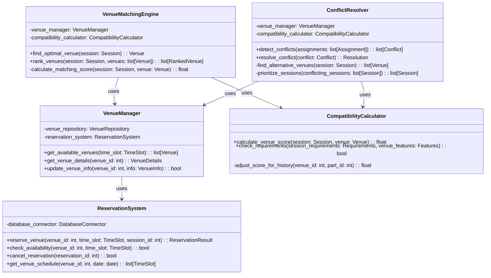
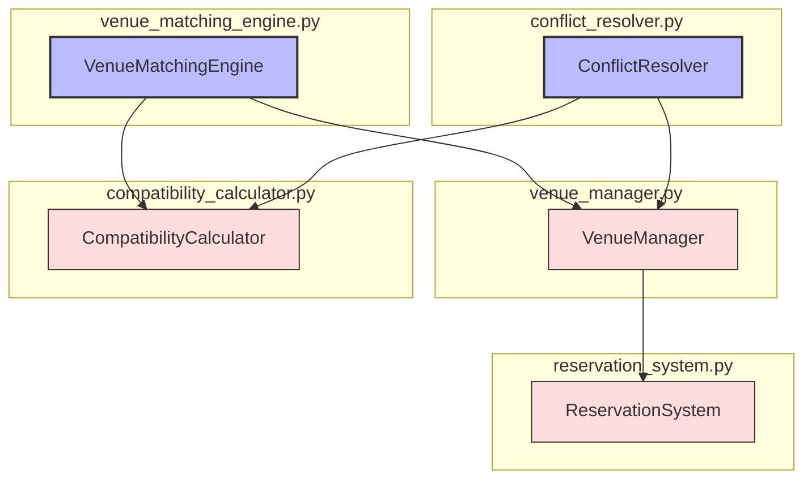

# ALGO-SCHED-001.2: 会場割り当てアルゴリズム実装

## 概要
練習表自動生成システムにおける会場割り当てアルゴリズムを実装します。各練習セッションに対して、練習内容や参加人数、パートの特性を考慮して最適な会場を割り当てる機能を開発します。

## 詳細
- 会場特性（収容人数、設備、利用可能時間など）の管理システム実装
- パート特性と会場特性のマッチングアルゴリズム開発
- 会場の予約状況と利用可能性の確認機能
- 会場予約の競合解決ロジック
- 会場割り当ての優先順位付けシステム

## 依存関係
- 親タスク: ALGO-SCHED-001
- ALGO-SCHED-001.1: 基本計画からの初期割り当てアルゴリズム実装
- BACK-DB-001.3: スケジュール管理テーブルの設計と実装
- BACK-DB-001.4: 会場・設備管理テーブルの設計と実装

## 参照ファイル
- [設計書/09_アルゴリズム詳細_1_スケジュール生成.md](../../../../設計書/09_アルゴリズム詳細_1_スケジュール生成.md)
- [設計書/10_会場管理仕様.md](../../../../設計書/10_会場管理仕様.md)

## 成果物
- 会場割り当てアルゴリズム実装コード
- アルゴリズムのテストケース
- 会場適合性評価関数の実装
- 実装ドキュメント
- 使用方法ガイド

## ステータス
- [ ] 未開始
- [ ] 進行中
- [ ] レビュー中
- [ ] 完了

## 担当者
未割り当て

## 主要機能
1. **会場特性管理**
   - 会場情報（広さ、設備、収容人数）のモデル化
   - 会場タイプの分類と特性マッピング
   - 会場利用可能時間の管理
   - 会場の特殊条件の定義と処理

2. **マッチングアルゴリズム**
   - パート要件と会場特性の適合度計算
   - 演奏形態に応じた会場選定ロジック
   - 優先度に基づく会場割り当て
   - 複数パート同時利用の最適配置

3. **予約状況管理**
   - 会場の予約状況の追跡システム
   - 時間枠ごとの利用可能会場のクエリ
   - 重複予約の防止メカニズム
   - 予約変更の影響分析

4. **競合解決**
   - 予約競合の検出アルゴリズム
   - 競合時の優先順位決定ロジック
   - 代替会場の提案メカニズム
   - 強制的な再割り当て処理

5. **優先順位システム**
   - パートの重要度に基づく優先順位付け
   - 特別イベントの優先処理
   - 履歴に基づく公平な会場割り当て
   - 会場割り当ての満足度評価

## 設計図

### クラス図


## 実装アプローチ
### 会場割り当てアルゴリズム概要
1. **前処理フェーズ**
   - 会場データのロードと特性分析
   - 練習セッションの要件抽出
   - パート特性と必要設備の特定
   - 予約済み会場の時間枠マッピング

2. **割り当てフェーズ**
   - 各練習セッションの会場要件スコアリング
   - 会場適合性ランキングの生成
   - 最適会場の選定と予約
   - 時間枠ごとの会場割り当てマップ作成

3. **最適化フェーズ**
   - 初期割り当ての評価
   - 問題箇所（不適切な会場割り当て）の特定
   - 会場交換による全体最適化
   - 最終的な会場割り当て計画の作成

## アルゴリズム詳細
### コアアルゴリズム
```
会場割り当てアルゴリズム:
1. 全練習セッションを取得
2. 各セッションの会場要件を分析:
   a. 参加予定人数の把握
   b. 必要な設備の特定
   c. 特別要件の確認
3. 各セッションについて:
   a. 適合度スコアに基づいて会場をランク付け
   b. 最高スコアの利用可能会場を選択
   c. 会場を予約し、割り当てマップに記録
4. 全セッションの割り当て後:
   a. 未割り当てセッションの特定
   b. 代替会場の検索と割り当て
5. 最終的な会場割り当て計画を返却
```

### 適合度計算関数
```
会場適合度計算:
1. 基本スコア = 100点
2. 収容人数評価:
   a. 収容人数が参加人数の80-120%: 満点
   b. 過小または過大: 比率に応じて減点
3. 設備評価:
   a. 必須設備がある場合: +30点
   b. 必須設備がない場合: -100点（除外）
   c. 推奨設備がある場合: +10点/項目
4. 特殊条件評価:
   a. 防音要件を満たす: +20点
   b. アクセス条件を満たす: +10点
5. 履歴評価:
   a. 同一パートが過去に良い結果を出した会場: +15点
6. 最終スコア = 合計点数
```

## 実装予定ファイル
以下は実装予定の全ファイルのリストです。各ファイルの役割と目的を簡潔に記載します。

- `src/algorithm/scheduler/venue_manager.py` - 会場管理機能
- `src/algorithm/scheduler/venue_matching_engine.py` - 会場マッチングエンジン
- `src/algorithm/scheduler/compatibility_calculator.py` - 適合度計算機能
- `src/algorithm/scheduler/reservation_system.py` - 予約システム実装
- `src/algorithm/scheduler/conflict_resolver.py` - 競合解決機能
- `src/algorithm/scheduler/models/venue_models.py` - 会場モデル定義
- `src/algorithm/scheduler/config/venue_config.py` - 会場設定
- `src/algorithm/scheduler/utils/scoring_utils.py` - スコアリングユーティリティ
- `tests/algorithm/scheduler/test_venue_matching.py` - 会場マッチングテスト
- `tests/algorithm/scheduler/test_conflict_resolver.py` - 競合解決テスト

## 実装ファイル構成詳細
### `src/algorithm/scheduler/venue_manager.py`
**目的**: 会場情報の管理と取得機能を提供し、会場の基本操作を実装する

**クラス/インターフェース**:
- `VenueManager`: 会場管理クラス
  - **継承/実装**: なし
  - **主要メソッド**: 
    - `get_available_venues(time_slot: TimeSlot) -> list[Venue]` - 指定時間枠で利用可能な会場を取得
    - `get_venue_details(venue_id: int) -> VenueDetails` - 会場の詳細情報を取得
    - `update_venue_info(venue_id: int, info: VenueInfo) -> bool` - 会場情報を更新
  - **依存クラス**: `VenueRepository`, `ReservationSystem`

### `src/algorithm/scheduler/venue_matching_engine.py`
**目的**: セッションと会場のマッチングを行い、最適な会場を選定する

**クラス/インターフェース**:
- `VenueMatchingEngine`: 会場マッチングエンジンクラス
  - **継承/実装**: なし
  - **主要メソッド**: 
    - `find_optimal_venue(session: Session) -> Venue` - セッションに最適な会場を選定
    - `rank_venues(session: Session, venues: list[Venue]) -> list[RankedVenue]` - 会場をランク付け
    - `calculate_matching_score(session: Session, venue: Venue) -> float` - マッチングスコアを計算
  - **依存クラス**: `VenueManager`, `CompatibilityCalculator`

### `src/algorithm/scheduler/compatibility_calculator.py`
**目的**: セッションと会場の適合度を計算し、要件との互換性を評価する

**クラス/インターフェース**:
- `CompatibilityCalculator`: 適合度計算クラス
  - **継承/実装**: なし
  - **主要メソッド**: 
    - `calculate_venue_score(session: Session, venue: Venue) -> float` - 会場適合度スコアを計算
    - `check_requirements(session_requirements: Requirements, venue_features: Features) -> bool` - 要件との互換性を確認
    - `adjust_score_for_history(venue_id: int, part_id: int) -> float` - 過去の利用履歴に基づくスコア調整
  - **依存クラス**: なし

### `src/algorithm/scheduler/reservation_system.py`
**目的**: 会場の予約管理と利用可能性の確認を行う

**クラス/インターフェース**:
- `ReservationSystem`: 予約システムクラス
  - **継承/実装**: なし
  - **主要メソッド**: 
    - `reserve_venue(venue_id: int, time_slot: TimeSlot, session_id: int) -> ReservationResult` - 会場を予約
    - `check_availability(venue_id: int, time_slot: TimeSlot) -> bool` - 会場の利用可能性を確認
    - `cancel_reservation(reservation_id: int) -> bool` - 予約をキャンセル
    - `get_venue_schedule(venue_id: int, date: date) -> list[TimeSlot]` - 会場のスケジュールを取得
  - **依存クラス**: `DatabaseConnector`

### `src/algorithm/scheduler/conflict_resolver.py`
**目的**: 会場予約の競合を検出し、解決する

**クラス/インターフェース**:
- `ConflictResolver`: 競合解決クラス
  - **継承/実装**: なし
  - **主要メソッド**: 
    - `detect_conflicts(assignments: list[Assignment]) -> list[Conflict]` - 予約競合を検出
    - `resolve_conflict(conflict: Conflict) -> Resolution` - 競合を解決
    - `find_alternative_venues(session: Session) -> list[Venue]` - 代替会場を検索
    - `prioritize_sessions(conflicting_sessions: list[Session]) -> list[Session]` - 競合セッションに優先順位を付ける
  - **依存クラス**: `VenueManager`, `CompatibilityCalculator`

## ファイル間クラス連携図
