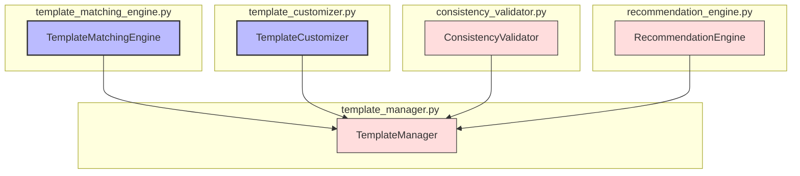

# ALGO-SCHED-001.3: 練習テンプレート適用アルゴリズム実装

## 概要
練習表自動生成システムにおける練習テンプレート適用アルゴリズムを実装します。事前に定義された練習テンプレートを各セッションに適用し、パート特性や練習進行状況に応じて最適な練習内容を設定する機能を開発します。

## 詳細
- 練習テンプレートの管理システム実装
- テンプレート選択とセッションへの適用ロジック
- パート特性と練習段階に基づくテンプレートのカスタマイズ機能
- テンプレート適用後の整合性検証
- テンプレート推奨システムの実装

## 依存関係
- 親タスク: ALGO-SCHED-001
- ALGO-SCHED-001.1: 基本計画からの初期割り当てアルゴリズム実装
- ALGO-SCHED-001.2: 会場割り当てアルゴリズム実装
- BACK-DB-001.2: パート・練習内容テーブルの設計と実装

## 参照ファイル
- [設計書/09_アルゴリズム詳細_1_スケジュール生成.md](../../../../設計書/09_アルゴリズム詳細_1_スケジュール生成.md)
- [設計書/11_練習テンプレート仕様.md](../../../../設計書/11_練習テンプレート仕様.md)

## 成果物
- 練習テンプレート適用アルゴリズム実装コード
- アルゴリズムのテストケース
- テンプレート管理インターフェース
- 実装ドキュメント
- 使用方法ガイド

## ステータス
- [ ] 未開始
- [ ] 進行中
- [ ] レビュー中
- [ ] 完了

## 担当者
未割り当て

## 主要機能
1. **テンプレート管理**
   - 練習テンプレートの定義と保存
   - テンプレートカテゴリの管理
   - テンプレートのバージョン管理
   - テンプレート間の関連付け

2. **テンプレート選択**
   - パート特性に基づくテンプレート推奨
   - 練習段階に応じたテンプレート選定
   - 特別イベント向けテンプレート管理
   - テンプレート選択の優先順位付け

3. **カスタマイズ機能**
   - テンプレートパラメータの調整
   - パート特性に基づくテンプレート修正
   - 進行状況によるテンプレート適応
   - 会場特性に合わせたテンプレート調整

4. **整合性検証**
   - テンプレート適用後の練習内容検証
   - 時間配分の妥当性確認
   - パート間の練習内容バランス確認
   - 練習目標との整合性確認

5. **テンプレート推奨**
   - 過去の成功実績に基づく推奨
   - パート特性とテンプレート適合度計算
   - シーズン段階に応じた推奨変更
   - ユーザーフィードバックの反映

## 設計図

### クラス図

```mermaid
classDiagram
    class TemplateManager {
        -template_repository: TemplateRepository
        +get_template(template_id: int): Template
        +save_template(template: Template): int
        +list_templates(category: str): list[Template]
        +get_template_version_history(template_id: int): list[TemplateVersion]
    }
    
    class TemplateMatchingEngine {
        -template_manager: TemplateManager
        -part_analyzer: PartAnalyzer
        +find_suitable_templates(session: Session): list[Template]
        +rank_templates(session: Session, templates: list[Template]): list[RankedTemplate]
        -calculate_template_score(session: Session, template: Template): float
    }
    
    class TemplateCustomizer {
        +customize_template(template: Template, session: Session): CustomizedTemplate
        +adjust_parameters(template: Template, adjustments: dict): Template
        -adapt_to_part_characteristics(template: Template, part: Part): Template
        -adapt_to_venue(template: Template, venue: Venue): Template
    }
    
    class ConsistencyValidator {
        +validate_template_application(session: Session, template: Template): ValidationResult
        +check_time_allocation(template: Template, session_duration: int): bool
        +check_practice_balance(template: Template): bool
        +check_goal_alignment(template: Template, part_goals: dict): bool
    }
    
    class RecommendationEngine {
        -template_manager: TemplateManager
        -history_analyzer: HistoryAnalyzer
        +recommend_templates(part: Part, progress_stage: str): list[Template]
        +incorporate_feedback(template_id: int, feedback: Feedback): void
        -analyze_success_patterns(part_id: int): list[SuccessPattern]
    }
    
    TemplateMatchingEngine --> TemplateManager : uses
    TemplateCustomizer --> TemplateManager : uses
    ConsistencyValidator --> TemplateManager : uses
    RecommendationEngine --> TemplateManager : uses
```


## 実装アプローチ
### テンプレート適用アルゴリズム概要
1. **前処理フェーズ**
   - テンプレートデータベースのロード
   - セッション情報の取得と分析
   - パート特性と練習段階の特定
   - 会場情報の確認

2. **テンプレート選択フェーズ**
   - 各セッションに最適なテンプレートを推奨
   - 推奨テンプレートのランキング生成
   - テンプレート選択の優先順位決定
   - 最適テンプレートの選定

3. **カスタマイズフェーズ**
   - 選択されたテンプレートをセッション要件に適応
   - パラメータ調整と内容カスタマイズ
   - 会場特性に合わせた修正
   - 最終的な練習内容の決定

4. **検証フェーズ**
   - カスタマイズ後の練習内容の整合性検証
   - 時間配分の確認
   - 練習目標との整合性チェック
   - 最終的な練習内容の承認

## アルゴリズム詳細
### コアアルゴリズム
```
テンプレート適用アルゴリズム:
1. 全練習セッションを取得
2. 各セッションについて:
   a. パート情報と練習段階を特定
   b. 会場情報と利用可能時間を確認
   c. 適合テンプレートをスコアリングで検索
   d. 最適テンプレートを選択
3. 選択されたテンプレートを各セッションに適用:
   a. テンプレートパラメータを調整
   b. パート特性に基づいて内容カスタマイズ
   c. 会場特性に合わせて時間配分調整
4. 全セッションのテンプレート適用後:
   a. 整合性チェックを実行
   b. 問題箇所を特定して修正
5. 最終的な練習内容を含むスケジュールを返却
```

### テンプレート適合度計算
```
テンプレート適合度計算:
1. 基本スコア = 100点
2. パート適合性:
   a. 専用テンプレート: +50点
   b. 互換性のあるテンプレート: +30点
   c. 一般テンプレート: +10点
3. 練習段階評価:
   a. 段階に完全一致: +40点
   b. 隣接段階: +20点
   c. 不一致: -20点
4. 過去の実績:
   a. 高評価を得たテンプレート: +25点
   b. 通常評価: +0点
   c. 低評価: -15点
5. 会場適合性:
   a. 会場特性に最適: +15点
   b. 調整必要: +0点
   c. 大幅な調整必要: -10点
6. 最終スコア = 合計点数
```

## 実装予定ファイル
以下は実装予定の全ファイルのリストです。各ファイルの役割と目的を簡潔に記載します。

- `src/algorithm/scheduler/template_manager.py` - テンプレート管理機能
- `src/algorithm/scheduler/template_matching_engine.py` - テンプレートマッチング
- `src/algorithm/scheduler/template_customizer.py` - カスタマイズ機能
- `src/algorithm/scheduler/consistency_validator.py` - 整合性検証
- `src/algorithm/scheduler/recommendation_engine.py` - 推奨エンジン
- `src/algorithm/scheduler/models/template_models.py` - テンプレートモデル定義
- `src/algorithm/scheduler/utils/template_utils.py` - テンプレート操作ユーティリティ
- `src/algorithm/scheduler/config/template_config.py` - テンプレート設定
- `tests/algorithm/scheduler/test_template_application.py` - テンプレート適用テスト
- `tests/algorithm/scheduler/test_template_customizer.py` - カスタマイズ機能テスト

## 実装ファイル構成詳細
### `src/algorithm/scheduler/template_manager.py`
**目的**: 練習テンプレートの管理と操作を行うための機能を提供する

**クラス/インターフェース**:
- `TemplateManager`: テンプレート管理クラス
  - **継承/実装**: なし
  - **主要メソッド**: 
    - `get_template(template_id: int) -> Template` - テンプレートを取得
    - `save_template(template: Template) -> int` - テンプレートを保存
    - `list_templates(category: str) -> list[Template]` - カテゴリ別テンプレート一覧取得
    - `get_template_version_history(template_id: int) -> list[TemplateVersion]` - テンプレートバージョン履歴取得
  - **依存クラス**: `TemplateRepository`

### `src/algorithm/scheduler/template_matching_engine.py`
**目的**: セッションに最適なテンプレートを選択するためのマッチング機能を提供する

**クラス/インターフェース**:
- `TemplateMatchingEngine`: テンプレートマッチングエンジンクラス
  - **継承/実装**: なし
  - **主要メソッド**: 
    - `find_suitable_templates(session: Session) -> list[Template]` - 適合するテンプレートを検索
    - `rank_templates(session: Session, templates: list[Template]) -> list[RankedTemplate]` - テンプレートをランク付け
    - `calculate_template_score(session: Session, template: Template) -> float` - テンプレートの適合度スコアを計算
  - **依存クラス**: `TemplateManager`, `PartAnalyzer`

### `src/algorithm/scheduler/template_customizer.py`
**目的**: 選択されたテンプレートをセッション要件に合わせてカスタマイズする

**クラス/インターフェース**:
- `TemplateCustomizer`: テンプレートカスタマイズクラス
  - **継承/実装**: なし
  - **主要メソッド**: 
    - `customize_template(template: Template, session: Session) -> CustomizedTemplate` - テンプレートをカスタマイズ
    - `adjust_parameters(template: Template, adjustments: dict) -> Template` - パラメータを調整
    - `adapt_to_part_characteristics(template: Template, part: Part) -> Template` - パート特性に適応
    - `adapt_to_venue(template: Template, venue: Venue) -> Template` - 会場に適応
  - **依存クラス**: なし

### `src/algorithm/scheduler/consistency_validator.py`
**目的**: テンプレート適用後の整合性を検証する

**クラス/インターフェース**:
- `ConsistencyValidator`: 整合性検証クラス
  - **継承/実装**: なし
  - **主要メソッド**: 
    - `validate_template_application(session: Session, template: Template) -> ValidationResult` - テンプレート適用を検証
    - `check_time_allocation(template: Template, session_duration: int) -> bool` - 時間配分を確認
    - `check_practice_balance(template: Template) -> bool` - 練習バランスを確認
    - `check_goal_alignment(template: Template, part_goals: dict) -> bool` - 目標との整合性を確認
  - **依存クラス**: `TemplateManager`

### `src/algorithm/scheduler/recommendation_engine.py`
**目的**: 過去のデータに基づいて最適なテンプレートを推奨する

**クラス/インターフェース**:
- `RecommendationEngine`: 推奨エンジンクラス
  - **継承/実装**: なし
  - **主要メソッド**: 
    - `recommend_templates(part: Part, progress_stage: str) -> list[Template]` - テンプレートを推奨
    - `incorporate_feedback(template_id: int, feedback: Feedback) -> None` - フィードバックを反映
    - `analyze_success_patterns(part_id: int) -> list[SuccessPattern]` - 成功パターンを分析
  - **依存クラス**: `TemplateManager`, `HistoryAnalyzer`

## ファイル間クラス連携図
