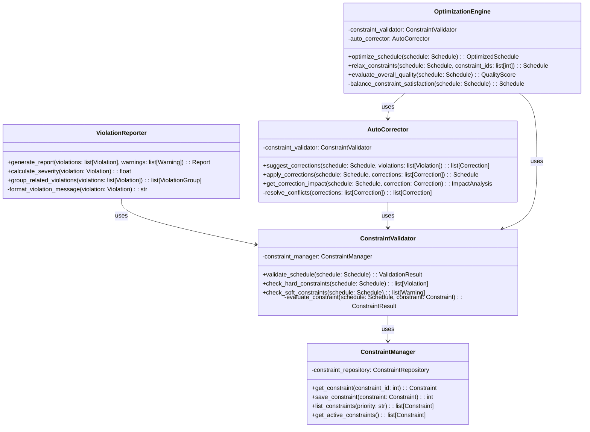
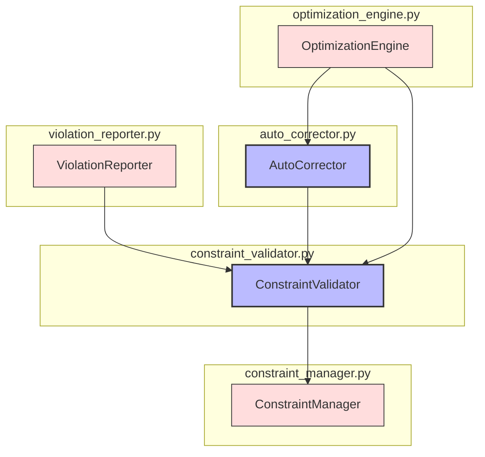

# ALGO-SCHED-001.4: スケジュール制約検証アルゴリズム実装

## 概要
練習表自動生成システムにおけるスケジュール制約検証アルゴリズムを実装します。生成されたスケジュールが運用上および練習効率上の制約を満たしているかを検証し、必要に応じて調整・修正する機能を開発します。

## 詳細
- ハードコンストレイント（絶対制約）の検証機能
- ソフトコンストレイント（望ましい条件）の検証機能
- 各種制約ルールの定義・管理システム
- 違反報告と自動修正機能の実装
- パフォーマンス最適化と複数制約の同時処理

## 依存関係
- 親タスク: ALGO-SCHED-001
- ALGO-SCHED-001.1: 基本計画からの初期割り当てアルゴリズム実装
- ALGO-SCHED-001.2: 会場割り当てアルゴリズム実装
- ALGO-SCHED-001.3: 練習テンプレート適用アルゴリズム実装
- BACK-DB-001.3: 制約条件テーブルの設計と実装

## 参照ファイル
- [設計書/09_アルゴリズム詳細_1_スケジュール生成.md](../../../../設計書/09_アルゴリズム詳細_1_スケジュール生成.md)
- [設計書/12_スケジュール制約条件.md](../../../../設計書/12_スケジュール制約条件.md)

## 成果物
- スケジュール制約検証アルゴリズム実装コード
- アルゴリズムのテストケース
- 制約ルール管理インターフェース
- 実装ドキュメント
- 使用方法ガイド

## ステータス
- [ ] 未開始
- [ ] 進行中
- [ ] レビュー中
- [ ] 完了

## 担当者
未割り当て

## 主要機能
1. **制約管理**
   - 制約条件の定義と保存
   - 制約の優先順位付け
   - ハードコンストレイントとソフトコンストレイントの区別
   - カスタム制約の追加・編集機能

2. **ハードコンストレイント検証**
   - 会場の重複予約の検出
   - 指導者の同時間帯複数予約の防止
   - 必須練習項目の未実施検出
   - 時間的連続性確認（不可能な移動の防止）

3. **ソフトコンストレイント検証**
   - 練習の理想的間隔の検証
   - パート間練習量バランスの評価
   - 曲目の練習バランス評価
   - 会場切り替えの最適化評価

4. **違反報告と修正提案**
   - 違反の詳細レポート生成
   - 違反の重大度評価
   - 自動修正案の提示
   - 複数違反の関連性分析

5. **最適化処理**
   - 複数制約の同時処理最適化
   - 優先順位に基づく制約緩和の提案
   - スケジュール全体の最適性評価
   - 実行パフォーマンスの最適化

## 設計図

### クラス図


## 実装アプローチ
### 制約検証アルゴリズム概要
1. **制約の初期化**
   - 設定された全ての制約条件を読み込み
   - 制約の優先順位に基づき分類
   - 制約間の関連性や矛盾の確認
   - 検証対象スケジュールの読み込み

2. **ハードコンストレイント検証**
   - 全ての絶対制約に対して検証実行
   - 違反発見時に即時フラグを立てる
   - 違反の詳細情報を記録
   - 重大な違反は処理を停止

3. **ソフトコンストレイント検証**
   - 全ての望ましい条件について検証
   - 条件ごとに満足度スコアを計算
   - 警告レベルの違反を記録
   - 全体スコアの集計

4. **違反のレポート生成**
   - 検出された全ての違反をまとめたレポート作成
   - 違反の重大度に基づいてソート
   - 関連する違反をグループ化
   - 修正に向けた提案を追加

5. **自動修正処理**
   - 違反の優先順位に基づいて修正案を生成
   - 修正案の相互影響を評価
   - 最適な修正の組み合わせを選定
   - 修正適用後の再検証

## アルゴリズム詳細
### コアアルゴリズム
```
スケジュール制約検証アルゴリズム:
1. 全ての制約条件をロード
2. 対象スケジュールの全セッションを走査
3. 各セッションについて:
   a. 全てのハードコンストレイントに対して検証
   b. 違反があれば違反リストに追加
4. 全てのハードコンストレイント検証が完了後:
   a. ハードコンストレイント違反がなければソフトコンストレイント検証へ
   b. 違反があれば深刻度を評価し、報告
5. ソフトコンストレイント検証:
   a. 全セッションに対して全ソフトコンストレイントを検証
   b. 各制約の満足度をスコア化
   c. 警告レベルの問題を記録
6. 違反と警告のレポート生成
7. 自動修正が可能な場合は修正案を提示
8. 修正適用後のスケジュールを返却
```

### 制約評価ロジック
```
制約評価ロジック:
1. 制約タイプを確認（ハード/ソフト）
2. 制約のチェック関数を実行
3. ハードコンストレイントの場合:
   a. 満たす: true を返す
   b. 満たさない: 違反詳細を含む false を返す
4. ソフトコンストレイントの場合:
   a. 満足度を 0～100 でスコア化
   b. 閾値未満のスコアは警告として記録
   c. 閾値以上のスコアは問題なしとして処理
5. 全制約の評価結果を集約
6. 総合評価スコアを算出
```

## 実装予定ファイル
以下は実装予定の全ファイルのリストです。各ファイルの役割と目的を簡潔に記載します。

- `src/algorithm/scheduler/constraint_manager.py` - 制約条件管理
- `src/algorithm/scheduler/constraint_validator.py` - 制約検証機能
- `src/algorithm/scheduler/violation_reporter.py` - 違反レポート機能
- `src/algorithm/scheduler/auto_corrector.py` - 自動修正機能
- `src/algorithm/scheduler/optimization_engine.py` - 最適化エンジン
- `src/algorithm/scheduler/models/constraint_models.py` - 制約モデル定義
- `src/algorithm/scheduler/utils/constraint_utils.py` - 制約操作ユーティリティ
- `src/algorithm/scheduler/config/constraint_config.py` - 制約設定
- `tests/algorithm/scheduler/test_constraint_validation.py` - 制約検証テスト
- `tests/algorithm/scheduler/test_auto_correction.py` - 自動修正テスト

## 実装ファイル構成詳細
### `src/algorithm/scheduler/constraint_manager.py`
**目的**: スケジュール制約条件の管理と操作を行うための機能を提供する

**クラス/インターフェース**:
- `ConstraintManager`: 制約管理クラス
  - **継承/実装**: なし
  - **主要メソッド**: 
    - `get_constraint(constraint_id: int) -> Constraint` - 制約を取得
    - `save_constraint(constraint: Constraint) -> int` - 制約を保存
    - `list_constraints(priority: str) -> list[Constraint]` - 優先度別制約一覧取得
    - `get_active_constraints() -> list[Constraint]` - 有効な制約を取得
  - **依存クラス**: `ConstraintRepository`

### `src/algorithm/scheduler/constraint_validator.py`
**目的**: スケジュールに対して制約条件の検証を行う

**クラス/インターフェース**:
- `ConstraintValidator`: 制約検証クラス
  - **継承/実装**: なし
  - **主要メソッド**: 
    - `validate_schedule(schedule: Schedule) -> ValidationResult` - スケジュールを検証
    - `check_hard_constraints(schedule: Schedule) -> list[Violation]` - ハード制約をチェック
    - `check_soft_constraints(schedule: Schedule) -> list[Warning]` - ソフト制約をチェック
    - `evaluate_constraint(schedule: Schedule, constraint: Constraint) -> ConstraintResult` - 制約を評価
  - **依存クラス**: `ConstraintManager`

### `src/algorithm/scheduler/violation_reporter.py`
**目的**: 制約違反の詳細レポートを生成する

**クラス/インターフェース**:
- `ViolationReporter`: 違反レポート生成クラス
  - **継承/実装**: なし
  - **主要メソッド**: 
    - `generate_report(violations: list[Violation], warnings: list[Warning]) -> Report` - レポート生成
    - `calculate_severity(violation: Violation) -> float` - 違反の重大度を計算
    - `group_related_violations(violations: list[Violation]) -> list[ViolationGroup]` - 関連する違反をグループ化
    - `format_violation_message(violation: Violation) -> str` - 違反メッセージを整形
  - **依存クラス**: なし

### `src/algorithm/scheduler/auto_corrector.py`
**目的**: 制約違反の自動修正を行う

**クラス/インターフェース**:
- `AutoCorrector`: 自動修正クラス
  - **継承/実装**: なし
  - **主要メソッド**: 
    - `suggest_corrections(schedule: Schedule, violations: list[Violation]) -> list[Correction]` - 修正案を提案
    - `apply_corrections(schedule: Schedule, corrections: list[Correction]) -> Schedule` - 修正を適用
    - `get_correction_impact(schedule: Schedule, correction: Correction) -> ImpactAnalysis` - 修正の影響を分析
    - `resolve_conflicts(corrections: list[Correction]) -> list[Correction]` - 修正間の競合を解決
  - **依存クラス**: `ConstraintValidator`

### `src/algorithm/scheduler/optimization_engine.py`
**目的**: スケジュール全体の最適化を行う

**クラス/インターフェース**:
- `OptimizationEngine`: 最適化エンジンクラス
  - **継承/実装**: なし
  - **主要メソッド**: 
    - `optimize_schedule(schedule: Schedule) -> OptimizedSchedule` - スケジュールを最適化
    - `relax_constraints(schedule: Schedule, constraint_ids: list[int]) -> Schedule` - 制約を緩和
    - `evaluate_overall_quality(schedule: Schedule) -> QualityScore` - 全体品質を評価
    - `balance_constraint_satisfaction(schedule: Schedule) -> Schedule` - 制約満足度のバランスを取る
  - **依存クラス**: `ConstraintValidator`, `AutoCorrector`

## ファイル間クラス連携図
