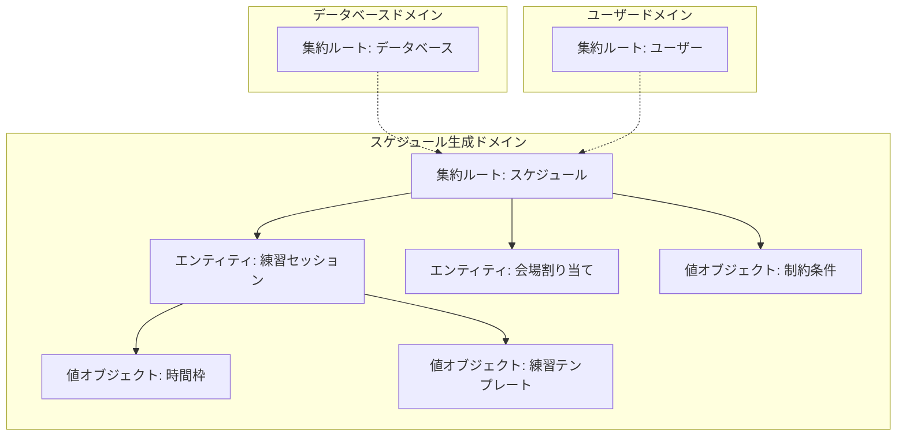
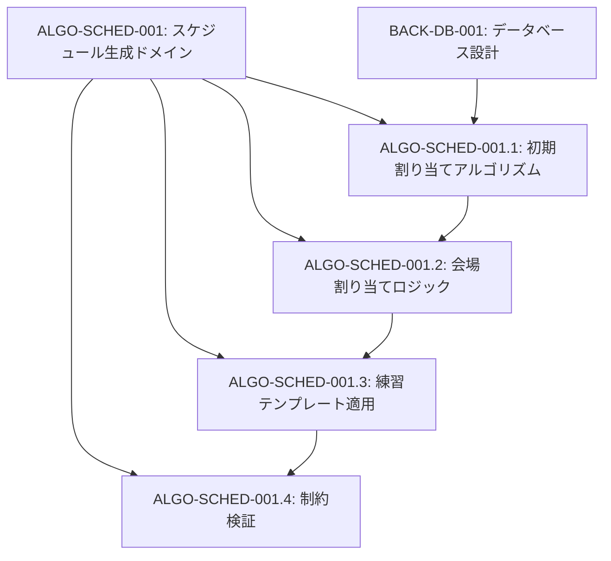
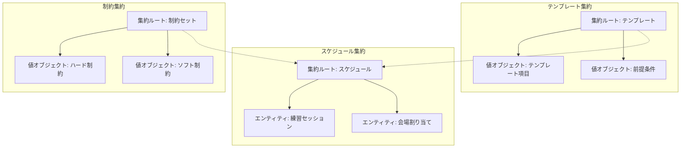
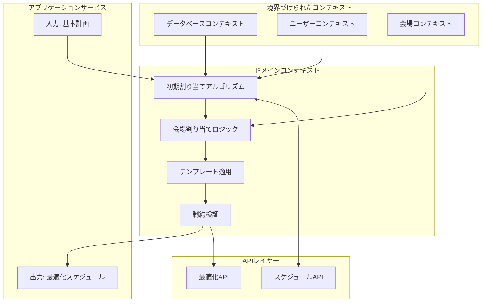

# ALGO-SCHED-001: 初期スケジュール生成アルゴリズム

## ドメインの概要
練習表自動生成システムの核となるスケジュール生成ドメインは、基本計画から練習セッションを最適に配置し、会場割り当て、参加者の調整などを行う責務を持ちます。制約条件を満たしながら効率的かつ実用的な練習スケジュールを生成することを目的とします。

## ドメインモデルと境界づけられたコンテキスト

## ユビキタス言語

| 用語 | 定義 |
|------|------|
| 基本計画 | 練習全体の方針や目標を定めた計画文書 |
| 練習セッション | 特定の時間枠、会場、参加者で構成される単一の練習単位 |
| 会場割り当て | 練習セッションに適切な会場を割り当てる処理 |
| 練習テンプレート | 繰り返し利用可能な練習パターンの定義 |
| 時間枠 | 練習が行われる日時の範囲を示す値オブジェクト |
| ハード制約 | 必ず満たさなければならない制約条件 |
| ソフト制約 | 可能な限り満たすことが望ましい制約条件 |
| タイムテーブル | 練習セッションの時間配置を表形式で表したもの |

## サブドメイン構成

## サブドメイン詳細

### ALGO-SCHED-001.1: 初期割り当てアルゴリズム
**ドメイン責務**: 基本計画を分析し、練習セッションの初期配置を最適に生成する

**ドメインサービス**:
- 基本計画分析サービス（計画文書からの要件抽出と解析）
- スケジュール構築サービス（時間枠への練習セッション配置）
- タイムテーブル生成サービス（視覚的なスケジュール表の生成）
- 練習頻度最適化サービス（パートごとの練習要件充足）

**ステータス**: 未開始

### ALGO-SCHED-001.2: 会場割り当てロジック
**ドメイン責務**: 練習セッションの要件に基づいて最適な会場を割り当てる

**ドメインサービス**:
- 会場マッチングサービス（練習要件と会場特性の整合）
- 会場容量検証サービス（参加人数と収容人数の検証）
- 設備互換性サービス（必要設備と会場設備の検証）
- 移動最適化サービス（移動時間と連続性の最適化）

**ステータス**: 未開始

### ALGO-SCHED-001.3: 練習テンプレート適用
**ドメイン責務**: 定義済みの練習パターンをスケジュールに適用し整合性を確保する

**ドメインサービス**:
- テンプレート管理サービス（テンプレートの保存と取得）
- 前提条件検証サービス（テンプレート適用の前提条件確認）
- テンプレートカスタマイズサービス（特定の状況に応じた調整）
- テンプレート整合性サービス（複数テンプレート間の調整）

**ステータス**: 未開始

### ALGO-SCHED-001.4: 制約検証
**ドメイン責務**: スケジュールに対する制約条件を検証し、違反時に調整を行う

**ドメインサービス**:
- 重複検出サービス（時間的重複の検出と解決）
- 容量制約サービス（会場容量制約の検証）
- 監督者制約サービス（監督者の連続割り当て制約）
- 参加人数検証サービス（最小参加人数の確保）

**ステータス**: 未開始

## コマンド・クエリ責務分離（CQRS）

### コマンド（書き込み操作）
- 基本計画登録コマンド
- スケジュール生成コマンド
- 会場割り当てコマンド
- テンプレート適用コマンド
- 制約違反解消コマンド
- スケジュール最適化コマンド

### クエリ（読み取り操作）
- スケジュール詳細クエリ
- 時間枠別セッションクエリ
- 会場利用状況クエリ
- テンプレート一覧クエリ
- 制約違反リストクエリ
- 最適化提案クエリ

## 集約と整合性境界

## 開発コンテキスト図

## 進捗管理

| サブドメイン | ステータス | 担当者 | 開始日 | 完了予定 | 実際の完了日 |
|------------|-----------|--------|-------|---------|------------|
| ALGO-SCHED-001.1 | 未開始 | 未割り当て | - | - | - |
| ALGO-SCHED-001.2 | 未開始 | 未割り当て | - | - | - |
| ALGO-SCHED-001.3 | 未開始 | 未割り当て | - | - | - |
| ALGO-SCHED-001.4 | 未開始 | 未割り当て | - | - | - |

## イベントストーミング

## 課題・リスク

- 複雑な制約条件の組み合わせによる最適化の計算量増大
- 多数の練習セッションが存在する場合のパフォーマンス低下
- ユーザーの意図しない結果が生成される可能性
- 会場情報やユーザー情報との連携における整合性確保
- ドメインモデルの複雑さに起因するメンテナンス性の低下

## レビューポイント

- アルゴリズムの計算量と性能
- 制約条件の実装の完全性
- ユーザーの意図を反映する柔軟性
- エッジケースへの対応
- テンプレート適用の整合性
- ドメインモデルとビジネス要件の一致度

## リファレンス

- [設計書/09_アルゴリズム詳細_1_スケジュール生成.md](../../設計書/09_アルゴリズム詳細_1_スケジュール生成.md)
- [要件定義/要件定義.md](../../要件定義/要件定義.md) 