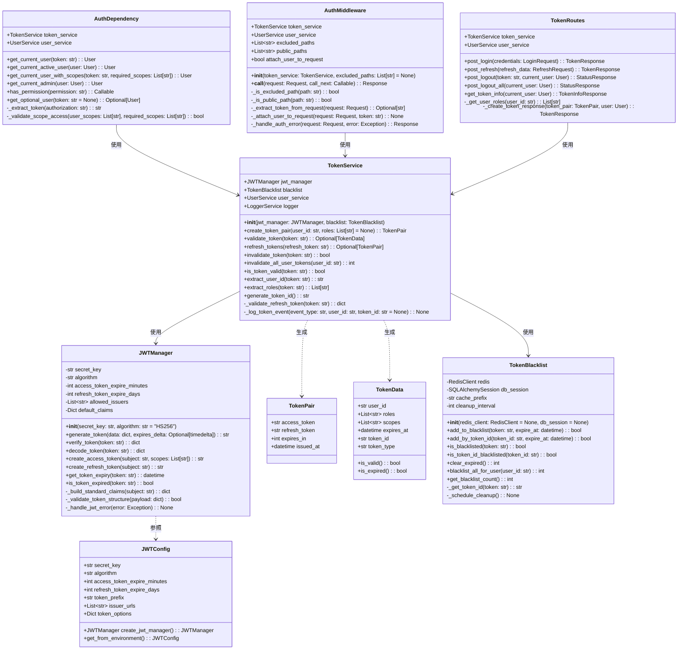
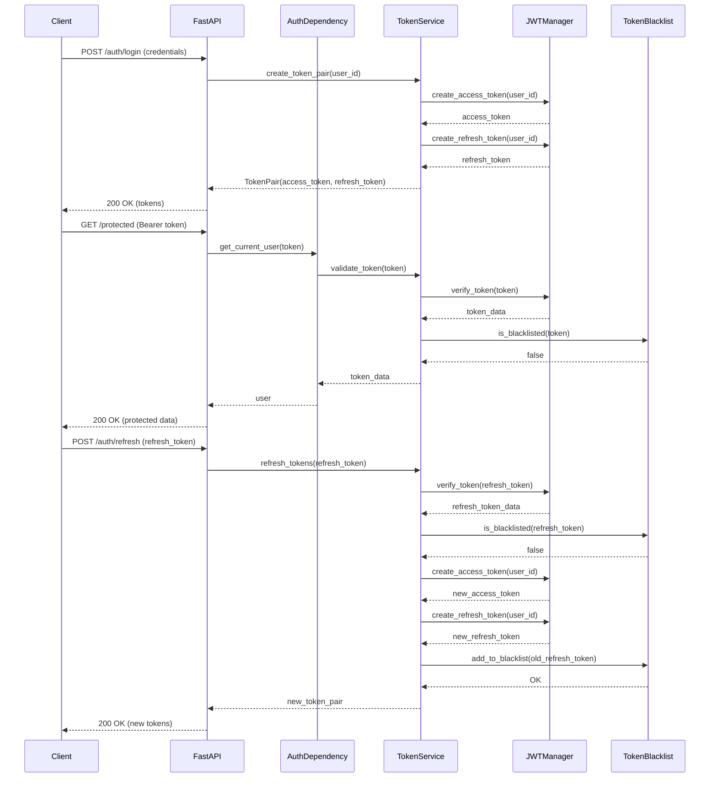
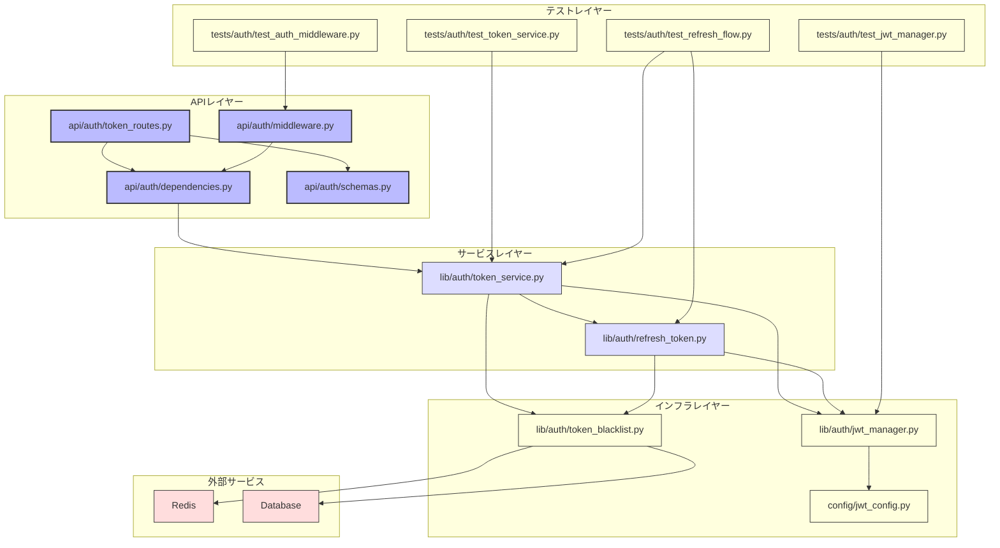

# BACK-API-001.2: JWT認証と更新機能実装

## 概要
練習表自動生成システムのJWT認証機能とトークン更新メカニズムをPythonで実装します。セキュアなユーザーセッション管理とアクセス制御を実現し、バックエンドAPIのセキュリティを確保します。

## 詳細
- PyJWTを使用したJWTトークンの生成と検証の実装
- リフレッシュトークンを使用したJWT更新機能の開発
- セキュアなトークン保存メカニズムの構築
- FastAPI用の認証ミドルウェアの実装
- トークン有効期限と自動更新機能のPython実装

## 依存関係
- 親タスク: BACK-API-001
- BACK-API-001.1: Supabase Auth設定と実装

## 参照ファイル
- [設計書/07_権限・ロール設計.md](../../../../設計書/07_権限・ロール設計.md)
- [設計書/11g_実装指針_バックエンド.md](../../../../設計書/11g_実装指針_バックエンド.md)

## 成果物
- Python JWT生成・検証ライブラリ
- トークン更新サービス
- セキュアストレージ実装
- FastAPI用認証ミドルウェア
- セキュリティテスト仕様書と実装

## ステータス
- [x] 未開始
- [ ] 進行中
- [ ] レビュー中
- [ ] 完了

## 担当者
未割り当て

## 主要機能
1. **JWTトークン管理**
   - PyJWTを使用したトークン構造の設計
   - RSA/HMAC署名と検証の実装
   - トークンペイロードスキーマの定義
   - Pythonでのトークン有効期限管理

2. **リフレッシュトークン機能**
   - セキュアなリフレッシュトークン生成
   - Redis/SQLを使用したトークン保存と検証
   - 有効期限と自動ローテーション機能
   - 無効化リスト（ブラックリスト）の管理

3. **FastAPI認証ミドルウェア**
   - Dependency Injection対応の認証機能
   - OAuth2スキームの実装
   - HTTPオンリーCookieでのトークン管理
   - シンプルなAPI保護メカニズム

4. **認証状態管理**
   - Pythonバックエンド用の状態管理
   - 認証状態変更イベントの実装
   - 有効期限切れ自動検出
   - Redis/SQLを使用したセッションストア

## 実装予定ファイル
以下は実装予定の全ファイルのリストです。各ファイルの役割と目的を簡潔に記載します。

- `lib/auth/jwt_manager.py` - JWTトークン生成と検証機能
- `lib/auth/token_service.py` - トークン管理サービス
- `lib/auth/refresh_token.py` - リフレッシュトークン処理
- `lib/auth/token_blacklist.py` - トークン無効化リスト管理
- `api/auth/dependencies.py` - FastAPI認証依存関係
- `api/auth/middleware.py` - FastAPI認証ミドルウェア
- `api/auth/token_routes.py` - トークン関連APIエンドポイント
- `config/jwt_config.py` - JWT設定ファイル
- `tests/auth/test_jwt_manager.py` - JWT管理のテスト
- `tests/auth/test_token_service.py` - トークンサービスのテスト
- `tests/auth/test_refresh_flow.py` - トークン更新フローのテスト
- `tests/auth/test_auth_middleware.py` - 認証ミドルウェアのテスト

## 設計図
### クラス図

### シーケンス図

## 実装アプローチ
### JWT実装
1. **設定と依存関係**
   - PyJWTライブラリのインストールと設定
   - 環境変数での秘密鍵管理
   - JWT設定の構成管理
   - トークン有効期限の設定

2. **トークン生成と検証**
   - アクセストークンとリフレッシュトークンの実装
   - トークンペイロード構造の実装
   - デジタル署名の実装と検証
   - 有効期限チェックとエラーハンドリング

3. **リフレッシュメカニズム**
   - リフレッシュトークンの保存方法実装
   - トークン更新APIエンドポイント開発
   - リフレッシュトークンのローテーション
   - 無効化メカニズムの実装

4. **セキュリティ強化**
   - CSRF対策の実装
   - XSS対策の実装
   - トークン漏洩対策
   - レート制限の設定

## 実装ファイル構成詳細
以下は全ての実装予定ファイルの詳細です。各ファイルごとに目的とクラス/インターフェース、メソッド、依存関係などを詳しく記載します。

### `lib/auth/jwt_manager.py`
**目的**: JWTトークンの生成と検証を行う中核機能の実装

**クラス/インターフェース**:
- `JWTManager`: JWT操作の主要クラス
  - **継承/実装**: なし
  - **主要属性**:
    - `secret_key: str` - トークン署名用の秘密鍵
    - `algorithm: str` - 署名アルゴリズム（デフォルト: HS256）
    - `access_token_expire_minutes: int` - アクセストークンの有効期限（分）
    - `refresh_token_expire_days: int` - リフレッシュトークンの有効期限（日）
    - `allowed_issuers: List[str]` - 許可されたトークン発行者リスト
    - `default_claims: Dict` - デフォルトのクレーム値
  - **主要メソッド**: 
    - `__init__(secret_key: str, algorithm: str = "HS256")` - 初期化
    - `generate_token(data: dict, expires_delta: Optional[timedelta] = None) -> str` - 汎用的なトークン生成
    - `verify_token(token: str) -> dict` - トークンの検証とデコード
    - `create_access_token(subject: str, scopes: List[str] = None) -> str` - アクセストークン生成
    - `create_refresh_token(subject: str) -> str` - リフレッシュトークン生成
    - `decode_token(token: str) -> dict` - 検証なしでトークンをデコード（内部用）
    - `get_token_expiry(token: str) -> datetime` - トークンの有効期限を取得
    - `is_token_expired(token: str) -> bool` - トークンが期限切れかチェック
  - **補助メソッド**:
    - `_build_standard_claims(subject: str) -> dict` - 標準クレームの構築
    - `_validate_token_structure(payload: dict) -> bool` - トークン構造の検証
    - `_handle_jwt_error(error: Exception) -> None` - JWT例外処理
  - **例外処理**:
    - `JWTDecodeError` - トークンデコードエラー
    - `JWTExpiredSignatureError` - 期限切れトークンエラー
    - `JWTInvalidSignatureError` - 不正な署名エラー
  - **依存クラス**: `PyJWT`, `datetime`, `typing`

### `lib/auth/token_service.py`
**目的**: トークン操作の高レベルサービスを提供する

**クラス/インターフェース**:
- `TokenPair`: アクセストークンとリフレッシュトークンのペア（Pydanticモデル）
  - **主要属性**:
    - `access_token: str` - アクセストークン
    - `refresh_token: str` - リフレッシュトークン
    - `expires_in: int` - 有効期限（秒）
    - `issued_at: datetime` - 発行日時

- `TokenData`: デコードされたトークンデータ（Pydanticモデル）
  - **主要属性**:
    - `user_id: str` - ユーザーID
    - `roles: List[str]` - ユーザーロール
    - `scopes: List[str]` - 許可されたスコープ
    - `expires_at: datetime` - 有効期限
    - `token_id: str` - トークンの一意識別子
    - `token_type: str` - トークンタイプ（access/refresh）
  - **メソッド**:
    - `is_valid() -> bool` - トークンが有効か確認
    - `is_expired() -> bool` - トークンが期限切れか確認

- `TokenService`: トークン管理の主要サービス
  - **継承/実装**: なし
  - **主要属性**:
    - `jwt_manager: JWTManager` - JWTマネージャー
    - `blacklist: TokenBlacklist` - トークンブラックリスト
    - `user_service: UserService` - ユーザーサービス（オプション）
    - `logger: LoggerService` - ロガーサービス
  - **主要メソッド**: 
    - `__init__(jwt_manager: JWTManager, blacklist: TokenBlacklist)` - 初期化
    - `create_token_pair(user_id: str, roles: List[str] = None) -> TokenPair` - トークンペアの生成
    - `validate_token(token: str) -> Optional[TokenData]` - トークンの検証
    - `refresh_tokens(refresh_token: str) -> Optional[TokenPair]` - トークンの更新
    - `invalidate_token(token: str) -> bool` - トークンの無効化
    - `invalidate_all_user_tokens(user_id: str) -> int` - ユーザーの全トークン無効化
    - `is_token_valid(token: str) -> bool` - トークンの有効性チェック
    - `extract_user_id(token: str) -> str` - トークンからユーザーID抽出
    - `extract_roles(token: str) -> List[str]` - トークンからロール抽出
    - `generate_token_id() -> str` - トークンIDの生成
  - **補助メソッド**:
    - `_validate_refresh_token(token: str) -> dict` - リフレッシュトークン検証
    - `_log_token_event(event_type: str, user_id: str, token_id: str = None) -> None` - トークンイベントログ
  - **例外処理**:
    - `InvalidTokenError` - 無効なトークンエラー
    - `ExpiredTokenError` - 期限切れトークンエラー
    - `BlacklistedTokenError` - ブラックリスト済みトークンエラー
  - **依存クラス**: `JWTManager`, `TokenBlacklist`, `uuid`, `datetime`

### `lib/auth/token_blacklist.py`
**目的**: 無効化されたトークンの管理

**クラス/インターフェース**:
- `TokenBlacklist`: トークンのブラックリスト管理
  - **継承/実装**: なし
  - **主要属性**:
    - `redis: RedisClient` - Redisクライアント（オプション）
    - `db_session: SQLAlchemySession` - データベースセッション（オプション）
    - `cache_prefix: str` - キャッシュプレフィックス
    - `cleanup_interval: int` - クリーンアップ実行間隔（秒）
  - **主要メソッド**: 
    - `__init__(redis_client: RedisClient = None, db_session = None)` - 初期化
    - `add_to_blacklist(token: str, expire_at: datetime) -> bool` - トークンをブラックリストに追加
    - `add_by_token_id(token_id: str, expire_at: datetime) -> bool` - トークンIDでブラックリストに追加
    - `is_blacklisted(token: str) -> bool` - トークンがブラックリストにあるか確認
    - `is_token_id_blacklisted(token_id: str) -> bool` - トークンIDがブラックリストにあるか確認
    - `clear_expired() -> int` - 期限切れのブラックリストエントリを削除
    - `blacklist_all_for_user(user_id: str) -> int` - ユーザーの全トークンをブラックリスト化
    - `get_blacklist_count() -> int` - ブラックリストのエントリ数取得
  - **補助メソッド**:
    - `_get_token_id(token: str) -> str` - トークンからIDを抽出
    - `_schedule_cleanup() -> None` - クリーンアップジョブのスケジュール
  - **依存クラス**: `redis`, `sqlalchemy`, `datetime`, `threading`

### `api/auth/middleware.py`
**目的**: FastAPI用の認証ミドルウェアを実装

**クラス/インターフェース**:
- `AuthMiddleware`: 認証ミドルウェア
  - **継承/実装**: なし
  - **主要属性**:
    - `token_service: TokenService` - トークンサービス
    - `user_service: UserService` - ユーザーサービス（オプション）
    - `excluded_paths: List[str]` - 認証除外パス
    - `public_paths: List[str]` - 公開パス（認証オプショナル）
    - `attach_user_to_request: bool` - リクエストにユーザー情報を添付するか
  - **主要メソッド**:
    - `__init__(token_service: TokenService, excluded_paths: List[str] = None)` - 初期化
    - `__call__(request: Request, call_next: Callable) -> Response` - ミドルウェアの実行
  - **補助メソッド**:
    - `_is_excluded_path(path: str) -> bool` - 除外パスかチェック
    - `_is_public_path(path: str) -> bool` - 公開パスかチェック
    - `_extract_token_from_request(request: Request) -> Optional[str]` - リクエストからトークン抽出
    - `_attach_user_to_request(request: Request, token: str) -> None` - ユーザー情報をリクエストに添付
    - `_handle_auth_error(request: Request, error: Exception) -> Response` - 認証エラー処理
  - **依存クラス**: `fastapi`, `starlette`, `TokenService`

### `api/auth/dependencies.py`
**目的**: FastAPIの依存性注入システム用の認証依存関係

**クラス/関数**:
- `get_token_service() -> TokenService` - トークンサービスのシングルトンインスタンスを取得
- `oauth2_scheme: OAuth2PasswordBearer` - FastAPI OAuth2スキーム
- `get_current_user(token: str = Depends(oauth2_scheme)) -> User` - 現在のユーザーを取得
- `get_current_active_user(user: User = Depends(get_current_user)) -> User` - アクティブなユーザーを取得
- `get_current_user_with_scopes(token: str = Depends(oauth2_scheme), required_scopes: List[str] = []) -> User` - スコープ付きのユーザー取得
- `get_current_admin(user: User = Depends(get_current_user)) -> User` - 管理者ユーザーを取得
- `has_permission(permission: str) -> Callable` - 特定の権限を持つユーザーを取得するファクトリ
- `get_optional_user(token: str = None) -> Optional[User]` - オプショナルなユーザー取得
- **補助関数**:
  - `_extract_token(authorization: str) -> str` - Authorization ヘッダーからトークン抽出
  - `_validate_scope_access(user_scopes: List[str], required_scopes: List[str]) -> bool` - スコープアクセスの検証
- **依存クラス**: `fastapi`, `fastapi.security`, `TokenService`, `UserService`

### `api/auth/token_routes.py`
**目的**: トークン関連のエンドポイントを実装

**クラス/インターフェース**:
- `TokenRoutes`: トークン関連ルーターの実装
  - **継承/実装**: `fastapi.APIRouter`
  - **主要属性**:
    - `token_service: TokenService` - トークンサービス
    - `user_service: UserService` - ユーザーサービス
  - **主要エンドポイント**:
    - `post_login(credentials: LoginRequest) -> TokenResponse` - ログイン処理
    - `post_refresh(refresh_data: RefreshRequest) -> TokenResponse` - トークン更新
    - `post_logout(token: str, current_user: User) -> StatusResponse` - ログアウト処理
    - `post_logout_all(current_user: User) -> StatusResponse` - 全デバイスからログアウト
    - `get_token_info(current_user: User) -> TokenInfoResponse` - トークン情報取得
  - **補助メソッド**:
    - `_get_user_roles(user_id: str) -> List[str]` - ユーザーロールの取得
    - `_create_token_response(token_pair: TokenPair, user: User) -> TokenResponse` - トークンレスポンス生成
  - **依存クラス**: `fastapi`, `TokenService`, `UserService`, `pydantic`

### `config/jwt_config.py`
**目的**: JWT設定を管理する

**クラス/インターフェース**:
- `JWTConfig`: JWT設定のクラス
  - **継承/実装**: `pydantic.BaseSettings`
  - **主要属性**:
    - `secret_key: str` - 秘密鍵
    - `algorithm: str` - 署名アルゴリズム（デフォルト: HS256）
    - `access_token_expire_minutes: int` - アクセストークン有効期限
    - `refresh_token_expire_days: int` - リフレッシュトークン有効期限
    - `token_prefix: str` - トークンプレフィックス（例: "Bearer"）
    - `issuer_urls: List[str]` - 発行者URL
    - `token_options: Dict` - PyJWTオプション
  - **主要メソッド**:
    - `create_jwt_manager() -> JWTManager` - JWTマネージャーを生成
    - `get_from_environment() -> JWTConfig` - 環境変数から設定を読み込み
  - **依存クラス**: `pydantic`, `os`

### `tests/auth/test_jwt_manager.py`
**目的**: JWTマネージャーのユニットテスト

**クラス/インターフェース**:
- `TestJWTManager`: JWTマネージャーのテスト
  - **継承/実装**: `unittest.TestCase` または `pytest`
  - **主要テストケース**:
    - `test_create_access_token` - アクセストークン生成のテスト
    - `test_create_refresh_token` - リフレッシュトークン生成のテスト
    - `test_verify_token_with_valid_token` - 有効なトークンの検証
    - `test_verify_token_with_expired_token` - 期限切れトークンの検証
    - `test_verify_token_with_invalid_signature` - 不正な署名のトークン検証
    - `test_decode_token_no_validation` - 検証なしトークンデコード
    - `test_generate_token_with_custom_expiry` - カスタム有効期限トークン
  - **依存クラス**: `unittest` または `pytest`, `JWTManager`, `freezegun`

## ファイル間クラス連携図
