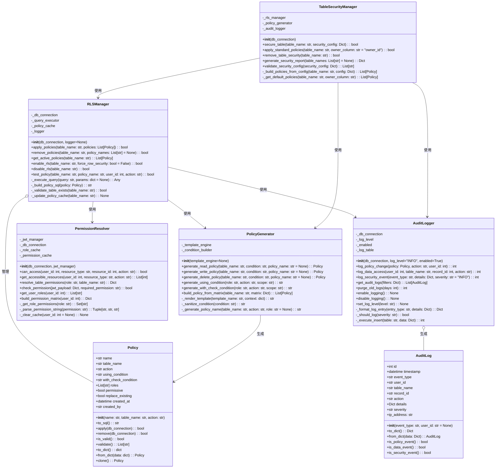

# BACK-API-001.3: Row Level Security (RLS)ポリシー設定

## 概要
練習表自動生成システムのデータベースセキュリティを強化するため、PostgreSQLのRow Level Security (RLS)ポリシーをPythonスクリプトで設計・実装します。ユーザーの役割やアクセス権限に基づいて、データの読み取り・編集・削除を制御する柔軟なアクセス制御システムを構築します。

## 詳細
- SQLAlchemyとPythonを使用した各テーブルのRLSポリシー定義スクリプト開発
- ロールベースのアクセス制御をSQLとPythonで実装
- Pythonを使用したセキュリティ監査ログシステムの構築
- 権限分離メカニズムの実装
- Pythonテストフレームワークを使用したRLSポリシーのテストと検証

## 依存関係
- 親タスク: BACK-API-001
- BACK-DB-001: データベース設計と実装（すべてのサブタスク）
- BACK-API-001.1: Supabase Auth設定と実装

## 参照ファイル
- [設計書/07_権限・ロール設計.md](../../../../設計書/07_権限・ロール設計.md)
- [設計書/10_データモデル_2_アクセス制御と監査.md](../../../../設計書/10_データモデル_2_アクセス制御と監査.md)
- [設計書/11g_実装指針_バックエンド.md](../../../../設計書/11g_実装指針_バックエンド.md)

## 成果物
- Python生成のRLSポリシー定義スクリプト
- RLSポリシーの自動適用ツール
- Pythonベースのセキュリティテスト実装
- ポリシー設計ドキュメント
- Python実装のエラーハンドリングシステム
- 監査ログ設定と管理ツール

## ステータス
- [x] 未開始
- [ ] 進行中
- [ ] レビュー中
- [ ] 完了

## 担当者
未割り当て

## 主要機能
1. **RLSポリシー自動生成システム**
   - テーブルごとのセキュリティ要件分析ツール
   - Python生成の役割別アクセス権限マトリクス
   - SQLAlchemyベースのポリシー生成ライブラリ
   - 動的ポリシー適用ユーティリティ

2. **Pythonロールベースアクセス制御**
   - SQLAlchemyでの権限階層モデリング
   - JWT内のロール情報処理ライブラリ
   - 部門/パート内アクセス制限の実装
   - Pythonによる動的権限解決システム

3. **監査ログシステム**
   - Pythonトリガーによるデータ変更記録
   - セキュリティイベントログ処理機能
   - ログレベル管理とフィルタリングAPI
   - ログローテーション処理の自動化

4. **権限分離フレームワーク**
   - 職責による権限分離の実装
   - 最小権限の原則を適用したポリシー生成
   - 特権アクセス監視システム
   - Python実装の時間制限付き権限昇格機能

## 実装予定ファイル
以下は実装予定の全ファイルのリストです。各ファイルの役割と目的を簡潔に記載します。

- `lib/security/rls_manager.py` - RLSポリシー管理の中核クラス
- `lib/security/policy_generator.py` - ポリシー自動生成機能
- `lib/security/permission_resolver.py` - 権限解決ロジック
- `lib/security/audit_logger.py` - 監査ログ機能
- `scripts/apply_rls_policies.py` - ポリシー適用スクリプト
- `scripts/generate_policy_matrix.py` - 権限マトリクス生成ツール
- `migrations/rls/001_users_members_policies.sql` - ユーザー・メンバー管理RLSポリシー
- `migrations/rls/002_parts_templates_policies.sql` - パート・練習内容RLSポリシー
- `migrations/rls/003_schedule_policies.sql` - スケジュール管理RLSポリシー
- `migrations/rls/004_venues_policies.sql` - 会場・設備管理RLSポリシー
- `migrations/rls/005_absence_policies.sql` - 欠席管理RLSポリシー
- `tests/security/test_rls_policies.py` - RLSポリシーテスト
- `tests/security/test_permission_resolver.py` - 権限解決テスト
- `docs/security/rls_policy_design.md` - ポリシー設計ドキュメント

## 設計図
### クラス図

## 実装アプローチ
### RLSポリシー実装
1. **ポリシー定義スクリプト開発**
   - Python SQLAlchemy拡張の開発
   - テーブルメタデータからの自動ポリシー生成
   - Jinja2テンプレートを使用したSQL生成
   - ポリシー依存関係の解決

2. **ポリシー適用フレームワーク**
   - ポリシー管理データベースの設計
   - マイグレーション管理との統合
   - ポリシー変更の追跡システム
   - ロールバック機能の実装

3. **テスト・検証システム**
   - 様々なユーザーロールでのポリシーテスト自動化
   - アクセス制御マトリクスの検証
   - エッジケースやセキュリティ境界のテスト
   - パフォーマンス影響評価

4. **監査・モニタリング**
   - ポリシー違反の検出システム
   - アクセスパターン分析ツール
   - リアルタイムモニタリングダッシュボード
   - セキュリティインシデント検出

## 実装ファイル構成詳細
以下は全ての実装予定ファイルの詳細です。各ファイルごとに目的とクラス/インターフェース、メソッド、依存関係などを詳しく記載します。

### `lib/security/rls_manager.py`
**目的**: RLSポリシーの管理と適用を行う中核クラス

**クラス/インターフェース**:
- `RLSManager`: RLSポリシー管理の主要クラス
  - **継承/実装**: なし
  - **主要属性**:
    - `_db_connection` - データベース接続オブジェクト
    - `_query_executor` - クエリ実行用ユーティリティ
    - `_policy_cache` - ポリシーキャッシュ
    - `_logger` - ロガーオブジェクト
  - **主要メソッド**: 
    - `__init__(db_connection, logger=None)` - 初期化
    - `apply_policies(table_name: str, policies: List[Policy]) -> bool` - ポリシーを適用する
    - `remove_policies(table_name: str, policy_names: List[str] = None) -> bool` - ポリシーを削除する
    - `get_active_policies(table_name: str) -> List[Policy]` - アクティブなポリシーを取得
    - `enable_rls(table_name: str, force_row_security: bool = False) -> bool` - RLSを有効化
    - `disable_rls(table_name: str) -> bool` - RLSを無効化
    - `test_policy(table_name: str, policy_name: str, user_id: int, action: str) -> bool` - ポリシーをテスト
  - **補助メソッド**:
    - `_execute_query(query: str, params: dict = None) -> Any` - SQLクエリを実行
    - `_build_policy_sql(policy: Policy) -> str` - ポリシーのSQL文を構築
    - `_validate_table_exists(table_name: str) -> bool` - テーブルの存在を検証
    - `_update_policy_cache(table_name: str) -> None` - ポリシーキャッシュを更新
  - **例外処理**:
    - `RLSManagerError` - 一般的なRLSマネージャーエラー
    - `TableNotFoundError` - テーブルが見つからない場合
    - `PolicyError` - ポリシー適用エラー
  - **依存クラス**: `SQLAlchemy`, `psycopg2`, `Policy`, `AuditLogger`

### `lib/security/policy_generator.py`
**目的**: ポリシー定義の自動生成と管理

**クラス/インターフェース**:
- `PolicyGenerator`: ポリシー生成クラス
  - **継承/実装**: なし
  - **主要属性**:
    - `_template_engine` - テンプレートエンジン（Jinja2など）
    - `_condition_builder` - 条件式ビルダー
  - **主要メソッド**: 
    - `__init__(template_engine=None)` - 初期化
    - `generate_read_policy(table_name: str, condition: str, policy_name: str = None) -> Policy` - 読み取りポリシーを生成
    - `generate_write_policy(table_name: str, condition: str, policy_name: str = None) -> Policy` - 書き込みポリシーを生成
    - `generate_delete_policy(table_name: str, condition: str, policy_name: str = None) -> Policy` - 削除ポリシーを生成
    - `generate_using_condition(role: str, action: str, scope: str) -> str` - USING条件を生成
    - `generate_with_check_condition(role: str, action: str, scope: str) -> str` - WITH CHECK条件を生成
    - `build_policy_from_matrix(table_name: str, matrix: Dict) -> List[Policy]` - マトリクスからポリシーを構築
  - **補助メソッド**:
    - `_render_template(template_name: str, context: dict) -> str` - テンプレートをレンダリング
    - `_sanitize_condition(condition: str) -> str` - 条件式をサニタイズ
    - `_generate_policy_name(table_name: str, action: str, role: str = None) -> str` - ポリシー名を生成
  - **依存クラス**: `Policy`, `Jinja2`

- `Policy`: ポリシー定義クラス
  - **継承/実装**: なし
  - **主要属性**:
    - `name: str` - ポリシー名
    - `table_name: str` - 対象テーブル名
    - `action: str` - アクション (SELECT, INSERT, UPDATE, DELETE, ALL)
    - `using_condition: str` - USING条件
    - `with_check_condition: str` - WITH CHECK条件
    - `roles: List[str]` - 適用ロール
    - `permissive: bool` - 許可型かどうか
    - `replace_existing: bool` - 既存ポリシーを置き換えるか
    - `created_at: datetime` - 作成日時
    - `created_by: str` - 作成者
  - **主要メソッド**:
    - `__init__(name: str, table_name: str, action: str)` - 初期化
    - `to_sql() -> str` - SQL文字列に変換
    - `apply(db_connection) -> bool` - ポリシーを適用
    - `remove(db_connection) -> bool` - ポリシーを削除
    - `is_valid() -> bool` - ポリシーが有効かチェック
    - `validate() -> List[str]` - バリデーションエラー取得
    - `to_dict() -> dict` - 辞書に変換
    - `from_dict(data: dict) -> Policy` - 辞書からポリシー生成（クラスメソッド）
    - `clone() -> Policy` - ポリシーの複製
  - **依存クラス**: なし

### `lib/security/permission_resolver.py`
**目的**: 認証されたユーザーの権限を解決し、リソースへのアクセス権を判断する

**クラス/インターフェース**:
- `PermissionResolver`: 権限解決クラス
  - **継承/実装**: なし
  - **主要属性**:
    - `_jwt_manager` - JWTマネージャー
    - `_db_connection` - データベース接続
    - `_role_cache` - ロールキャッシュ
    - `_permission_cache` - 権限キャッシュ
  - **主要メソッド**: 
    - `__init__(db_connection, jwt_manager)` - 初期化
    - `can_access(user_id: int, resource_type: str, resource_id: int, action: str) -> bool` - アクセス権をチェック
    - `get_accessible_resources(user_id: int, resource_type: str, action: str) -> List[int]` - アクセス可能なリソースを取得
    - `resolve_table_permissions(role: str, table_name: str) -> Dict` - テーブル権限を解決
    - `check_permission(jwt_payload: Dict, required_permission: str) -> bool` - JWTからの権限チェック
    - `get_user_roles(user_id: int) -> List[str]` - ユーザーのロールを取得
    - `build_permission_matrix(user_id: int) -> Dict` - 権限マトリクスを構築
  - **補助メソッド**:
    - `_get_role_permissions(role: str) -> Set[str]` - ロールの権限を取得
    - `_parse_permission_string(permission: str) -> Tuple[str, str, str]` - 権限文字列を解析
    - `_clear_cache(user_id: int = None) -> None` - キャッシュをクリア
  - **依存クラス**: `SQLAlchemy`, `JWTManager`

### `lib/security/audit_logger.py`
**目的**: セキュリティ関連イベントの監査ログを記録・管理する

**クラス/インターフェース**:
- `AuditLogger`: 監査ログ記録クラス
  - **継承/実装**: なし
  - **主要属性**:
    - `_db_connection` - データベース接続
    - `_log_level` - ログレベル
    - `_enabled` - ロギング有効フラグ
    - `_log_table` - ログテーブル名
  - **主要メソッド**: 
    - `__init__(db_connection, log_level="INFO", enabled=True)` - 初期化
    - `log_policy_change(policy: Policy, action: str, user_id: int) -> int` - ポリシー変更のログ
    - `log_data_access(user_id: int, table_name: str, record_id: int, action: str) -> int` - データアクセスのログ
    - `log_security_event(event_type: str, details: Dict, severity: str = "INFO") -> int` - セキュリティイベントのログ
    - `get_audit_logs(filters: Dict) -> List[AuditLog]` - 監査ログを取得
    - `purge_old_logs(days: int) -> int` - 古いログを削除
    - `enable_logging() -> None` - ロギングを有効化
    - `disable_logging() -> None` - ロギングを無効化
    - `set_log_level(level: str) -> None` - ログレベルを設定
  - **補助メソッド**:
    - `_format_log_entry(entry_type: str, details: Dict) -> Dict` - ログエントリをフォーマット
    - `_should_log(severity: str) -> bool` - ログすべきかを判定
    - `_execute_insert(table: str, data: Dict) -> int` - ログデータの挿入
  - **依存クラス**: `SQLAlchemy`, `AuditLog`

- `AuditLog`: 監査ログエントリモデル
  - **継承/実装**: `Pydantic.BaseModel` または独自モデル
  - **主要属性**:
    - `id: int` - ログID
    - `timestamp: datetime` - タイムスタンプ
    - `event_type: str` - イベントタイプ
    - `user_id: str` - ユーザーID
    - `table_name: str` - テーブル名
    - `record_id: str` - レコードID
    - `action: str` - アクション
    - `details: Dict` - 詳細情報
    - `severity: str` - 重要度
    - `ip_address: str` - IPアドレス
  - **主要メソッド**:
    - `__init__(event_type: str, user_id: str = None)` - 初期化
    - `to_dict() -> Dict` - 辞書に変換
    - `from_dict(data: Dict) -> AuditLog` - 辞書からオブジェクト生成（クラスメソッド）
    - `is_policy_event() -> bool` - ポリシーイベントかどうか
    - `is_data_event() -> bool` - データイベントかどうか
    - `is_security_event() -> bool` - セキュリティイベントかどうか
  - **依存クラス**: `pydantic` または独自実装

### `lib/security/table_security_manager.py`
**目的**: テーブルのセキュリティ設定を一元管理するクラス

**クラス/インターフェース**:
- `TableSecurityManager`: テーブルセキュリティ管理クラス
  - **継承/実装**: なし
  - **主要属性**:
    - `_rls_manager` - RLSマネージャー
    - `_policy_generator` - ポリシージェネレーター
    - `_audit_logger` - 監査ロガー
  - **主要メソッド**: 
    - `__init__(db_connection)` - 初期化
    - `secure_table(table_name: str, security_config: Dict) -> bool` - テーブルセキュリティを設定
    - `apply_standard_policies(table_name: str, owner_column: str = "owner_id") -> bool` - 標準ポリシーを適用
    - `remove_table_security(table_name: str) -> bool` - テーブルセキュリティを削除
    - `generate_security_report(table_names: List[str] = None) -> Dict` - セキュリティレポート生成
    - `validate_security_config(security_config: Dict) -> List[str]` - セキュリティ設定を検証
  - **補助メソッド**:
    - `_build_policies_from_config(table_name: str, config: Dict) -> List[Policy]` - 設定からポリシーを構築
    - `_get_default_policies(table_name: str, owner_column: str) -> List[Policy]` - デフォルトポリシーを取得
  - **依存クラス**: `RLSManager`, `PolicyGenerator`, `AuditLogger`

### `scripts/apply_rls_policies.py`
**目的**: 定義されたRLSポリシーをデータベースに適用するスクリプト

**主要機能**:
- コマンドライン引数処理
  - `--config-file` - 設定ファイルパス
  - `--table` - 特定のテーブルのみ処理
  - `--dry-run` - 変更を適用せずにシミュレーション
  - `--verbose` - 詳細出力
- データベース接続管理
  - 接続文字列のパース
  - コネクションプール管理
  - トランザクション処理
- ポリシー設定ファイルの読み込み
  - JSON/YAML構成ファイルのパース
  - テーブル構成の検証
  - ポリシー依存関係の解析
- ポリシーの適用と検証
  - 既存ポリシーの検出
  - ポリシーの差分計算
  - 適用順序の最適化
  - RLSの有効化/無効化
- 適用結果のレポート出力
  - 成功/失敗の集計
  - エラーの詳細出力
  - ログファイル出力
- エラーハンドリングとロールバック
  - トランザクション制御
  - エラー状態からの復旧
  - 部分適用の処理

### `scripts/generate_policy_matrix.py`
**目的**: テーブルごとの権限マトリクスを生成するスクリプト

**主要機能**:
- メタデータ解析
  - データベーススキーマの読み取り
  - テーブル関係の分析
  - カラム属性の解析
- ロールベースのマトリクス生成
  - 定義済みロールの読み込み
  - デフォルト権限の適用
  - 推奨ポリシーの生成
- 出力フォーマット
  - JSON/YAML形式
  - マークダウンテーブル
  - CSVエクスポート
- カスタマイズオプション
  - テンプレート設定
  - 特殊ケースの処理
  - 過去の設定の読み込み

### `migrations/rls/001_users_members_policies.sql`
**目的**: ユーザーとメンバー管理テーブルのRLSポリシー定義

**主要内容**:
- ユーザーテーブルのRLSポリシー
  - 自身のデータ読み取り権限
  - 管理者の全ユーザー読み取り権限
  - ロール別のユーザー作成/編集/削除権限
- メンバーテーブルのRLSポリシー
  - チーム内メンバー閲覧権限
  - パート責任者の編集権限
  - 管理者の全権限

### `migrations/rls/002_parts_templates_policies.sql`
**目的**: パートと練習テンプレート管理のRLSポリシー定義

**主要内容**:
- パートテーブルのRLSポリシー
  - パート所属メンバーの読み取り権限
  - パート責任者の編集権限
  - 全体の練習計画参照権限
- テンプレートテーブルのRLSポリシー
  - 作成者の編集権限
  - 共有範囲に基づく閲覧権限
  - パート固有テンプレートのアクセス制限

### `tests/security/test_rls_policies.py`
**目的**: RLSポリシーのユニットテストとインテグレーションテスト

**クラス/インターフェース**:
- `TestRLSPolicies`: RLSポリシーテストクラス
  - **継承/実装**: `unittest.TestCase` または `pytest.fixtures`
  - **主要テストケース**:
    - `test_admin_can_read_all_users` - 管理者ユーザー読み取りテスト
    - `test_user_can_only_read_own_data` - 個人データアクセスのテスト
    - `test_part_leader_can_modify_part_members` - パート責任者権限テスト
    - `test_rls_policy_with_multitenancy` - マルチテナント環境のテスト
    - `test_policy_performance_impact` - パフォーマンス影響測定
  - **依存クラス**: `unittest` または `pytest`, `RLSManager`, `PolicyGenerator`

## ファイル間クラス連携図

```mermaid
graph TD
    subgraph "セキュリティコア"
        RLS[lib/security/rls_manager.py]
        PG[lib/security/policy_generator.py]
        PR[lib/security/permission_resolver.py]
        AL[lib/security/audit_logger.py]
        TSM[lib/security/table_security_manager.py]
    end
    
    subgraph "スクリプト"
        APS[scripts/apply_rls_policies.py]
        GPM[scripts/generate_policy_matrix.py]
    end
    
    subgraph "マイグレーション"
        M1[migrations/rls/001_users_members_policies.sql]
        M2[migrations/rls/002_parts_templates_policies.sql]
        M3[migrations/rls/003_schedule_policies.sql]
        M4[migrations/rls/004_venues_policies.sql]
        M5[migrations/rls/005_absence_policies.sql]
    end
    
    subgraph "テスト"
        T1[tests/security/test_rls_policies.py]
        T2[tests/security/test_permission_resolver.py]
        T3[tests/security/test_audit_logger.py]
    end
    
    APS --> TSM
    GPM --> PG
    TSM --> RLS
    TSM --> PG
    TSM --> AL
    RLS --> PR
    RLS --> AL
    RLS --> PG
    T1 --> RLS
    T2 --> PR
    T3 --> AL
    APS --> M1
    APS --> M2
    APS --> M3
    APS --> M4
    APS --> M5
    
    classDef core fill:#bbf,stroke:#333,stroke-width:2px;
    classDef script fill:#ddf,stroke:#333,stroke-width:1px;
    classDef migration fill:#ffd,stroke:#333,stroke-width:1px;
    classDef test fill:#fdd,stroke:#333,stroke-width:1px;
    
    class RLS,PG,PR,AL,TSM core;
    class APS,GPM script;
    class M1,M2,M3,M4,M5 migration;
    class T1,T2,T3 test;
``` 
