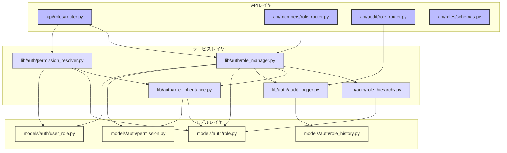

# BACK-API-001.4: ロール管理機能実装

## 概要
練習表自動生成システムのユーザーロール管理機能をPythonで実装します。ロールの定義・割り当て・権限管理および継承機能を構築し、FastAPIベースのバックエンドでセキュアで柔軟なアクセス制御システムを実現します。

## 詳細
- SQLAlchemyを使用したロール定義とロール階層の実装
- ユーザーへのロール割り当て機能のPython実装
- 権限の継承機能のクラス設計と実装
- SQLite/PostgreSQLを使用したロール変更履歴の管理
- FastAPIエンドポイントによる緊急時の権限昇格機能

## 依存関係
- 親タスク: BACK-API-001
- BACK-DB-001.1: ユーザー・メンバー管理テーブルの設計と実装
- BACK-API-001.1: Supabase Auth設定と実装
- BACK-API-001.3: Row Level Security (RLS)ポリシー設定

## 参照ファイル
- [設計書/07_権限・ロール設計.md](../../../../設計書/07_権限・ロール設計.md)
- [設計書/11g_実装指針_バックエンド.md](../../../../設計書/11g_実装指針_バックエンド.md)

## 成果物
- Python実装のロール管理ライブラリ
- FastAPI用ロール管理エンドポイント
- SQLAlchemyベースのロール継承システム
- Pythonによる権限変更履歴システム
- Pytestで実装されたテスト

## ステータス
- [x] 未開始
- [ ] 進行中
- [ ] レビュー中
- [ ] 完了

## 担当者
未割り当て

## 主要機能
1. **ロール定義システム**
   - SQLAlchemyモデルによる標準ロールの定義
   - Pythonクラスによるロール階層の実装
   - カスタムロール作成機能のAPI実装
   - ロール属性の管理機能開発

2. **ロール割り当て機能**
   - FastAPIエンドポイントによるユーザーへのロール割り当て
   - Pythonによるロール有効期限管理
   - 条件付きロール割り当てのビジネスロジック
   - 一括ロール操作のバッチ処理実装

3. **権限継承メカニズム**
   - Pythonオブジェクト指向設計による親ロールからの権限継承
   - SQLAlchemyによる継承ルールのデータモデル
   - Pythonディレクティブによる継承の上書き設定
   - 再帰的アルゴリズムによる継承連鎖の解決

4. **ロール変更履歴**
   - SQLAlchemyイベントによるロール変更ログの自動記録
   - FastAPIエンドポイントによる変更履歴の閲覧機能
   - Pythonを使用した変更の監査追跡
   - 状態パターンを使用した履歴復元機能

5. **緊急時権限管理**
   - 時間ベースの一時的な権限昇格機能
   - FastAPIとPydanticによる承認ワークフロー
   - タイマータスクによる権限昇格の自動期限設定
   - 構造化ロギングによる緊急アクセスログ作成

## 実装予定ファイル
以下は実装予定の全ファイルのリストです。各ファイルの役割と目的を簡潔に記載します。

- `lib/auth/role_manager.py` - ロール管理の中核機能
- `lib/auth/permission_resolver.py` - 権限解決ロジック
- `lib/auth/role_hierarchy.py` - ロール階層の実装
- `lib/auth/role_inheritance.py` - 権限継承メカニズム
- `lib/auth/audit_logger.py` - 変更履歴記録機能
- `models/auth/role.py` - ロールのSQLAlchemyモデル
- `models/auth/permission.py` - 権限のSQLAlchemyモデル
- `models/auth/user_role.py` - ユーザーロール割り当てモデル
- `models/auth/role_history.py` - ロール変更履歴モデル
- `api/roles/router.py` - ロール管理APIルーター
- `api/roles/schemas.py` - ロール関連のPydanticスキーマ
- `api/members/role_router.py` - メンバーロール管理APIルーター
- `api/audit/role_router.py` - ロール監査APIルーター
- `tests/auth/test_role_manager.py` - ロール管理テスト
- `tests/auth/test_permission_resolver.py` - 権限解決テスト
- `tests/auth/test_role_inheritance.py` - 権限継承テスト
- `tests/api/test_role_endpoints.py` - APIエンドポイントテスト

## 設計図
### クラス図

```mermaid
classDiagram
    class RoleManager {
        -_db_session
        +create_role(name: str, permissions: List[str], parent_role_id: int = None): Role
        +update_role(role_id: int, name: str = None, permissions: List[str] = None): Role
        +delete_role(role_id: int): bool
        +get_role(role_id: int): Role
        +get_all_roles(): List[Role]
        +assign_role_to_user(user_id: int, role_id: int, expires_at: datetime = None): UserRole
        +remove_role_from_user(user_id: int, role_id: int): bool
        +get_user_roles(user_id: int): List[Role]
        +get_role_users(role_id: int): List[User]
    }
    
    class PermissionResolver {
        +resolve_user_permissions(user_id: int): Set[Permission]
        +check_permission(user_id: int, required_permission: str): bool
        +get_effective_roles(user_id: int): List[Role]
        +get_permission_matrix(user_id: int): Dict[str, bool]
        +has_any_role(user_id: int, role_names: List[str]): bool
        +has_all_roles(user_id: int, role_names: List[str]): bool
    }
    
    class RoleHierarchy {
        +get_child_roles(role_id: int): List[Role]
        +get_parent_roles(role_id: int): List[Role]
        +get_role_depth(role_id: int): int
        +get_role_tree(): Dict
        +is_ancestor(ancestor_role_id: int, descendant_role_id: int): bool
        +rebuild_hierarchy(): bool
    }
    
    class RoleInheritance {
        +get_inherited_permissions(role_id: int): Set[Permission]
        +override_inheritance(role_id: int, permission_id: int, allowed: bool): bool
        +reset_inheritance_override(role_id: int, permission_id: int): bool
        +get_inheritance_chain(role_id: int): List[Role]
        +resolve_permission_conflicts(): Dict
    }
    
    class AuditLogger {
        -_db_session
        +log_role_change(role_id: int, user_id: int, action: str, details: Dict): RoleHistory
        +log_assignment_change(user_id: int, role_id: int, action: str, details: Dict): RoleHistory
        +get_role_history(role_id: int): List[RoleHistory]
        +get_user_role_history(user_id: int): List[RoleHistory]
        +get_audit_logs(filters: Dict): List[RoleHistory]
        +restore_from_history(history_id: int): bool
    }
    
    class Role {
        +int id
        +str name
        +str description
        +int parent_role_id
        +datetime created_at
        +datetime updated_at
        +bool is_system_role
        +List[Permission] permissions
        +List[Role] child_roles
        +Role parent_role
    }
    
    class Permission {
        +int id
        +str name
        +str resource_type
        +str action
        +str description
        +List[Role] roles
    }
    
    class UserRole {
        +int id
        +int user_id
        +int role_id
        +datetime assigned_at
        +datetime expires_at
        +int assigned_by
        +bool is_active
        +User user
        +Role role
    }
    
    class RoleHistory {
        +int id
        +int role_id
        +int user_id
        +str action
        +Dict details
        +datetime timestamp
        +Role role
        +User user
    }
    
    RoleManager --> Role : 管理
    RoleManager --> UserRole : 管理
    PermissionResolver --> Role : 使用
    PermissionResolver --> Permission : 使用
    PermissionResolver --> UserRole : 使用
    RoleHierarchy --> Role : 使用
    RoleInheritance --> Role : 使用
    RoleInheritance --> Permission : 使用
    AuditLogger --> RoleHistory : 作成
    Role --> Permission : 所有
```

## 実装アプローチ
### ロール管理システム実装
1. **データモデル設計と実装**
   - SQLAlchemyを使用したロール・権限モデルの実装
   - モデル間のリレーションシップ定義
   - データベースマイグレーションスクリプトの作成
   - モデルの単体テスト実装

2. **核となるロール管理機能**
   - RoleManagerクラスの実装
   - PermissionResolverのアルゴリズム開発
   - RoleHierarchyの木構造実装
   - 各クラスの単体テスト

3. **APIエンドポイント実装**
   - FastAPIを使用したエンドポイント定義
   - Pydanticスキーマの作成
   - バリデーションとエラーハンドリング
   - エンドポイントセキュリティ実装

4. **フロントエンド連携**
   - APIドキュメント生成（OpenAPI）
   - フロントエンド用のJSONレスポンス最適化
   - エラーレスポンスの標準化
   - パフォーマンス最適化

## 実装ファイル構成詳細
以下は全ての実装予定ファイルの詳細です。各ファイルごとに目的とクラス/インターフェース、メソッド、依存関係などを詳しく記載します。

### `lib/auth/role_manager.py`
**目的**: ロール管理のコア機能を提供する

**クラス/インターフェース**:
- `RoleManager`: ロール管理の主要クラス
  - **継承/実装**: なし
  - **主要メソッド**: 
    - `create_role(name: str, permissions: List[str], parent_role_id: int = None) -> Role` - 新しいロールを作成
    - `update_role(role_id: int, name: str = None, permissions: List[str] = None) -> Role` - ロールを更新
    - `delete_role(role_id: int) -> bool` - ロールを削除
    - `get_role(role_id: int) -> Role` - ロール情報を取得
    - `get_all_roles() -> List[Role]` - 全ロールを取得
    - `assign_role_to_user(user_id: int, role_id: int, expires_at: datetime = None) -> UserRole` - ユーザーにロール割り当て
    - `remove_role_from_user(user_id: int, role_id: int) -> bool` - ユーザーからロール削除
    - `get_user_roles(user_id: int) -> List[Role]` - ユーザーのロール取得
    - `get_role_users(role_id: int) -> List[User]` - ロールを持つユーザー取得
  - **依存クラス**: `SQLAlchemy Session`, `Role`, `Permission`, `UserRole`, `AuditLogger`

### `lib/auth/permission_resolver.py`
**目的**: ユーザーの実効権限を解決する機能を提供する

**クラス/インターフェース**:
- `PermissionResolver`: 権限解決クラス
  - **継承/実装**: なし
  - **主要メソッド**: 
    - `resolve_user_permissions(user_id: int) -> Set[Permission]` - ユーザーの全権限を解決
    - `check_permission(user_id: int, required_permission: str) -> bool` - 特定の権限を持つか確認
    - `get_effective_roles(user_id: int) -> List[Role]` - ユーザーの実効ロールを取得
    - `get_permission_matrix(user_id: int) -> Dict[str, bool]` - 権限マトリクスを取得
    - `has_any_role(user_id: int, role_names: List[str]) -> bool` - いずれかのロールを持つか確認
    - `has_all_roles(user_id: int, role_names: List[str]) -> bool` - すべてのロールを持つか確認
  - **依存クラス**: `SQLAlchemy Session`, `Role`, `UserRole`, `RoleInheritance`

### `models/auth/role.py`
**目的**: ロールのデータモデルとデータベースマッピングを定義する

**クラス/インターフェース**:
- `Role`: ロールのSQLAlchemyモデル
  - **継承/実装**: `SQLAlchemy Base`
  - **主要属性**:
    - `id: int` - プライマリキー
    - `name: str` - ロール名
    - `description: str` - ロールの説明
    - `parent_role_id: int` - 親ロールID（外部キー）
    - `created_at: datetime` - 作成日時
    - `updated_at: datetime` - 更新日時
    - `is_system_role: bool` - システムロールフラグ
  - **リレーションシップ**:
    - `permissions: List[Permission]` - ロールに割り当てられた権限（多対多）
    - `child_roles: List[Role]` - 子ロール（一対多）
    - `parent_role: Role` - 親ロール（多対一）
  - **メソッド**:
    - `__repr__() -> str` - オブジェクト文字列表現
    - `to_dict() -> dict` - 辞書変換
  - **依存クラス**: `SQLAlchemy`

### `api/roles/router.py`
**目的**: ロール管理APIエンドポイントを提供する

**ルート定義**:
- `@router.get("/roles", response_model=List[RoleResponse])` - ロール一覧を取得
- `@router.get("/roles/{role_id}", response_model=RoleDetailResponse)` - 特定ロールの詳細を取得
- `@router.post("/roles", response_model=RoleResponse)` - 新規ロールを作成
- `@router.put("/roles/{role_id}", response_model=RoleResponse)` - ロールを更新
- `@router.delete("/roles/{role_id}", response_model=StatusResponse)` - ロールを削除
- `@router.get("/roles/{role_id}/permissions", response_model=List[PermissionResponse])` - ロールの権限一覧を取得
- `@router.post("/roles/{role_id}/permissions", response_model=RoleResponse)` - ロールに権限を追加
- `@router.delete("/roles/{role_id}/permissions/{permission_id}", response_model=StatusResponse)` - ロールから権限を削除

**依存関係**:
- `RoleManager`
- `PermissionResolver`
- `FastAPI Depends`
- `Pydanticスキーマ`

## ファイル間クラス連携図
