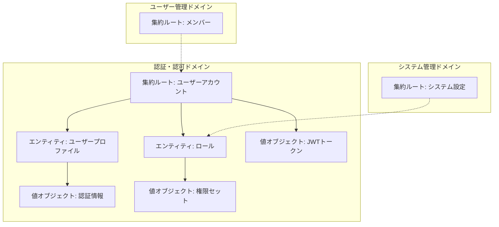
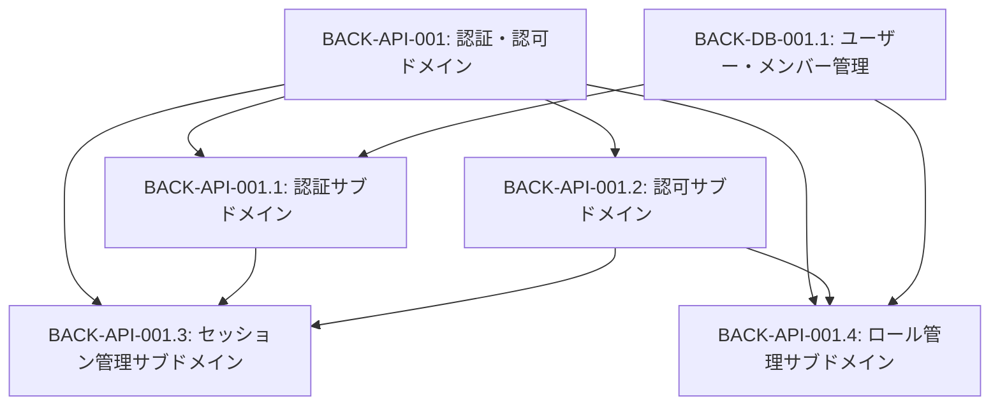
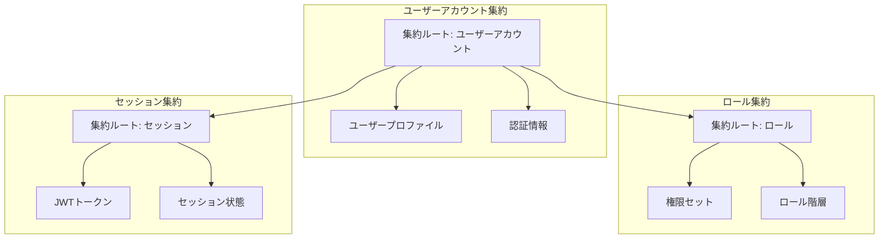
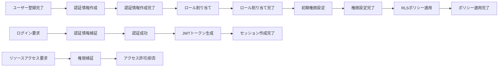

# BACK-API-001: 認証・認可システム実装

## ドメインの概要
認証・認可ドメインは、練習表自動生成システムのセキュリティ境界を確立し、ユーザー認証と適切な権限管理を提供します。このドメインはユーザーの身元確認、セッション管理、およびシステムリソースへのアクセス制御を担当します。

## ドメインモデルと境界づけられたコンテキスト


## ユビキタス言語

| 用語 | 定義 |
|------|------|
| ユーザーアカウント | システムにアクセスするための一意の識別子と認証情報を持つエンティティ |
| ロール | システム内での権限グループ（部長/作成担当/部員/システム管理者） |
| 権限 | システム内の特定の操作を実行する能力 |
| JWT | JSON Web Token。ユーザー認証状態を安全に保持する暗号化されたトークン |
| RLS | Row Level Security。データベースレベルでのアクセス制御ポリシー |
| 認証 | ユーザーの身元を確認するプロセス |
| 認可 | 認証されたユーザーに特定のリソースへのアクセス権を付与するプロセス |
| セッション | ユーザーのログイン状態を維持する一時的な期間 |

## サブドメイン構成



## サブドメイン詳細

### BACK-API-001.1: 認証サブドメイン
**ドメイン責務**: ユーザーの身元を確認し、セキュアな認証プロセスを提供する

**ドメインサービス**:
- 認証サービス（メールアドレス認証とパスワード検証を処理）
- トークン生成サービス（JWTトークンの生成と検証）
- パスワードポリシーサービス（パスワード強度と有効期限の管理）

**ステータス**: 未開始

### BACK-API-001.2: 認可サブドメイン
**ドメイン責務**: ユーザーの権限に基づいてシステムリソースへのアクセスを制御する

**ドメインサービス**:
- 権限検証サービス（リソースアクセス要求に対する権限チェック）
- RLSポリシーサービス（データベースレベルでのアクセス制御ポリシー管理）
- 監査ログサービス（セキュリティ関連アクションの記録）

**ステータス**: 未開始

### BACK-API-001.3: セッション管理サブドメイン
**ドメイン責務**: ユーザーセッションの作成、維持、および安全な終了を管理する

**ドメインサービス**:
- セッション管理サービス（セッションの作成、更新、削除）
- トークンリフレッシュサービス（JWTトークンの定期的な更新）
- セッション検証サービス（セッションの有効性確認）

**ステータス**: 未開始

### BACK-API-001.4: ロール管理サブドメイン
**ドメイン責務**: システム内のロールとその権限セットを定義・管理する

**ドメインサービス**:
- ロール定義サービス（ロールと権限セットの管理）
- ロール割り当てサービス（ユーザーへのロール割り当て）
- 権限継承サービス（ロール階層の管理）

**ステータス**: 未開始

## コマンド・クエリ責務分離（CQRS）

### コマンド（書き込み操作）
- ユーザー登録
- ユーザーログイン
- パスワード変更
- ロール割り当て
- 権限更新
- セッション作成
- セッション終了

### クエリ（読み取り操作）
- ユーザー認証状態確認
- ユーザーロール取得
- 権限チェック
- セッション情報取得
- ロール一覧取得
- アクセスポリシー確認

## 集約と整合性境界



## 開発コンテキスト図

```mermaid
graph TB
    subgraph 境界づけられたコンテキスト
        DB1[ユーザー管理コンテキスト]
        DB2[システム管理コンテキスト]
        DB3[練習表コンテキスト]
    end
    
    subgraph 認証・認可ドメインコンテキスト
        V[認証サブドメイン]
        A[認可サブドメイン]
        R[セッション管理サブドメイン]
        B[ロール管理サブドメイン]
    end
    
    subgraph APIレイヤー
        API1[認証API]
        API2[権限管理API]
    end
    
    subgraph アプリケーションサービス
        I[認証リクエスト]
        O[認証済みセッション]
    end
    
    I --> V
    DB1 --> V
    DB2 --> B
    V --> A
    DB3 --> A
    A --> R
    R --> B
    B --> O
    
    V <--> API1
    B --> API2
```

## 進捗管理

| サブドメイン | ステータス | 担当者 | 開始日 | 完了予定 | 実際の完了日 |
|------------|-----------|--------|-------|---------|------------|
| BACK-API-001.1: 認証サブドメイン | 未開始 | 未割り当て | - | - | - |
| BACK-API-001.2: 認可サブドメイン | 未開始 | 未割り当て | - | - | - |
| BACK-API-001.3: セッション管理サブドメイン | 未開始 | 未割り当て | - | - | - |
| BACK-API-001.4: ロール管理サブドメイン | 未開始 | 未割り当て | - | - | - |

## イベントストーミング



## 成果物
- 認証フロー実装コード
- ロールベースアクセス制御(RBAC)システム
- RLSポリシー設定スクリプト
- 認証テスト仕様書

## 主要ファイル
### 設定ファイル
- `supabase/config/auth.json` - 認証設定ファイル
- `supabase/migrations/002_rls_policies.sql` - RLSポリシー定義

### 機能実装ファイル
- `src/lib/auth/authClient.ts` - 認証クライアントライブラリ
- `src/lib/auth/roleManagement.ts` - ロール管理機能
- `src/hooks/useAuth.ts` - 認証カスタムフック

### ドキュメント
- `docs/auth_flow.md` - 認証フロー説明ドキュメント
- `docs/rbac_policies.md` - アクセス制御ポリシー説明

## 課題・リスク

- 複数ロールを持つユーザーの権限競合処理
- JWTトークンの安全な保存と管理
- セッションハイジャック対策の実装
- ロール変更時の既存セッション処理
- データベースレベルとアプリケーションレベルの権限整合性確保

## レビューポイント

- 認証プロセスのセキュリティ強度
- RLSポリシーの完全性と正確性
- ユーザーエクスペリエンスへの影響（認証プロセスの煩雑さなど）
- 権限変更の監査ログ実装の適切性
- セッションタイムアウト処理の妥当性

## リファレンス

- [設計書/07_権限・ロール設計.md](../../設計書/07_権限・ロール設計.md)
- [設計書/11g_実装指針_バックエンド.md](../../設計書/11g_実装指針_バックエンド.md) 