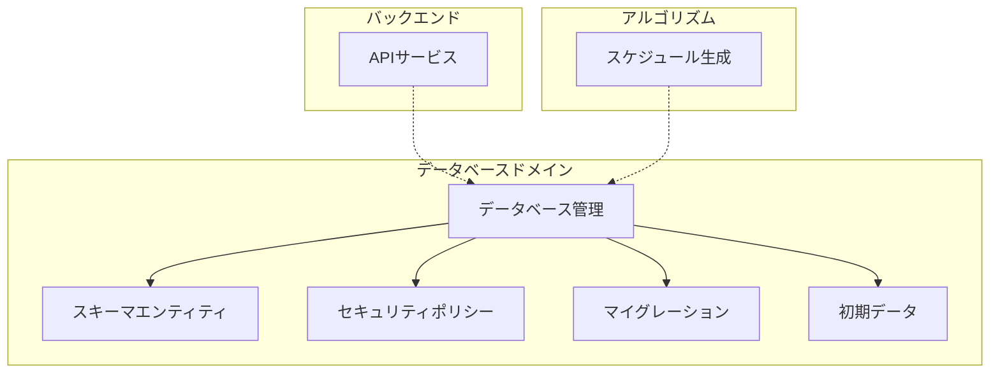
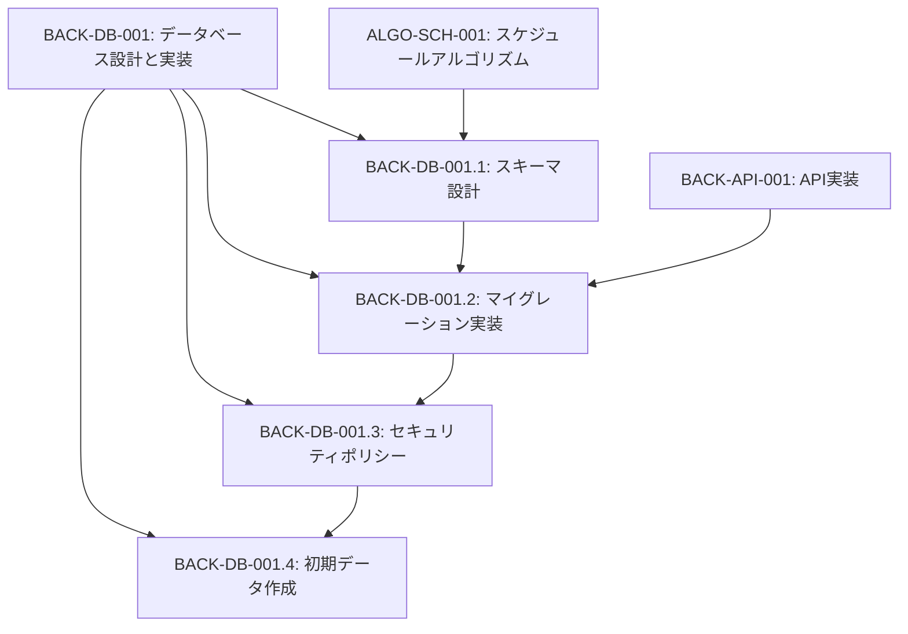
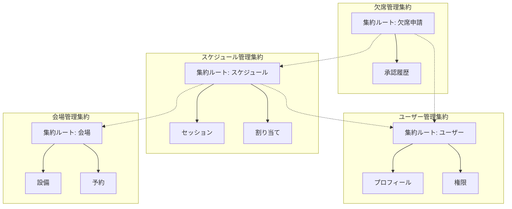
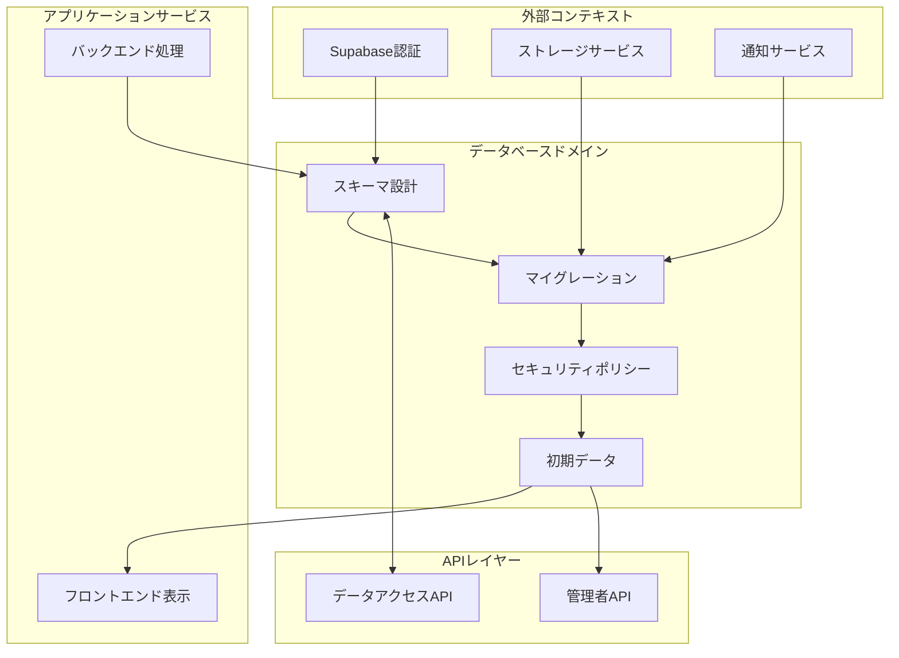

# BACK-DB-001: データベース設計と実装

## ドメインの概要
データベースドメインは、練習表自動生成システムの永続化層として機能し、Supabaseを用いたPostgreSQLデータベースの設計・実装・保守を担当します。ユーザー管理、スケジューリング、リソース管理など、システム全体のデータモデルの一貫性と整合性を保証します。

## ドメインモデルと境界づけられたコンテキスト

## ユビキタス言語

| 用語 | 定義 |
|------|------|
| スキーマ | データベース内のテーブル、ビュー、関数などの構造を定義する論理的なコンテナ |
| マイグレーション | データベース構造の変更を管理するためのスクリプト |
| RLS | Row Level Security、行レベルでのアクセス制御ポリシー |
| エンティティ | システム内で管理される実体（ユーザー、スケジュール、会場など） |
| リレーションシップ | エンティティ間の関連付け |
| インデックス | データベースクエリのパフォーマンスを向上させるための構造 |
| シードデータ | システム初期化時に必要となる基本データ |

## サブドメイン構成

## サブドメイン詳細

### BACK-DB-001.1: スキーマ設計
**ドメイン責務**: データベーススキーマの設計と最適化

**ドメインサービス**:
- テーブル定義サービス（テーブル、列、制約の設計）
- ER図生成サービス（データモデルの視覚化）
- リレーションシップ管理サービス（外部キー関係の最適化）

**ステータス**: 未開始

### BACK-DB-001.2: マイグレーション実装
**ドメイン責務**: データベース変更の管理と適用

**ドメインサービス**:
- マイグレーションスクリプト生成サービス（SQL生成）
- バージョン管理サービス（マイグレーション履歴の追跡）
- ロールバックサービス（変更の取り消し）

**ステータス**: 未開始

### BACK-DB-001.3: セキュリティポリシー
**ドメイン責務**: データアクセス制御の実装

**ドメインサービス**:
- RLSポリシー設計サービス（行レベルセキュリティの定義）
- 権限管理サービス（ユーザーロールと権限の設定）
- セキュリティ監査サービス（アクセスログとポリシー検証）

**ステータス**: 未開始

### BACK-DB-001.4: 初期データ作成
**ドメイン責務**: システム運用に必要な基本データの提供

**ドメインサービス**:
- シードデータ生成サービス（基本マスターデータの作成）
- データ整合性検証サービス（シードデータの検証）
- テストデータ管理サービス（開発環境用データの提供）

**ステータス**: 未開始

## コマンド・クエリ責務分離（CQRS）

### コマンド（書き込み操作）
- スキーマ作成コマンド
- マイグレーション適用コマンド
- セキュリティポリシー設定コマンド
- シードデータ挿入コマンド
- インデックス作成コマンド

### クエリ（読み取り操作）
- スキーマ情報取得クエリ
- マイグレーション履歴確認クエリ
- セキュリティポリシー確認クエリ
- データ検証クエリ
- パフォーマンス診断クエリ

## 集約と整合性境界

## 開発コンテキスト図

## 進捗管理

| サブドメイン | ステータス | 担当者 | 開始日 | 完了予定 | 実際の完了日 |
|------------|-----------|--------|-------|---------|------------|
| BACK-DB-001.1 | 未開始 | 未割り当て | - | - | - |
| BACK-DB-001.2 | 未開始 | 未割り当て | - | - | - |
| BACK-DB-001.3 | 未開始 | 未割り当て | - | - | - |
| BACK-DB-001.4 | 未開始 | 未割り当て | - | - | - |

## イベントストーミング

## 課題・リスク

- PostgreSQLバージョンの依存性とSupabase環境との互換性
- 大規模データ処理時のパフォーマンス最適化
- マイグレーション適用時のデータ損失リスク
- 複雑な権限設計によるセキュリティホールの可能性
- スキーマ変更に伴うアプリケーション層への影響

## レビューポイント

- ER図の正確性と業務要件との整合性
- マイグレーションスクリプトの可逆性
- RLSポリシーの網羅性と正確性
- インデックス設計の適切性
- シードデータの完全性と整合性

## リファレンス

- [設計書/10_データモデル_1_概要と主要エンティティ.md](../../設計書/10_データモデル_1_概要と主要エンティティ.md)
- [設計書/11b_ER図詳細.md](../../設計書/11b_ER図詳細.md)
- [設計書/11g_実装指針_バックエンド.md](../../設計書/11g_実装指針_バックエンド.md)
- [Supabase公式ドキュメント](https://supabase.io/docs)
- [PostgreSQLドキュメント](https://www.postgresql.org/docs/) 