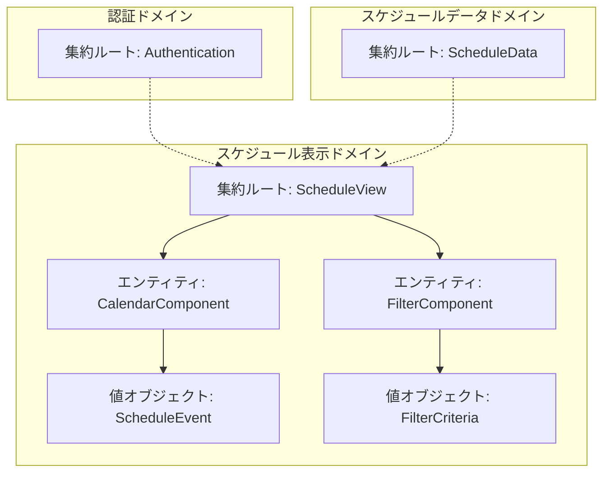
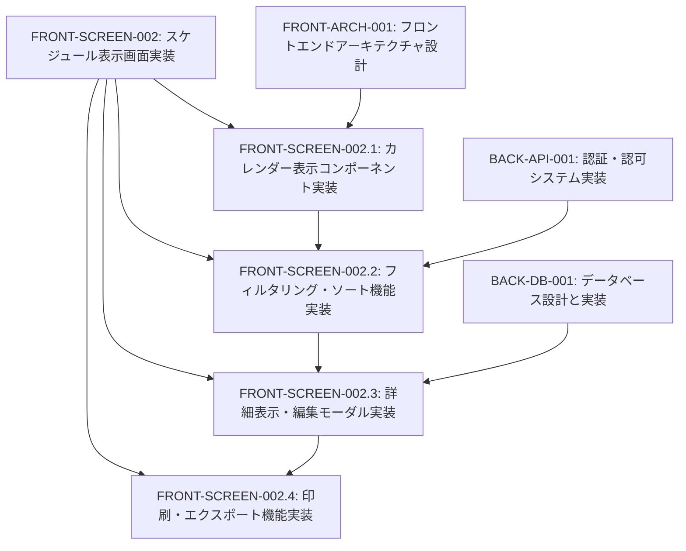
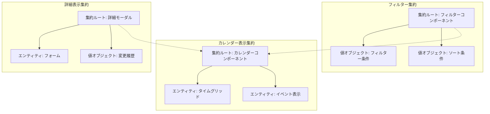
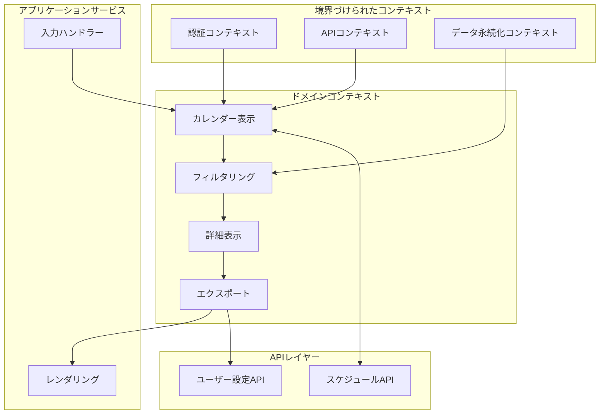
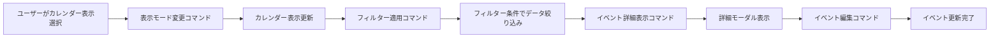

# FRONT-SCREEN-002: スケジュール表示画面実装

## ドメインの概要
練習表自動生成システムのフロントエンドにおいて、生成されたスケジュールを閲覧・管理するためのユーザーインターフェースを提供します。直感的で使いやすいカレンダー表示、詳細確認、印刷機能などを備えたUIコンポーネント群を実装します。

## ドメインモデルと境界づけられたコンテキスト

## ユビキタス言語

| 用語 | 定義 |
|------|------|
| スケジュール表示 | 生成された練習スケジュールをカレンダー形式で表示する機能 |
| カレンダーコンポーネント | 月表示/週表示/日表示の切り替え可能なスケジュール表示UI要素 |
| フィルタリング | パート別・会場別・監督者別などの条件でスケジュールを絞り込む機能 |
| 詳細表示モーダル | 練習内容の詳細情報を表示・編集するためのポップアップ画面 |
| エクスポート機能 | スケジュールをPDF/Excel/iCal形式で出力する機能 |
| 監督者管理ビュー | 監督者がスケジュールを確認・管理するための専用画面 |

## サブドメイン構成

## サブドメイン詳細

### FRONT-SCREEN-002.1: カレンダー表示コンポーネント実装
**ドメイン責務**: スケジュールデータをカレンダー形式で視覚的に表示し、様々な時間単位（月/週/日）での閲覧を可能にする

**ドメインサービス**:
- カレンダーレンダリングサービス（カレンダーグリッドの生成と表示）
- イベント配置サービス（スケジュールイベントの適切な配置）
- 時間帯表示サービス（時間帯ごとの視覚的表現）
- ドラッグ&ドロップサービス（イベントの移動機能）

**ステータス**: 未開始

### FRONT-SCREEN-002.2: フィルタリング・ソート機能実装
**ドメイン責務**: ユーザーが必要なスケジュール情報を素早く見つけられるよう、多様な条件でのフィルタリングとソートを提供する

**ドメインサービス**:
- フィルタークエリサービス（フィルター条件の構築）
- データフィルタリングサービス（条件に基づくデータ絞り込み）
- UIフィルターコンポーネントサービス（フィルター操作UI）
- フィルター状態管理サービス（フィルター条件の保存と復元）

**ステータス**: 未開始

### FRONT-SCREEN-002.3: 詳細表示・編集モーダル実装
**ドメイン責務**: 各スケジュールの詳細情報を表示し、必要に応じてインラインでの編集を可能にする

**ドメインサービス**:
- 詳細データ取得サービス（スケジュール詳細情報の取得）
- インライン編集サービス（フィールド単位の編集機能）
- 変更履歴サービス（編集履歴の管理と表示）
- コメント管理サービス（スケジュールへのコメント機能）

**ステータス**: 未開始

### FRONT-SCREEN-002.4: 印刷・エクスポート機能実装
**ドメイン責務**: スケジュール情報を様々な形式で出力し、オフラインでの使用や共有を可能にする

**ドメインサービス**:
- 印刷レイアウトサービス（印刷用ページレイアウトの最適化）
- ファイルエクスポートサービス（PDF/Excel/iCal形式への変換）
- 共有リンク生成サービス（共有用URL生成）
- QRコード生成サービス（スケジュールへのアクセスQR生成）

**ステータス**: 未開始

## コマンド・クエリ責務分離（CQRS）

### コマンド（書き込み操作）
- スケジュールイベント移動コマンド
- スケジュール詳細更新コマンド
- フィルター条件保存コマンド
- エクスポート設定保存コマンド
- コメント追加コマンド

### クエリ（読み取り操作）
- 期間別スケジュール取得クエリ
- フィルター適用スケジュール取得クエリ
- イベント詳細取得クエリ
- エクスポート用データ取得クエリ
- 監督者別スケジュール取得クエリ

## 集約と整合性境界

## 開発コンテキスト図

## 進捗管理

| サブドメイン | ステータス | 担当者 | 開始日 | 完了予定 | 実際の完了日 |
|------------|-----------|--------|-------|---------|------------|
| FRONT-SCREEN-002.1 | 未開始 | 未割り当て | - | - | - |
| FRONT-SCREEN-002.2 | 未開始 | 未割り当て | - | - | - |
| FRONT-SCREEN-002.3 | 未開始 | 未割り当て | - | - | - |
| FRONT-SCREEN-002.4 | 未開始 | 未割り当て | - | - | - |

## イベントストーミング

## 課題・リスク

- レスポンシブ対応とモバイル表示の最適化
- 大量のスケジュールデータ表示時のパフォーマンス
- フィルタリング複雑化による検索の遅延
- 複数ユーザーによる同時編集時の整合性確保
- ブラウザ互換性の担保と古いブラウザのサポート

## レビューポイント

- カレンダー表示のUIデザインと使いやすさ
- フィルタリング操作のUX最適化
- 編集機能のユーザビリティと誤操作防止
- エクスポート機能の出力品質と形式対応
- 監督者向け機能の権限管理と表示制御

## リファレンス

- [設計書/04_画面設計_2_スケジュール表示画面.md](../../../設計書/04_画面設計_2_スケジュール表示画面.md)
- [設計書/05_API仕様.md](../../../設計書/05_API仕様.md)
- [FRONT-ARCH-001: フロントエンドアーキテクチャ設計](../FRONT-ARCH-001/README.md) 