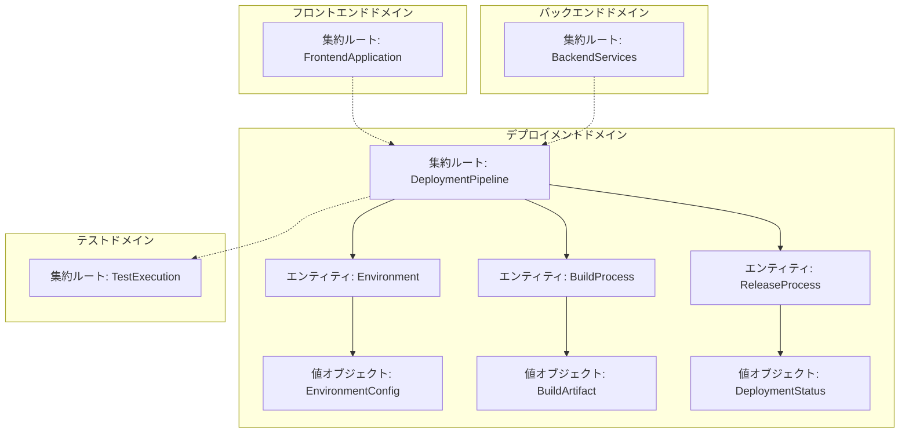
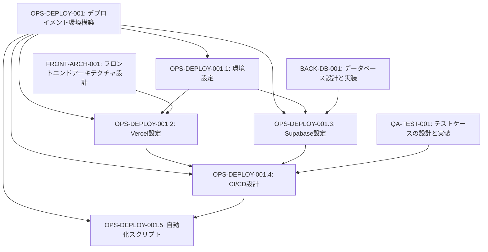
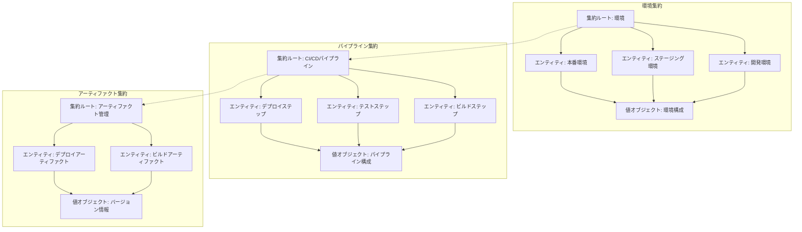
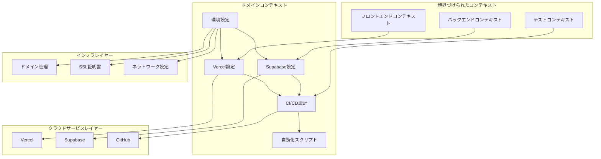

# OPS-DEPLOY-001: デプロイメント環境構築

## ドメインの概要
練習表自動生成システムの開発環境、ステージング環境、本番環境を構築し、継続的デリバリーパイプラインを確立するドメインです。Vercelやsupabaseなどのクラウドサービスを活用し、安定的かつ効率的なデプロイメントフローを実現します。

## ドメインモデルと境界づけられたコンテキスト

## ユビキタス言語

| 用語 | 定義 |
|------|------|
| デプロイメント | アプリケーションを特定の環境に配置し、実行可能な状態にするプロセス |
| 環境 | アプリケーションが実行されるインフラストラクチャの設定と構成（開発/ステージング/本番） |
| CI/CD | 継続的インテグレーション/継続的デリバリー。コード変更の自動ビルド、テスト、デプロイを行うプロセス |
| パイプライン | コードの変更からデプロイメントまでの一連の自動化された手順 |
| ビルドアーティファクト | ビルドプロセスで生成される成果物（コンパイル済みファイル、バンドルなど） |
| インフラストラクチャ | アプリケーションを実行するために必要なハードウェアとソフトウェアリソース |
| 構成管理 | 環境ごとの設定情報や環境変数などを管理するプロセス |
| ブルー/グリーンデプロイ | 新旧2つの環境を並行して維持し、切り替えることでダウンタイムを最小化するデプロイ手法 |
| ロールバック | 問題発生時に以前のバージョンに戻すプロセス |
| ゼロダウンタイムデプロイ | サービスを停止せずにアプリケーションを更新するデプロイ手法 |

## サブドメイン構成

## サブドメイン詳細

### OPS-DEPLOY-001.1: 環境設定
**ドメイン責務**: 開発、ステージング、本番の各環境に必要な設定と構成を定義し、一貫性のある環境を構築する

**ドメインサービス**:
- 環境定義サービス（環境ごとの仕様と設定の定義）
- 構成管理サービス（環境変数やシークレットの管理）
- ネットワーク設定サービス（ドメイン、SSL、ネットワークルールの設定）
- セキュリティ設定サービス（アクセス制御とセキュリティポリシーの設定）

**ステータス**: 未開始

### OPS-DEPLOY-001.2: Vercel設定
**ドメイン責務**: フロントエンドアプリケーションのデプロイメント環境としてVercelを構成し、最適な設定を適用する

**ドメインサービス**:
- プロジェクト設定サービス（Vercelプロジェクトの設定と構成）
- ビルド設定サービス（ビルドコマンドとオプションの最適化）
- ドメイン設定サービス（カスタムドメインとSSL証明書の設定）
- サーバーレス関数サービス（APIルートとサーバーレス関数の設定）

**ステータス**: 未開始

### OPS-DEPLOY-001.3: Supabase設定
**ドメイン責務**: バックエンドサービスとデータベースの環境としてSupabaseを構成し、必要な設定と機能を実装する

**ドメインサービス**:
- プロジェクト設定サービス（Supabaseプロジェクトの設定と構成）
- データベースマイグレーションサービス（スキーマ変更の適用と管理）
- バックアップ設定サービス（データバックアップ戦略の実装）
- セキュリティ設定サービス（認証と認可の設定）

**ステータス**: 未開始

### OPS-DEPLOY-001.4: CI/CD設計
**ドメイン責務**: コード変更から各環境へのデプロイメントまでの自動化パイプラインを設計・実装する

**ドメインサービス**:
- ワークフロー設計サービス（GitHub Actionsワークフローの設計）
- テスト統合サービス（自動テストの統合と実行）
- デプロイ自動化サービス（環境ごとのデプロイ自動化）
- 承認フローサービス（デプロイ承認プロセスの実装）

**ステータス**: 未開始

### OPS-DEPLOY-001.5: 自動化スクリプト
**ドメイン責務**: 環境構築、データベース操作、メンテナンスなどの運用作業を効率化するスクリプトを開発する

**ドメインサービス**:
- データベースマイグレーションスクリプトサービス（DBスキーマの更新自動化）
- 環境構築スクリプトサービス（新環境のセットアップ自動化）
- バックアップスクリプトサービス（データバックアップの自動化）
- 監視スクリプトサービス（システム状態の監視と通知）

**ステータス**: 未開始

## コマンド・クエリ責務分離（CQRS）

### コマンド（書き込み操作）
- 環境作成コマンド
- デプロイ実行コマンド
- ロールバック実行コマンド
- 構成更新コマンド
- マイグレーション実行コマンド

### クエリ（読み取り操作）
- デプロイ状態取得クエリ
- 環境構成取得クエリ
- デプロイ履歴取得クエリ
- ビルドログ取得クエリ
- サービス健全性取得クエリ

## 集約と整合性境界

## 開発コンテキスト図

## 進捗管理

| サブドメイン | ステータス | 担当者 | 開始日 | 完了予定 | 実際の完了日 |
|------------|-----------|--------|-------|---------|------------|
| OPS-DEPLOY-001.1 | 未開始 | 未割り当て | - | - | - |
| OPS-DEPLOY-001.2 | 未開始 | 未割り当て | - | - | - |
| OPS-DEPLOY-001.3 | 未開始 | 未割り当て | - | - | - |
| OPS-DEPLOY-001.4 | 未開始 | 未割り当て | - | - | - |
| OPS-DEPLOY-001.5 | 未開始 | 未割り当て | - | - | - |

## イベントストーミング

## 課題・リスク

- 環境間の構成差異によるデプロイメント問題
- シークレット管理とセキュリティリスク
- 複雑なCI/CDパイプラインのメンテナンスコスト
- データベースマイグレーションの整合性確保
- ダウンタイムの最小化とユーザー影響の軽減
- クラウドサービスの障害や制限への対応策

## レビューポイント

- 環境設定の一貫性と再現性
- デプロイメントプロセスの信頼性と安定性
- CI/CDパイプラインの効率性と速度
- セキュリティ対策の十分性
- ロールバック戦略の有効性
- 運用作業の自動化レベル

## リファレンス

- [設計書/15_インフラストラクチャ設計.md](../../設計書/15_インフラストラクチャ設計.md)
- [設計書/16_CI_CD設計.md](../../設計書/16_CI_CD設計.md)
- [FRONT-ARCH-001: フロントエンドアーキテクチャ設計](../../frontend/FRONT-ARCH-001/README.md)
- [QA-TEST-001: テストケースの設計と実装](../../qa/QA-TEST-001/README.md) 