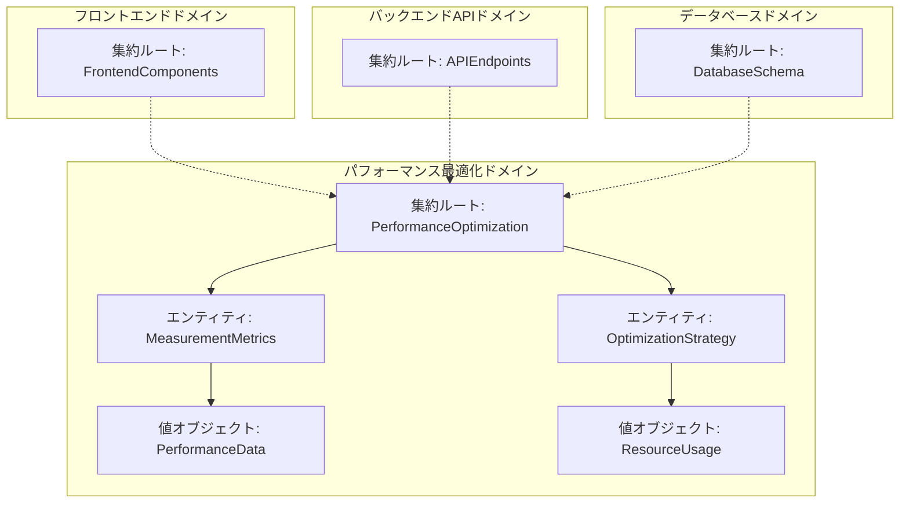
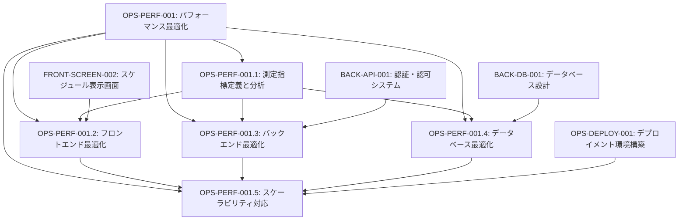
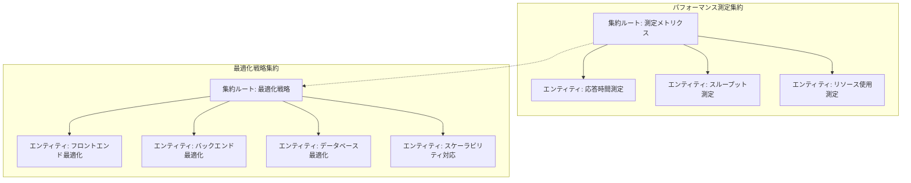
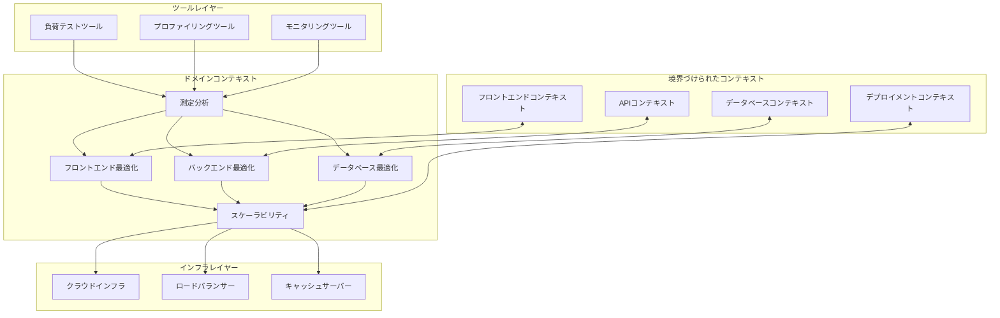

# OPS-PERF-001: パフォーマンス最適化

## ドメインの概要
練習表自動生成システム全体のパフォーマンスを測定・分析・最適化し、高速なレスポンスとスケーラビリティを確保するドメインです。フロントエンド、バックエンド、データベースの各層におけるボトルネックを特定し、適切な改善策を実装します。

## ドメインモデルと境界づけられたコンテキスト

## ユビキタス言語

| 用語 | 定義 |
|------|------|
| パフォーマンス測定 | システムの応答時間、スループット、リソース使用率を定量的に計測する活動 |
| ボトルネック | システムのパフォーマンスを制限している特定の箇所や処理 |
| 応答時間 | ユーザーのアクションから結果が表示されるまでの経過時間 |
| スループット | 単位時間あたりに処理できるリクエスト数や操作数 |
| リソース使用率 | CPU、メモリ、ディスクI/O、ネットワークなどのコンピュータリソースの使用割合 |
| キャッシュ | 頻繁にアクセスされるデータを高速なストレージに一時的に保存する仕組み |
| 水平スケーリング | サーバーやインスタンスの数を増やしてシステム全体の処理能力を向上させる方法 |
| 負荷分散 | 複数のサーバーやリソースに処理を分散して効率的に負荷を分散する技術 |

## サブドメイン構成

## サブドメイン詳細

### OPS-PERF-001.1: 測定指標定義と分析
**ドメイン責務**: システムパフォーマンスの定量的な測定基準を定義し、ボトルネックを特定するための分析フレームワークを構築する

**ドメインサービス**:
- メトリクス定義サービス（測定対象と基準値の定義）
- パフォーマンス計測サービス（定義された指標に基づく計測実行）
- データ分析サービス（測定結果の統計分析と可視化）
- ボトルネック特定サービス（パフォーマンス低下要因の特定）

**ステータス**: 未開始

### OPS-PERF-001.2: フロントエンド最適化
**ドメイン責務**: ユーザーの体感速度を向上させるため、フロントエンドコードとアセットを最適化し、レンダリングパフォーマンスを改善する

**ドメインサービス**:
- バンドル最適化サービス（JavaScript/CSSファイルサイズ削減）
- レンダリング最適化サービス（コンポーネント再描画の最小化）
- アセット最適化サービス（画像・フォントなどの最適化）
- ネットワーク最適化サービス（リクエスト数削減とキャッシュ活用）

**ステータス**: 未開始

### OPS-PERF-001.3: バックエンド最適化
**ドメイン責務**: API応答時間の短縮と処理効率の向上を実現するため、バックエンドコードとサービスを最適化する

**ドメインサービス**:
- APIレスポンス最適化サービス（応答時間短縮施策の実装）
- キャッシュ管理サービス（データキャッシュ戦略の設計と実装）
- 非同期処理サービス（長時間処理のバックグラウンド化）
- リソース効率化サービス（CPU/メモリ使用の最適化）

**ステータス**: 未開始

### OPS-PERF-001.4: データベース最適化
**ドメイン責務**: データアクセスの高速化とデータベースサーバーの負荷軽減を実現するためのデータベース最適化を行う

**ドメインサービス**:
- インデックス最適化サービス（適切なインデックス設計と実装）
- クエリ最適化サービス（SQL/NoSQLクエリの効率化）
- データモデル最適化サービス（スキーマ設計の見直し）
- 接続管理サービス（コネクションプールと接続設定の最適化）

**ステータス**: 未開始

### OPS-PERF-001.5: スケーラビリティ対応
**ドメイン責務**: ユーザー数やデータ量の増加に対応できるシステム設計と、柔軟なリソーススケーリングを実現する

**ドメインサービス**:
- 水平スケーリング設計サービス（分散システム設計）
- 負荷分散サービス（ロードバランサーとトラフィック分散）
- サービス分割サービス（マイクロサービスアーキテクチャ検討）
- 障害耐性サービス（フォールバック設計と冗長構成）

**ステータス**: 未開始

## コマンド・クエリ責務分離（CQRS）

### コマンド（書き込み操作）
- パフォーマンス測定開始コマンド
- 最適化戦略適用コマンド
- インデックス作成/更新コマンド
- キャッシュ設定更新コマンド
- スケーリングポリシー設定コマンド

### クエリ（読み取り操作）
- パフォーマンス指標取得クエリ
- ボトルネックレポート取得クエリ
- リソース使用率取得クエリ
- 最適化効果比較クエリ
- スケーラビリティ分析クエリ

## 集約と整合性境界

## 開発コンテキスト図

## 進捗管理

| サブドメイン | ステータス | 担当者 | 開始日 | 完了予定 | 実際の完了日 |
|------------|-----------|--------|-------|---------|------------|
| OPS-PERF-001.1 | 未開始 | 未割り当て | - | - | - |
| OPS-PERF-001.2 | 未開始 | 未割り当て | - | - | - |
| OPS-PERF-001.3 | 未開始 | 未割り当て | - | - | - |
| OPS-PERF-001.4 | 未開始 | 未割り当て | - | - | - |
| OPS-PERF-001.5 | 未開始 | 未割り当て | - | - | - |

## イベントストーミング

## 課題・リスク

- 最適化による副作用（機能の動作変更やバグ発生）のリスク
- パフォーマンス改善と開発速度のトレードオフ
- 異なる環境（開発・ステージング・本番）での挙動の差異
- クラウドリソースコストとパフォーマンスのバランス
- データ量増加に伴う将来的なスケーラビリティ課題

## レビューポイント

- パフォーマンス指標の妥当性と測定方法の適切さ
- 最適化施策の優先順位付けと投資対効果
- 実装した最適化の持続可能性と保守性
- データベースインデックスとクエリの最適化バランス
- スケーリング設計のコスト効率と信頼性

## リファレンス

- [設計書/17_パフォーマンス要件.md](../../設計書/17_パフォーマンス要件.md)
- [OPS-DEPLOY-001: デプロイメント環境構築](../OPS-DEPLOY-001/README.md)
- [FRONT-SCREEN-002: スケジュール表示画面実装](../../frontend/FRONT-SCREEN-002/README.md) 