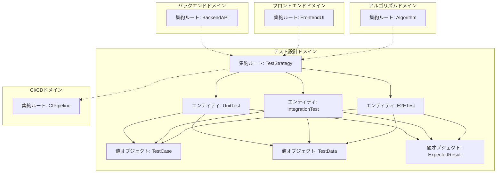
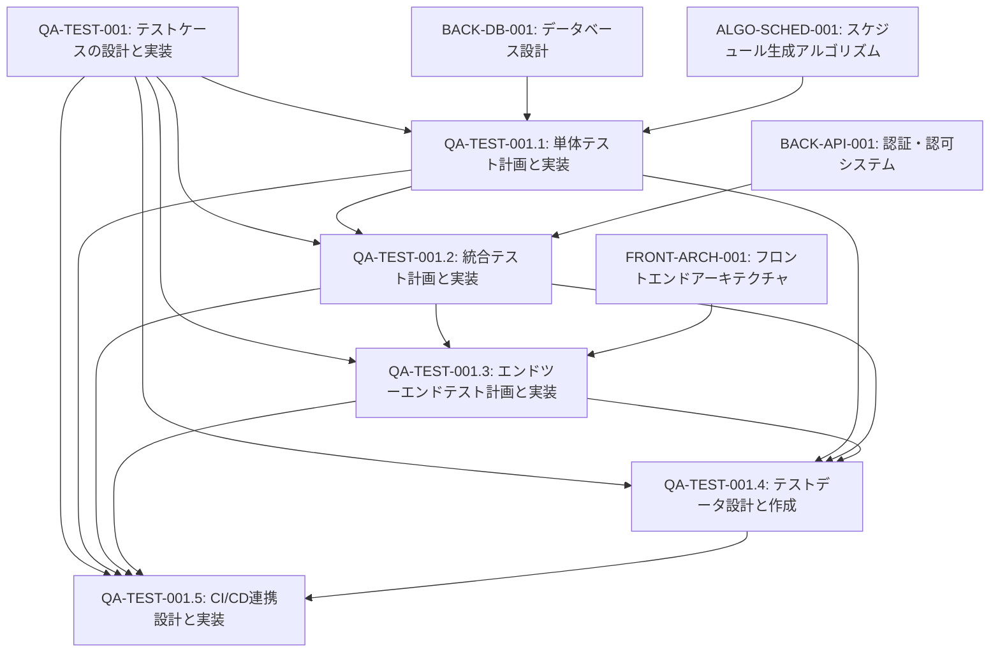
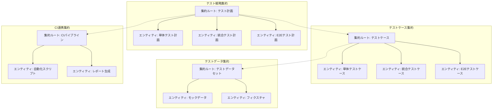
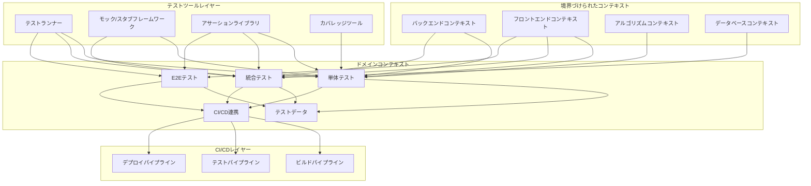

# QA-TEST-001: テストケースの設計と実装

## ドメインの概要
練習表自動生成システムの品質を確保するための包括的なテスト戦略を設計・実装するドメインです。単体テスト、統合テスト、エンドツーエンドテストを通じて、システムの各コンポーネントが仕様通りに動作することを検証し、高い品質と信頼性を担保します。

## ドメインモデルと境界づけられたコンテキスト

## ユビキタス言語

| 用語 | 定義 |
|------|------|
| テストケース | 特定の機能や動作を検証するために設計された一連の入力と期待される出力のセット |
| 単体テスト | 個々のコンポーネントやモジュールが独立して正しく動作することを検証するテスト |
| 統合テスト | 複数のコンポーネントが連携して正しく動作することを検証するテスト |
| エンドツーエンドテスト | ユーザーの視点からシステム全体の機能が正しく動作することを検証するテスト |
| テストデータ | テスト実行に必要なダミーまたは模擬データ |
| モック | テスト対象が依存するコンポーネントを模倣するオブジェクト |
| スタブ | テスト対象が依存するコンポーネントの代わりに固定値を返すオブジェクト |
| テストカバレッジ | テストによって検証されたコードの割合 |
| CI/CD | 継続的インテグレーション/継続的デリバリーの略。自動テストとデプロイを含むプロセス |
| テスト自動化 | 手動操作なしでテストを実行するプロセス |

## サブドメイン構成

## サブドメイン詳細

### QA-TEST-001.1: 単体テスト計画と実装
**ドメイン責務**: 各コンポーネントが独立して正しく動作することを検証するための単体テストを設計し実装する

**ドメインサービス**:
- テストケース設計サービス（ケース定義と実装）
- モック生成サービス（依存コンポーネントのモック作成）
- テスト実行サービス（単体テストの実行と結果分析）
- カバレッジ分析サービス（コードカバレッジの測定と報告）

**ステータス**: 未開始

### QA-TEST-001.2: 統合テスト計画と実装
**ドメイン責務**: 複数のコンポーネントが連携して正しく動作することを検証するための統合テストを設計し実装する

**ドメインサービス**:
- コンポーネント連携テスト設計サービス（複数コンポーネント間の相互作用検証）
- APIエンドポイントテストサービス（APIの入出力と挙動検証）
- データフロー検証サービス（データの流れと変換の検証）
- 境界値テストサービス（境界条件におけるシステム挙動の検証）

**ステータス**: 未開始

### QA-TEST-001.3: エンドツーエンドテスト計画と実装
**ドメイン責務**: ユーザーの視点からシステム全体の機能が正しく動作することを検証するためのE2Eテストを設計し実装する

**ドメインサービス**:
- ユーザーフロー設計サービス（典型的なユーザーシナリオの定義）
- UI操作自動化サービス（ブラウザ操作の自動化）
- 視覚的検証サービス（UIの外観と挙動の検証）
- パフォーマンステストサービス（負荷下でのシステム挙動検証）

**ステータス**: 未開始

### QA-TEST-001.4: テストデータ設計と作成
**ドメイン責務**: テスト実行に必要な様々な条件をカバーするテストデータを設計し作成する

**ドメインサービス**:
- データ生成サービス（テスト用ダミーデータの自動生成）
- エッジケースデータサービス（境界条件や異常系テスト用データ作成）
- データリセットサービス（テスト間でのデータ状態初期化）
- データ検証サービス（テストデータの妥当性確認）

**ステータス**: 未開始

### QA-TEST-001.5: CI/CD連携設計と実装
**ドメイン責務**: テスト自動化を継続的インテグレーション/デリバリーパイプラインと連携させ、品質を継続的に担保する

**ドメインサービス**:
- パイプライン設計サービス（CI/CDフローの定義と設定）
- テスト自動化スクリプトサービス（自動実行スクリプトの作成）
- 結果レポーティングサービス（テスト結果の集約と可視化）
- 通知サービス（テスト失敗時の通知と対応）

**ステータス**: 未開始

## コマンド・クエリ責務分離（CQRS）

### コマンド（書き込み操作）
- テストケース作成コマンド
- テスト実行コマンド
- テストデータ生成コマンド
- テスト結果記録コマンド
- CI設定更新コマンド

### クエリ（読み取り操作）
- テストケース一覧取得クエリ
- テスト結果取得クエリ
- テストカバレッジ取得クエリ
- テストデータ取得クエリ
- CI実行履歴取得クエリ

## 集約と整合性境界

## 開発コンテキスト図

## 進捗管理

| サブドメイン | ステータス | 担当者 | 開始日 | 完了予定 | 実際の完了日 |
|------------|-----------|--------|-------|---------|------------|
| QA-TEST-001.1 | 未開始 | 未割り当て | - | - | - |
| QA-TEST-001.2 | 未開始 | 未割り当て | - | - | - |
| QA-TEST-001.3 | 未開始 | 未割り当て | - | - | - |
| QA-TEST-001.4 | 未開始 | 未割り当て | - | - | - |
| QA-TEST-001.5 | 未開始 | 未割り当て | - | - | - |

## イベントストーミング

```mermaid
graph LR
    E1[テスト計画策定] --> C1[テストケース設計コマンド]
    C1 --> E2[テストケース作成完了]
    E2 --> C2[テストデータ生成コマンド]
    C2 --> E3[テストデータ準備完了]
    E3 --> C3[単体テスト実行コマンド]
    C3 --> E4[単体テスト完了]
    E4 --> C4[統合テスト実行コマンド]
    C4 --> E5[統合テスト完了]
    E5 --> C5[E2Eテスト実行コマンド]
    C5 --> E6[E2Eテスト完了]
    E6 --> C6[テスト結果レポートコマンド]
    C6 --> E7[テスト結果分析完了]
```

## 課題・リスク

- 複雑なアルゴリズムの振る舞いを効率的にテストする方法
- エンドツーエンドテストの実行時間とCI/CDパイプラインへの影響
- テストデータの設計とメンテナンスの複雑さ
- UI変更に伴うE2Eテストの脆弱性と保守コスト
- テストカバレッジと実際の品質保証レベルのバランス

## レビューポイント

- テストケース設計の完全性と効率性
- モックとスタブの適切な使用
- テストデータの網羅性と異常系への対応
- 自動テストの信頼性と安定性
- CI/CDパイプラインとの統合の完成度

## リファレンス

- [設計書/13_テスト計画.md](../../設計書/13_テスト計画.md)
- [BACK-DB-001: データベース設計と実装](../../backend/BACK-DB-001/README.md)
- [FRONT-ARCH-001: フロントエンドアーキテクチャ設計](../../frontend/FRONT-ARCH-001/README.md)
- [ALGO-SCHED-001: スケジュール生成アルゴリズム実装](../../algorithm/ALGO-SCHED-001/README.md) 