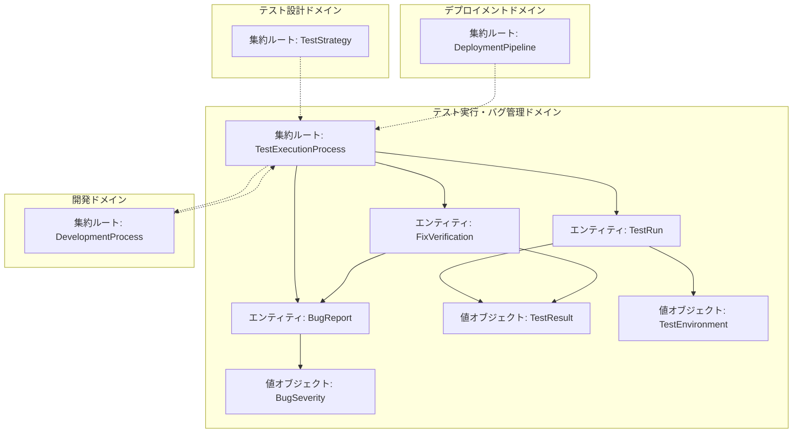
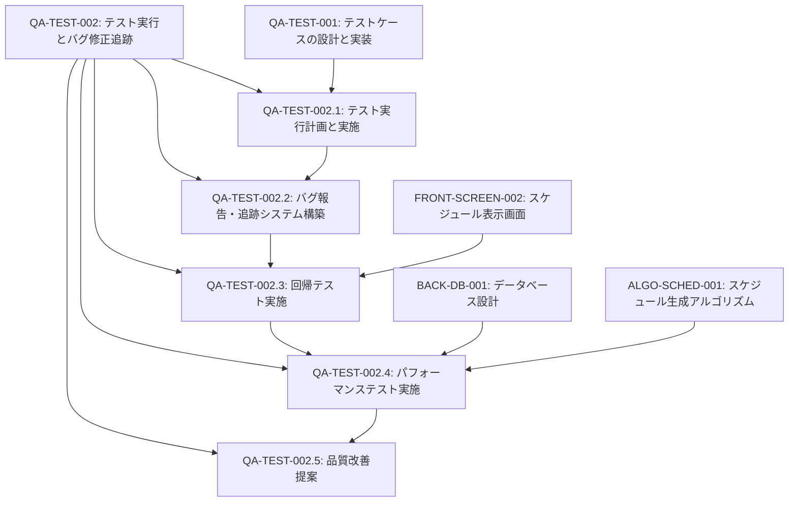
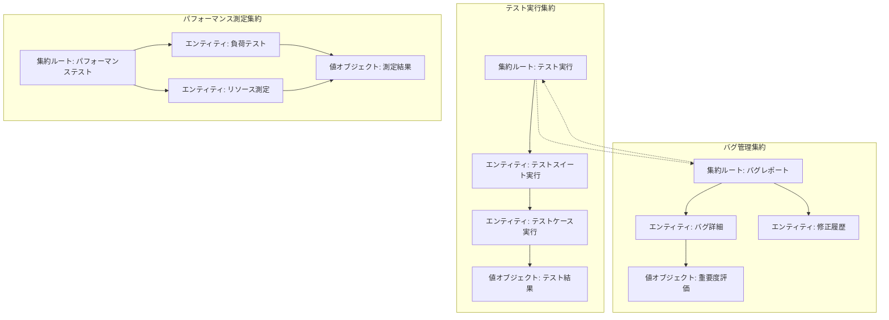
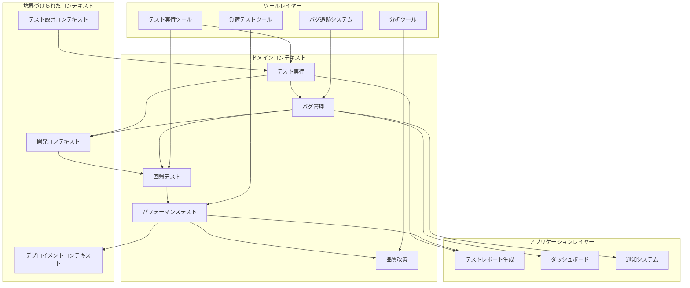
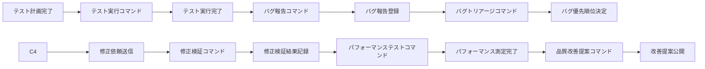

# QA-TEST-002: テスト実行とバグ修正追跡

## ドメインの概要
練習表自動生成システムの品質保証プロセスのうち、テスト実行、バグ管理、修正追跡を担当するドメインです。定義されたテストケースの実行、発見された不具合の体系的な管理、修正の検証を通じて、システム全体の品質と信頼性を確保します。

## ドメインモデルと境界づけられたコンテキスト

## ユビキタス言語

| 用語 | 定義 |
|------|------|
| テスト実行 | 定義されたテストケースを実際に動作させて結果を記録する活動 |
| バグレポート | 発見された不具合の詳細情報（再現手順、影響範囲、重要度など）を記録したドキュメント |
| 重要度 | バグの影響の大きさを示す指標（致命的、重大、中程度、軽微など） |
| 優先度 | バグの修正順序を決定するための指標（最優先、高、中、低など） |
| 回帰テスト | 修正後に以前正常だった機能が引き続き正しく動作することを確認するテスト |
| バグトリアージ | バグの重要度、優先度、修正担当などを決定する分類プロセス |
| テスト環境 | テストが実行される技術的な環境設定（OS、ブラウザ、データベースなど） |
| テストレポート | テスト実行結果を集約した文書（合格/不合格率、発見された問題など） |
| パフォーマンスバジェット | システムのパフォーマンス指標の目標値と許容範囲 |
| 品質ゲート | ソフトウェア開発工程の次の段階に進むための品質基準 |

## サブドメイン構成

## サブドメイン詳細

### QA-TEST-002.1: テスト実行計画と実施
**ドメイン責務**: 開発されたコンポーネントに対して効率的かつ効果的にテストを実行するための計画を策定し、実行する

**ドメインサービス**:
- テスト環境準備サービス（テスト実行用の環境構築・構成）
- テスト優先順位付けサービス（重要度・リスクに基づく優先順位設定）
- テスト実行サービス（テストの実施と結果記録）
- テスト分析サービス（テスト結果の集約と分析）

**ステータス**: 未開始

### QA-TEST-002.2: バグ報告・追跡システム構築
**ドメイン責務**: 発見された不具合を体系的に管理し、修正までのライフサイクルを追跡するための仕組みを構築する

**ドメインサービス**:
- バグ報告サービス（標準化されたバグ報告フォーマットと登録プロセス）
- バグトリアージサービス（バグの分類・優先順位付け）
- バグ追跡サービス（ステータス管理と進捗追跡）
- バグメトリクスサービス（バグ統計の集計と分析）

**ステータス**: 未開始

### QA-TEST-002.3: 回帰テスト実施
**ドメイン責務**: バグ修正やコード変更後に既存機能が正常に動作することを確認し、副作用を検出する

**ドメインサービス**:
- 修正検証サービス（バグ修正の確認テスト）
- 影響範囲特定サービス（修正による影響を受ける可能性のある機能の特定）
- 自動回帰テストサービス（繰り返し実行される回帰テストの自動化）
- テスト範囲最適化サービス（効率的な回帰テストの範囲設定）

**ステータス**: 未開始

### QA-TEST-002.4: パフォーマンステスト実施
**ドメイン責務**: システムのパフォーマンス特性を検証し、スケーラビリティと安定性を評価する

**ドメインサービス**:
- 負荷テストサービス（高負荷下でのシステム動作検証）
- ストレステストサービス（限界を超える状況での挙動検証）
- スケーラビリティテストサービス（増加するユーザー数やデータ量への対応能力検証）
- リソース使用率分析サービス（CPU、メモリ、ネットワーク使用の測定と分析）

**ステータス**: 未開始

### QA-TEST-002.5: 品質改善提案
**ドメイン責務**: テスト結果と不具合分析に基づいて、システム品質向上のための具体的な改善策を提案する

**ドメインサービス**:
- 根本原因分析サービス（バグの根本的な原因の特定）
- パターン検出サービス（共通するエラーパターンの特定）
- 予防策提案サービス（類似バグの発生を防ぐための対策）
- プロセス改善サービス（開発・テストプロセスの改善提案）

**ステータス**: 未開始

## コマンド・クエリ責務分離（CQRS）

### コマンド（書き込み操作）
- テスト実行開始コマンド
- バグ報告登録コマンド
- バグステータス更新コマンド
- 修正検証結果記録コマンド
- パフォーマンステスト設定コマンド

### クエリ（読み取り操作）
- テスト結果取得クエリ
- バグ一覧取得クエリ
- バグ詳細情報取得クエリ
- テスト進捗状況取得クエリ
- パフォーマンス指標取得クエリ

## 集約と整合性境界

## 開発コンテキスト図

## 進捗管理

| サブドメイン | ステータス | 担当者 | 開始日 | 完了予定 | 実際の完了日 |
|------------|-----------|--------|-------|---------|------------|
| QA-TEST-002.1 | 未開始 | 未割り当て | - | - | - |
| QA-TEST-002.2 | 未開始 | 未割り当て | - | - | - |
| QA-TEST-002.3 | 未開始 | 未割り当て | - | - | - |
| QA-TEST-002.4 | 未開始 | 未割り当て | - | - | - |
| QA-TEST-002.5 | 未開始 | 未割り当て | - | - | - |

## イベントストーミング

## 課題・リスク

- 環境差異によるバグ再現性の問題
- 膨大なテスト結果と不具合情報の効率的な管理
- 修正によるリグレッション（新たな不具合の発生）
- パフォーマンステストの適切な負荷設定と測定精度
- バグ修正の優先順位付けと開発リソースのバランス
- 品質とリリース速度のトレードオフ

## レビューポイント

- テスト実行計画の網羅性と効率性
- バグ報告プロセスの明確さと追跡のしやすさ
- 回帰テストの範囲と効果的な実行方法
- パフォーマンステストシナリオの現実性
- 品質改善提案の具体性と実現可能性
- テスト結果の視覚化と報告方法の有効性

## リファレンス

- [設計書/13_テスト計画.md](../../設計書/13_テスト計画.md)
- [設計書/14_品質保証計画.md](../../設計書/14_品質保証計画.md)
- [QA-TEST-001: テストケースの設計と実装](../QA-TEST-001/README.md)
- [OPS-PERF-001: パフォーマンス最適化](../../ops/OPS-PERF-001/README.md) 