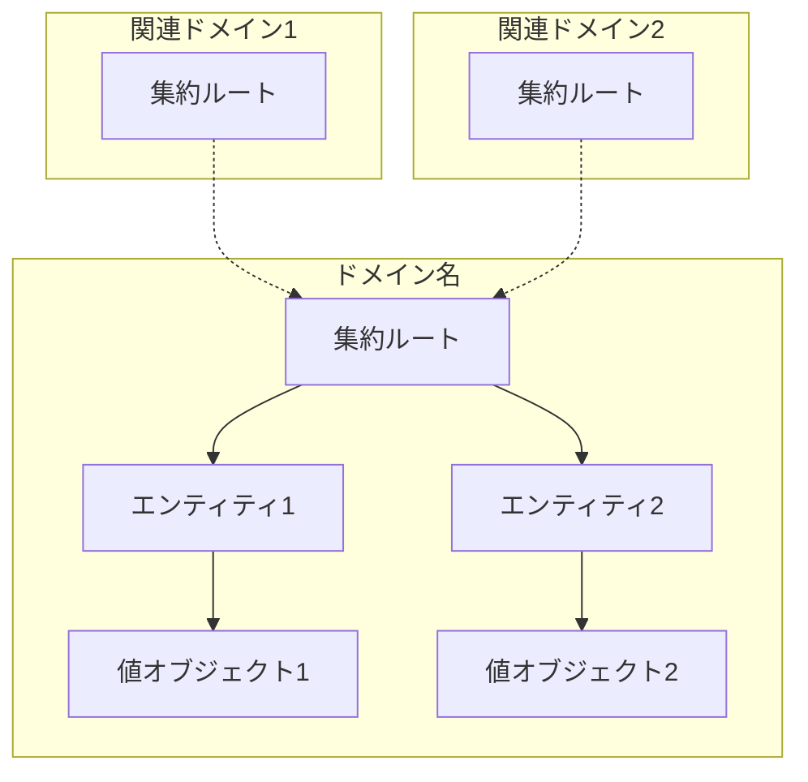
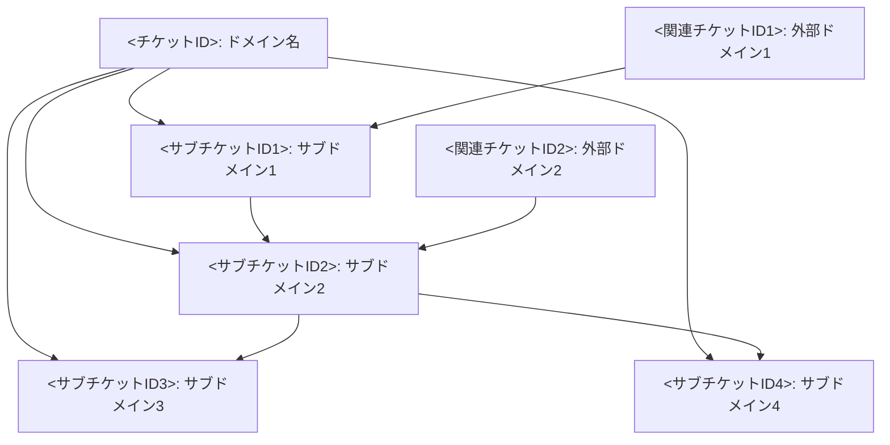
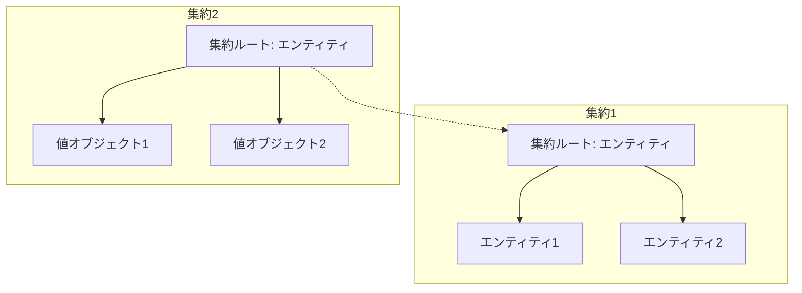
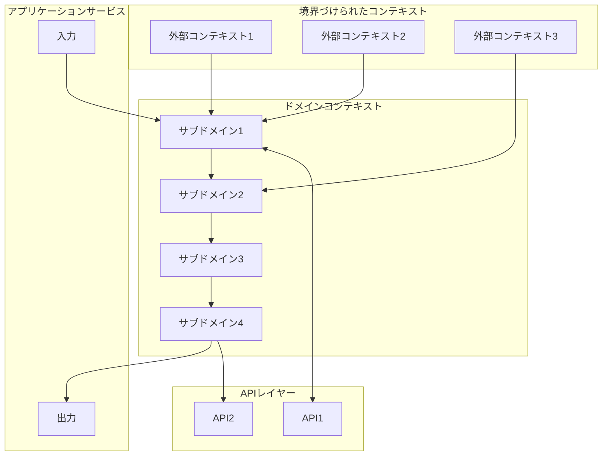
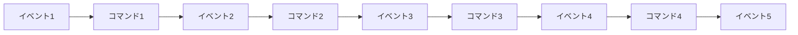

# 親チケットREADME作成手順書

## 概要
このドキュメントは、チケット管理システムの親チケットに対応するREADME.mdファイルを作成するための標準的な手順と構造を提供します。**ドメイン駆動設計（DDD）の原則に基づいて**、ticketsディレクトリ内の親チケットごとにREADME.mdを作成し、プロジェクト管理と情報共有の効率化を図ります。各READMEは境界づけられたコンテキスト、ユビキタス言語、集約、エンティティなどのDDDの主要概念を明確に表現し、チームの共通理解を促進します。

## README.mdの基本構造

```markdown
# <チケットID>: <チケット名>

## ドメインの概要
<ドメインの目的と責務を2〜3文で簡潔に説明>

## ドメインモデルと境界づけられたコンテキスト


## ユビキタス言語

| 用語 | 定義 |
|------|------|
| <用語1> | <定義1> |
| <用語2> | <定義2> |
| ... | ... |

## サブドメイン構成



## サブドメイン詳細

### <サブチケットID1>: <サブドメイン名>
**ドメイン責務**: <サブドメインの主要な責務>

**ドメインサービス**:
- <サービス1>（<簡単な説明>）
- <サービス2>（<簡単な説明>）
- ...

**ステータス**: <進捗状況>

### <サブチケットID2>: <サブドメイン名>
**ドメイン責務**: <サブドメインの主要な責務>

**ドメインサービス**:
- <サービス1>（<簡単な説明>）
- <サービス2>（<簡単な説明>）
- ...

**ステータス**: <進捗状況>

## コマンド・クエリ責務分離（CQRS）

### コマンド（書き込み操作）
- <コマンド1>
- <コマンド2>
- ...

### クエリ（読み取り操作）
- <クエリ1>
- <クエリ2>
- ...

## 集約と整合性境界



## 開発コンテキスト図



## 進捗管理

| サブドメイン | ステータス | 担当者 | 開始日 | 完了予定 | 実際の完了日 |
|------------|-----------|--------|-------|---------|------------|
| <サブチケットID1> | <ステータス> | <担当者> | <開始日> | <完了予定> | <実際の完了日> |
| <サブチケットID2> | <ステータス> | <担当者> | <開始日> | <完了予定> | <実際の完了日> |
| ... | ... | ... | ... | ... | ... |

## イベントストーミング



## 課題・リスク

- <課題・リスク1>
- <課題・リスク2>
- <課題・リスク3>
- ...

## レビューポイント

- <レビューポイント1>
- <レビューポイント2>
- <レビューポイント3>
- ...

## リファレンス

- [関連ドキュメント1](パス/ファイル名.md)
- [関連ドキュメント2](パス/ファイル名.md)
- ...
```

## 作成手順

1. **親チケット情報の確認**
   - tickets.mdから親チケットIDと名称を特定する
   - 親チケットのカテゴリーと領域を確認する
   - **そのドメインの戦略的重要性（コアドメイン、サポートドメイン、汎用ドメインなど）を評価する**

2. **対応するディレクトリを作成**
   - 親チケット用のディレクトリがない場合は作成する
   - 例: `tickets/algorithm/ALGO-ROT-001/`
   - **ディレクトリ構造がドメインの境界を表現していることを確認する**

3. **README.mdファイルの作成**
   - 上記の基本構造をテンプレートとして使用する
   - チケットIDと名称を正確に記載する
   - **ドキュメントがDDDの概念を明確に表現していることを確認する**

4. **ドメイン概要の作成**
   - tickets.mdの説明文から主要な目的と責務を抽出する
   - 必要に応じて、関連する設計ドキュメントを参照する
   - **ドメインの核となる概念と戦略的価値を明確に説明する**

5. **ドメインモデルの設計**
   - 設計ドキュメントを参照して主要な集約、エンティティ、値オブジェクトを特定する
   - Mermaid記法を使用して図を作成する
   - **モデル内の関係が不変条件や整合性を正しく表現していることを確認する**

6. **ユビキタス言語の定義**
   - ドメイン固有の用語を設計ドキュメントから抽出する
   - 各用語の定義を明確に記述する
   - **ビジネス専門家とのコミュニケーションに使われる言語と一致していることを確認する**

7. **サブドメイン構造の設計**
   - tickets.mdからサブチケット（サブドメイン）を特定する
   - サブドメイン間の関係と依存関係をMermaid図で表現する
   - **各サブチケットIDを明示的に記載する（例：ALGO-ROT-001.1）**
   - **各サブドメインが明確な責務を持ち、適切に分離されていることを確認する**

8. **各サブドメインの詳細化**
   - サブチケットの説明から各サブドメインの責務を抽出する
   - サブチケットID（例：ALGO-ROT-001.1）とサブドメイン名を見出しに正確に記載する
   - 想定されるドメインサービスをリストアップする
   - 現在のステータスをtickets.mdから転記する
   - **ドメインサービスがドメインの中核概念に焦点を当てていることを確認する**

9. **CQRS構造の説明**
   - ドメインで想定されるコマンドとクエリを特定する
   - それぞれをカテゴリ分けして記載する
   - **コマンドが不変条件を維持し、クエリが必要な情報アクセスを提供していることを確認する**

10. **集約と整合性境界の設計**
    - ドメインの主要な集約を特定する
    - 集約間の関係をMermaid図で表現する
    - **各集約が明確な境界を持ち、トランザクション整合性を維持していることを確認する**

11. **開発コンテキスト図の作成**
    - システム内での位置づけを表現する
    - 外部コンポーネントとの連携を示す
    - **境界づけられたコンテキスト間の関係（コンテキストマッピング）を明確にする**

12. **進捗管理表の作成**
    - サブチケットの状況をtickets.mdから転記する
    - 担当者や日程がわかる場合は追加する
    - **チーム内での進捗共有とドメイン知識の透明性を確保する**

13. **イベントストーミングの図示**
    - ドメイン内の主要なイベントフローを特定する
    - コマンドとイベントの連鎖をMermaid図で表現する
    - **ドメインイベントがドメイン内の重要な状態変化を表していることを確認する**

14. **課題・リスクの特定**
    - 設計ドキュメントや議論から想定される課題を抽出する
    - 技術的リスクやプロジェクトリスクを記載する
    - **ドメインモデルの複雑さに関連するリスクを特に注意深く分析する**

15. **レビューポイントの設定**
    - ドメインの複雑さや重要性に基づいて、重要なレビュー観点を設定する
    - 品質確保のためのチェックポイントを記載する
    - **ドメインモデルとビジネス要件の一致を確認するポイントを明確にする**

16. **リファレンスの追加**
    - 関連する設計ドキュメントへのリンクを追加する
    - tickets.mdに記載されている参照ファイルを優先的に含める
    - **ドメインに関連する仕様書や既存のコンテキストマップへの参照を含める**

## 補足情報

### チケット番号の命名規則
- 親チケット番号: `<カテゴリ略称>-<機能略称>-<連番3桁>`（例：ALGO-ROT-001）
- サブチケット番号: `<親チケット番号>.<連番1桁>`（例：ALGO-ROT-001.1）
- 関連チケット番号: 関連する他の親チケットやサブチケットのID（例：BACK-DB-001.1）
- 命名の一貫性を維持し、ドキュメント内のすべての箇所で正確に参照する

### ステータスの種類
- 未開始
- 計画中
- 開発中
- テスト中
- 完了
- 保留中

### Mermaid図の作成ポイント
- 関係性は明確に（実線と点線を使い分ける）
- サブグラフを活用して論理的なグループ化を行う
- 方向性を明確に示す（TD: 上から下、LR: 左から右）
- コメントを活用して補足情報を提供する
- **集約の境界を破線で囲むことでDDDの構造を明確に表現する**

### 効果的なドメイン責務の書き方
- 動詞から始める
- 1〜2文で簡潔に
- 具体的な成果物や目標を含める
- 他のサブドメインとの重複を避ける
- **ドメインの中核となる業務価値を強調する**

### DDD主要概念の正しい使用
- **集約ルート**：トランザクションの一貫性境界を表す主要エンティティ
- **値オブジェクト**：属性のみを持ち、同一性を持たないオブジェクト
- **エンティティ**：一意の識別子を持ち、ライフサイクルを通じて同一性を維持するオブジェクト
- **ドメインサービス**：複数の集約にまたがる操作を行うオブジェクト
- **リポジトリ**：集約の永続化と取得を担当するオブジェクト
- **ドメインイベント**：ドメイン内の重要な状態変化を表すオブジェクト

### リファレンスリンクの書き方
- 相対パスを使用する
- 設計書へのリンク例: `[設計書/09_アルゴリズム詳細_1_スケジュール生成.md](../../設計書/09_アルゴリズム詳細_1_スケジュール生成.md)`
- 要件定義へのリンク例: `[要件定義/要件定義.md](../../要件定義/要件定義.md)`
- **DDDの参考文献**: `[Eric Evansのドメイン駆動設計](https://www.amazon.co.jp/dp/4798126446/)` 