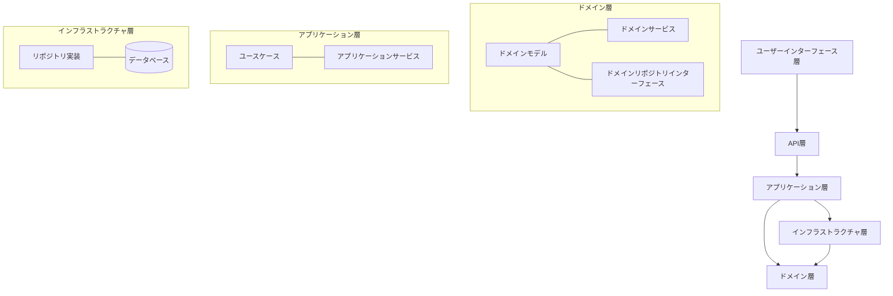
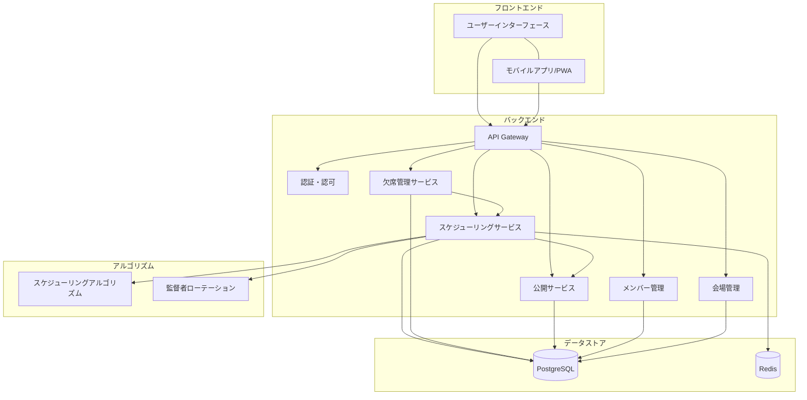

# 練習表自動生成システム 設計書：概要

## システムの目的

本システムは、同志社大学能部における練習表作成業務を効率化し、練習機会の公平性を高め、練習の質を向上させることを目的とする。現状の課題として以下が挙げられる：

1. 練習表の手動作成に多大な時間を要し、担当者・部長に負荷が集中している
2. 直前欠席への対応が困難で、練習の質のばらつきや練習機会の逸失が発生している
3. 練習表の共有が遅れ、部員への周知が練習直前になることがある
4. 公平な監督者ローテーションが保証できていない
5. 権限管理が曖昧で、無許可変更による混乱リスクがある

これらの課題に対応するため、本システムでは以下の目標を設定する：

- 練習表作成・再生成時間を「秒〜数分」に短縮し、部長主導で即時共有可能にする
- 欠席情報を反映した自動リスケジュールにより、全員が等しく練習機会を得られるようにする
- 監督者ローテーションをアルゴリズムで最適化し、公平性を担保する
- 閲覧／編集権限を分離し、変更履歴とバージョン管理を実装する

## 設計思想

本システムはドメイン駆動設計（DDD）の思想に基づいて設計する。これにより、以下の利点を得る：

1. **ユビキタス言語の確立**：
   - 開発者とステークホルダー間で共通言語を用いることで、要件の誤解を減少させる
   - ドメインの専門家（部長など）と開発者の認識を一致させる

2. **ドメインの明確な境界**：
   - バウンデッドコンテキストによる責務の明確化
   - サブドメイン間の関係性の整理

3. **ビジネスルールのカプセル化**：
   - ドメインモデル内に重要なビジネスルールを閉じ込め、整合性を保証
   - 不変条件による整合性チェック

4. **テスト容易性**：
   - 各集約をユニットとしたテストが可能
   - ドメインサービスの責務が明確で、モックが容易

5. **拡張性と保守性**：
   - 新機能追加時の影響範囲を限定可能
   - 変更に強い設計

## 全体アーキテクチャ

本システムは以下の層からなるクリーンアーキテクチャを採用する：

### 主要なコンポーネント

1. **ドメイン層**：
   - エンティティ、値オブジェクト、集約
   - ドメインサービス
   - ドメインイベント
   - リポジトリインターフェース

2. **アプリケーション層**：
   - ユースケース
   - アプリケーションサービス
   - DTOマッピング

3. **インターフェース層**：
   - REST API コントローラー
   - ユーザーインターフェース
   - 認証・認可

4. **インフラストラクチャ層**：
   - リポジトリの実装
   - 永続化
   - 外部サービス連携

## システム全体図

## ステークホルダー

| 役割 | 主な関心事 | システム上の権限 |
|------|-----------|----------------|
| **部長 (ClubCaptain)** | 出欠入力・最終承認・共有 | Admin (作成・公開・編集・ロール設定) |
| **作成担当 (Scheduler)** | データ入力補助・初期草案 | Editor (作成・編集) |
| **部員 (Member)** | 練習内容確認・欠席連絡 | Viewer / AbsenceReporter (欠席登録) |
| **システム管理者 (ITAdmin)** | 運用・保守 | SysAdmin | 