# 練習表自動生成システム 設計書：ドメインモデル

## エンティティ

エンティティは、システム内で一意に識別され、ライフサイクルを持つオブジェクトです。以下に本システムの主要エンティティを示します。

### Member（部員）

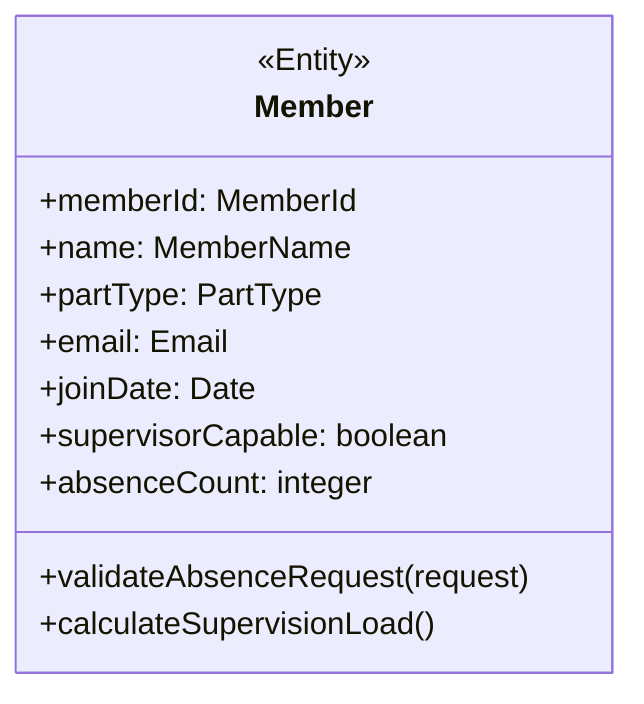

**主な属性**:
- `memberId`: 部員の一意識別子（値オブジェクト）
- `name`: 氏名（値オブジェクト）
- `partType`: 所属パート（謡/舞など）
- `email`: メールアドレス（値オブジェクト）
- `joinDate`: 入部日
- `supervisorCapable`: 監督者資格の有無
- `absenceCount`: 月間欠席回数のカウンター

**主な振る舞い**:
- `validateAbsenceRequest(request)`: 欠席申請のバリデーション
- `calculateSupervisionLoad()`: 当該メンバーの監督負荷を計算

### PracticeSession（練習セッション）

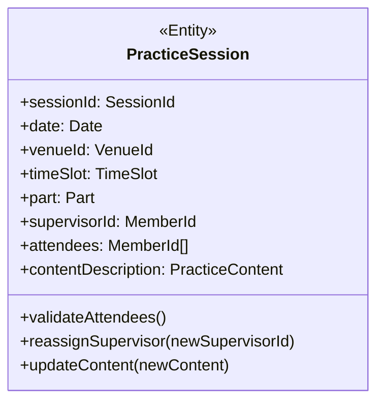

**主な属性**:
- `sessionId`: セッションの一意識別子（値オブジェクト）
- `date`: 練習日
- `venueId`: 会場ID（外部キー）
- `timeSlot`: 時間枠（値オブジェクト）
- `part`: パート情報（エンティティへの参照）
- `supervisorId`: 監督者ID（外部キー）
- `attendees`: 参加予定メンバーのIDリスト
- `contentDescription`: 練習内容（値オブジェクト）

**主な振る舞い**:
- `validateAttendees()`: 参加者構成の妥当性確認
- `reassignSupervisor(newSupervisorId)`: 監督者の再割り当て
- `updateContent(newContent)`: 練習内容の更新

### PracticeSchedule（練習スケジュール）

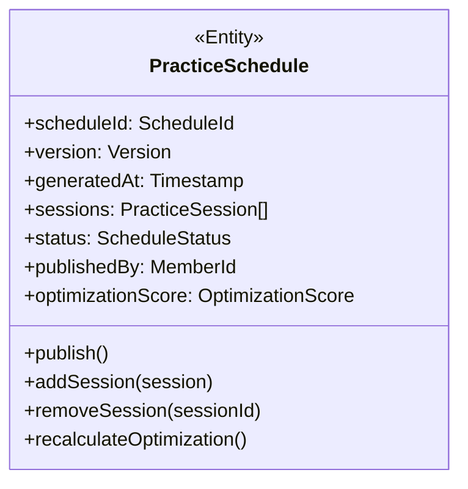

**主な属性**:
- `scheduleId`: スケジュールの一意識別子（値オブジェクト）
- `version`: バージョン情報（値オブジェクト）
- `generatedAt`: 生成日時
- `sessions`: 練習セッションのコレクション
- `status`: スケジュールの状態（値オブジェクト）
- `publishedBy`: 公開者ID（外部キー）
- `optimizationScore`: 最適化スコア（値オブジェクト）

**主な振る舞い**:
- `publish()`: スケジュールの公開処理
- `addSession(session)`: セッションの追加
- `removeSession(sessionId)`: セッションの削除
- `recalculateOptimization()`: 最適化スコアの再計算

### AbsenceRequest（欠席申請）

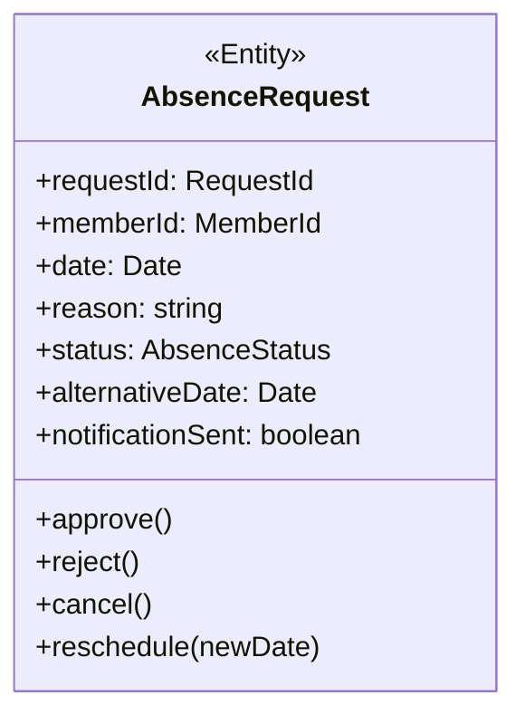

**主な属性**:
- `requestId`: 申請の一意識別子（値オブジェクト）
- `memberId`: 申請者ID（外部キー）
- `date`: 欠席予定日
- `reason`: 理由
- `status`: 申請状態（値オブジェクト）
- `alternativeDate`: 代替希望日
- `notificationSent`: 通知送信済みフラグ

**主な振る舞い**:
- `approve()`: 欠席申請の承認
- `reject()`: 欠席申請の拒否
- `cancel()`: 欠席申請の取消
- `reschedule(newDate)`: 代替日程の設定

### Venue（会場）

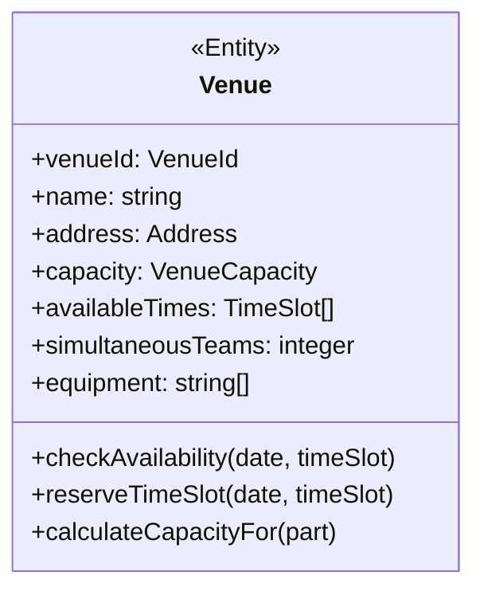

**主な属性**:
- `venueId`: 会場の一意識別子（値オブジェクト）
- `name`: 会場名
- `address`: 住所（値オブジェクト）
- `capacity`: 収容人数（値オブジェクト）
- `availableTimes`: 利用可能時間のリスト
- `simultaneousTeams`: 同時開催可能チーム数
- `equipment`: 利用可能設備のリスト

**主な振る舞い**:
- `checkAvailability(date, timeSlot)`: 特定日時の利用可否確認
- `reserveTimeSlot(date, timeSlot)`: 時間枠の予約
- `calculateCapacityFor(part)`: パート別収容人数の計算

### Part（パート）

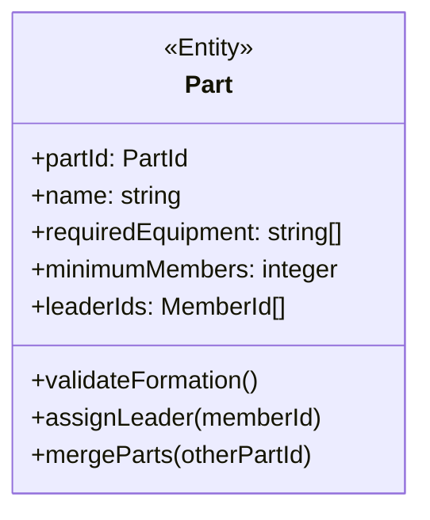

**主な属性**:
- `partId`: パートの一意識別子（値オブジェクト）
- `name`: パート名
- `requiredEquipment`: 必要設備リスト
- `minimumMembers`: 最低必要人数
- `leaderIds`: リーダーIDのリスト

**主な振る舞い**:
- `validateFormation()`: 編成の妥当性確認
- `assignLeader(memberId)`: リーダーの割り当て
- `mergeParts(otherPartId)`: パートの統合処理

## 値オブジェクト

値オブジェクトは、属性のみで構成され、同一性ではなく値そのものが重要なオブジェクトです。

### TimeSlot（時間枠）

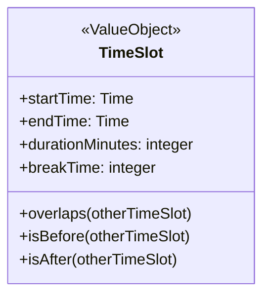

**主な属性**:
- `startTime`: 開始時刻
- `endTime`: 終了時刻
- `durationMinutes`: 所要時間（分）
- `breakTime`: 休憩時間（分）

**主な振る舞い**:
- `overlaps(otherTimeSlot)`: 他の時間枠と重複するか判定
- `isBefore(otherTimeSlot)`: 他の時間枠より前か判定
- `isAfter(otherTimeSlot)`: 他の時間枠より後か判定

### VenueCapacity（会場収容人数）

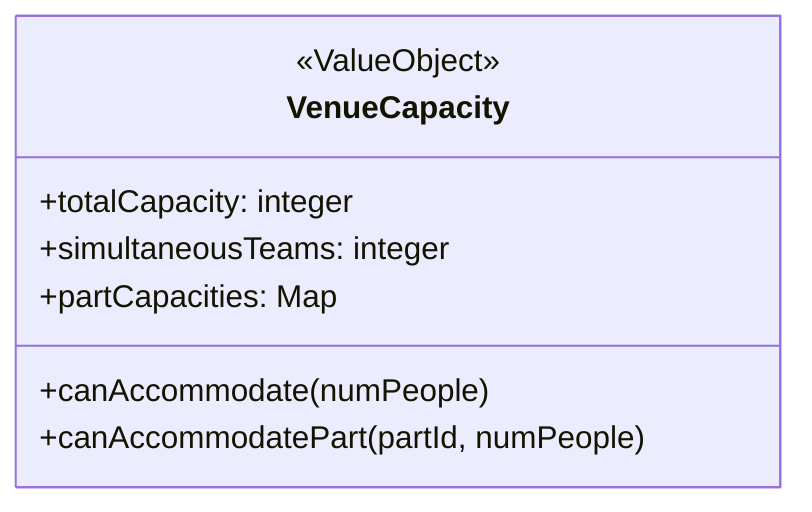

**主な属性**:
- `totalCapacity`: 総収容人数
- `simultaneousTeams`: 同時開催可能数
- `partCapacities`: パート別収容可能人数

**主な振る舞い**:
- `canAccommodate(numPeople)`: 指定人数収容可能か判定
- `canAccommodatePart(partId, numPeople)`: 特定パートの人数収容可能か判定

### RotationPolicy（ローテーションポリシー）

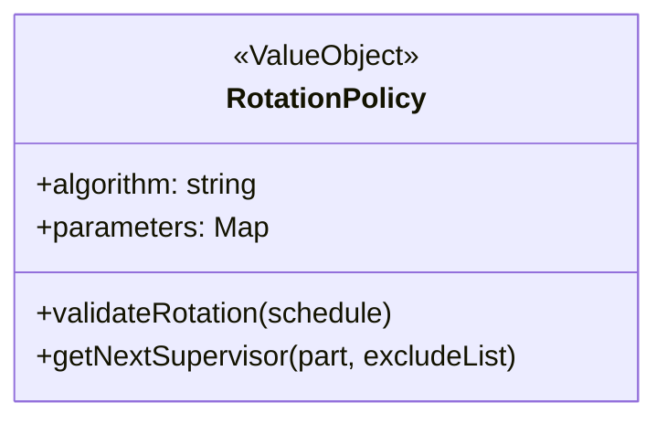

**主な属性**:
- `algorithm`: 使用アルゴリズム名
- `parameters`: アルゴリズムパラメータ
  - `maxConsecutive`: 最大連続回数
  - `balanceThreshold`: バランス閾値
  - `priorityMembers`: 優先メンバーリスト

**主な振る舞い**:
- `validateRotation(schedule)`: ローテーション妥当性検証
- `getNextSupervisor(part, excludeList)`: 次の監督者候補取得

### Role（役割）

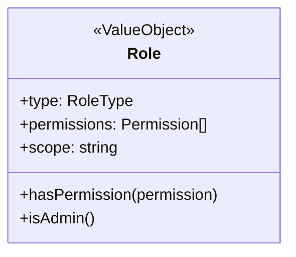

**主な属性**:
- `type`: 役割タイプ（Admin/Editor/Viewer）
- `permissions`: 権限リスト
- `scope`: 適用範囲

**主な振る舞い**:
- `hasPermission(permission)`: 特定権限を持つか確認
- `isAdmin()`: 管理者権限を持つか確認

### Version（バージョン）

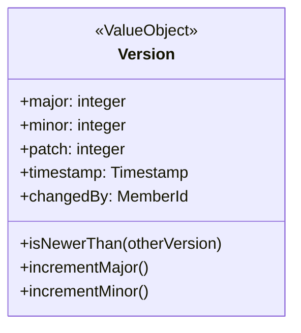

**主な属性**:
- `major`: メジャーバージョン
- `minor`: マイナーバージョン
- `patch`: パッチバージョン
- `timestamp`: 変更日時
- `changedBy`: 変更者ID

**主な振る舞い**:
- `isNewerThan(otherVersion)`: 他バージョンより新しいか確認
- `incrementMajor()`: メジャーバージョン増加
- `incrementMinor()`: マイナーバージョン増加

### ScheduleStatus（スケジュール状態）

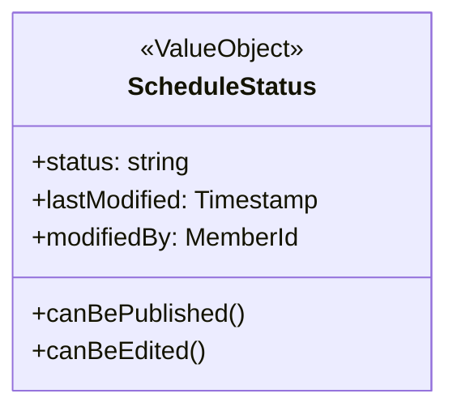

**主な属性**:
- `status`: 状態（Draft/Published/Archived）
- `lastModified`: 最終更新日時
- `modifiedBy`: 更新者ID

**主な振る舞い**:
- `canBePublished()`: 公開可能か判定
- `canBeEdited()`: 編集可能か判定

### PracticeContent（練習内容）

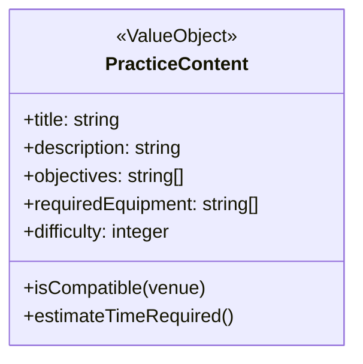

**主な属性**:
- `title`: タイトル
- `description`: 説明
- `objectives`: 目標リスト
- `requiredEquipment`: 必要設備
- `difficulty`: 難易度（1-5）

**主な振る舞い**:
- `isCompatible(venue)`: 会場と互換性があるか確認
- `estimateTimeRequired()`: 想定所要時間の見積もり

### AbsenceStatus（欠席状態）

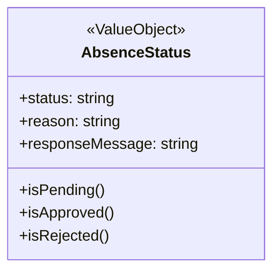

**主な属性**:
- `status`: 状態（Pending/Approved/Rejected）
- `reason`: 理由
- `responseMessage`: 回答メッセージ

**主な振る舞い**:
- `isPending()`: 保留中か確認
- `isApproved()`: 承認済みか確認
- `isRejected()`: 拒否されたか確認

### OptimizationScore（最適化スコア）

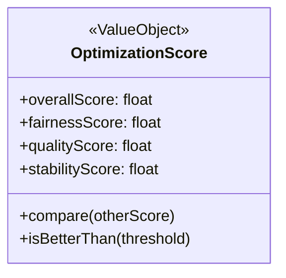

**主な属性**:
- `overallScore`: 総合スコア
- `fairnessScore`: 公平性スコア
- `qualityScore`: 質スコア
- `stabilityScore`: 安定性スコア

**主な振る舞い**:
- `compare(otherScore)`: 他スコアと比較
- `isBetterThan(threshold)`: 閾値より良いか判定

### MemberAvailability（メンバー可用性）

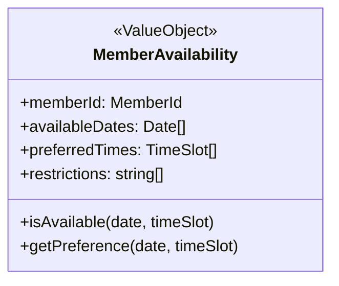

**主な属性**:
- `memberId`: メンバーID
- `availableDates`: 利用可能日リスト
- `preferredTimes`: 希望時間帯リスト
- `restrictions`: 制約条件リスト

**主な振る舞い**:
- `isAvailable(date, timeSlot)`: 特定日時に利用可能か確認
- `getPreference(date, timeSlot)`: 特定日時の希望度取得

## 集約と不変条件

集約はトランザクション整合性を保つためのエンティティと値オブジェクトのクラスタです。各集約にはルートとなるエンティティがあり、外部からのアクセスはこのルートを通じて行われます。

### PracticeSchedule 集約

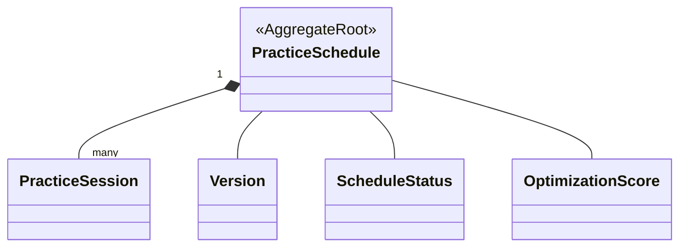

**不変条件**:
1. 同一 `TimeSlot` に同一 `Member` が複数セッションに登場しない
   ```typescript
   // 疑似コード
   validateMemberAssignments(): boolean {
     const memberAssignments = new Map<MemberId, Set<TimeSlot>>();
     
     for (const session of this.sessions) {
       for (const memberId of [...session.attendees, session.supervisorId]) {
         if (!memberAssignments.has(memberId)) {
           memberAssignments.set(memberId, new Set());
         }
         
         const assignedSlots = memberAssignments.get(memberId);
         for (const slot of assignedSlots) {
           if (slot.overlaps(session.timeSlot)) {
             return false;  // 違反
           }
         }
         
         assignedSlots.add(session.timeSlot);
       }
     }
     
     return true;
   }
   ```

2. `Venue.capacity` を超えるメンバー数を割り当てない
   ```typescript
   validateVenueCapacity(): boolean {
     const venueAssignments = new Map<VenueId, Map<TimeSlot, number>>();
     
     for (const session of this.sessions) {
       if (!venueAssignments.has(session.venueId)) {
         venueAssignments.set(session.venueId, new Map());
       }
       
       const venueTimeSlots = venueAssignments.get(session.venueId);
       const attendeeCount = session.attendees.length + 1; // +1 for supervisor
       
       for (const [timeSlot, count] of venueTimeSlots.entries()) {
         if (timeSlot.overlaps(session.timeSlot)) {
           const venue = venueRepository.findById(session.venueId);
           const newCount = count + attendeeCount;
           
           if (newCount > venue.capacity.totalCapacity) {
             return false;  // 違反
           }
         }
       }
       
       venueTimeSlots.set(session.timeSlot, attendeeCount);
     }
     
     return true;
   }
   ```

3. 監督者ローテーション: 連続`n`回以上同一Supervisorを同一Partに割り当て不可 (n=2)
   ```typescript
   validateSupervisorRotation(): boolean {
     const MAX_CONSECUTIVE = 2;
     const supervisorAssignments = new Map<MemberId, Array<[PartId, Date]>>();
     
     // 日付でソート
     const sortedSessions = [...this.sessions].sort((a, b) => a.date.getTime() - b.date.getTime());
     
     for (const session of sortedSessions) {
       if (!supervisorAssignments.has(session.supervisorId)) {
         supervisorAssignments.set(session.supervisorId, []);
       }
       
       const assignments = supervisorAssignments.get(session.supervisorId);
       assignments.push([session.part.partId, session.date]);
       
       // 連続割り当てチェック
       let consecutiveCount = 1;
       const currentPartId = session.part.partId;
       
       for (let i = assignments.length - 2; i >= 0; i--) {
         const [partId, _] = assignments[i];
         
         if (partId === currentPartId) {
           consecutiveCount++;
           
           if (consecutiveCount > MAX_CONSECUTIVE) {
             return false;  // 違反
           }
         } else {
           break;  // 別パートなら連続カウントリセット
         }
       }
     }
     
     return true;
   }
   ```

4. `version` は公開時にインクリメントし、履歴を保持

5. 各パートには最低1名の監督者が割り当てられている

6. すべてのセッションに最低限必要な人数が割り当てられている

### Attendance 集約

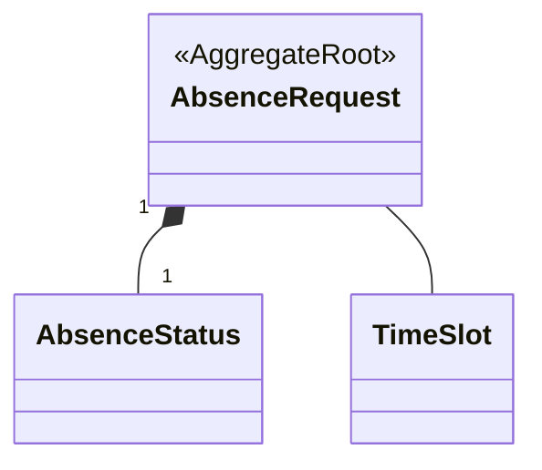

**不変条件**:
1. 同一メンバーの同一日の欠席申請は1件のみ
   ```typescript
   validateUniqueRequest(memberId: MemberId, date: Date): boolean {
     const existingRequests = absenceRequestRepository.findByMemberAndDate(memberId, date);
     return existingRequests.length === 0;
   }
   ```

2. 欠席申請は練習日の24時間前までのみ受付
   ```typescript
   isValidSubmissionTime(practiceDate: Date): boolean {
     const now = new Date();
     const timeDiff = practiceDate.getTime() - now.getTime();
     const hoursDiff = timeDiff / (1000 * 60 * 60);
     
     return hoursDiff >= 24;
   }
   ```

3. 連続3回を超える欠席は特別承認が必要
   ```typescript
   requiresSpecialApproval(memberId: MemberId): boolean {
     const member = memberRepository.findById(memberId);
     return member.absenceCount >= 3;
   }
   ```

4. 欠席取消は承認ステータスに関わらず可能

5. 代替日の提案は有効な練習日でなければならない
   ```typescript
   isValidAlternativeDate(date: Date): boolean {
     const scheduledDates = practiceScheduleRepository.getScheduledDates();
     return scheduledDates.some(scheduledDate => 
       scheduledDate.getFullYear() === date.getFullYear() &&
       scheduledDate.getMonth() === date.getMonth() &&
       scheduledDate.getDate() === date.getDate()
     );
   }
   ```

### Member 集約

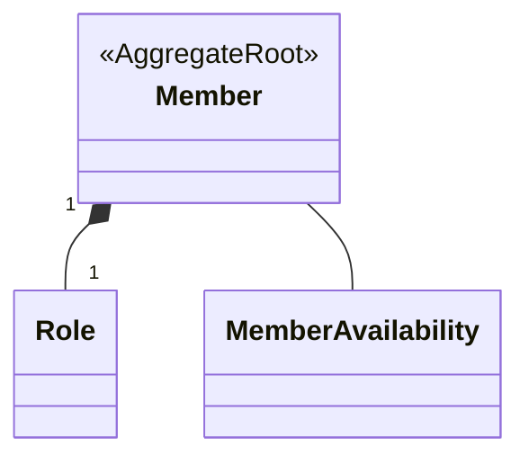

**不変条件**:
1. パート所属は必ず1つ以上
   ```typescript
   hasValidPartAssignment(): boolean {
     return this.partType !== null && this.partType !== undefined;
   }
   ```

2. 監督者資格のないメンバーは監督者として割り当てられない
   ```typescript
   canSupervise(): boolean {
     return this.supervisorCapable === true;
   }
   ```

3. 同一パートのリーダーは最大2名まで
   ```typescript
   validateLeaderCount(partId: PartId): boolean {
     const part = partRepository.findById(partId);
     return part.leaderIds.length < 2;
   }
   ```

4. 欠席回数は毎月リセットされ、統計として保持
   ```typescript
   resetAbsenceCount(): void {
     // 毎月1日に実行
     this.absenceCount = 0;
   }
   ```

### Venue 集約

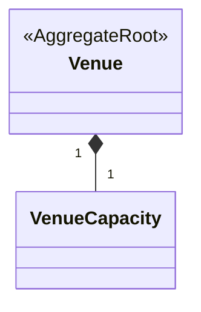

**不変条件**:
1. 同一時間帯の予約は `simultaneousTeams` を超えない
   ```typescript
   validateSimultaneousBooking(date: Date, timeSlot: TimeSlot): boolean {
     const overlappingSessions = practiceSessionRepository.findByVenueAndTimeRange(
       this.venueId, date, timeSlot
     );
     
     return overlappingSessions.length < this.simultaneousTeams;
   }
   ```

2. 利用可能時間外の予約はできない
   ```typescript
   isTimeSlotAvailable(timeSlot: TimeSlot): boolean {
     return this.availableTimes.some(availableSlot => 
       timeSlot.startTime >= availableSlot.startTime && 
       timeSlot.endTime <= availableSlot.endTime
     );
   }
   ```

3. 各パートの必須設備が揃っていないとそのパートの練習はできない
   ```typescript
   canAccommodatePart(part: Part): boolean {
     return part.requiredEquipment.every(equipment => 
       this.equipment.includes(equipment)
     );
   }
   