# 練習表自動生成システム 設計書：バウンデッドコンテキスト

## コンテキストマップ

本システムは以下のバウンデッドコンテキストから構成されています。

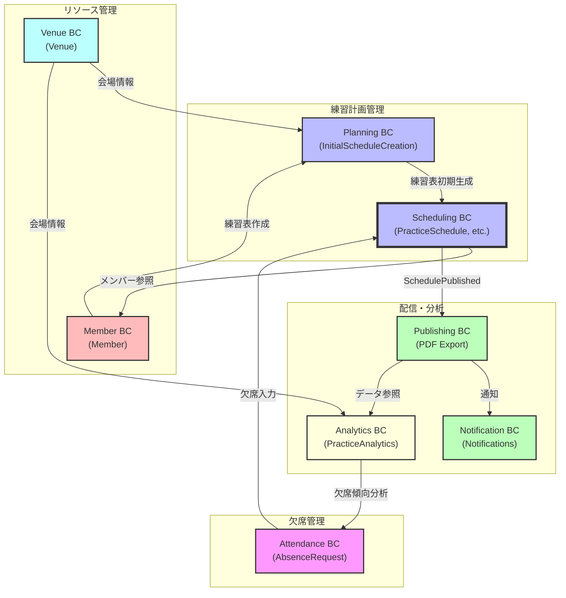

### コンテキスト間の関係性

| 関係 | 上流 | 下流 | 統合方式 | データ交換 |
|------|------|------|----------|------------|
| 会場情報提供 | Venue BC | Planning BC | 顧客-サプライヤー | 会場データ |
| メンバー情報提供 | Member BC | Planning BC | 共有カーネル | メンバーリスト |
| 練習表初期生成 | Planning BC | Scheduling BC | 準備-整合性Saga | 基本計画データ |
| メンバー参照 | Member BC | Scheduling BC | 共有カーネル | メンバー情報 |
| 欠席情報の共有 | Attendance BC | Scheduling BC | 発行-購読型 | 欠席イベント |
| スケジュール公開 | Scheduling BC | Publishing BC | 顧客-サプライヤー | 確定スケジュール |
| 通知配信 | Publishing BC | Notification BC | 発行-購読型 | 通知イベント |
| 分析データ提供 | Publishing BC | Analytics BC | 適合者 | スケジュールデータ |
| 会場情報分析 | Venue BC | Analytics BC | 適合者 | 会場使用データ |
| 欠席傾向フィードバック | Analytics BC | Attendance BC | オープンホスト | 分析結果 |

## 各コンテキストの責務

### Planning BC（計画コンテキスト）

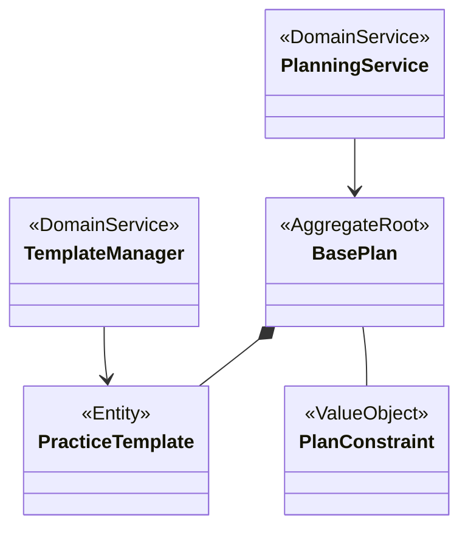

**主な責務**:
- 学期ごとの基本練習計画の作成
- 練習内容テンプレートの管理
- 練習計画の制約条件の定義
- 初期スケジュール計画の策定

**主要エンティティ**:
- BasePlan（基本計画）
- PracticeTemplate（練習テンプレート）

**主要値オブジェクト**:
- PlanConstraint（計画制約）
- AcademicTerm（学期）

**主要ドメインサービス**:
- PlanningService（計画サービス）: 基本計画の作成と管理を担当
- TemplateManager（テンプレート管理サービス）: 練習テンプレートの管理と検証を担当

**サービス間の連携**:
- PlanningServiceはTemplateManagerを利用してテンプレートの検証と適用を行う
- TemplateManagerは練習テンプレートの整合性を確保し、各パートに適したテンプレートを提供する

**提供するインターフェース**:
- IPlanningService: 基本計画CRUD操作
- ITemplateService: テンプレート管理
- IInitialScheduleCreation: 初期スケジュール生成

**消費するインターフェース**:
- IVenueQuery: 会場情報照会
- IMemberQuery: メンバー情報照会

### Scheduling BC（スケジューリングコンテキスト）

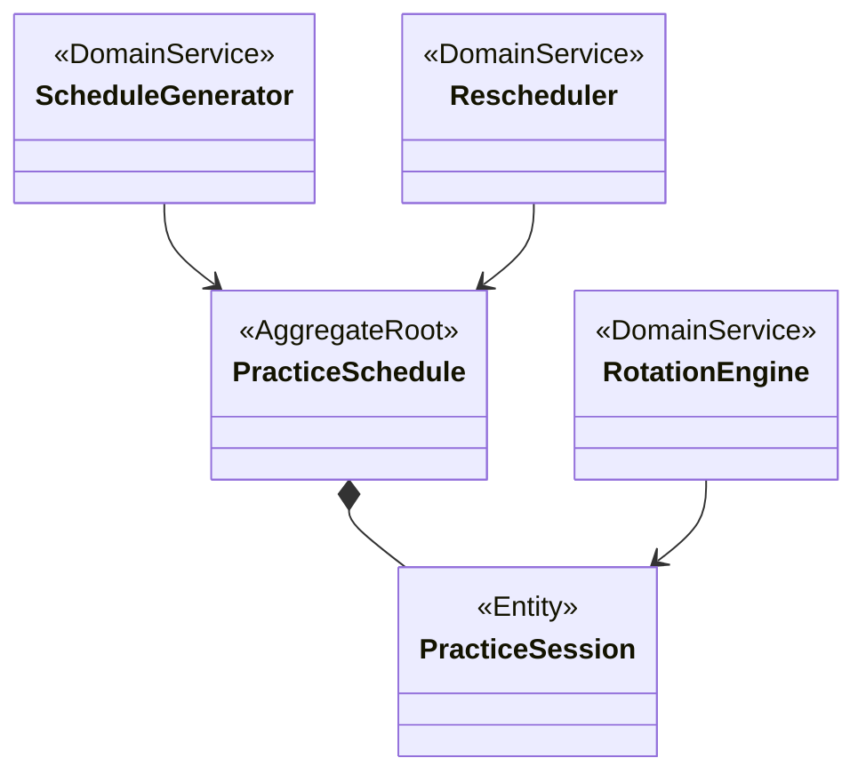

**主な責務**:
- 練習スケジュールの最適生成
- 欠席情報に基づく再スケジューリング
- 監督者の公平な割り当て
- 練習の質の評価と最適化
- 会場の適切な割り当て

**主要エンティティ**:
- PracticeSchedule（練習スケジュール）
- PracticeSession（練習セッション）

**主要値オブジェクト**:
- TimeSlot（時間枠）
- OptimizationScore（最適化スコア）
- RotationPolicy（ローテーションポリシー）

**提供するインターフェース**:
- IScheduleService: スケジュール操作
- IScheduleNotification: スケジュール変更通知
- ISupervisorAssignment: 監督者割り当て

**消費するインターフェース**:
- IAbsenceQuery: 欠席情報照会
- IMemberQuery: メンバー情報照会
- IBasePlanQuery: 基本計画情報照会

### Attendance BC（出欠管理コンテキスト）

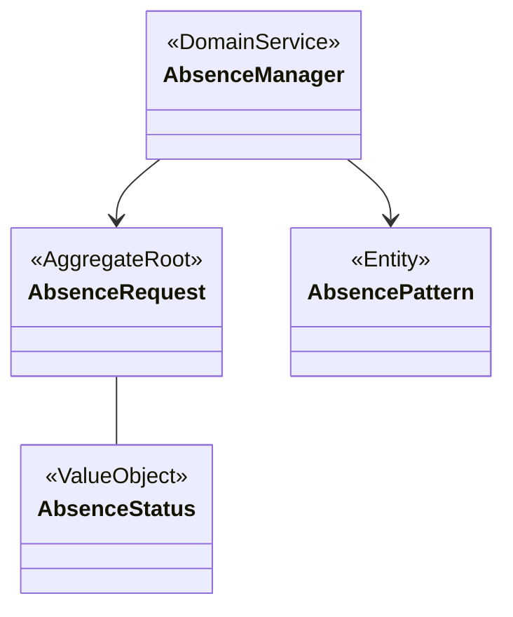

**主な責務**:
- 欠席申請の受付と状態管理
- 申請の承認/拒否ワークフロー
- 欠席理由の集計・分析
- 欠席パターンの検出
- 代替日程の提案

**主要エンティティ**:
- AbsenceRequest（欠席申請）
- AbsencePattern（欠席パターン）

**主要値オブジェクト**:
- AbsenceStatus（欠席状態）
- AbsenceReason（欠席理由）

**提供するインターフェース**:
- IAbsenceService: 欠席申請のCRUD操作
- IAbsenceNotification: 欠席イベント通知
- IAbsenceAnalysis: 欠席パターン分析

**消費するインターフェース**:
- IMemberQuery: メンバー情報照会
- IScheduleQuery: スケジュール情報照会
- IAnalyticsInsight: 分析インサイト

### Member BC（メンバー管理コンテキスト）

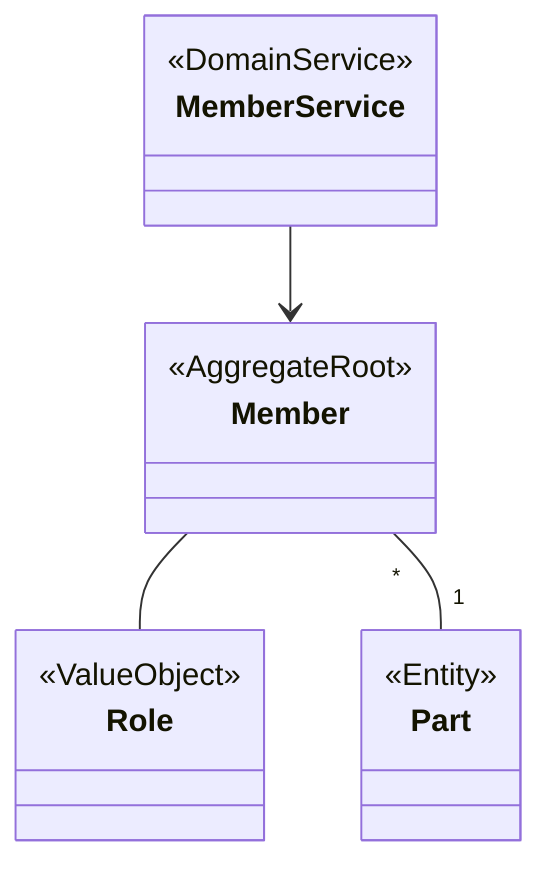

**主な責務**:
- メンバー情報の管理
- 権限・ロールの管理
- 監督者資格の管理
- パート所属の管理
- メンバー統計情報の集計

**主要エンティティ**:
- Member（メンバー）
- Part（パート）

**主要値オブジェクト**:
- Role（役割）
- MemberAvailability（メンバー可用性）
- SupervisorCapability（監督者能力）

**提供するインターフェース**:
- IMemberService: メンバー情報CRUD操作
- IRoleService: 役割・権限管理
- ISupervisorEligibility: 監督者資格確認
- IPartManagement: パート管理

**消費するインターフェース**:
- なし（他コンテキストへ情報提供する中心的コンテキスト）

### Venue BC（会場管理コンテキスト）

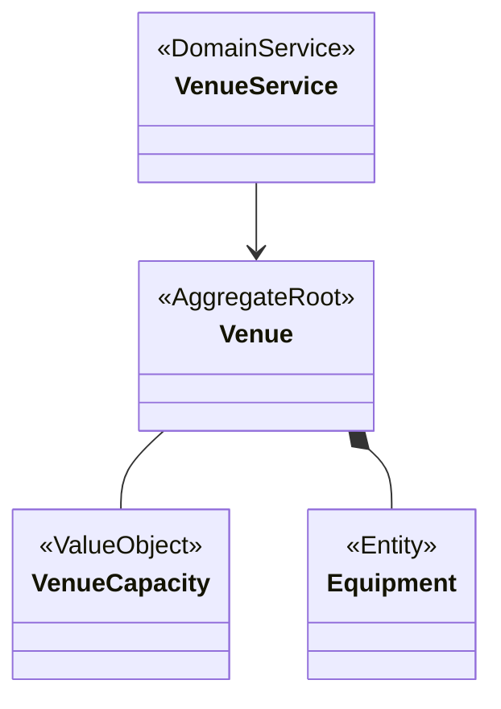

**主な責務**:
- 会場情報の管理
- 会場予約状況の管理
- 会場適合性の評価
- 設備情報の管理
- 収容人数の管理

**主要エンティティ**:
- Venue（会場）
- Equipment（設備）

**主要値オブジェクト**:
- VenueCapacity（会場収容人数）
- TimeSlot（利用可能時間枠）
- VenueRestriction（会場制約）

**提供するインターフェース**:
- IVenueService: 会場情報CRUD操作
- IVenueAvailability: 会場利用可否確認
- IVenueCapacityCheck: 収容人数確認
- IEquipmentManagement: 設備管理

**消費するインターフェース**:
- なし（情報提供側のコンテキスト）

### Publishing BC（公開コンテキスト）

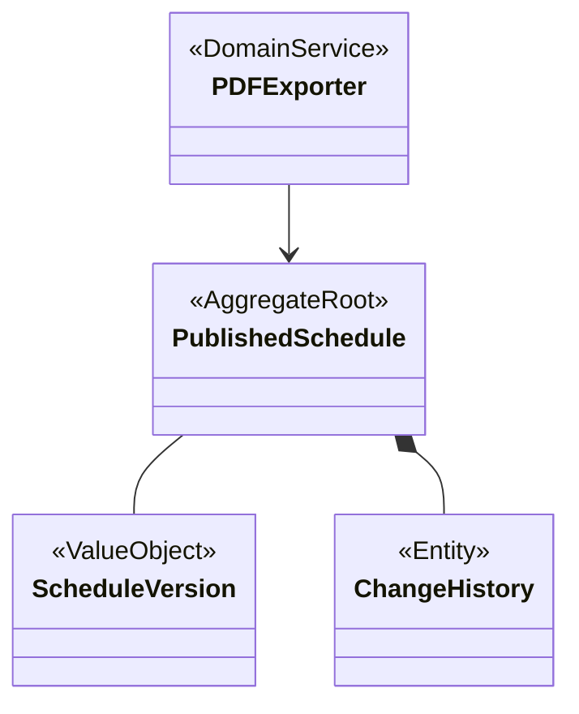

**主な責務**:
- スケジュールのバージョン管理
- 確定版のPDFエクスポート
- 変更履歴の管理
- 公開スケジュールの管理
- 共有機能の提供

**主要エンティティ**:
- PublishedSchedule（公開スケジュール）
- ChangeHistory（変更履歴）

**主要値オブジェクト**:
- ScheduleVersion（スケジュールバージョン）
- PublicationStatus（公開状態）
- ExportFormat（エクスポート形式）

**提供するインターフェース**:
- IPublishService: スケジュール公開操作
- IExportService: エクスポート機能
- IHistoryService: 変更履歴管理
- IScheduleShareService: スケジュール共有

**消費するインターフェース**:
- IScheduleQuery: スケジュール情報照会
- IMemberDisplayInfo: メンバー表示情報

### Notification BC（通知コンテキスト）

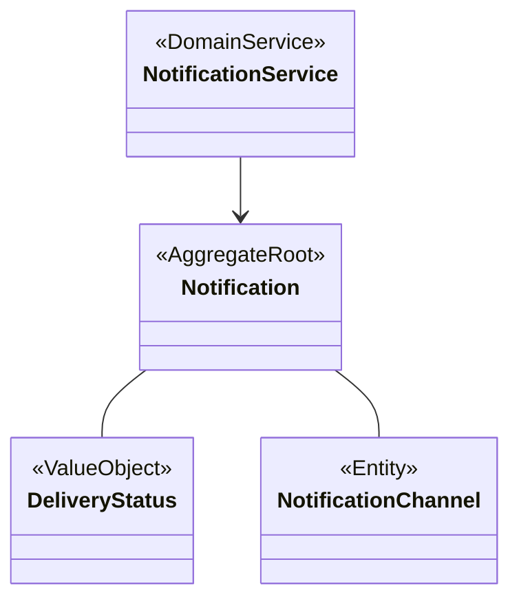

**主な責務**:
- 通知の管理と配信
- 通知チャネルの管理
- 通知テンプレートの管理
- 配信状況の追跡
- 通知のスケジューリング

**主要エンティティ**:
- Notification（通知）
- NotificationChannel（通知チャネル）
- NotificationTemplate（通知テンプレート）

**主要値オブジェクト**:
- DeliveryStatus（配信状態）
- NotificationPriority（通知優先度）
- NotificationType（通知種別）

**提供するインターフェース**:
- INotificationService: 通知CRUD操作
- IDeliveryService: 通知配信
- IChannelManagement: チャネル管理
- INotificationStatus: 配信状態確認

**消費するインターフェース**:
- IPublishEvent: 公開イベント購読
- IMemberContact: メンバー連絡先情報

### Analytics BC（分析コンテキスト）

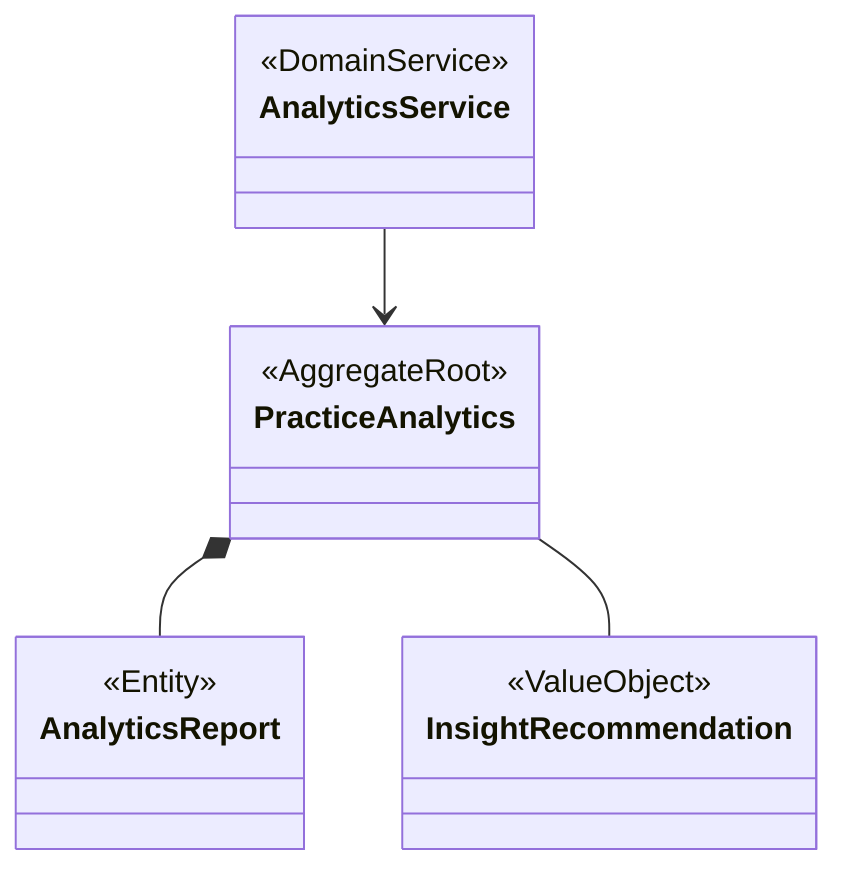

**主な責務**:
- 練習データの分析
- 参加率とパターンの分析
- 練習品質の評価
- 監督者割り当ての公平性評価
- 改善提案の生成

**主要エンティティ**:
- PracticeAnalytics（練習分析）
- AnalyticsReport（分析レポート）
- PracticeMetric（練習指標）

**主要値オブジェクト**:
- InsightRecommendation（洞察と推奨）
- QualityScore（品質スコア）
- TrendIndicator（傾向指標）

**提供するインターフェース**:
- IAnalyticsService: 分析機能
- IReportService: レポート生成
- IInsightService: 洞察提供
- ITrendAnalysis: 傾向分析

**消費するインターフェース**:
- IScheduleData: スケジュールデータ
- IAttendanceData: 出席データ
- IVenueUtilization: 会場利用データ

## コンテキスト間の連携パターン

バウンデッドコンテキスト間の連携には以下のパターンを採用しています。

### 発行-購読型統合 (Publisher-Subscriber)

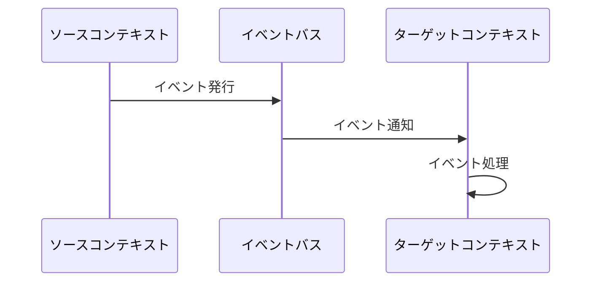

**適用例**:
- `Attendance BC` → `Scheduling BC` (欠席情報の共有)
- `Publishing BC` → `Notification BC` (通知配信)

このパターンでは、イベント発行側は購読側を意識せず、疎結合な連携が実現できます。

### 顧客-サプライヤー型統合 (Customer-Supplier)

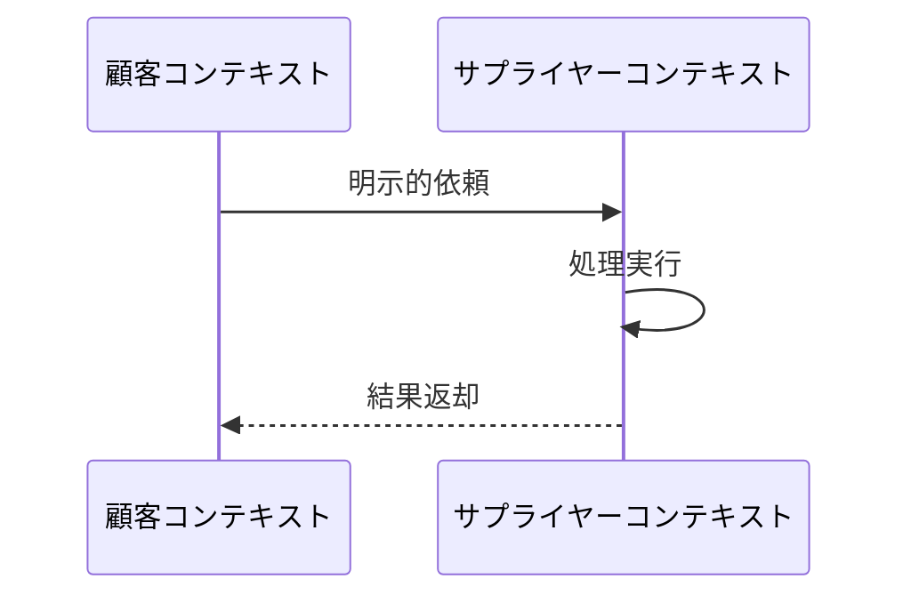

**適用例**:
- `Venue BC` → `Planning BC` (会場情報提供)
- `Scheduling BC` → `Publishing BC` (スケジュール公開)

下流コンテキスト（顧客）のニーズに合わせて上流コンテキスト（サプライヤー）がAPIを提供するパターンです。

### 共有カーネル統合 (Shared Kernel)

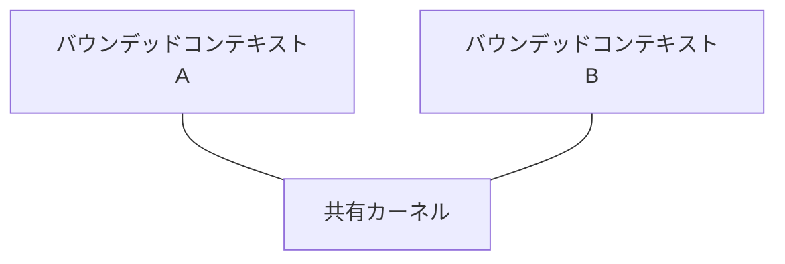

**適用例**:
- `Member BC` → `Planning BC` (メンバー情報提供)
- `Member BC` → `Scheduling BC` (メンバー参照)

複数のコンテキストで共通のモデルやコードを共有し、整合性を保つパターンです。変更には相互の合意が必要です。

### 適合者パターン (Conformist)

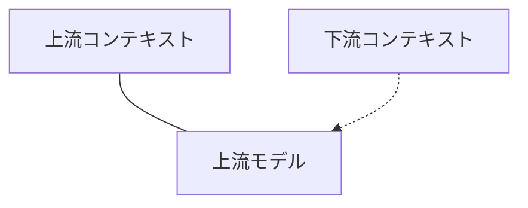

**適用例**:
- `Publishing BC` → `Analytics BC` (分析データ提供)
- `Venue BC` → `Analytics BC` (会場使用データ)

下流コンテキストが上流コンテキストのモデルに合わせるパターンです。上流側に変更の主導権があります。

### オープンホスト (Open Host Service)

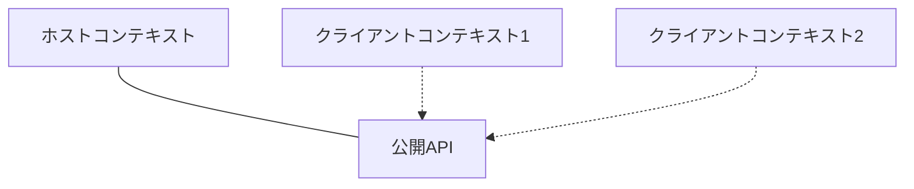

**適用例**:
- `Analytics BC` → `Attendance BC` (欠席傾向フィードバック)

一般的なプロトコルやAPIを通じて多様なクライアントと連携するパターンです。

### 準備-整合性Saga (Anti-Corruption Layer with Saga)

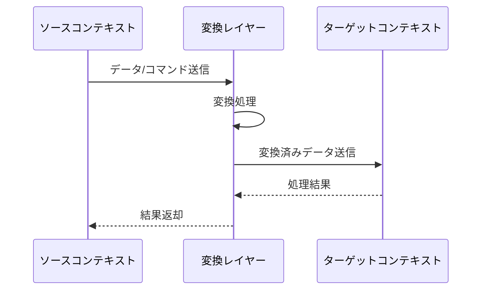

**適用例**:
- `Planning BC` → `Scheduling BC` (練習表初期生成)

コンテキスト間の概念の違いを吸収し、長時間トランザクションを整合的に処理するパターンです。 