# 練習表自動生成システム 設計書：ドメインサービス

ドメインサービスは、特定のエンティティに属さない、ドメインの重要な振る舞いを表現するコンポーネントです。バウンデッドコンテキストに従って、本システムでは以下のドメインサービスを定義します。

## ドメインサービス一覧

本システムで実装するドメインサービスとその関連性を以下のフローチャートに示します。

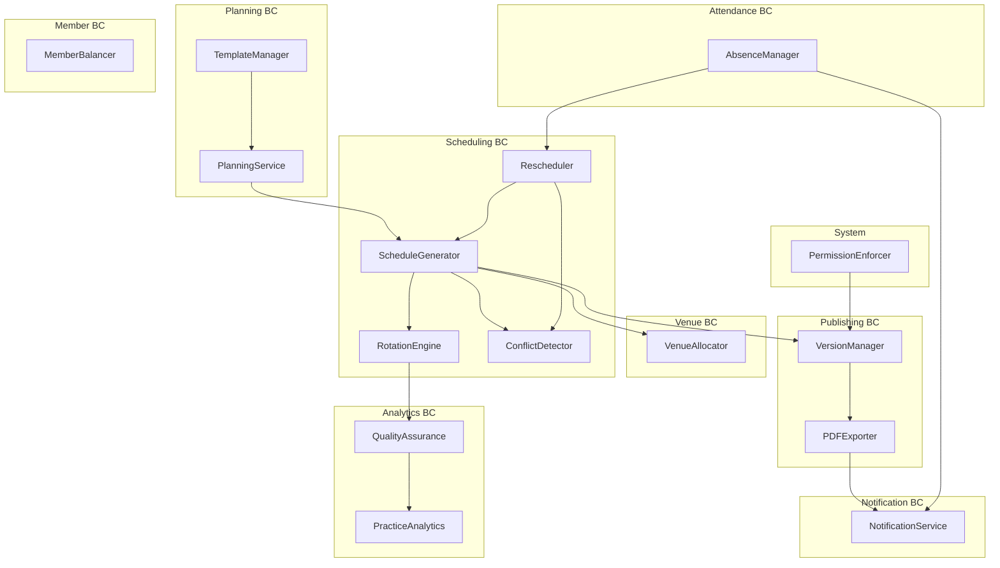

各バウンデッドコンテキストのドメインサービスについて詳細を説明します。

## Planning BC（計画コンテキスト）

### PlanningService（計画サービス）

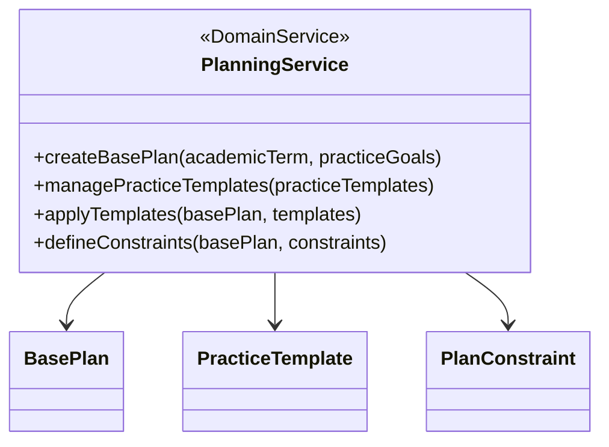

**責務**:
- 学期ごとの基本練習計画を作成する
- 練習内容テンプレートを管理する
- テンプレートを基本計画に適用する
- 計画に対する制約条件を定義する

**主要メソッド**:

1. `createBasePlan(academicTerm, practiceGoals)`
   - 入力: 学期情報、練習目標リスト
   - 処理: 基本計画の初期構造を作成
   - 出力: 基本計画インスタンス

2. `managePracticeTemplates(practiceTemplates)`
   - 入力: 練習テンプレートリスト
   - 処理: テンプレートの検証、登録、更新
   - 出力: 更新済テンプレートリスト

3. `applyTemplates(basePlan, templates)`
   - 入力: 基本計画、適用するテンプレート
   - 処理: テンプレートを計画に適用
   - 出力: テンプレート適用済み計画

4. `defineConstraints(basePlan, constraints)`
   - 入力: 基本計画、制約条件リスト
   - 処理: 計画に制約条件を設定
   - 出力: 制約設定済み計画

**依存**:
- BasePlanRepository
- TemplateRepository
- VenueRepository
- MemberRepository

### TemplateManager（テンプレート管理サービス）

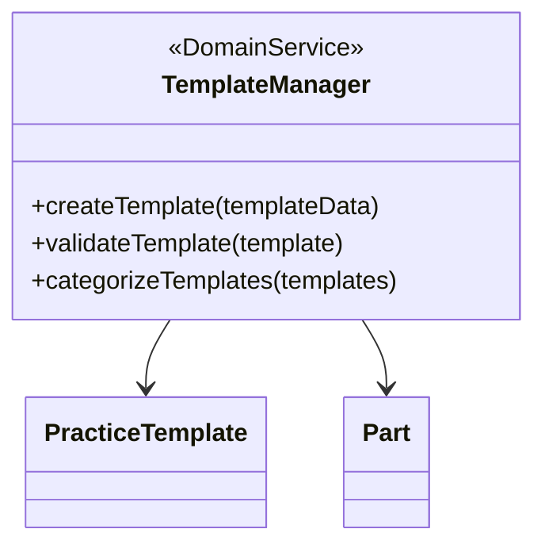

**責務**:
- 練習テンプレートの作成と管理
- テンプレートの整合性検証
- テンプレートの分類

**主要メソッド**:

1. `createTemplate(templateData)`
   - 入力: テンプレートデータ
   - 処理: テンプレートインスタンスの作成
   - 出力: 新テンプレート

2. `validateTemplate(template)`
   - 入力: テンプレート
   - 処理: 必要設備、時間要件、適合性の検証
   - 出力: 検証結果

3. `categorizeTemplates(templates)`
   - 入力: テンプレートリスト
   - 処理: パート、難易度、目的による分類
   - 出力: 分類結果

**依存**:
- TemplateRepository
- PartRepository

## Scheduling BC（スケジューリングコンテキスト）

### ScheduleGenerator（スケジュール生成サービス）

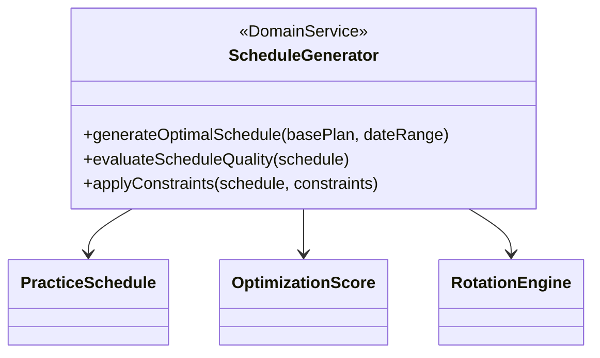

**責務**:
- 基本計画と日程から最適なスケジュールを生成する
- 生成されたスケジュールの品質を評価する
- 特定の制約を適用してスケジュールを調整する

**主要メソッド**:

1. `generateOptimalSchedule(basePlan, dateRange)`
   - 入力: 基本計画、日程範囲
   - 処理: 制約充足問題（CSP）として解き、最適スケジュールを生成
   - 出力: 最適化された PracticeSchedule インスタンス

2. `evaluateScheduleQuality(schedule)`
   - 入力: スケジュールインスタンス
   - 処理: 公平性、効率性、練習の質などの観点でスコアリング
   - 出力: OptimizationScore インスタンス

3. `applyConstraints(schedule, constraints)`
   - 入力: スケジュール、適用する制約リスト
   - 処理: 特定の制約に基づきスケジュールを微調整
   - 出力: 調整済みスケジュール

**依存**:
- PracticeScheduleRepository
- BasePlanRepository
- MemberRepository
- RotationEngine

### Rescheduler（再スケジュールサービス）

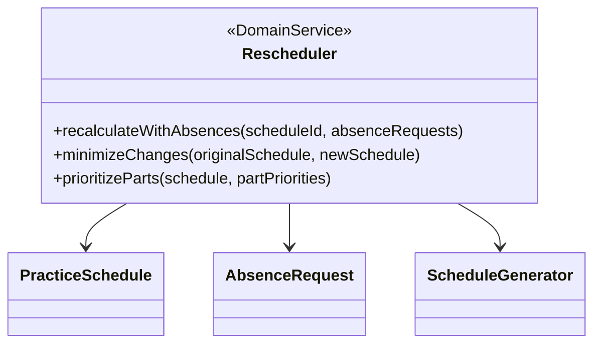

**責務**:
- 欠席情報をトリガーにスケジュールを再生成する
- 元のスケジュールからの変更を最小化する
- パート間の優先度を考慮した調整を行う

**主要メソッド**:

1. `recalculateWithAbsences(scheduleId, absenceRequests)`
   - 入力: スケジュールID、欠席申請リスト
   - 処理: 欠席情報を考慮して再生成アルゴリズムを実行
   - 出力: 再生成されたスケジュール

2. `minimizeChanges(originalSchedule, newSchedule)`
   - 入力: 元のスケジュール、新しく生成されたスケジュール
   - 処理: 差分を最小化する最適化を実行
   - 出力: 変更最小化されたスケジュール

3. `prioritizeParts(schedule, partPriorities)`
   - 入力: スケジュール、パート優先度マップ
   - 処理: 重要なパートを優先的に配置
   - 出力: 優先度を反映したスケジュール

**依存**:
- PracticeScheduleRepository
- AbsenceRequestRepository
- ScheduleGenerator

### RotationEngine（ローテーションエンジン）

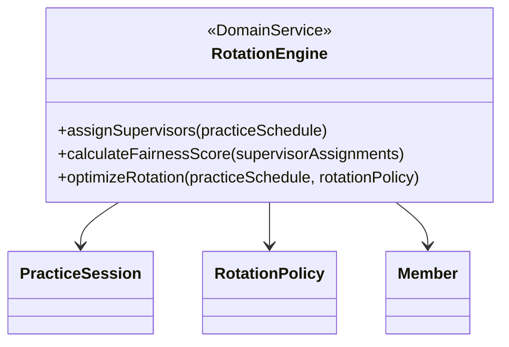

**責務**:
- 監督者の公平な割り当てを計算する
- 監督者配置の公平性スコアを評価する
- ローテーションポリシーに基づき最適な配置を行う

**主要メソッド**:

1. `assignSupervisors(practiceSchedule)`
   - 入力: 練習スケジュール
   - 処理: 各セッションに適切な監督者を割り当て
   - 出力: 監督者割り当て済みのスケジュール

2. `calculateFairnessScore(supervisorAssignments)`
   - 入力: 監督者割り当て情報
   - 処理: 負荷バランスや連続担当などの観点で公平性を計算
   - 出力: 公平性スコア（0-100）

3. `optimizeRotation(practiceSchedule, rotationPolicy)`
   - 入力: スケジュール、ローテーションポリシー
   - 処理: 指定されたポリシーに基づき監督者割り当てを最適化
   - 出力: 最適化されたスケジュール

**依存**:
- MemberRepository
- PracticeSessionRepository

### ConflictDetector（競合検出サービス）

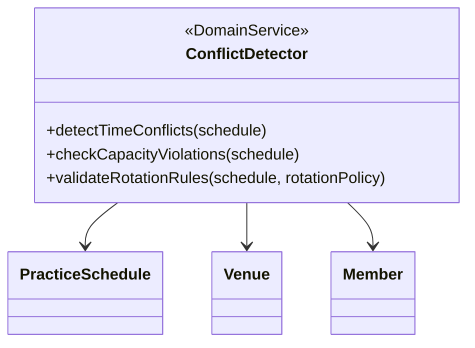

**責務**:
- スケジュールの時間的競合を検出する
- 会場の収容人数違反をチェックする
- ローテーションルールの違反を検証する

**主要メソッド**:

1. `detectTimeConflicts(schedule)`
   - 入力: スケジュール
   - 処理: 同一メンバーの時間重複をチェック
   - 出力: 競合リスト

2. `checkCapacityViolations(schedule)`
   - 入力: スケジュール
   - 処理: 各会場・時間枠での収容人数オーバーをチェック
   - 出力: 違反リスト

3. `validateRotationRules(schedule, rotationPolicy)`
   - 入力: スケジュール、ローテーションポリシー
   - 処理: 監督者ローテーションルールの遵守をチェック
   - 出力: 違反リスト

**依存**:
- VenueRepository
- MemberRepository

## Attendance BC（欠席管理コンテキスト）

### AbsenceManager（欠席管理サービス）

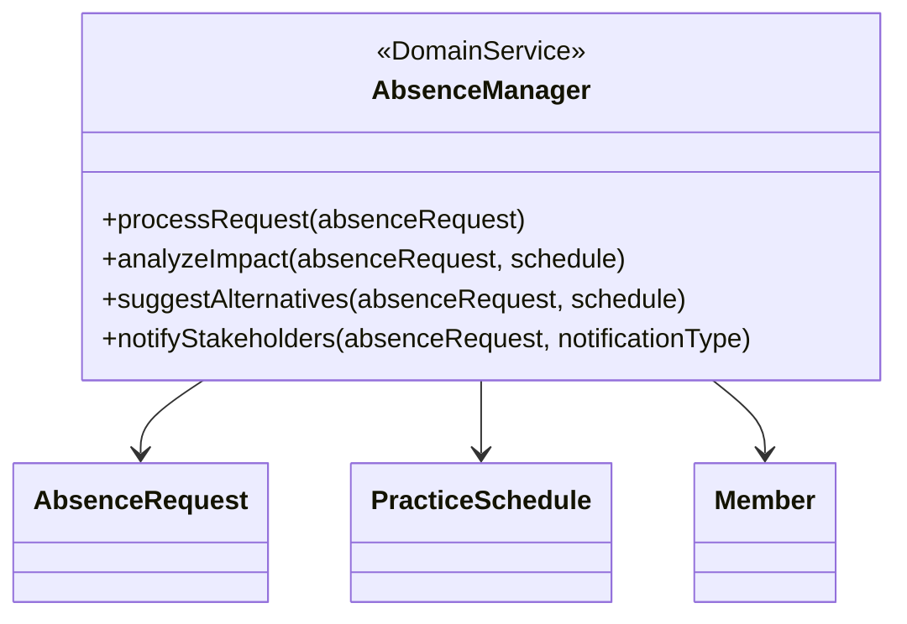

**責務**:
- 欠席申請の処理とワークフロー管理
- 欠席による影響分析
- 代替日程の提案
- 関係者への通知

**主要メソッド**:

1. `processRequest(absenceRequest)`
   - 入力: 欠席申請
   - 処理: バリデーション、ステータス更新、履歴記録
   - 出力: 処理済み申請

2. `analyzeImpact(absenceRequest, schedule)`
   - 入力: 欠席申請、現行スケジュール
   - 処理: パートバランス、人数、監督者配置への影響を分析
   - 出力: 影響分析レポート

3. `suggestAlternatives(absenceRequest, schedule)`
   - 入力: 欠席申請、スケジュール
   - 処理: 代替日程の候補を計算
   - 出力: 代替日程候補リスト

4. `notifyStakeholders(absenceRequest, notificationType)`
   - 入力: 欠席申請、通知タイプ
   - 処理: 関係者への適切な通知を送信
   - 出力: 通知送信結果

**依存**:
- AbsenceRequestRepository
- PracticeScheduleRepository
- MemberRepository

## Analytics BC（分析コンテキスト）

### QualityAssurance（品質保証サービス）

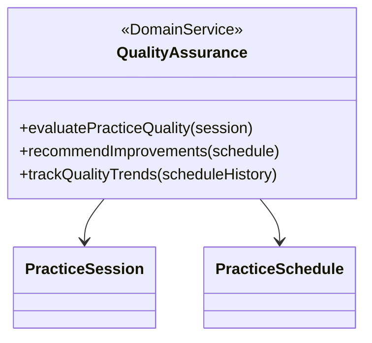

**責務**:
- 練習セッションの質を評価する
- 品質向上のための改善案を提案する
- 長期的な品質トレンドを追跡する

**主要メソッド**:

1. `evaluatePracticeQuality(session)`
   - 入力: 練習セッション
   - 処理: パートバランス、監督者適合性、内容の難易度などを評価
   - 出力: 品質スコア

2. `recommendImprovements(schedule)`
   - 入力: スケジュール
   - 処理: 低品質と判断されたセッションの改善案を生成
   - 出力: 改善提案リスト

3. `trackQualityTrends(scheduleHistory)`
   - 入力: 過去のスケジュール履歴
   - 処理: 時間経過に伴う品質変化を分析
   - 出力: トレンドレポート

**依存**:
- PracticeSessionRepository
- PracticeScheduleRepository

### PracticeAnalytics（練習分析サービス）

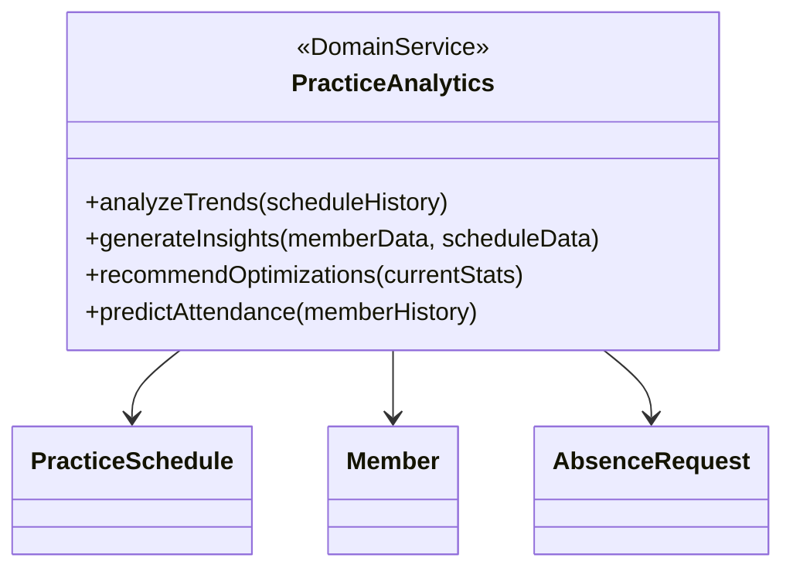

**責務**:
- 練習データの傾向分析を行う
- データに基づく洞察を生成する
- 最適化のための提案を行う
- 出席予測を行う

**主要メソッド**:

1. `analyzeTrends(scheduleHistory)`
   - 入力: スケジュール履歴
   - 処理: 時系列分析、パターン検出
   - 出力: トレンドレポート

2. `generateInsights(memberData, scheduleData)`
   - 入力: メンバーデータ、スケジュールデータ
   - 処理: データマイニングと相関分析
   - 出力: インサイトレポート

3. `recommendOptimizations(currentStats)`
   - 入力: 現在の統計データ
   - 処理: 最適化アルゴリズムを適用
   - 出力: 最適化提案

4. `predictAttendance(memberHistory)`
   - 入力: メンバーの参加履歴
   - 処理: 予測モデルの適用
   - 出力: 出席確率予測

**依存**:
- PracticeScheduleRepository
- MemberRepository
- AbsenceRequestRepository

## Venue BC（会場管理コンテキスト）

### VenueAllocator（会場割当サービス）

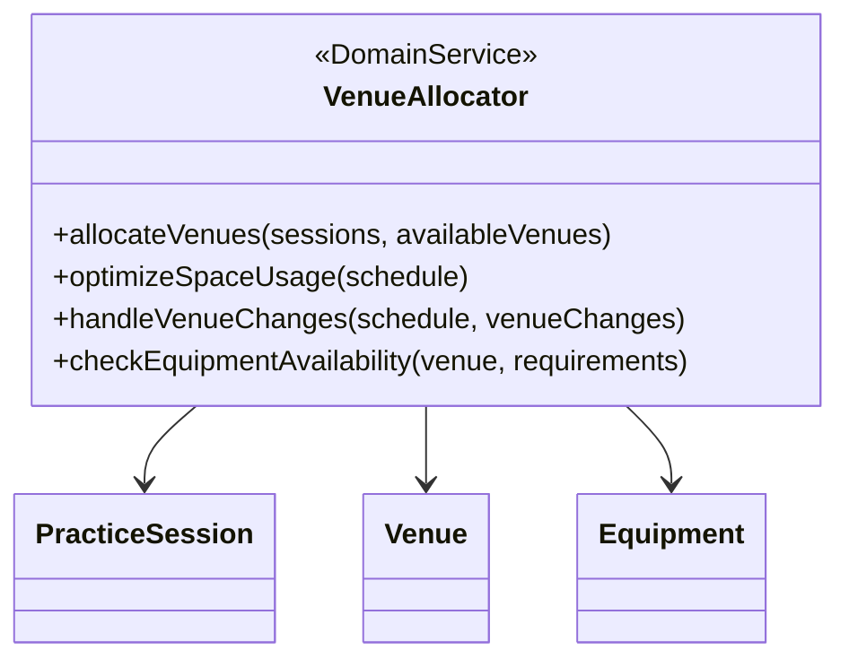

**責務**:
- 練習セッションに最適な会場を割り当てる
- 会場スペースの効率的な利用を最適化する
- 会場変更に対応したスケジュール調整を行う
- 必要設備の可用性をチェックする

**主要メソッド**:

1. `allocateVenues(sessions, availableVenues)`
   - 入力: 練習セッションリスト、利用可能会場リスト
   - 処理: 各セッションに最適な会場を割り当て
   - 出力: 会場割り当て済みセッションリスト

2. `optimizeSpaceUsage(schedule)`
   - 入力: スケジュール
   - 処理: 空間利用効率を最大化するよう会場割り当てを調整
   - 出力: 最適化されたスケジュール

3. `handleVenueChanges(schedule, venueChanges)`
   - 入力: スケジュール、会場変更情報
   - 処理: 会場変更に伴う影響を最小化する調整を実施
   - 出力: 調整済みスケジュール

4. `checkEquipmentAvailability(venue, requirements)`
   - 入力: 会場、設備要件
   - 処理: 必要設備の可用性チェック
   - 出力: 適合性評価

**依存**:
- VenueRepository
- EquipmentRepository
- PracticeSessionRepository

## Member BC（メンバー管理コンテキスト）

### MemberBalancer（メンバーバランサー）

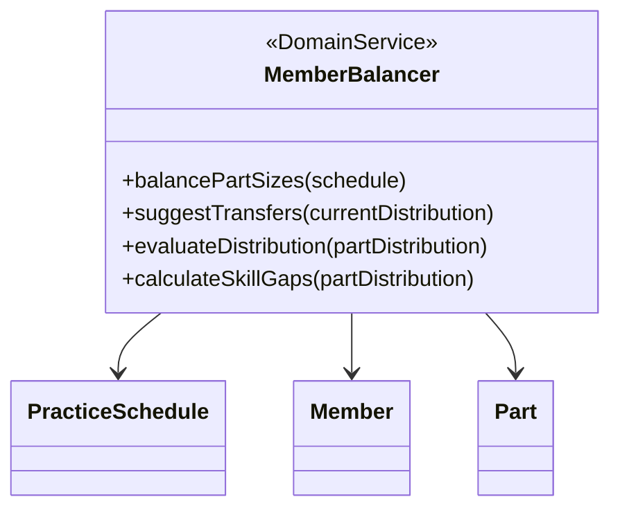

**責務**:
- パート間のメンバー数バランスを調整する
- メンバーの最適な移動を提案する
- 分布の均衡性を評価する
- スキルギャップを分析する

**主要メソッド**:

1. `balancePartSizes(schedule)`
   - 入力: スケジュール
   - 処理: パート間の人数バランスを調整
   - 出力: バランス調整済みスケジュール

2. `suggestTransfers(currentDistribution)`
   - 入力: 現在のパート分布
   - 処理: 最適なメンバー移動パターンを計算
   - 出力: メンバー移動提案リスト

3. `evaluateDistribution(partDistribution)`
   - 入力: パート分布
   - 処理: 分布の均衡性をスコア化
   - 出力: バランススコア

4. `calculateSkillGaps(partDistribution)`
   - 入力: パート分布
   - 処理: 各パートのスキル分布とギャップを分析
   - 出力: スキルギャップ分析結果

**依存**:
- MemberRepository
- PartRepository
- PracticeScheduleRepository

## Publishing BC（公開コンテキスト）

### PDFExporter（PDF出力サービス）

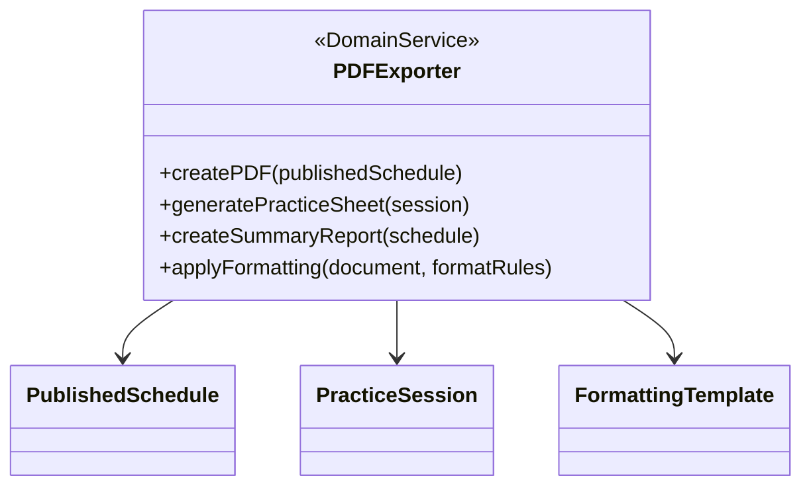

**責務**:
- スケジュールのPDF形式への変換
- 練習シートの生成
- サマリーレポートの作成
- 書式設定の適用

**主要メソッド**:

1. `createPDF(publishedSchedule)`
   - 入力: 公開スケジュール
   - 処理: PDF形式へのレンダリング
   - 出力: PDFデータ

2. `generatePracticeSheet(session)`
   - 入力: 練習セッション
   - 処理: 詳細な練習シートの生成
   - 出力: 練習シートデータ

3. `createSummaryReport(schedule)`
   - 入力: スケジュール
   - 処理: 全体サマリーの作成
   - 出力: サマリーデータ

4. `applyFormatting(document, formatRules)`
   - 入力: ドキュメント、書式ルール
   - 処理: 書式の適用
   - 出力: 書式適用済みドキュメント

**依存**:
- PublishedScheduleRepository
- FormattingTemplateRepository

### VersionManager（バージョン管理サービス）

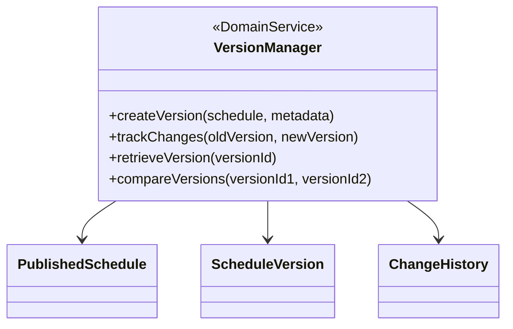

**責務**:
- 公開スケジュールのバージョン管理
- 変更履歴の追跡
- 過去バージョンの取得
- バージョン間の比較

**主要メソッド**:

1. `createVersion(schedule, metadata)`
   - 入力: スケジュール、メタデータ
   - 処理: 新バージョンの作成
   - 出力: バージョン情報

2. `trackChanges(oldVersion, newVersion)`
   - 入力: 旧バージョン、新バージョン
   - 処理: 変更点の検出と記録
   - 出力: 変更履歴

3. `retrieveVersion(versionId)`
   - 入力: バージョンID
   - 処理: 指定バージョンの取得
   - 出力: バージョンデータ

4. `compareVersions(versionId1, versionId2)`
   - 入力: 比較対象バージョンIDs
   - 処理: 差分の抽出
   - 出力: 差分情報

**依存**:
- PublishedScheduleRepository
- VersionRepository
- ChangeHistoryRepository

## Notification BC（通知コンテキスト）

### NotificationService（通知サービス）

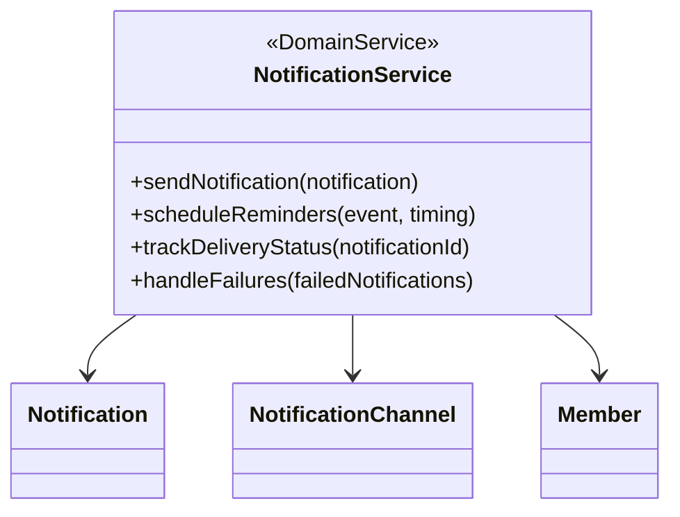

**責務**:
- 通知の送信管理
- リマインダーのスケジューリング
- 配信状況の追跡
- 失敗した通知の処理

**主要メソッド**:

1. `sendNotification(notification)`
   - 入力: 通知オブジェクト
   - 処理: 適切なチャネルを通じて送信
   - 出力: 送信結果

2. `scheduleReminders(event, timing)`
   - 入力: イベント情報、タイミング設定
   - 処理: リマインダーをスケジュール
   - 出力: スケジュール結果

3. `trackDeliveryStatus(notificationId)`
   - 入力: 通知ID
   - 処理: 配信状況の追跡
   - 出力: 配信ステータス

4. `handleFailures(failedNotifications)`
   - 入力: 失敗した通知リスト
   - 処理: 再送や代替チャネルでの送信
   - 出力: 処理結果

**依存**:
- NotificationRepository
- NotificationChannelRepository
- MemberRepository

## システム全体のサービス

### PermissionEnforcer（権限管理サービス）

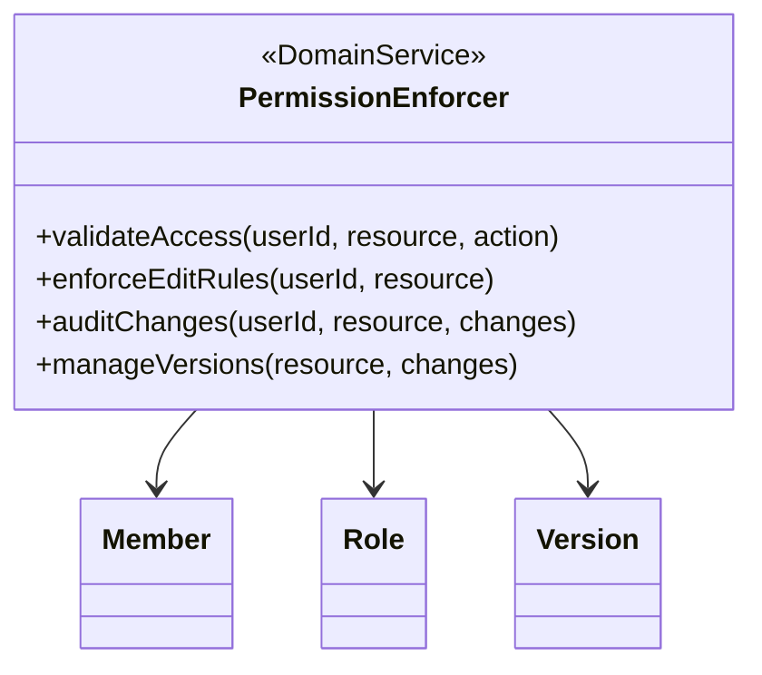

**責務**:
- アクセス権限のバリデーションを行う
- 編集ルールを適用する
- 変更履歴を監査する
- バージョン管理を行う

**主要メソッド**:

1. `validateAccess(userId, resource, action)`
   - 入力: ユーザーID、リソース、アクション
   - 処理: 指定アクションの権限を確認
   - 出力: アクセス許可/拒否結果

2. `enforceEditRules(userId, resource)`
   - 入力: ユーザーID、リソース
   - 処理: 編集可能性とルールをチェック
   - 出力: 編集許可/拒否結果

3. `auditChanges(userId, resource, changes)`
   - 入力: ユーザーID、リソース、変更内容
   - 処理: 変更履歴を記録
   - 出力: 監査ログエントリ

4. `manageVersions(resource, changes)`
   - 入力: リソース、変更内容
   - 処理: バージョン番号更新と履歴保存
   - 出力: 新バージョン情報

**依存**:
- MemberRepository
- RoleRepository
- VersionRepository 