# 練習表自動生成システム 設計書：アプリケーション層

## アプリケーション層の概要

アプリケーション層は、ユーザーの意図をドメイン層の機能に変換し、ユーザーインターフェースとドメインモデル間の仲介を行う層です。本システムでのアプリケーション層の主な役割は以下の通りです：

1. **ユースケースの実装**
   - 要件定義から導出されたユースケースを実現する
   - トランザクション境界の定義とアプリケーションサービスの提供

2. **ドメインサービスのオーケストレーション**
   - 複数のドメインサービスを連携させた処理フローの制御
   - 各バウンデッドコンテキスト間の連携の仲介

3. **入出力変換**
   - 外部インターフェース（API/UI）からの入力をドメインモデルに変換
   - ドメインモデルの出力を表示用データに変換（DTOマッピング）

4. **横断的関心事の処理**
   - 認証・認可の実施
   - ロギング
   - エラーハンドリング

## バウンデッドコンテキストとアプリケーションサービス

本システムのアプリケーションサービスは、バウンデッドコンテキスト構成に基づいて以下のように編成されます。

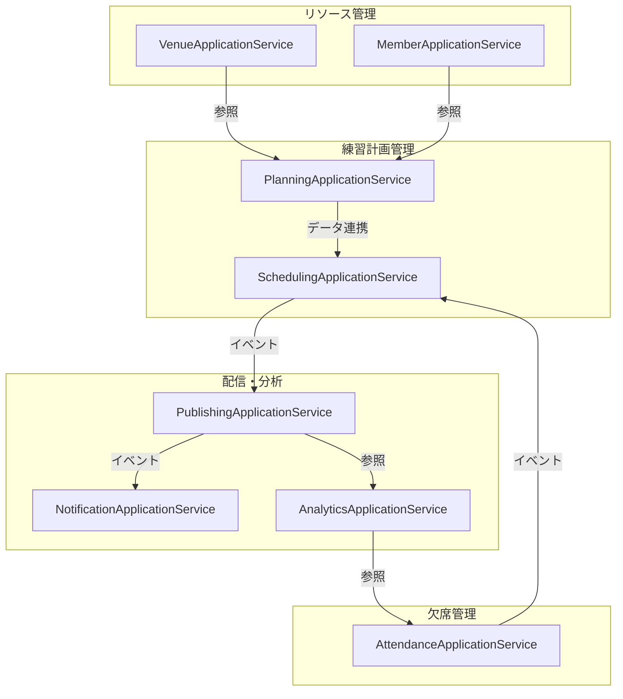

## ユースケース設計

本システムの主要ユースケースを以下に示します。各ユースケースは関連するバウンデッドコンテキストに対応します。

### 1. 練習計画管理ユースケース（Planning BC）

#### 1.1 CreateBasePlanUseCase（基本計画作成）

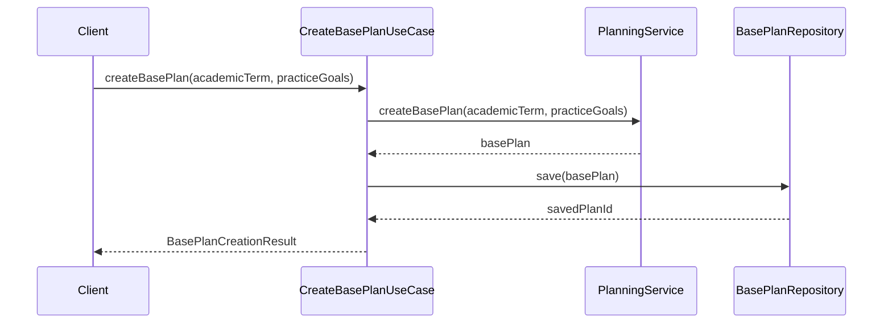

**入力**:
- `academicTerm`: 学期情報
- `practiceGoals`: 練習目標リスト

**処理**:
1. PlanningServiceを使用して基本計画を作成
2. 作成された計画をリポジトリに保存

**出力**:
- `BasePlanCreationResult`: 作成結果（計画ID、概要情報など）

#### 1.2 ManagePracticeTemplatesUseCase（練習テンプレート管理）

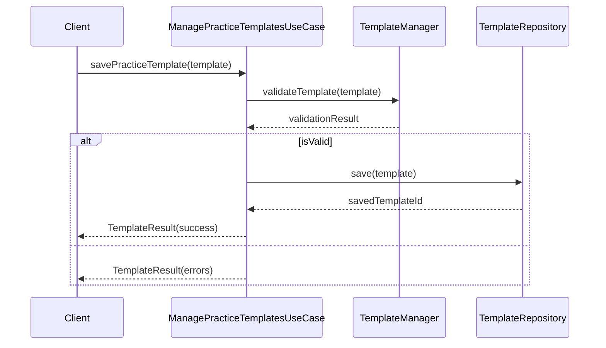

**入力**:
- `template`: 練習テンプレート情報

**処理**:
1. TemplateManagerによるテンプレート情報のバリデーション
2. バリデーション成功時、テンプレートをリポジトリに保存

**出力**:
- `TemplateResult`: 保存結果（成功/エラー情報）

### 2. スケジュール管理ユースケース（Scheduling BC）

#### 2.1 CreateDraftScheduleUseCase（練習表草案作成）

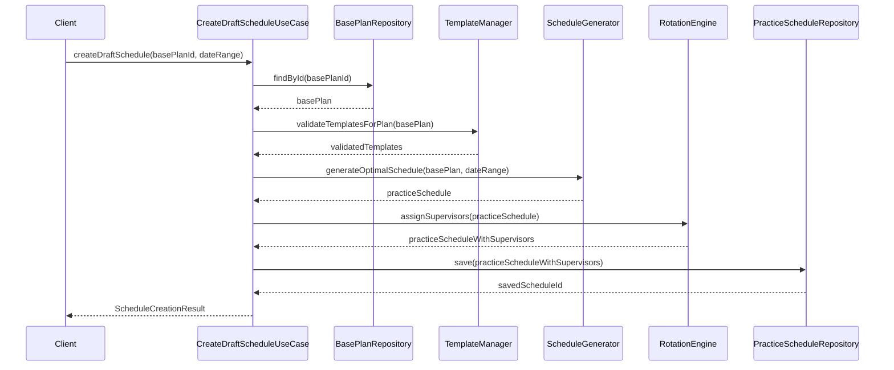

**入力**:
- `basePlanId`: 基本計画ID - PlanningBCから提供される練習計画の基本情報
- `dateRange`: 練習スケジュールの対象期間 - 開始日と終了日を含む

**処理**:
1. 基本計画の取得と検証
   - 指定されたIDの基本計画を取得
   - 計画に含まれるテンプレートの整合性をTemplateManagerで検証
2. スケジュール生成
   - 検証済みの基本計画と日程範囲を`ScheduleGenerator`に渡してスケジュールを生成
   - 基本計画に含まれるテンプレートと制約条件に基づいて最適なスケジュールを算出
3. 監督者割り当て
   - `RotationEngine`を使用して各セッションに適切な監督者を割り当て
   - 公平性と専門性を考慮した最適な監督者ローテーションを計算
4. 保存と結果返却
   - 生成されたスケジュールをリポジトリに保存（ステータス = Draft）
   - 最適化スコアや警告情報を含む結果をクライアントに返却

**出力**:
- `ScheduleCreationResult`: 生成結果
  - スケジュールID
  - 最適化スコア（0-100）
  - 警告メッセージ（存在する場合）
  - セッション概要統計（パート別セッション数など）

#### 2.2 UpdateScheduleUseCase（練習表更新）

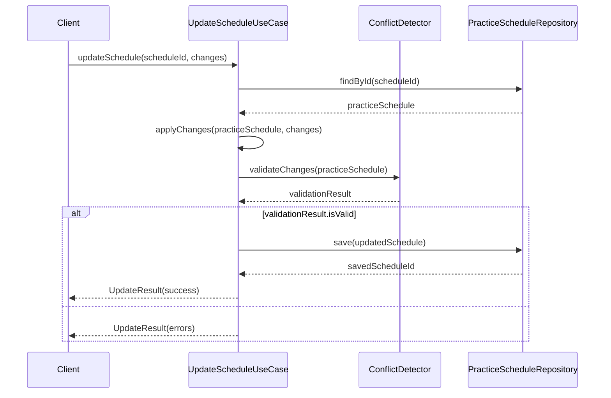

**入力**:
- `scheduleId`: 更新対象のスケジュールID
- `changes`: 変更内容（セッション追加/削除/変更など）

**処理**:
1. 対象スケジュールを取得
2. 変更を適用
3. `ConflictDetector`で変更内容の競合チェック
4. 問題がなければ保存

**出力**:
- `UpdateResult`: 更新結果（成功/エラー情報）

#### 2.3 HandleAbsenceEventUseCase（欠席イベント処理）

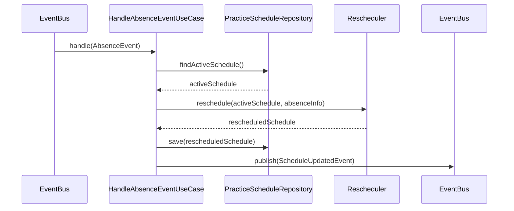

**入力**:
- `AbsenceEvent`: 欠席関連イベント（作成/承認/取消）

**処理**:
1. アクティブスケジュールの取得
2. `Rescheduler`で欠席に基づく再スケジューリング
3. 更新したスケジュールの保存
4. スケジュール更新イベントの発行

**出力**:
- `ScheduleUpdatedEvent`: スケジュール更新イベント

### 3. 欠席管理ユースケース（Attendance BC）

#### 3.1 SubmitAbsenceUseCase（欠席申請）

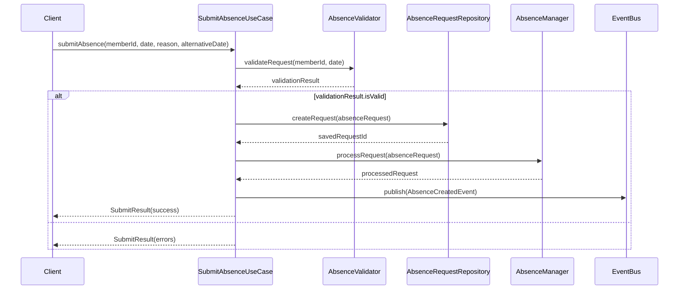

**入力**:
- `memberId`: 欠席申請者ID
- `date`: 欠席予定日
- `reason`: 欠席理由
- `alternativeDate`: 代替希望日（オプション）

**処理**:
1. 欠席申請のバリデーション（期限、重複チェックなど）
2. 申請を作成・保存
3. `AbsenceManager`で申請を処理
4. `AbsenceCreatedEvent`の発行

**出力**:
- `SubmitResult`: 申請結果（成功/エラー情報）

#### 3.2 ProcessAnalyticsInsightUseCase（分析洞察処理）

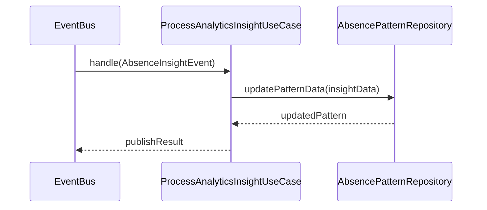

**入力**:
- `AbsenceInsightEvent`: 分析コンテキストからの洞察イベント

**処理**:
1. 洞察データの解析
2. 欠席パターンデータの更新
3. 必要に応じた対応策の提案

**出力**:
- 分析結果の反映状態

### 4. 公開管理ユースケース（Publishing BC）

#### 4.1 PublishScheduleUseCase（練習表公開）

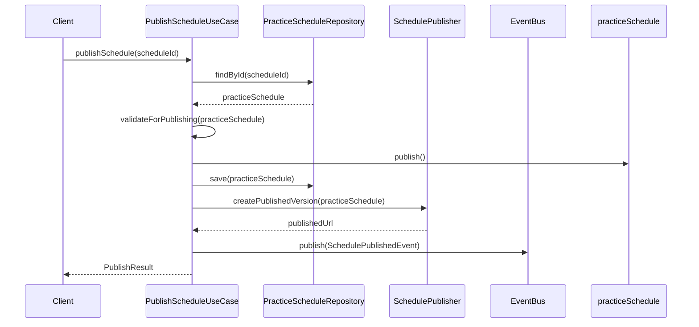

**入力**:
- `scheduleId`: 公開対象のスケジュールID

**処理**:
1. 対象スケジュールを取得
2. 公開可能かの最終チェック
3. ステータスを「Published」に変更
4. `SchedulePublisher`を使用してPDF生成などの公開処理
5. スケジュール公開イベントの発行

**出力**:
- `PublishResult`: 公開結果（URL、バージョン情報など）

#### 4.2 ManageVersionsUseCase（バージョン管理）

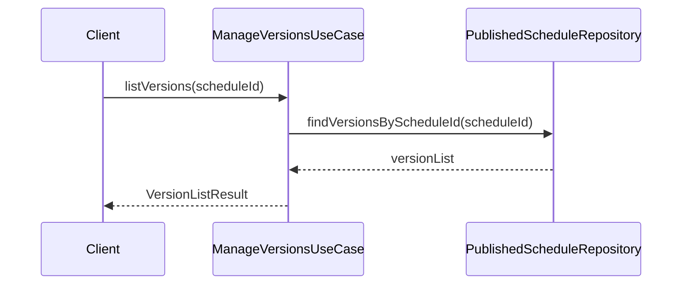

**入力**:
- `scheduleId`: 対象スケジュールID

**処理**:
1. スケジュールのバージョン履歴を取得
2. バージョン情報をDTOに変換

**出力**:
- `VersionListResult`: バージョン一覧

### 5. 通知管理ユースケース（Notification BC）

#### 5.1 SendNotificationUseCase（通知送信）

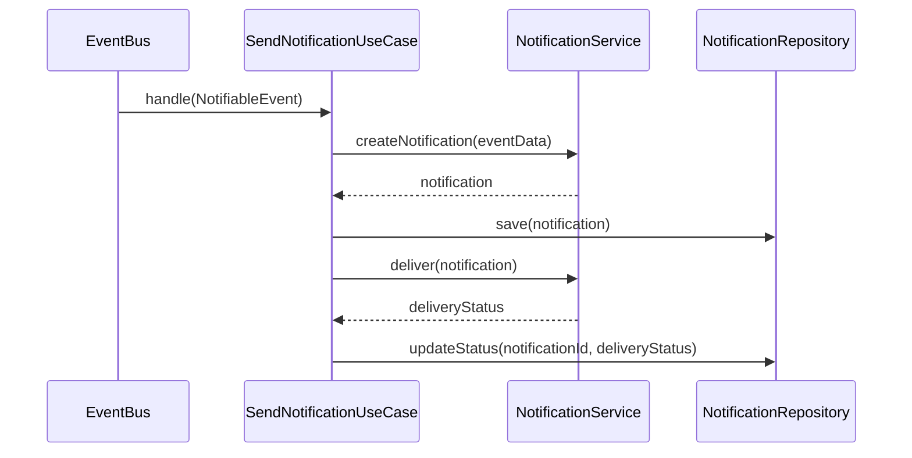

**入力**:
- `NotifiableEvent`: 通知対象イベント（スケジュール公開など）

**処理**:
1. 通知内容の作成
2. 通知エンティティの保存
3. 通知配信処理
4. 配信状態の更新

**出力**:
- 配信状態

#### 5.2 ManageNotificationSettingsUseCase（通知設定管理）

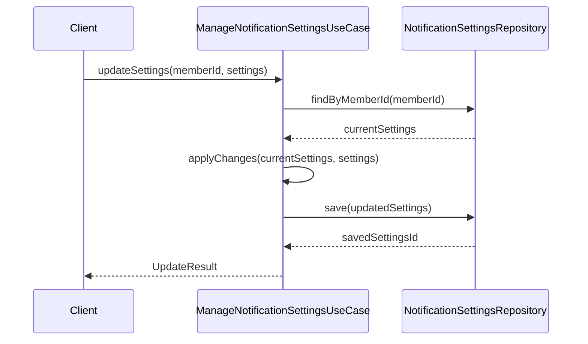

**入力**:
- `memberId`: 対象メンバーID
- `settings`: 通知設定

**処理**:
1. 現在の設定を取得
2. 設定変更を適用
3. 更新した設定を保存

**出力**:
- `UpdateResult`: 更新結果

### 6. 分析ユースケース（Analytics BC）

#### 6.1 GenerateAnalyticsReportUseCase（分析レポート生成）

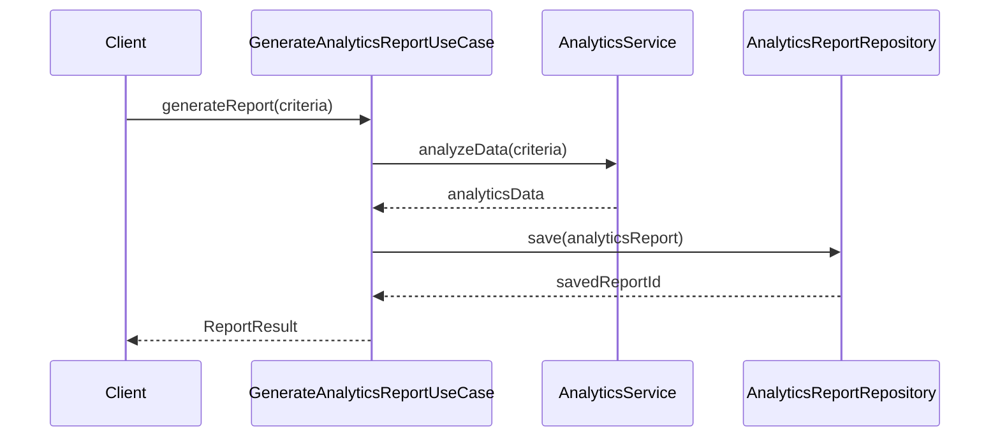

**入力**:
- `criteria`: 分析条件（期間、メトリクスなど）

**処理**:
1. 分析条件に基づくデータ分析
2. 分析レポートの作成・保存

**出力**:
- `ReportResult`: レポート結果（洞察、グラフデータなど）

#### 6.2 DetectAbsencePatternsUseCase（欠席パターン検出）

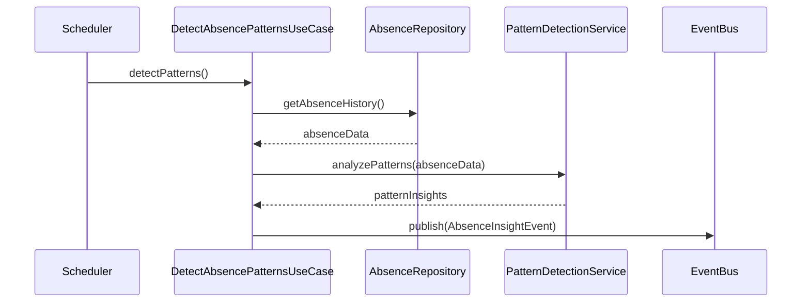

**入力**:
- 定期実行トリガー

**処理**:
1. 欠席履歴データの取得
2. パターン分析の実行
3. 洞察イベントの発行

**出力**:
- `AbsenceInsightEvent`: 欠席パターン洞察イベント

## サービス間連携パターン

アプリケーションサービス間の連携には以下のパターンを採用します。

### 1. イベント駆動型連携（発行-購読型）

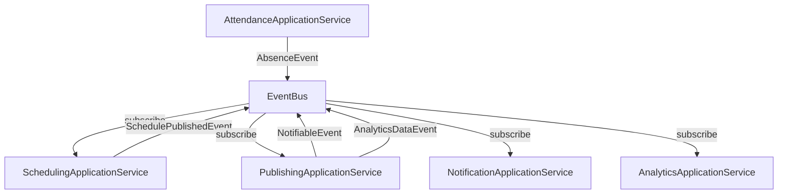

主なイベント:
- `AbsenceEvent`: 欠席関連イベント
- `SchedulePublishedEvent`: スケジュール公開イベント
- `NotifiableEvent`: 通知対象イベント
- `AnalyticsDataEvent`: 分析データイベント
- `AbsenceInsightEvent`: 欠席分析洞察イベント

### 2. 同期型サービス呼び出し（顧客-サプライヤー型、共有カーネル型）

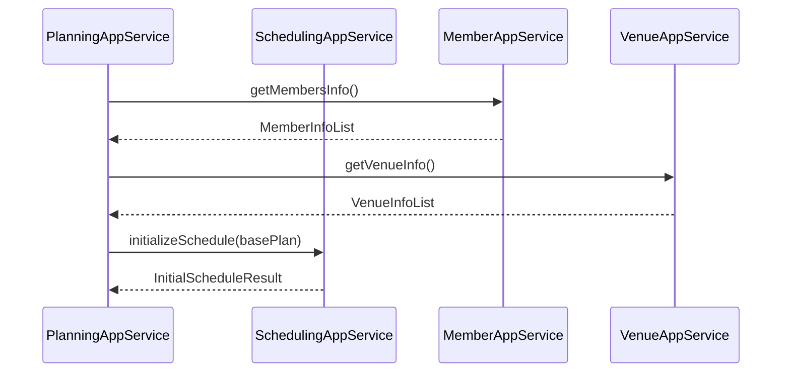

### 3. 準備-整合性Saga（長時間トランザクション）

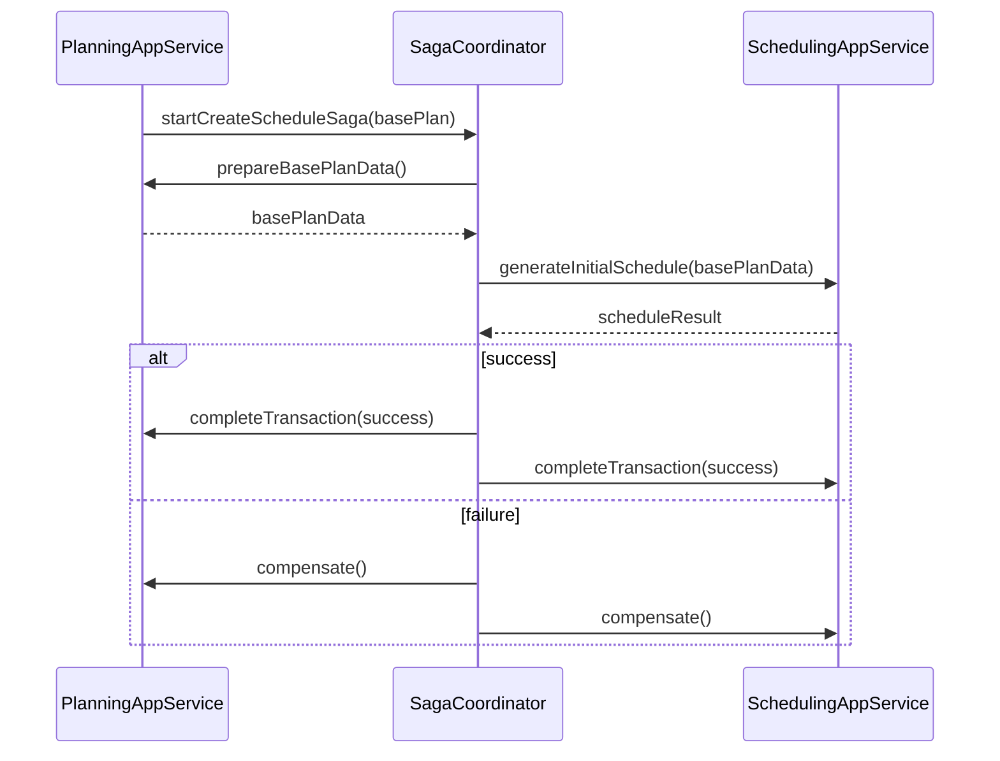

### 4. バッチ処理・非同期処理

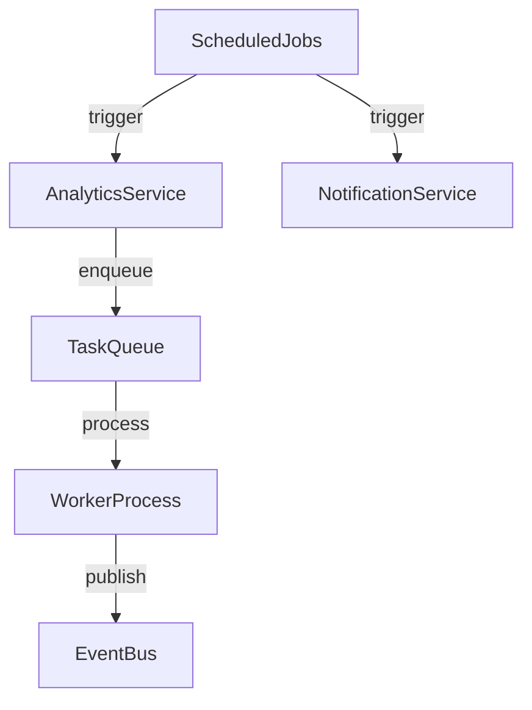

主な非同期処理:
- データ分析バッチ処理
- 通知配信処理
- スケジュール最適化処理
- レポート生成処理

## 入出力変換（DTOパターン）

外部インターフェースとドメインモデル間のデータ変換には、以下のDTOを使用します。

### 入力DTOs（リクエスト）

- `CreateBasePlanRequestDTO`: 基本計画作成リクエスト
- `CreateScheduleRequestDTO`: スケジュール作成リクエスト
- `AbsenceRequestDTO`: 欠席申請リクエスト
- `UpdateSessionRequestDTO`: セッション更新リクエスト
- `NotificationSettingsRequestDTO`: 通知設定リクエスト
- `AnalyticsRequestDTO`: 分析リクエスト

### 出力DTOs（レスポンス）

- `BasePlanResponseDTO`: 基本計画情報レスポンス
- `ScheduleResponseDTO`: スケジュール情報レスポンス
- `AbsenceResponseDTO`: 欠席情報レスポンス
- `SupervisionStatsResponseDTO`: 監督統計レスポンス
- `NotificationResponseDTO`: 通知情報レスポンス
- `AnalyticsReportResponseDTO`: 分析レポートレスポンス

## 例外処理

アプリケーション層では以下の例外ハンドリングを行います。

1. **ドメイン例外のラップ**:
   - `DomainValidationException` → `ApplicationValidationException`
   - `DomainEntityNotFoundException` → `ResourceNotFoundException`

2. **アプリケーション固有例外**:
   - `UnauthorizedAccessException`: 権限不足
   - `ConcurrentModificationException`: 同時更新の競合
   - `InvalidOperationException`: 操作の順序違反 