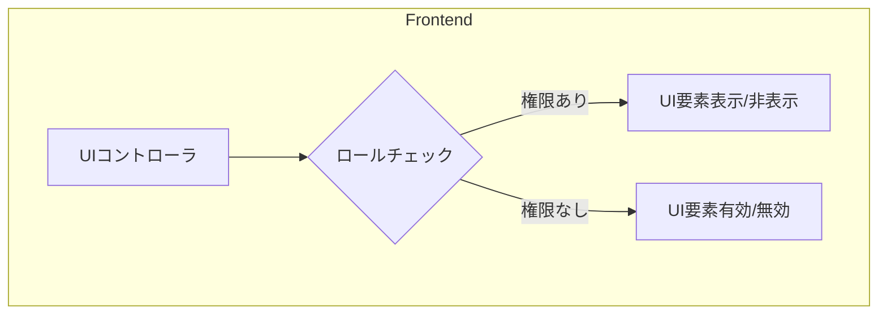
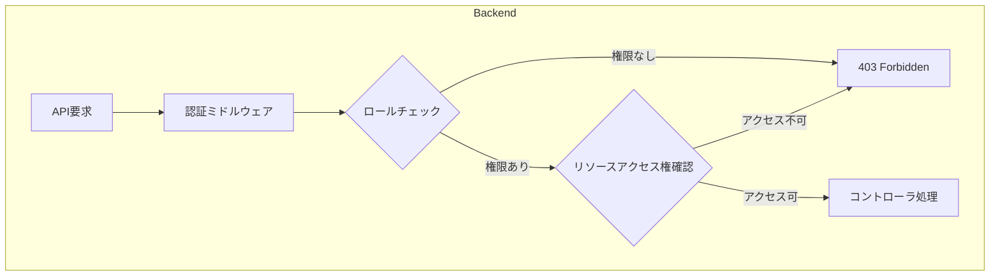
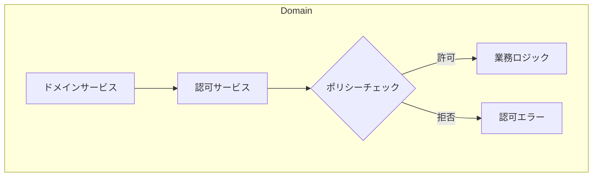
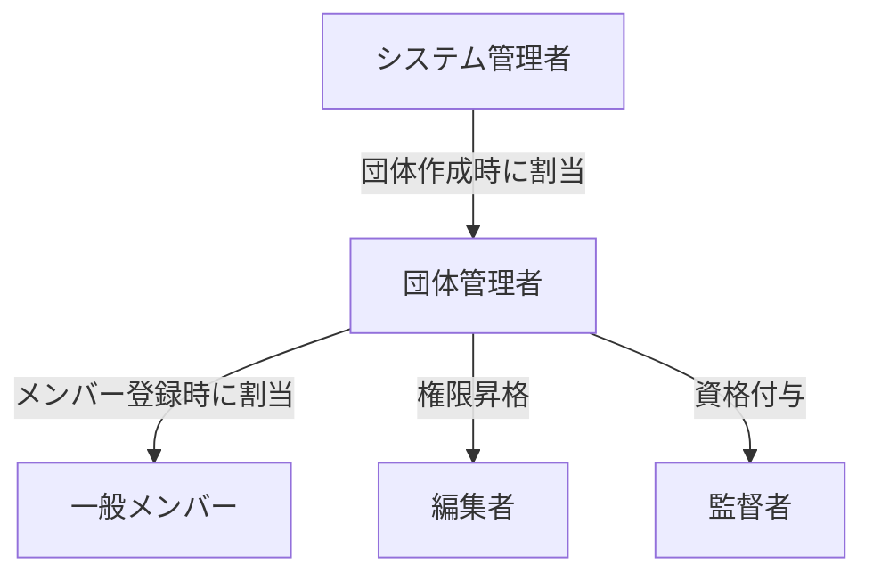
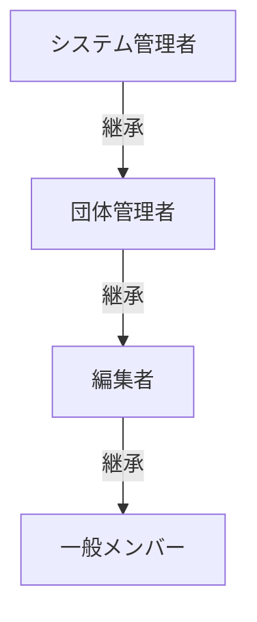
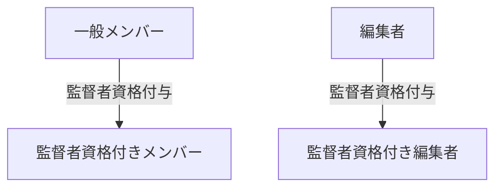

# 練習表自動生成システム 設計書：権限・ロール設計

本システムでは、機能へのアクセス制御と操作権限を明確に区分するため、ロールベースのアクセス制御（RBAC）を採用します。各ユーザーに適切なロールを割り当てることで、システム全体のセキュリティと使いやすさを両立させます。

## ロール定義

システムでは以下の5つの基本ロールを定義します。

### 1. システム管理者（System Administrator）

システム全体の管理権限を持つ最上位ロールです。

**主な特徴**:
- すべての機能へのフルアクセス
- ユーザー管理（追加・削除・ロール変更）
- マスターデータの管理
- システム設定の変更
- 監査ログの閲覧

### 2. 団体管理者（Organization Administrator）

特定の団体（オーケストラ、合唱団など）の管理権限を持つロールです。

**主な特徴**:
- 所属団体内のスケジュール管理（作成・編集・削除・公開）
- 所属団体内のメンバー管理（追加・編集・削除）
- 所属団体内の会場管理
- 欠席申請の承認・拒否
- レポート・統計情報の閲覧

### 3. 編集者（Editor）

スケジュールの作成と編集が可能なロールです。管理者からこの権限を付与されたユーザーが担当します。

**主な特徴**:
- スケジュールの作成・編集（公開権限なし）
- 監督者の割り当て・変更
- 会場の変更
- 欠席情報の閲覧
- 統計情報の閲覧

### 4. 監督者（Supervisor）

練習の監督を担当するメンバーに付与される特別な資格です。これは役割を示すフラグであり、他のロール（編集者や一般メンバー）と組み合わせて使用されます。

**主な特徴**:
- 監督担当セッションの詳細閲覧
- 監督結果の報告機能
- 自身の監督スケジュールの閲覧

### 5. 一般メンバー（Regular Member）

基本的な閲覧権限と自身の情報管理権限を持つ一般ユーザーです。

**主な特徴**:
- 公開されたスケジュールの閲覧
- 自身の練習予定の確認
- 欠席申請の提出・取消
- 自身のプロフィール情報の編集

## 権限マトリクス

各ロールが持つ具体的な権限を以下のマトリクスで定義します。

### スケジュール管理機能

| 機能 | システム管理者 | 団体管理者 | 編集者 | 一般メンバー |
|------|--------------|-----------|--------|------------|
| スケジュール閲覧 | ✓ | ✓ | ✓ | ✓（公開済のみ） |
| スケジュール作成 | ✓ | ✓ | ✓ | ✗ |
| スケジュール編集 | ✓ | ✓ | ✓ | ✗ |
| スケジュール削除 | ✓ | ✓ | ✗ | ✗ |
| スケジュール公開 | ✓ | ✓ | ✗ | ✗ |
| スケジュールPDF出力 | ✓ | ✓ | ✓ | ✓ |
| スケジュール複製 | ✓ | ✓ | ✓ | ✗ |

### セッション管理機能

| 機能 | システム管理者 | 団体管理者 | 編集者 | 一般メンバー |
|------|--------------|-----------|--------|------------|
| セッション閲覧 | ✓ | ✓ | ✓ | ✓（公開済のみ） |
| セッション追加 | ✓ | ✓ | ✓ | ✗ |
| セッション編集 | ✓ | ✓ | ✓ | ✗ |
| セッション削除 | ✓ | ✓ | ✓ | ✗ |
| セッション会場変更 | ✓ | ✓ | ✓ | ✗ |

### 欠席管理機能

| 機能 | システム管理者 | 団体管理者 | 編集者 | 一般メンバー |
|------|--------------|-----------|--------|------------|
| 欠席申請 | ✓ | ✓ | ✓ | ✓ |
| 欠席申請取消 | ✓ | ✓ | ✓ | ✓（自身のみ） |
| 欠席一覧閲覧 | ✓ | ✓ | ✓ | ✗ |
| 欠席申請承認/拒否 | ✓ | ✓ | ✗ | ✗ |
| 欠席統計閲覧 | ✓ | ✓ | ✓ | ✗ |
| 他者の欠席申請編集 | ✓ | ✓ | ✗ | ✗ |

### 監督者管理機能

| 機能 | システム管理者 | 団体管理者 | 編集者 | 一般メンバー |
|------|--------------|-----------|--------|------------|
| 監督者資格付与/剥奪 | ✓ | ✓ | ✗ | ✗ |
| 監督者割当 | ✓ | ✓ | ✓ | ✗ |
| 監督者統計閲覧 | ✓ | ✓ | ✓ | ✓（監督者のみ） |
| 監督結果報告 | ✓ | ✓ | ✓ | ✓（担当セッションのみ） |

### 会場管理機能

| 機能 | システム管理者 | 団体管理者 | 編集者 | 一般メンバー |
|------|--------------|-----------|--------|------------|
| 会場一覧閲覧 | ✓ | ✓ | ✓ | ✓ |
| 会場詳細閲覧 | ✓ | ✓ | ✓ | ✓ |
| 会場登録 | ✓ | ✓ | ✗ | ✗ |
| 会場編集 | ✓ | ✓ | ✗ | ✗ |
| 会場削除 | ✓ | ✓ | ✗ | ✗ |

### メンバー管理機能

| 機能 | システム管理者 | 団体管理者 | 編集者 | 一般メンバー |
|------|--------------|-----------|--------|------------|
| メンバー一覧閲覧 | ✓ | ✓ | ✓ | ✓ |
| メンバー詳細閲覧 | ✓ | ✓ | ✓ | ✓（限定情報） |
| メンバー登録 | ✓ | ✓ | ✗ | ✗ |
| メンバー編集 | ✓ | ✓ | ✗ | ✓（自身のみ） |
| メンバー削除 | ✓ | ✓ | ✗ | ✗ |
| ロール変更 | ✓ | ✓（編集者・一般のみ） | ✗ | ✗ |

### システム管理機能

| 機能 | システム管理者 | 団体管理者 | 編集者 | 一般メンバー |
|------|--------------|-----------|--------|------------|
| システム設定変更 | ✓ | ✗ | ✗ | ✗ |
| 団体追加/編集/削除 | ✓ | ✗ | ✗ | ✗ |
| 監査ログ閲覧 | ✓ | ✓（自団体のみ） | ✗ | ✗ |
| バックアップ/リストア | ✓ | ✗ | ✗ | ✗ |
| アルゴリズムパラメータ調整 | ✓ | ✓ | ✗ | ✗ |

## アクセス制御実装

アクセス制御は以下の3層で実装します：

### 1. フロントエンドでのUI制御

- 各UI要素（ボタン、メニュー項目、フォームなど）は、ユーザーのロールに基づいて表示/非表示や有効/無効が制御されます
- ユーザーのロールとアクセス権限はログイン時にクライアントに送信され、クライアント側でキャッシュされます
- ナビゲーションメニューやアクション要素は動的に構築され、権限のない機能へのアクセスを防止します

### 2. APIレベルでの認可制御

- すべてのAPI要求はJWTトークンによる認証を経て処理されます
- 認証後、要求されたエンドポイントに対する権限チェックが行われます
- ロールだけでなく、リソース所有権や組織関係なども考慮されます（例：自分の欠席申請のみ編集可能）
- 権限がない場合は403 Forbiddenエラーを返します

### 3. ドメインレベルでの権限チェック

- ドメインサービスレベルでも権限チェックを実装し、多層防御を実現します
- 複雑な権限ルール（例：監督者が自分の担当セッションのみ報告できる）は専用の認可サービスによって評価されます
- 認可サービスはポリシーベースの設計を採用し、柔軟な権限ルールの定義を可能にします

## ロール管理とトランジション

### ロールの割り当て

- システム管理者は新しい団体を作成し、その団体の管理者を指定できます
- 団体管理者はメンバーを登録し、そのロールを一般メンバーまたは編集者に設定できます
- 監督者資格は通常の権限ロールとは別に付与され、他のロールと組み合わせ可能です

### 権限の継承構造

- 上位ロールは下位ロールのすべての権限を継承します
- 団体管理者はシステム管理者の団体管理機能のみを継承し、システム管理機能は継承しません
- 編集者は一般メンバーの権限に加えて、スケジュール編集権限を持ちます

## 多要素認証（MFA）

高い権限を持つロールに対しては、セキュリティ強化のため多要素認証を実装します。

| ロール | MFA必須 |
|-------|--------|
| システム管理者 | ✓ |
| 団体管理者 | ✓ |
| 編集者 | オプション |
| 一般メンバー | オプション |

## 特殊権限の詳細設計

### 監督者資格

監督者資格は通常のロールとは異なり、任意のロールに付与できる特別な属性です。

- 監督者資格を持つメンバーは担当セッションの報告機能にアクセスできます
- 監督者資格とロールの組み合わせによって、行使できる権限が決まります（例：編集者+監督者は、監督者割当も可能）
- 監督者資格の付与・剥奪は団体管理者またはシステム管理者のみが行えます

### ゲストアクセス

公開情報へのゲストアクセスを実現するために、特別な閲覧専用権限を設けます。

| 機能 | ゲスト |
|------|-------|
| 公開スケジュール閲覧 | ✓（URLアクセスのみ） |
| メンバー情報閲覧 | ✗ |
| その他すべての機能 | ✗ |

- 特定のスケジュールは共有リンクを通じてゲストに公開可能です
- ゲストは認証なしで閲覧のみ可能です
- 共有リンクには有効期限を設定可能です

## 監査とコンプライアンス

権限変更やシステム変更などの重要な操作は監査ログに記録されます。

| 操作 | ログ記録 |
|------|---------|
| ログイン/ログアウト | ✓ |
| ロール変更 | ✓ |
| スケジュール公開 | ✓ |
| メンバー追加/削除 | ✓ |
| システム設定変更 | ✓ |
| 欠席承認/拒否 | ✓ |

監査ログには以下の情報が含まれます：
- 操作日時
- 操作ユーザー
- 操作種別
- 対象リソース
- 変更前/変更後の状態
- IPアドレス
- ユーザーエージェント

## 権限設計のポリシーと原則

本システムの権限設計には以下の原則を適用します：

1. **最小権限の原則**：ユーザーには必要最小限の権限のみを付与します
2. **職務分離**：重要な操作（作成と承認など）は異なるロールに分離します
3. **監査可能性**：権限変更を含むすべての重要な操作は監査ログに記録します
4. **明示的拒否**：明示的に許可されていない操作はすべて拒否します
5. **一貫性**：UIでできることとAPIでできることの権限は一致させます
6. **理解しやすさ**：権限構造はシンプルで直感的に理解できるものにします
7. **拡張性**：将来的な権限の追加や変更に対応できる柔軟な設計にします 