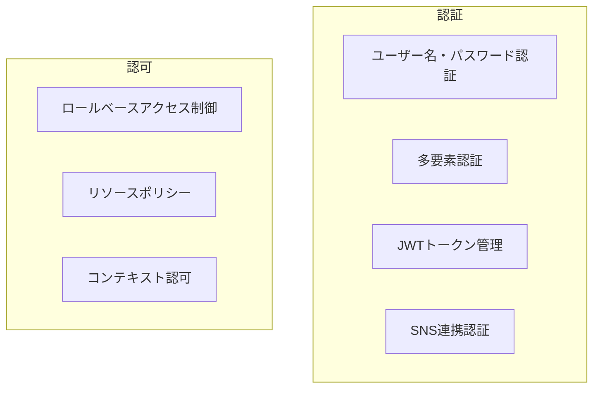
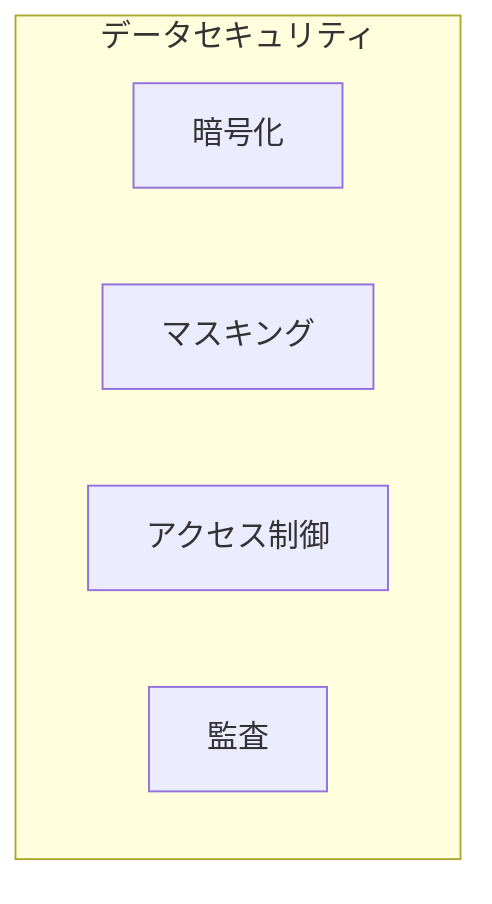
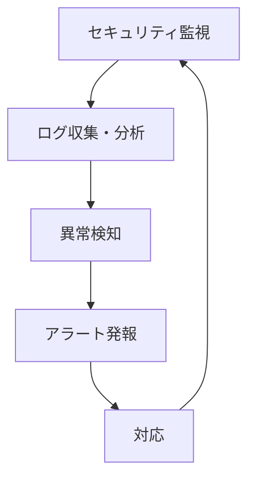
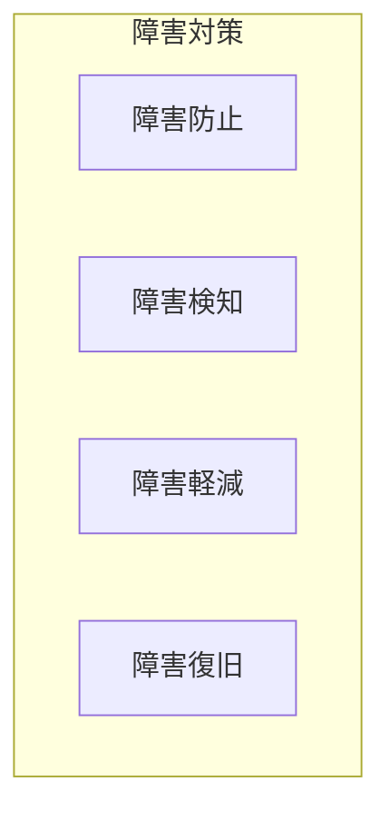
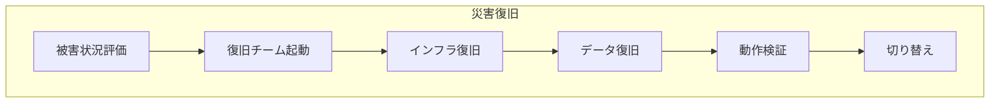

# 練習表自動生成システム 設計書：非機能要件対応（2/3）- セキュリティと可用性

## 3. セキュリティ要件

本システムでは、ユーザーデータとシステムを保護するために、以下のセキュリティ対策を実装します。

### 3.1 認証・認可

#### 3.1.1 認証設計

- **パスワードポリシー**：
  - 最小長：8文字
  - 複雑性：大文字・小文字・数字・特殊文字を含む
  - パスワード有効期間：180日
  - パスワード履歴：過去5回分の再利用禁止
  - アカウントロック：5回連続失敗で30分ロック

- **多要素認証（MFA）**：
  - 管理者ロールには必須、一般ユーザーはオプション
  - 認証手段：モバイルアプリ（TOTP）、SMS、メール

- **トークン管理**：
  - JWTを採用し、アクセストークンとリフレッシュトークンの2段階方式
  - アクセストークン有効期間：60分
  - リフレッシュトークン有効期間：14日
  - セッション無効化機能の実装

#### 3.1.2 認可設計

- **ロールベースアクセス制御（RBAC）**：
  - ロール階層：システム管理者 > 団体管理者 > 編集者 > 一般メンバー
  - 権限粒度の最適化（過度に細分化せず、理解しやすい設計）
  - 権限検証の多層化（UI制御・APIレベル・ドメインレベル）

- **リソースアクセスポリシー**：
  - スケジュールデータの所有権と共有範囲の厳密な制御
  - メンバー情報へのアクセス制限（必要な情報のみに限定）
  - 欠席データの閲覧権限の適切な設定

### 3.2 データ保護

#### 3.2.1 保存データの保護

- **データ暗号化**：
  - 個人識別情報（PII）の暗号化保存
  - データベース暗号化（TDE）の適用
  - バックアップデータの暗号化

- **機密データ分類**：

| データ分類 | 例 | 保護対策 |
|-----------|------|--------|
| 高機密 | パスワード、認証情報 | ハッシュ化（bcrypt）、保存なし |
| 機密 | メールアドレス、電話番号 | フィールドレベル暗号化 |
| 内部情報 | メンバー情報、スケジュール | ロールベースアクセス制御 |
| 公開情報 | 公開スケジュール | 制限なし |

- **データマスキング**：
  - ログやエラーメッセージでの機密情報マスキング
  - 不要な画面表示での個人情報部分マスキング

#### 3.2.2 通信データの保護

- **トランスポートセキュリティ**：
  - TLS 1.2以上の強制（HTTP Strict Transport Security）
  - 強力な暗号スイートの使用
  - 証明書更新の自動化

- **API通信セキュリティ**：
  - CORS設定の適切な構成
  - APIリクエスト署名の検証
  - レート制限によるDoS攻撃対策

### 3.3 脆弱性対策

本システムでは、OWASP Top 10の脆弱性対策を中心に、以下のセキュリティ対策を実装します。

#### 3.3.1 主要な脆弱性対策

| 脆弱性カテゴリ | 対策 |
|--------------|-----|
| インジェクション攻撃 | パラメータ化クエリ、ORM使用、入力バリデーション |
| 認証の不備 | 強力なパスワードポリシー、多要素認証、セッション管理 |
| 機密データ露出 | データ暗号化、TLS通信、機密データ最小化 |
| XML外部実体参照 | XMLパーサーの安全な設定、DTD無効化 |
| アクセス制御の不備 | 多層防御、最小権限原則、認可チェックの統一 |
| セキュリティ設定ミス | セキュアデフォルト設定、構成管理、自動チェック |
| XSS | 出力エンコーディング、CSP、フレームワークのセキュリティ機能活用 |
| 安全でないデシリアライゼーション | 信頼できるデータのみ処理、署名検証 |
| 既知の脆弱性のあるコンポーネント使用 | 依存関係管理、脆弱性スキャン、定期的更新 |
| 不十分なロギングと監視 | 包括的なログ収集、異常検知、アラート設定 |

#### 3.3.2 セキュアコーディング

- **フロントエンド**：
  - React等のフレームワークを活用したXSS対策
  - CSP（Content Security Policy）の適用
  - 入力値の厳格なバリデーション

- **バックエンド**：
  - パラメータ化クエリの使用
  - 入出力サニタイズの徹底
  - セキュリティヘッダの適切な設定

### 3.4 セキュリティ監視と対応

システムのセキュリティを継続的に監視し、脅威に迅速に対応するための体制を構築します。

- **ログ監視**：
  - 認証イベント（成功・失敗）の記録
  - 特権操作のログ取得
  - リソースアクセスのモニタリング

- **脅威検知**：
  - 異常ログイン試行の検出
  - 権限昇格の疑わしい操作検知
  - 大量データアクセスの監視

- **インシデント対応計画**：
  - セキュリティインシデント発生時の対応手順の文書化
  - 関係者の役割と責任の明確化
  - 復旧手順と報告プロセスの確立

### 3.5 セキュリティテスト計画

システムのセキュリティを検証するために、以下のテストを実施します。

| テスト種別 | 内容 | 頻度 |
|-----------|------|------|
| 静的アプリケーションセキュリティテスト | ソースコード解析によるセキュリティ脆弱性の検出 | CI/CD時 |
| 動的アプリケーションセキュリティテスト | 実行中アプリケーションの脆弱性検査 | リリース前 |
| 脆弱性スキャン | 既知の脆弱性に対するスキャン | 月次 |
| ペネトレーションテスト | 実際の攻撃を模した侵入テスト | 半年毎 |
| 依存関係チェック | 使用ライブラリの脆弱性確認 | CI/CD時 |

## 4. 可用性要件

本システムの可用性要件と対策について定義します。

### 4.1 可用性目標

| 指標 | 目標値 |
|------|-------|
| 稼働率 | 99.5%（月間最大3.6時間のダウンタイム許容） |
| 計画メンテナンス | 月1回（2時間以内、低負荷時間帯） |
| 障害復旧時間（RTO） | 4時間以内 |
| 障害時データ損失許容時間（RPO） | 24時間以内 |

### 4.2 障害対策

システムの可用性を確保するために、以下の障害対策を実施します。

#### 4.2.1 障害防止

- **環境の冗長化**：
  - Webサーバー/APサーバーの複数台構成
  - データベースのレプリケーション
  - 複数アベイラビリティゾーンの活用（クラウド環境）

- **構成管理**：
  - インフラのコード化（IaC）
  - デプロイ自動化によるヒューマンエラー防止
  - 開発・ステージング・本番環境の分離

#### 4.2.2 障害検知

- **ヘルスチェック**：
  - サーバー・サービスの定期的ヘルスモニタリング
  - エンドポイント別の死活監視
  - データベース接続状態の監視

- **メトリクス監視**：
  - CPU、メモリ、ディスク使用率の監視
  - ネットワークトラフィックの監視
  - キューの滞留状況監視

- **ログ分析**：
  - エラーログの継続的分析
  - パターン検知によるアノマリー検出
  - 自己診断ログの実装

#### 4.2.3 障害対応

- **システム保護**：
  - サーキットブレーカーパターンの実装
  - タイムアウト設定の最適化
  - グレースフルデグラデーション（機能縮退）対応

- **自動復旧**：
  - 障害サーバーの自動再起動
  - 読み取り操作のフェイルオーバー
  - バックアップからの自動リストア

### 4.3 バックアップと復元

データ保全と迅速な復旧を実現するためのバックアップ戦略を以下に定義します。

#### 4.3.1 バックアップ計画

| データ種別 | バックアップ頻度 | 保持期間 | 方式 |
|-----------|----------------|---------|------|
| データベース | 日次（フル） | 30日 | スナップショット |
|           | 1時間（増分） | 7日 | トランザクションログ |
| ファイル資産 | 日次 | 30日 | 差分バックアップ |
| 構成情報 | 変更時 | 10世代 | 構成管理リポジトリ |

- **バックアップ運用**：
  - バックアップジョブの自動化
  - バックアップ成功/失敗の通知
  - 定期的なリストアテスト

#### 4.3.2 災害復旧計画

- **災害復旧手順**：
  - 復旧優先順位の明確化
  - 役割分担と連絡体制の確立
  - 手順の文書化と定期的なリハーサル

- **復旧シナリオ**：
  - サーバー障害：新規サーバープロビジョニングと構成適用
  - データ破損：最新バックアップからのリストア
  - 広域災害：代替サイトでの復旧

### 4.4 運用監視

システムの正常動作を継続的に監視し、迅速な対応を可能にするための監視体制を確立します。

#### 4.4.1 監視レベル

| 監視レベル | 対象 | 監視内容 |
|-----------|------|---------|
| インフラ監視 | サーバー、ネットワーク | CPU、メモリ、ディスク、ネットワーク |
| ミドルウェア監視 | Webサーバー、DB、キャッシュ | 可用性、パフォーマンスメトリクス |
| アプリケーション監視 | APIエンドポイント、バッチ処理 | レスポンス時間、エラー率、スループット |
| ビジネス監視 | 重要業務プロセス | 完了率、処理時間、異常値 |

#### 4.4.2 アラート設定

| 重要度 | 通知方法 | 対応時間 |
|--------|---------|---------|
| 重大（P1） | メール、SMS、電話 | 即時（24時間365日） |
| 高（P2） | メール、SMS | 2時間以内（営業時間） |
| 中（P3） | メール | 24時間以内（営業日） |
| 低（P4） | ダッシュボード表示 | 次回メンテナンス時 |

- **アラート最適化**：
  - 誤検知の最小化
  - アラート疲れ防止のための閾値調整
  - 関連アラートのグルーピング

### 4.5 可用性テスト計画

システムの可用性を検証するために、以下のテストを実施します。

| テスト種別 | 目的 | 内容 |
|-----------|------|------|
| フェイルオーバーテスト | 冗長構成の検証 | 主系サーバーダウン時の自動切替確認 |
| 復旧テスト | バックアップからの復旧確認 | 定期的なリストア演習の実施 |
| カオステスト | 予期せぬ障害への耐性検証 | ランダムな障害注入による動作確認 |
| 負荷制限テスト | 過負荷時の動作検証 | リソース枯渇時のデグラデーション確認 | 