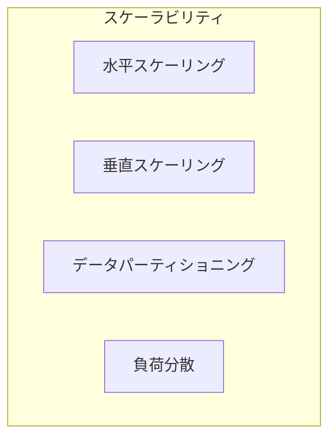
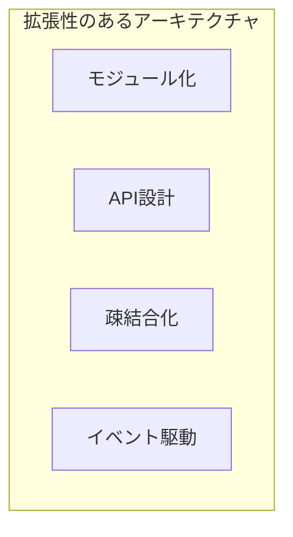
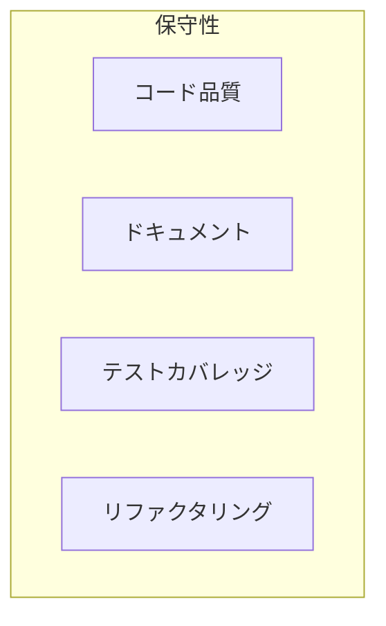
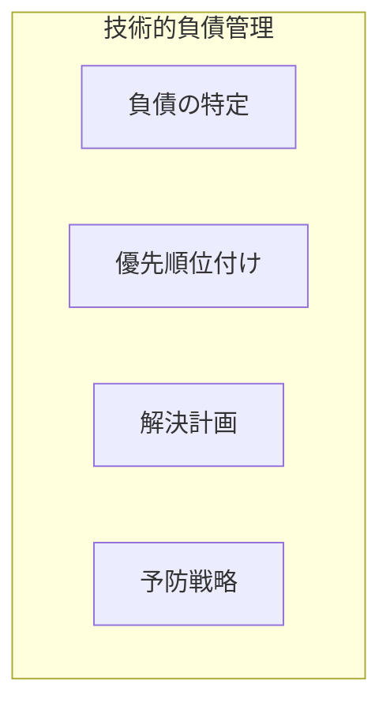
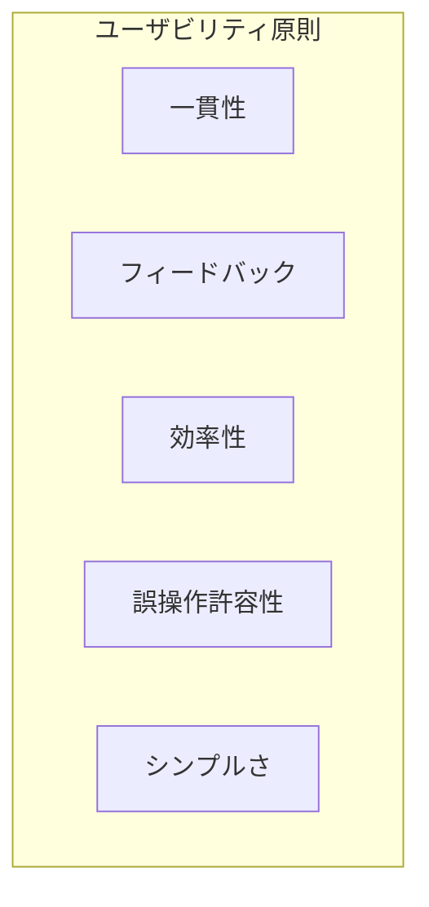
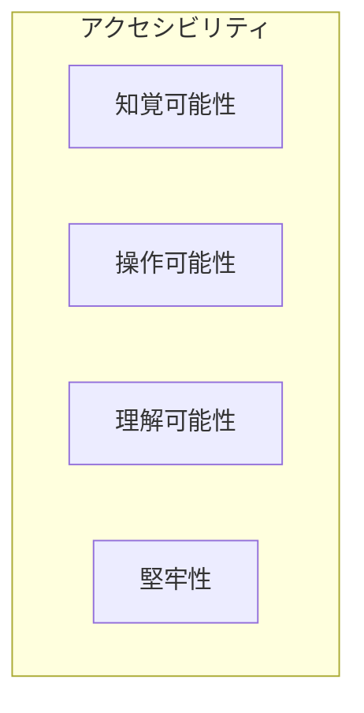
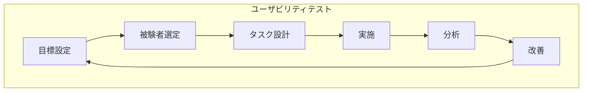
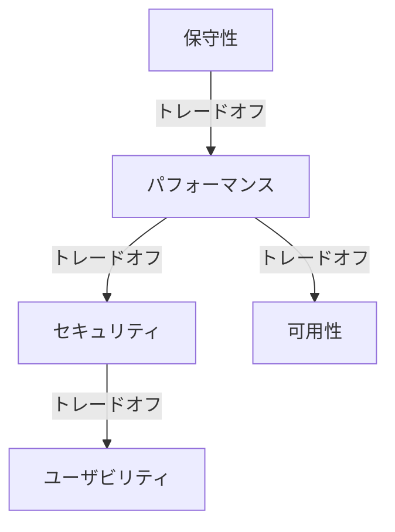
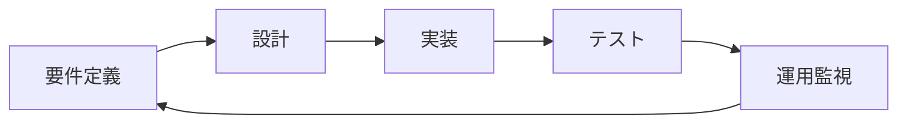
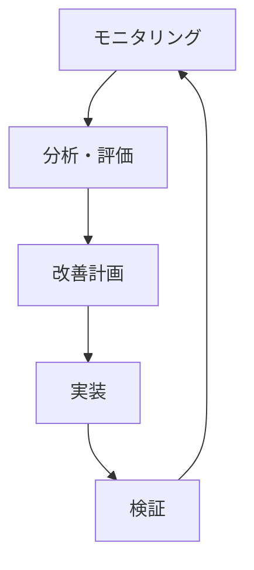

# 練習表自動生成システム 設計書：非機能要件対応（3/3）- 拡張性とユーザビリティ

## 5. 拡張性・保守性要件

本システムが長期にわたって利用され、機能拡張やメンテナンスが容易に行えるよう、拡張性と保守性に関する要件を定義します。

### 5.1 スケーラビリティ

将来的なユーザー数増加やデータ量増大に対応できる拡張性を確保します。

#### 5.1.1 インフラスケーリング

- **水平スケーリング対応**：
  - ステートレスなアプリケーション設計
  - サーバーインスタンスの動的追加に対応
  - セッション共有メカニズムの実装

- **垂直スケーリング対応**：
  - リソース拡張に伴う設定調整の自動化
  - スケールアップ時のダウンタイム最小化

- **スケーリングポリシー**：
  - CPU使用率80%超過時に自動スケールアウト
  - 夜間・週末など低負荷時間帯の自動スケールイン
  - スケジュール生成など高負荷処理用の専用インスタンス

#### 5.1.2 データベーススケーリング

- **読み取りスケーリング**：
  - 読み取り専用レプリカの活用
  - キャッシュ層の導入
  - クエリ分散による負荷分散

- **書き込みスケーリング**：
  - シャーディング戦略の検討
  - 非同期書き込みの活用
  - バッチ処理の最適化

#### 5.1.3 キャパシティプランニング

定期的なキャパシティレビューを行い、将来的なリソース要件を予測します。

| リソース | 初期状態 | 1年目予測 | 3年目予測 |
|---------|---------|-----------|----------|
| ユーザー数 | 300人 | 1,000人 | 5,000人 |
| 同時アクセス | 最大50人 | 最大200人 | 最大1,000人 |
| ストレージ | 50GB | 200GB | 1TB |
| データベーストランザクション | 1,000/日 | 5,000/日 | 20,000/日 |

### 5.2 拡張性の確保

将来的な機能追加やシステム連携を容易にするための拡張性を確保します。

#### 5.2.1 アーキテクチャの拡張性

- **モジュール化設計**：
  - 責務ごとに明確に分離されたモジュール構造
  - 再利用可能なコンポーネント設計
  - 依存関係の明確な管理（依存性の注入など）

- **APIファースト設計**：
  - 内部機能もAPIとして設計
  - バージョニング戦略の導入
  - 後方互換性の維持ポリシー

- **イベント駆動アーキテクチャ**：
  - 主要なビジネスイベントの定義
  - イベントバスを通じた非同期通信
  - 新機能追加時の既存コード変更最小化

#### 5.2.2 将来拡張対応

現時点で計画されている拡張や、将来的な拡張可能性に対応するための設計対応を行います。

| 拡張シナリオ | 対応策 |
|------------|-------|
| 複数団体対応 | マルチテナント設計、データ分離 |
| モバイルアプリ対応 | APIファースト、レスポンシブデザイン |
| 外部カレンダー連携 | 標準カレンダーフォーマット対応、連携API |
| 多言語対応 | 国際化（i18n）フレームワーク導入、文字列外部化 |
| AIによる最適化機能 | 拡張可能なアルゴリズムインターフェース設計 |

### 5.3 保守性

長期的な運用・保守を容易にするための設計を行います。

#### 5.3.1 コード品質とドキュメント

高い保守性を実現するためのコード品質とドキュメント整備を行います。

- **コーディング規約**：
  - 言語別コーディング規約の適用
  - コードレビュープロセスの確立
  - 静的解析ツールの導入

- **ドキュメント整備**：
  - アーキテクチャドキュメント
  - API仕様書（OpenAPI/Swagger）
  - データモデル図
  - 運用・障害対応マニュアル

- **テスト自動化**：
  - 単体テスト（カバレッジ目標：80%以上）
  - 統合テスト
  - エンドツーエンドテスト
  - 回帰テスト

#### 5.3.2 変更管理

システム変更を安全に実施するための変更管理プロセスを確立します。

- **バージョン管理**：
  - セマンティックバージョニングの採用
  - ブランチ戦略の明確化
  - マージ前レビュープロセス

- **デプロイ管理**：
  - CI/CDパイプラインの構築
  - ブルー/グリーンデプロイの検討
  - カナリアリリースの検討

- **構成管理**：
  - 環境ごとの設定の外部化
  - インフラのコード化（IaC）
  - シークレット管理の徹底

#### 5.3.3 監視・運用性

システム運用を効率化するための監視・運用体制を確立します。

- **運用効率化**：
  - 自己診断機能の実装
  - 集中管理ダッシュボードの提供
  - 自動化スクリプトの整備

- **ログ管理**：
  - 構造化ログの採用
  - ログレベルの適切な設定
  - ログ集約・検索基盤の導入

- **メトリクス収集**：
  - システムメトリクス（CPU、メモリなど）
  - アプリケーションメトリクス（レスポンス時間、エラー率など）
  - ビジネスメトリクス（ユーザー活動、機能利用率など）

### 5.4 技術的負債管理

システムの長期的な健全性を維持するための技術的負債管理を行います。

- **技術的負債の特定**：
  - コード品質メトリクスの定期的評価
  - パフォーマンスボトルネックの特定
  - 古くなったライブラリ・フレームワークの把握

- **技術的負債の優先順位付け**：
  - リスク評価に基づく優先順位付け
  - ビジネスインパクトの考慮
  - 解決の容易さと効果のバランス

- **リファクタリング計画**：
  - 四半期ごとのリファクタリングスプリント
  - 新機能開発との並行実施
  - 段階的な改善アプローチ

## 6. ユーザビリティ・アクセシビリティ要件

本システムは、さまざまなユーザーが効率的に操作できるよう、ユーザビリティとアクセシビリティに配慮した設計を行います。

### 6.1 ユーザビリティ設計原則

システム全体のユーザビリティを高めるために、以下の設計原則を適用します。

#### 6.1.1 一般的なユーザビリティ対応

- **一貫性の確保**：
  - デザインシステムの採用
  - 画面間での操作方法の統一
  - 用語・アイコンの標準化

- **フィードバックの提供**：
  - 操作結果の即時表示
  - 処理中の進捗表示
  - エラー時の明確なメッセージング

- **効率性の向上**：
  - よく使う機能へのショートカット
  - 入力の自動補完・候補表示
  - バルク操作の提供

- **誤操作に対する許容性**：
  - 操作取り消し機能
  - 確認ダイアログの適切な使用
  - 誤操作防止のUIデザイン

### 6.2 特定ユースケースのユーザビリティ強化

本システムの主要機能における特殊なユーザビリティ要件を定義します。

#### 6.2.1 スケジュール編集のユーザビリティ

スケジュール編集は本システムの中核機能であり、特に使いやすさを重視します。

- **ドラッグ＆ドロップ操作**：
  - セッションのドラッグによる移動
  - 時間枠の視覚的調整
  - 会場・パート間のドラッグ移動

- **視覚的フィードバック**：
  - 競合セッションの視覚的強調
  - 時間枠の自動スナップ
  - リアルタイムの変更反映

- **一括編集機能**：
  - 複数セッションの同時選択
  - パターンベースの一括生成
  - テンプレート活用

#### 6.2.2 モバイル利用のユーザビリティ

スマートフォンやタブレットでの利用を想定した設計を行います。

- **タッチ操作最適化**：
  - 適切なタップターゲットサイズ（最小44x44px）
  - スワイプジェスチャーの活用
  - ピンチズーム対応

- **モバイル向け特別UI**：
  - ボトムナビゲーション
  - フローティングアクションボタン
  - スケジュール表示の最適化

- **オフライン対応**：
  - 基本情報のオフラインキャッシュ
  - オフライン時の閲覧機能
  - 再接続時の自動同期

### 6.3 アクセシビリティ対応

さまざまな能力を持つユーザーが利用できるよう、アクセシビリティへの対応を行います。

#### 6.3.1 アクセシビリティ目標

WCAG 2.1のAA準拠を目標とし、以下の対応を行います。

- **知覚可能性**：
  - 画像の代替テキスト
  - 色だけに依存しない情報伝達
  - 十分なコントラスト比の確保
  - 文字サイズの調整可能性

- **操作可能性**：
  - キーボードのみでの操作
  - 十分な操作時間の確保
  - 発作を引き起こすコンテンツの回避
  - ナビゲーションのしやすさ

- **理解可能性**：
  - 読みやすさと可読性
  - 予測可能な操作と結果
  - 入力支援と誤り防止

- **堅牢性**：
  - 支援技術との互換性
  - 標準技術の使用

#### 6.3.2 具体的な実装対応

- **スクリーンリーダー対応**：
  - ARIA属性の適切な使用
  - 意味のあるHTML構造化
  - フォーカス順序の最適化

- **キーボード操作**：
  - ショートカットキーの実装
  - フォーカスインジケータの視認性確保
  - モーダル内でのフォーカストラップ

- **レスポンシブ対応**：
  - フレキシブルレイアウト
  - ビューポート制御
  - コンテンツの適応的変更

### 6.4 多言語・国際化対応

将来的な多言語対応を見据えた国際化対応を行います。

- **文字列リソースの外部化**：
  - すべての表示テキストをリソースファイルに分離
  - プレースホルダーの活用
  - 複数形対応

- **日時・数値表示**：
  - ロケールに応じた日付・時刻表示
  - 数値フォーマットの適応
  - タイムゾーン対応

- **レイアウト対応**：
  - 文字列長の変化に対応したレイアウト
  - 右から左へ（RTL）の言語への対応準備

### 6.5 ユーザビリティテスト計画

設計したユーザビリティが実際に効果的であるかを検証するためのテスト計画を策定します。

#### 6.5.1 テスト種別

| テスト種別 | 目的 | 手法 |
|-----------|------|------|
| フォーマティブテスト | 設計初期の問題発見 | ペーパープロトタイプ、クリック可能なモックアップ |
| サマティブテスト | 完成版の使いやすさ評価 | タスク達成テスト、満足度調査 |
| A/Bテスト | 設計の選択肢比較 | 2種類のデザインの比較実験 |
| アクセシビリティ評価 | アクセシビリティの検証 | チェックリスト評価、支援技術テスト |

#### 6.5.2 測定指標

- **効率性**：
  - タスク完了時間
  - クリック数・操作数
  - エラー発生回数

- **有効性**：
  - タスク成功率
  - エラー回復率
  - 学習曲線（繰り返し使用時の向上）

- **満足度**：
  - SUS（System Usability Scale）スコア
  - NPS（Net Promoter Score）
  - カスタム満足度アンケート

## 7. 非機能要件のトレードオフと優先順位

非機能要件間のトレードオフと優先順位付けを明確にし、設計判断の指針とします。

### 7.1 要件間のトレードオフ

主要なトレードオフと対応方針を以下に示します。

| トレードオフ | 対応方針 |
|------------|---------|
| パフォーマンス vs セキュリティ | セキュリティを優先しつつ、キャッシュ等でパフォーマンス確保 |
| 可用性 vs コスト | 初期はミディアムレベルの可用性を確保し、需要に応じて拡張 |
| ユーザビリティ vs 機能性 | コア機能の使いやすさを優先し、高度な機能はアドバンストモードで提供 |
| 拡張性 vs 単純性 | 将来の拡張に備えつつ、過剰な抽象化を避ける |

### 7.2 優先順位付け

本システムにおける非機能要件の優先順位を以下のように定めます。

| 優先順位 | 要件カテゴリ | 理由 |
|---------|------------|------|
| 1 | セキュリティ | 個人情報を扱うため最優先 |
| 2 | ユーザビリティ | 利用頻度が高く、ユーザー満足度に直結 |
| 3 | パフォーマンス | スケジュール生成は計算負荷が高い |
| 4 | 可用性 | 定期的なアクセス集中があるため重要 |
| 5 | 拡張性・保守性 | 長期運用を見据えた持続可能な設計 |

## 8. 非機能要件の検証計画

非機能要件が満たされていることを検証するための総合的な計画を定めます。

### 8.1 検証プロセス

各開発フェーズにおける非機能要件の検証アプローチを以下に示します。

| フェーズ | 検証方法 |
|---------|---------|
| 要件定義 | 要件の明確性、測定可能性、実現可能性の確認 |
| 設計 | アーキテクチャレビュー、設計パターンの評価 |
| 実装 | コードレビュー、静的解析、ユニットテスト |
| テスト | 性能テスト、セキュリティテスト、ユーザビリティテスト |
| 運用 | 継続的なモニタリング、定期的な評価 |

### 8.2 総合テスト計画

すべての非機能要件を網羅的に検証するための総合テスト計画を以下に示します。

| テストカテゴリ | 頻度 | 責任者 | 合格基準 |
|--------------|------|-------|---------|
| 性能テスト | リリース前、四半期ごと | 性能テスト担当 | レスポンス時間目標の達成 |
| セキュリティテスト | リリース前、半年ごと | セキュリティ担当 | 重大な脆弱性がないこと |
| 可用性テスト | リリース前、年次 | インフラ担当 | フェイルオーバーの正常動作 |
| ユーザビリティテスト | 主要機能開発時 | UI/UX担当 | SUSスコア70以上 |
| 負荷テスト | リリース前、大型イベント前 | 性能テスト担当 | 目標同時アクセス数の処理 |

### 8.3 継続的な改善プロセス

運用開始後も非機能要件の達成状況を継続的に評価し、改善を行うプロセスを確立します。

- **モニタリング**：実環境での非機能要件の達成状況を継続的に監視
- **分析・評価**：収集データの分析と要件達成度の評価
- **改善計画**：問題点や改善機会の特定と対策立案
- **実装**：改善策の実装
- **検証**：改善効果の検証

これにより、システムの品質を継続的に向上させ、変化するニーズや環境に適応します。 