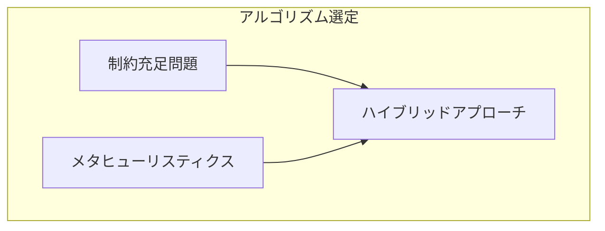
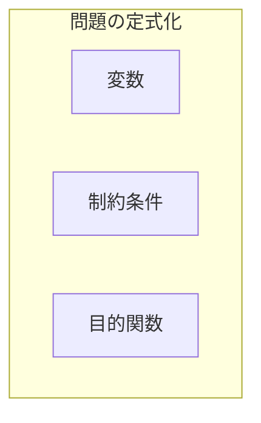
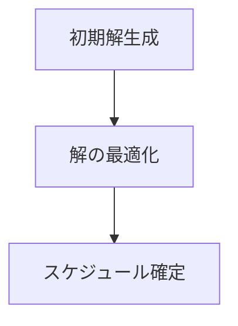
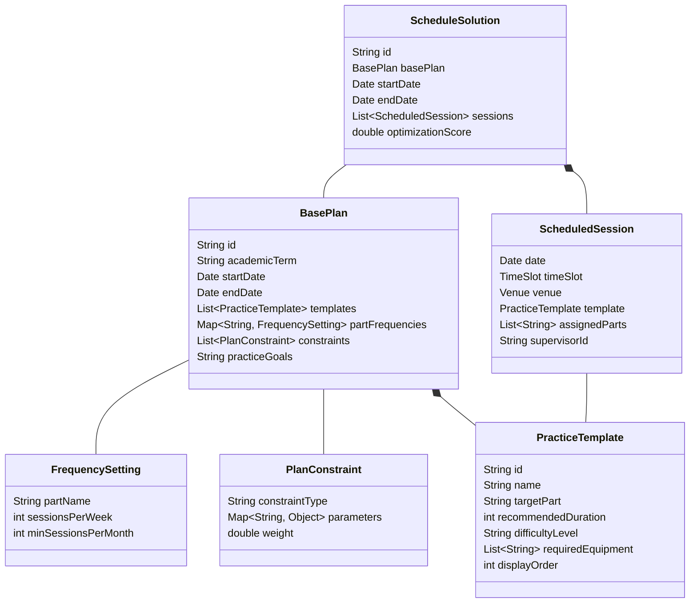
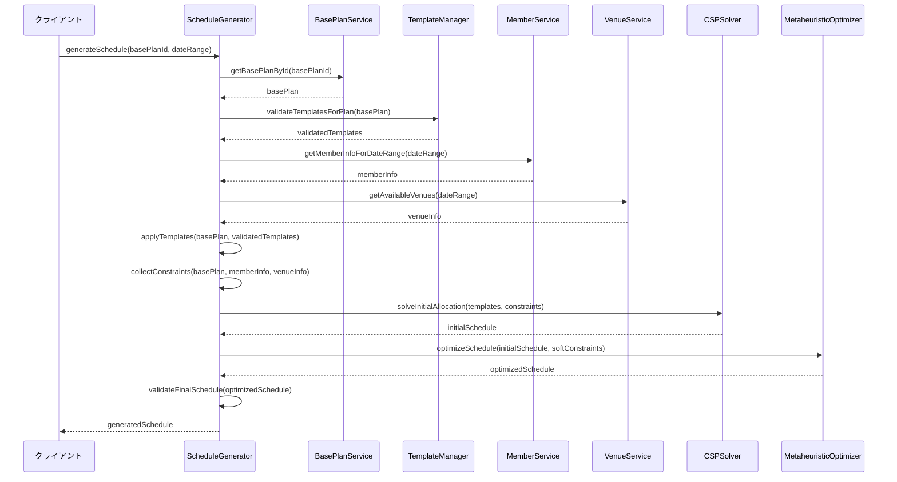
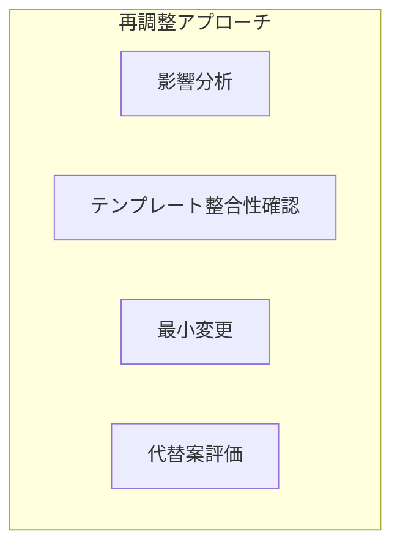
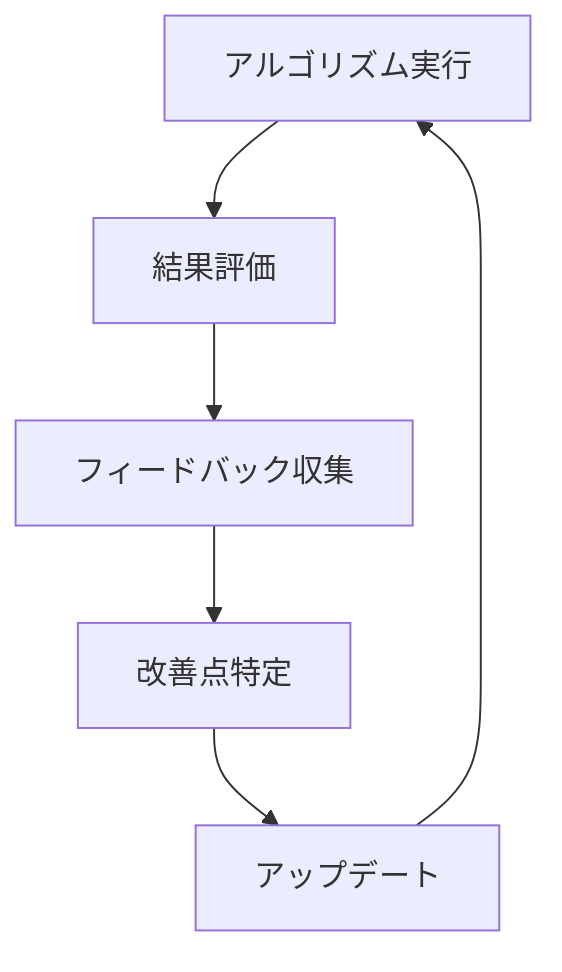

# 練習表自動生成システム 設計書：アルゴリズム詳細（1/2）- スケジュール生成

本書では、練習表自動生成システムの核となるアルゴリズムの詳細設計について記述します。特に、スケジュール生成アルゴリズムとローテーション最適化アルゴリズムに焦点を当てて説明します。

## 1. スケジュール生成アルゴリズム概要

スケジュール生成は本システムの中核機能です。メンバーの予定、会場の空き状況、パート間のバランスなどの制約条件を考慮しながら、最適な練習スケジュールを生成します。

### 1.1 アルゴリズムの目標

スケジュール生成アルゴリズムの主な目標は以下の通りです：

1. **実現可能性**：すべての制約条件（ハード制約）を満たすスケジュールを生成する
2. **最適性**：望ましい条件（ソフト制約）をできるだけ多く満たすスケジュールを生成する
3. **効率性**：現実的な時間内にスケジュールを生成する
4. **柔軟性**：優先度や制約条件の変更に対応できる設計とする

### 1.2 アルゴリズム選定

本システムでは、以下の理由から**制約充足問題（CSP）**と**メタヒューリスティクス**を組み合わせたハイブリッドアプローチを採用します：



| アルゴリズム | 長所 | 短所 | 適用範囲 |
|------------|-----|------|---------|
| 制約充足問題（CSP） | ハード制約を確実に満たす | 大規模問題での計算量 | ハード制約の充足 |
| 遺伝的アルゴリズム | 大域的最適解の探索 | 解の品質保証なし | 多目的最適化 |
| 焼きなまし法 | 局所解からの脱出 | パラメータ調整が必要 | 解の改善 |
| ヒューリスティックス | 計算効率が良い | 最適性の保証なし | 初期解生成 |

## 2. スケジュール生成のモデル化

### 2.1 問題の定式化

スケジュール生成問題を以下のように定式化します：



#### 2.1.1 決定変数

- $X_{ijkl}$：日付$i$、時間帯$j$、会場$k$、パート$l$のセッションが割り当てられるかどうか（1または0）
- $Y_{im}$：メンバー$m$が日付$i$のセッションに参加するかどうか（1または0）
- $Z_{ijk}$：日付$i$、時間帯$j$、会場$k$が使用されるかどうか（1または0）

#### 2.1.2 ハード制約

実現可能なスケジュールが満たすべき必須条件：

1. **会場容量制約**：各時間帯における会場の利用者数は会場の収容人数を超えない
   - $\sum_{l} \sum_{m} X_{ijkl} \cdot Y_{im} \leq Capacity_k \quad \forall i,j,k$

2. **会場利用可能時間制約**：会場が利用可能な時間帯のみスケジュールを組む
   - $X_{ijkl} \leq Availability_{ijk} \quad \forall i,j,k,l$

3. **同時刻重複回避制約**：同じメンバーが同じ時間に複数の場所にいることはできない
   - $\sum_{k} \sum_{l} X_{ijkl} \cdot Y_{im} \leq 1 \quad \forall i,j,m$

4. **最小参加人数制約**：各パートの最小必要人数を確保する
   - $\sum_{m} X_{ijkl} \cdot Y_{im} \cdot PartMember_{ml} \geq MinAttendance_l \quad \forall i,j,k,l$

5. **欠席メンバー考慮制約**：欠席届が提出されているメンバーはその日のスケジュールに含めない
   - $Y_{im} = 0 \quad \forall i,m \text{ where } Absence_{im} = 1$

#### 2.1.3 ソフト制約

スケジュールの質を高めるための望ましい条件：

1. **練習頻度均等性**：各パートの練習頻度をできるだけ均等にする
2. **メンバー参加率最大化**：できるだけ多くのメンバーが参加できるようにする
3. **会場利用効率最大化**：会場の無駄な空き時間を最小化する
4. **連続練習の最適化**：適切な間隔での練習セッションを配置する
5. **特別要望対応**：可能な限り特別な要望（特定の日の練習希望など）に対応する

#### 2.1.4 目的関数

ソフト制約の充足度を数値化した目的関数を最大化します：

$Maximize \quad w_1 \cdot PartFrequencyScore + w_2 \cdot MemberAttendanceScore + w_3 \cdot VenueUtilizationScore + w_4 \cdot ContinuityScore + w_5 \cdot SpecialRequestScore$

ここで、$w_1, w_2, \ldots, w_5$は各評価指標の重み係数です。

### 2.2 アルゴリズム設計

スケジュール生成アルゴリズムは以下の3段階で構成されます：



#### 2.2.1 初期解生成フェーズ

1. **テンプレートベースの初期割り当て**
   - 基本計画(BasePlan)の各テンプレートをスケジュール期間に適用
   - 各パートの練習頻度設定に基づいてテンプレートの適用回数を決定
   - 会場の優先順位とテンプレートの要件を考慮した初期配置

2. **制約ベース割り当て**
   - ハード制約を考慮して日程と会場を割り当て
   - テンプレートからの要件（パート、必要設備など）に基づく会場選択
   - メンバーの出席可能性を最大化する日程選択

3. **フィージビリティチェック**
   - 初期解がすべてのハード制約を満たしているか確認
   - パートの最小参加人数要件の検証
   - 会場の収容人数と利用可能性の確認
   - 満たしていない場合は、制約違反の最小化を目指した調整を行う

#### 2.2.2 解の最適化フェーズ

1. **テンプレート充足度最適化**
   - 各パートの練習テンプレートが適切に配置されているかを評価
   - テンプレート間の順序関係（前提条件など）を考慮した調整
   - 各パートの練習バランスを最適化

2. **メンバー参加率最適化**
   - メンバーの参加可能性スコアを最大化
   - 欠席申請を考慮した日程調整
   - 特定のメンバー（特に監督者資格保持者）の参加を優先

3. **会場効率最適化**
   - 会場の特性（収容人数、設備）とテンプレート要件のマッチング
   - 移動距離や時間帯の分散を考慮
   - 会場の利用効率を最大化

```python
# テンプレートベース初期解生成の疑似コード
def generate_template_based_initial_solution(base_plan, date_range, members, venues):
    """
    基本計画(BasePlan)のテンプレートに基づいて初期解を生成する
    
    Args:
        base_plan: 基本計画オブジェクト
        date_range: スケジュール対象期間
        members: メンバー情報
        venues: 会場情報
        
    Returns:
        初期スケジュール案
    """
    # 使用可能日の抽出
    available_dates = extract_available_dates(date_range)
    
    # テンプレートの抽出とパート別グループ化
    templates_by_part = group_templates_by_part(base_plan.templates)
    
    # パート別の練習頻度設定の取得
    practice_frequencies = base_plan.part_frequencies
    
    # 初期スケジュール
    initial_schedule = Schedule()
    
    # パートごとにテンプレートを割り当て
    for part, templates in templates_by_part.items():
        # このパートの理想的な練習回数
        target_sessions = calculate_target_sessions(practice_frequencies[part], date_range)
        
        # テンプレートの優先順位付け
        prioritized_templates = prioritize_templates(templates, base_plan.practice_goals)
        
        # テンプレートの割り当て
        assign_templates_to_dates(initial_schedule, prioritized_templates, 
                                 target_sessions, available_dates, venues, members)
    
    # 会場の重複チェックと調整
    resolve_venue_conflicts(initial_schedule, venues)
    
    # ハード制約チェック
    validate_hard_constraints(initial_schedule, members, venues)
    
    return initial_schedule
```

```python
# テンプレートベース最適化の疑似コード
def optimize_template_based_schedule(initial_schedule, base_plan, soft_constraints, max_iterations=1000):
    """
    テンプレートベースのスケジュールを最適化する
    
    Args:
        initial_schedule: 初期スケジュール
        base_plan: 基本計画
        soft_constraints: ソフト制約リスト
        max_iterations: 最大反復回数
        
    Returns:
        最適化されたスケジュール
    """
    current_solution = initial_schedule
    best_solution = initial_schedule
    current_score = evaluate_schedule(current_solution, base_plan, soft_constraints)
    best_score = current_score
    
    temperature = 100.0
    cooling_rate = 0.95
    
    for iteration in range(max_iterations):
        # 近傍操作を選択（テンプレート入れ替え、日程変更、会場変更など）
        operation = select_neighborhood_operation()
        
        # 近傍解の生成
        neighbor = apply_operation(current_solution, operation, base_plan)
        
        # ハード制約チェック
        if not is_feasible(neighbor):
            continue
        
        # ソフト制約評価
        neighbor_score = evaluate_schedule(neighbor, base_plan, soft_constraints)
        
        # 解の受理判定（シミュレーテッドアニーリング）
        delta = neighbor_score - current_scorem
        if delta > 0 or random() < exp(delta / temperature):
            current_solution = neighbor
            current_score = neighbor_score
            
            # 最良解の更新
            if current_score > best_score:
                best_solution = current_solution
                best_score = current_score
        
        # 温度の更新
        temperature *= cooling_rate
        
        # 多様性維持のための操作（必要に応じて）
        if iteration % 100 == 0:
            current_solution = diversify(current_solution, base_plan)
            current_score = evaluate_schedule(current_solution, base_plan, soft_constraints)
    
    return best_solution
```

#### 2.2.3 スケジュール確定フェーズ

1. **後処理最適化**
   - 細かな調整による最終的な品質向上
   - パート間バランスの微調整m
   - 連続する練習の間隔最適化

2. **実行可能性の最終確認**
   - すべてのハード制約が確実に満たされているか最終確認
   - 矛盾がある場合は修正または警告表示

3. **品質評価**
   - 生成されたスケジュールの品質スコアを計算
   - 各評価指標の詳細を可視化

### 2.3 アルゴリズムパラメータ

アルゴリズムの動作を調整するパラメータ：

| パラメータ | 説明 | デフォルト値 | 調整範囲 |
|-----------|------|-------------|---------|
| 初期温度 | シミュレーテッドアニーリングの初期温度 | 100.0 | 50.0-200.0 |
| 冷却率 | 温度の減少率 | 0.95 | 0.90-0.99 |
| 反復回数 | 最適化の反復回数 | 10000 | 5000-20000 |
| テンプレート適用重み | テンプレート適用の優先度 | 3.0 | 1.0-5.0 |
| メンバー参加重み | メンバー参加率の優先度 | 2.0 | 1.0-5.0 |
| 会場効率重み | 会場利用効率の優先度 | 1.0 | 0.5-3.0 |
| 連続性重み | 練習間隔の適切さの優先度 | 1.5 | 0.5-3.0 |
| 多様性維持間隔 | 多様化操作を行う反復間隔 | 100 | 50-200 |
| テンプレート類似度閾値 | 類似テンプレート判定の閾値 | 0.7 | 0.5-0.9 |
| 最小パート割り当て率 | 各パートへの最小割り当て率 | 0.8 | 0.6-1.0 |

### 2.4 データ構造とオブジェクトモデル

スケジュール生成アルゴリズムで使用する主要なデータ構造：



### 2.5 評価関数

スケジュールの品質を評価するための関数：

```python
def evaluate_schedule(schedule, base_plan, constraints):
    """
    スケジュールの品質を評価する
    
    Args:
        schedule: 評価対象のスケジュール
        base_plan: 基本計画
        constraints: 制約条件リスト
    
    Returns:
        総合評価スコア（0-100）
    """
    scores = {}
    
    # テンプレート適用度評価
    scores['template_coverage'] = evaluate_template_coverage(schedule, base_plan)
    
    # パート別練習バランス評価
    scores['part_balance'] = evaluate_part_balance(schedule, base_plan.partFrequencies)
    
    # メンバー参加率評価
    scores['member_attendance'] = evaluate_member_attendance(schedule)
    
    # 会場利用効率評価
    scores['venue_efficiency'] = evaluate_venue_efficiency(schedule)
    
    # 練習間隔の適切さ評価
    scores['practice_interval'] = evaluate_practice_intervals(schedule)
    
    # 特別要求充足度評価
    scores['special_requests'] = evaluate_special_requests(schedule, constraints)
    
    # 重み付き合計スコアの計算
    weights = {
        'template_coverage': 3.0,
        'part_balance': 2.0,
        'member_attendance': 2.0,
        'venue_efficiency': 1.0,
        'practice_interval': 1.5,
        'special_requests': 1.0
    }
    
    total_score = 0
    total_weight = sum(weights.values())
    
    for key, score in scores.items():
        total_score += score * weights.get(key, 1.0)
    
    # 0-100スケールに正規化
    normalized_score = (total_score / total_weight) * 100
    
    return min(100, max(0, normalized_score))
```

## 3. アルゴリズムの実装詳細

### 3.1 入力データ

スケジュール生成アルゴリズムは以下の入力データを受け取ります：

```mermaid
graph TD
    Input[入力データ]
    BasePlan[基本計画(BasePlan)]
    DateRange[日程範囲]
    Members[メンバー情報]
    Venues[会場情報]
    Constraints[制約条件]
    
    Input --> BasePlan
    Input --> DateRange
    Input --> Members
    Input --> Venues
    Input --> Constraints
    
    BasePlan --> Templates[練習テンプレート]
    BasePlan --> PlanConstraints[計画制約]
    BasePlan --> PracticeGoals[練習目標]
    BasePlan --> PartFrequencies[パート別練習頻度]
```

#### 3.1.1 基本計画（BasePlan）

- **学期情報**：対象となる学期（前期/後期/通年）
- **練習テンプレート**：各パート向けの練習内容テンプレート一覧
- **計画制約**：計画レベルでの制約条件（特定パートの練習頻度など）
- **練習目標**：達成すべき目標（発表会準備、基礎練習など）
- **パート別練習頻度設定**：各パートの理想的な練習頻度

#### 3.1.2 日程範囲

- **開始日**：スケジュールの開始日
- **終了日**：スケジュールの終了日
- **除外日**：スケジュールから除外する日（祝日、特定イベントなど）

#### 3.1.3 メンバー情報

- **メンバーリスト**：ID、名前、パート、監督者資格など
- **欠席予定**：事前に分かっている欠席情報
- **希望条件**：特定の希望（監督回数の制限など）

#### 3.1.4 会場情報

- **会場リスト**：ID、名前、収容人数、設備など
- **利用可能時間帯**：各会場の利用可能な時間帯
- **予約済み時間帯**：既に予約されている時間帯

#### 3.1.5 制約条件

- **ハード制約**：必ず満たすべき条件
- **ソフト制約**：できるだけ満たしたい条件
- **優先度設定**：条件間の優先順位

### 3.2 処理フロー

スケジュール生成の処理フローを以下に示します：



#### 3.2.1 処理ステップ詳細

1. **基本計画の取得と検証**
   - クライアントから基本計画IDと日程範囲を受け取る
   - 指定されたIDの基本計画を取得
   - 基本計画の整合性を確認（必要な情報が揃っているか）

2. **テンプレート検証と適用**
   - 基本計画に含まれるテンプレートの整合性をTemplateManagerで検証
   - 有効なテンプレートの抽出と優先順位付け
   - 日程範囲内での適用パターンの策定

3. **リソース情報の収集**
   - メンバー情報（欠席予定、パート情報など）の取得
   - 会場情報（利用可能時間、設備など）の取得
   - これらの情報と基本計画から制約条件を生成

4. **初期スケジュール割り当て**
   - CSPソルバーを使用してハード制約を満たす初期解を生成
   - テンプレートに基づいた日程・パート・会場の初期割り当て
   - 実現可能な初期解が見つからない場合は制約を緩和するか警告を表示

5. **スケジュール最適化**
   - メタヒューリスティクスアルゴリズムによる解の改善
   - ソフト制約の充足度を評価関数として使用
   - 指定された計算時間または収束条件まで最適化を実施

6. **最終検証と返却**
   - 生成されたスケジュールの最終確認
   - 問題点がある場合は警告情報を添付
   - 最適化スコアを計算
   - クライアントに結果を返却

## 4. 欠席情報を考慮したスケジュール再調整

既存の練習スケジュールに対して欠席情報が事後的に提出された場合、最小限の変更でスケジュールを再調整するアルゴリズムを設計します。

### 4.1 再調整のアプローチ



#### 4.1.1 影響分析

欠席情報が提出された際の影響を分析します：

1. **クリティカリティ評価**
   - 欠席するメンバーの役割重要度を評価
   - 監督者欠席の場合は優先度高で代替が必要
   - テンプレートの最小人数要件を下回る場合は再調整が必要
   - パート人数が最小人数を下回る場合は再調整が必要

2. **テンプレート整合性の確認**
   - 欠席による練習テンプレートの実行可能性の再評価
   - テンプレート間の依存関係を考慮した影響範囲特定
   - 代替テンプレートの候補抽出

3. **代替案の自動検討**
   - 欠席影響の少ないケース：変更なし
   - 監督者欠席：他の監督資格者で代替
   - テンプレート不整合：代替テンプレートへの置換
   - パート人数不足：他日への振替またはセッション調整

#### 4.1.2 再調整アルゴリズム

1. **最小変更原則**
   - できるだけ基本計画のテンプレート順序と内容を維持
   - できるだけ少ない変更で対応
   - 変更範囲を特定の日付・セッションに限定

2. **再調整手法**
   - **監督者再割当**：監督者が欠席する場合、別の監督資格者を割り当て
   - **テンプレート置換**：テンプレートの要件を満たせない場合、同等の代替テンプレートを適用
   - **セッション調整**：パート人数が不足する場合、練習内容を調整
   - **日程変更**：必要な場合のみ日程を変更（最終手段）

```python
# 再調整アルゴリズムの疑似コード
def reschedule_after_absences(schedule, base_plan, new_absences):
    """
    欠席情報に基づいてスケジュールを再調整する
    
    Args:
        schedule: 現在のスケジュール
        base_plan: 基本計画
        new_absences: 新規欠席情報
        
    Returns:
        再調整されたスケジュール、重大な問題リスト
    """
    adjusted_schedule = copy(schedule)
    critical_issues = []
    
    # 影響分析
    impact_assessment = assess_impact(schedule, base_plan, new_absences)
    
    # 影響の少ないケースはスキップ
    if impact_assessment.criticality == 'LOW':
        return adjusted_schedule, []
    
    # 監督者欠席の処理
    supervisor_absences = filter_supervisor_absences(new_absences)
    for absence in supervisor_absences:
        session = find_affected_session(adjusted_schedule, absence)
        alternative_supervisors = find_alternative_supervisors(session.date, base_plan)
        
        if alternative_supervisors:
            # 代替監督者の中から最適な人を選択（公平性、スキルを考慮）
            best_supervisor = select_best_supervisor(alternative_supervisors, adjusted_schedule)
            session.supervisor = best_supervisor
        else:
            # 代替監督者がいない場合の対応
            critical_issues.append(CriticalIssue(
                session=session,
                message="No alternative supervisor available",
                severity="HIGH"
            ))
    
    # テンプレート整合性の確認
    template_issues = validate_templates_with_absences(adjusted_schedule, base_plan, new_absences)
    for issue in template_issues:
        session = issue.session
        
        # 代替テンプレートが利用可能か確認
        alternative_templates = find_alternative_templates(
            session.template, 
            base_plan.templates,
            session.assignedParts
        )
        
        if alternative_templates:
            # 最適な代替テンプレートを選択
            best_template = select_best_template(alternative_templates, adjusted_schedule)
            session.template = best_template
        else:
            # セッションの調整（時間・内容の変更）
            adjusted = adjust_session_content(session, issue.part_shortages)
            
            if not adjusted:
                # 調整できない場合は重大な問題として記録
                critical_issues.append(CriticalIssue(
                    session=session,
                    message=f"Cannot maintain template integrity due to absences",
                    severity="MEDIUM"
                ))
    
    # パート人数不足の処理（テンプレート置換で解決できなかった場合）
    part_shortage_issues = identify_remaining_part_shortages(adjusted_schedule, new_absences)
    for issue in part_shortage_issues:
        part, date, session = issue.part, issue.date, issue.session
        
        # 他の日への振替が可能か検討
        alternative_dates = find_alternative_dates(adjusted_schedule, base_plan, part, session.template)
        
        if alternative_dates and can_reschedule(session, alternative_dates[0]):
            # 最適な代替日を選択して振替
            reschedule_to_alternative_date(adjusted_schedule, session, alternative_dates[0])
        else:
            # 対応策がない場合の対応
            critical_issues.append(CriticalIssue(
                session=session,
                message=f"Part {part} shortage on {date}, cannot reschedule",
                severity="MEDIUM"
            ))
    
    # 最終的なスケジュールの評価と整合性確認
    final_validation = validate_final_schedule(adjusted_schedule, base_plan)
    if not final_validation.is_valid:
        for issue in final_validation.issues:
            critical_issues.append(issue)
    
    return adjusted_schedule, critical_issues
```

### 4.2 変更の優先順位と意思決定

変更が必要な場合の優先順位と意思決定プロセス：

| 変更種別 | 優先順位 | 自動/手動 | 承認者 | テンプレート整合性 |
|---------|---------|----------|-------|-----------------|
| 監督者の再割当 | 最高 | 自動+通知 | 不要 | 維持 |
| テンプレートの置換 | 高 | 自動+通知 | 管理者通知 | 同等テンプレートに置換 |
| 練習内容の微調整 | 中 | 自動+承認 | 管理者 | 部分修正 |
| セッション時間の変更 | 中 | 提案+承認 | 管理者 | 縮小/拡大 |
| 日程の変更 | 低 | 提案+承認 | 管理者 | 維持 |
| セッションの中止 | 最低 | 手動 | 管理者 | 中止 |

### 4.3 再調整結果の評価

再調整されたスケジュールの品質を評価するための指標：

1. **変更量指標**：元のスケジュールからの変更量
   - 変更されたセッション数
   - テンプレート置換の度合い
   - 監督者変更の度合い

2. **テンプレート整合性指標**：基本計画のテンプレート構成との整合性
   - テンプレートの順序維持率
   - テンプレート間依存関係の保持率
   - パート別テンプレート網羅率

3. **影響範囲指標**：変更による影響を受けるメンバー数
   - 通知が必要なメンバー数
   - 予定変更が必要なメンバー数
   - パート別の影響度

4. **ソフト制約満足度**：再調整後のソフト制約の充足度
   - メンバー参加率
   - 監督者割り当て公平性
   - 会場利用効率

## 5. パフォーマンス最適化

スケジュール生成アルゴリズムの実行時間を最適化するための戦略：

### 5.1 計算量削減

1. **探索空間の絞り込み**
   - 明らかに実現不可能な組み合わせを事前に除外
   - ヒューリスティクスによる有望解の優先的探索

2. **増分計算**
   - スケジュールの部分的な変更時に、影響範囲のみを再計算
   - 評価関数の効率的な実装

### 5.2 並列処理

1. **探索の並列化**
   - 複数の初期解からの並列探索
   - 遺伝的アルゴリズムの並列評価

2. **分散処理対応**
   - 大規模スケジュール生成時の分散処理
   - クラウドリソースの活用

### 5.3 メモリ最適化

1. **データ構造の最適化**
   - メモリ効率の良いデータ構造の使用
   - キャッシュ最適化

2. **インクリメンタル更新**
   - 全体の再計算ではなく差分更新を活用
   - 中間結果の効率的な保存と再利用

## 6. アルゴリズム改善計画

スケジュール生成アルゴリズムの継続的な改善計画：

### 6.1 フィードバックループ



1. **実績データ収集**
   - 生成されたスケジュールの実際の利用状況
   - 手動での調整箇所の記録
   - 利用者満足度調査

2. **機械学習による最適化**
   - 過去のスケジュールデータからのパターン学習
   - パラメータの自動チューニング
   - 予測モデルによる欠席予測の組み込み

### 6.2 バージョンアップ計画

| バージョン | 追加機能 | 予定時期 |
|-----------|---------|---------|
| 1.0 | 基本的なスケジュール生成 | リリース時 |
| 1.1 | 欠席情報を考慮した再調整 | リリース後3ヶ月 |
| 1.2 | パラメータ自動チューニング | リリース後6ヶ月 |
| 2.0 | 機械学習による予測組み込み | リリース後1年 | 