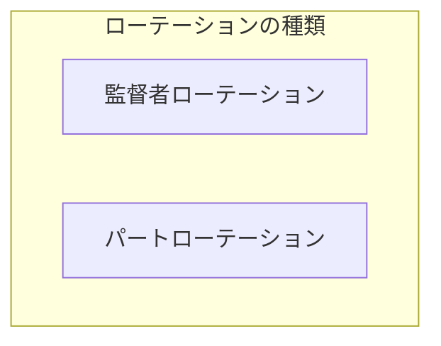
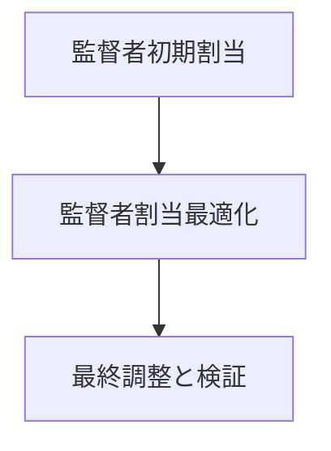

# 練習表自動生成システム 設計書：アルゴリズム詳細（2/3）- ローテーション最適化（前編）

本書では、練習表自動生成システムにおけるローテーション最適化アルゴリズムの詳細設計について記述します。監督者の公平な割り当てや、パート間のバランス調整など、ローテーションに関わる最適化手法を詳細に説明します。

## 1. ローテーション最適化の概要

ローテーション最適化は、練習セッションへの監督者の割り当てやパートごとの練習時間の公平な分配を実現するためのアルゴリズムです。

### 1.1 ローテーション最適化の目標

ローテーション最適化の主な目標は以下の通りです：

1. **公平性**：監督業務や練習機会が特定のメンバーに偏らないようにする
2. **効率性**：メンバーのスキルや経験を考慮した効果的な割り当てを行う
3. **一貫性**：類似セッション間で一貫性のある割り当てを実現する
4. **柔軟性**：メンバーの事情や特別要請に対応できる仕組みを提供する

### 1.2 ローテーションの種類

本システムで扱うローテーションは主に以下の2種類です：



1. **監督者ローテーション**：各練習セッションに対して監督者を公平に割り当てるための仕組み
2. **パートローテーション**：練習時間や機会をパート間で公平に分配するための仕組み

## 2. 監督者ローテーションのモデル化

### 2.1 問題の定式化

監督者ローテーション問題を以下のように定式化します：

#### 2.1.1 決定変数

- $S_{ijk}$：日付$i$、セッション$j$に監督者$k$が割り当てられるかどうか（1または0）
- $W_{ik}$：日付$i$に監督者$k$が勤務するかどうか（1または0）

#### 2.1.2 制約条件

1. **監督者必須制約**：各セッションには少なくとも1人の監督者が必要
   - $\sum_{k} S_{ijk} \geq 1 \quad \forall i,j$

2. **監督者資格制約**：監督者として割り当てられるのは資格を持つメンバーのみ
   - $S_{ijk} \leq Qualification_k \quad \forall i,j,k$

3. **二重割当回避制約**：同じ日の複数セッションに同一監督者を割り当てない
   - $\sum_{j} S_{ijk} \leq 1 \quad \forall i,k$

4. **欠席考慮制約**：欠席予定の監督者は割り当てない
   - $S_{ijk} = 0 \quad \forall i,j,k \text{ where } Absence_{ik} = 1$

5. **最大負担制約**：各監督者の負担は一定期間内で上限を超えない
   - $\sum_{i=t}^{t+period} \sum_{j} S_{ijk} \leq MaxLoad_k \quad \forall t,k$

#### 2.1.3 目的関数

以下の目的関数を最小化します：

$Minimize \quad w_1 \cdot LoadImbalance + w_2 \cdot PreferenceViolation + w_3 \cdot SequentialAssignment + w_4 \cdot SkillMismatch$

ここで：
- $LoadImbalance$：監督者間の負担の不均衡度
- $PreferenceViolation$：希望条件との不一致度
- $SequentialAssignment$：連続割当のペナルティ
- $SkillMismatch$：スキルとセッション内容のミスマッチ度

### 2.2 監督者割当アルゴリズム

監督者割当アルゴリズムは以下の3段階で構成されます：



#### 2.2.1 初期割当フェーズ

1. **優先度ベース割当**
   - 監督者の数が限られている場合は、まず全セッションに最低1名の監督者を割り当てる
   - 監督者の可用性と監督回数の現状を考慮して初期割当を行う

```python
# 監督者初期割当の疑似コード
def initial_supervisor_assignment(sessions, supervisors):
    assignments = {}
    
    # 監督者の現在までの割当回数を取得
    supervisor_load = get_supervisor_load_history(supervisors)
    
    # セッションを日付順にソート
    sorted_sessions = sort_by_date(sessions)
    
    for session in sorted_sessions:
        # 該当日に利用可能な監督者を取得
        available_supervisors = get_available_supervisors(
            supervisors, session.date, session.time)
        
        if not available_supervisors:
            mark_as_problematic(session, "No supervisor available")
            continue
        
        # 負担が最も少ない監督者を選択
        selected = min(available_supervisors, key=lambda s: supervisor_load[s.id])
        
        # 割当を記録
        assignments[session.id] = selected.id
        supervisor_load[selected.id] += 1
    
    return assignments
```

2. **監督者利用可能性チェック**
   - 各セッションに対して利用可能な監督者がいない場合は問題として記録
   - 監督者が極端に不足する日を特定し、スケジュール生成アルゴリズムへフィードバック

#### 2.2.2 割当最適化フェーズ

1. **局所探索法**
   - 初期割当を出発点として、以下の操作により近傍解を探索
     - 監督者の交換（2つのセッション間で監督者を交換）
     - 監督者の再割当（1つのセッションの監督者を変更）

2. **タブーサーチ**
   - 局所最適解からの脱出のため、タブーリストを用いた探索を実施
   - 最近探索した割当パターンをタブーリストに追加し、一定期間再探索を禁止

```python
# タブーサーチによる監督者割当最適化の疑似コード
def tabu_search_supervisor_optimization(initial_assignment, max_iterations, tabu_tenure):
    current_solution = initial_assignment
    best_solution = initial_assignment
    current_score = evaluate_supervisor_assignment(current_solution)
    best_score = current_score
    
    tabu_list = []
    
    for iteration in range(max_iterations):
        # 近傍解の生成
        neighbors = generate_supervisor_assignment_neighbors(current_solution)
        
        # タブーでない近傍解、またはアスピレーション基準を満たす解を選択
        valid_neighbors = [n for n in neighbors if not is_tabu(n, tabu_list) or 
                           evaluate_supervisor_assignment(n) > best_score]
        
        if not valid_neighbors:
            continue
        
        # 最良の近傍解を選択
        next_solution = max(valid_neighbors, key=evaluate_supervisor_assignment)
        next_score = evaluate_supervisor_assignment(next_solution)
        
        # 移動を実行
        current_solution = next_solution
        current_score = next_score
        
        # タブーリストを更新
        add_to_tabu_list(tabu_list, get_move(current_solution, next_solution), tabu_tenure)
        
        # 最良解の更新
        if current_score > best_score:
            best_solution = current_solution
            best_score = current_score
    
    return best_solution
```

3. **公平性最適化**
   - 監督者間の負担バランスを評価
   - 負担が偏っている場合は、負担の大きい監督者から小さい監督者への割当移動を試行

#### 2.2.3 最終調整と検証フェーズ

1. **特別要件の適用**
   - 特定のセッションに対する監督者指定要件の適用
   - 特定の監督者に対する負担軽減要件の適用

2. **最終チェック**
   - すべてのセッションに監督者が割り当てられているか確認
   - 監督者の負担が許容範囲内か確認
   - 連続勤務など避けるべきパターンが生じていないか確認

3. **割当結果の評価**
   - 監督者間の負担バランス度の計算
   - 希望条件との一致度の評価
   - スキルマッチング度の評価

### 2.3 公平性評価メトリクス

監督者割当の公平性を評価するための主なメトリクス：

#### 2.3.1 負担バランス指標

1. **標準偏差に基づく指標**
   - 監督者ごとの割当回数の標準偏差を計算
   - 値が小さいほど公平な割当と判断

```python
def calculate_load_balance_score(assignments, supervisors):
    # 監督者ごとの割当回数をカウント
    supervisor_counts = {s.id: 0 for s in supervisors}
    for session_id, supervisor_id in assignments.items():
        supervisor_counts[supervisor_id] += 1
    
    # 割当回数の平均と標準偏差を計算
    counts = list(supervisor_counts.values())
    mean_count = sum(counts) / len(counts)
    variance = sum((c - mean_count) ** 2 for c in counts) / len(counts)
    std_dev = variance ** 0.5
    
    # 標準偏差が小さいほど高スコア（最大1.0）
    max_possible_std_dev = mean_count  # 理論上の最大標準偏差の概算
    return max(0, 1 - std_dev / max_possible_std_dev)
```

2. **ジニ係数に基づく指標**
   - 監督者間の負担分配の不平等さを測定
   - 0に近いほど公平、1に近いほど不公平

3. **最大最小比率**
   - 最も負担の大きい監督者と最も小さい監督者の比率
   - 比率が1に近いほど公平な割当と判断

#### 2.3.2 時間的公平性指標

1. **時間帯分散指標**
   - 各監督者に割り当てられる時間帯の分散度
   - 特定の時間帯（早朝・夜間など）に偏らないようにする

2. **休日・平日バランス**
   - 休日と平日の監督業務の公平な分配
   - 休日割当比率の監督者間のばらつきを最小化

#### 2.3.3 特殊セッション公平性

1. **特別練習の分散度**
   - 公演前の特別練習など、負担の大きいセッションの分散度
   - 特定の監督者に集中しないようにする

2. **遠隔地練習の分散度**
   - 移動距離の長い会場でのセッションの分散度
   - 移動負担が特定の監督者に集中しないようにする

### 2.4 スキルマッチング

監督者のスキルや経験とセッションの内容を適切にマッチングさせるための仕組み：

#### 2.4.1 スキルモデル

1. **監督者スキルプロファイル**
   - 監督経験年数
   - 得意なパート・分野
   - 専門性レベル（初心者指導、上級者指導など）
   - 特殊技能（コンクール対策、特殊奏法指導など）

2. **セッション要求プロファイル**
   - 必要な指導レベル
   - 練習内容の専門性
   - 対象メンバーの熟練度

#### 2.4.2 マッチングアルゴリズム

```python
# スキルマッチングスコア計算の疑似コード
def calculate_skill_matching_score(supervisor, session):
    score = 0
    
    # 基本的な適合度（経験年数による重み付け）
    score += min(1.0, supervisor.experience_years / 5.0) * 0.3
    
    # パート適合度
    if session.main_part in supervisor.specialized_parts:
        score += 0.3
    elif session.main_part in supervisor.familiar_parts:
        score += 0.15
    
    # 指導レベル適合度
    if session.required_level <= supervisor.teaching_level:
        level_match = 1.0 - (supervisor.teaching_level - session.required_level) * 0.1
        score += level_match * 0.2
    else:
        # 必要レベルを満たしていない場合は大幅減点
        score -= 0.2
    
    # 特殊要件適合度
    if session.special_requirements:
        matching_skills = set(session.special_requirements) & set(supervisor.special_skills)
        score += len(matching_skills) / len(session.special_requirements) * 0.2
    else:
        score += 0.1  # 特殊要件がない場合は若干のボーナス
    
    return max(0, min(1, score))  # 0から1の範囲に正規化
```

## 3. パートローテーションのモデル化

パート間での練習機会の公平な分配を実現するためのモデル化について説明します。

### 3.1 問題の定式化

#### 3.1.1 決定変数

- $P_{ijl}$：日付$i$、セッション$j$でパート$l$が練習するかどうか（1または0）
- $D_{il}$：日付$i$にパート$l$が練習するかどうか（1または0） 