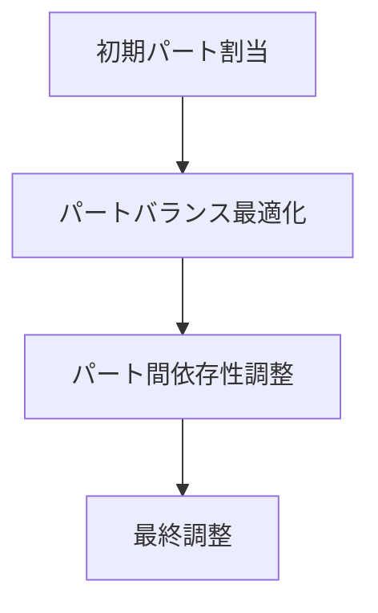
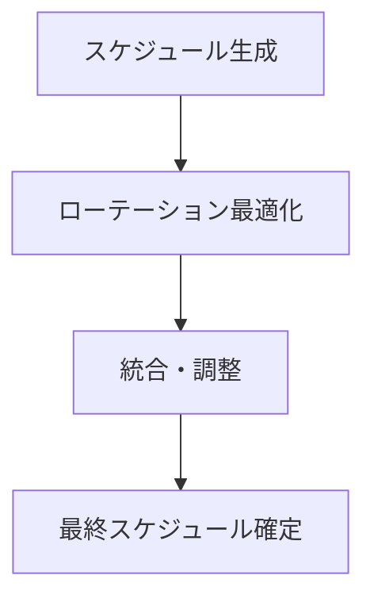

# 練習表自動生成システム 設計書：アルゴリズム詳細（3/3）- ローテーション最適化（後編）

## 3. パートローテーションのモデル化（続き）

### 3.1 問題の定式化（続き）

#### 3.1.2 制約条件

1. **練習必要性制約**：各パートは一定期間内に最低回数の練習機会を確保
   - $\sum_{i=t}^{t+period} D_{il} \geq MinPracticeDays_l \quad \forall t,l$

2. **同時パート制約**：一つのセッションで同時に練習できるパート数に制限
   - $\sum_{l} P_{ijl} \leq MaxSimultaneousParts_j \quad \forall i,j$

3. **連続練習制約**：同一パートの連続練習に関する制約
   - $D_{il} + D_{(i+1)l} \leq 1 + ConsecutiveAllowed_l \quad \forall i,l$

4. **パート依存制約**：特定のパート間の依存関係を考慮
   - $P_{ijl_1} \leq P_{ijl_2} \quad \forall i,j, \text{where } Dependency(l_1, l_2) = 1$

#### 3.1.3 目的関数

以下の目的関数を最大化します：

$Maximize \quad w_1 \cdot PartFrequencyBalance + w_2 \cdot ProgressConsistency + w_3 \cdot PartDependencyScore + w_4 \cdot SpecialRequestSatisfaction$

ここで：
- $PartFrequencyBalance$：パート間の練習頻度の均衡度
- $ProgressConsistency$：練習の進捗の一貫性
- $PartDependencyScore$：パート間の連携度
- $SpecialRequestSatisfaction$：特別要望の充足度

### 3.2 パートローテーションアルゴリズム

パートローテーションを最適化するアルゴリズムは以下の段階で構成されます：



#### 3.2.1 初期パート割当フェーズ

1. **優先度ベース割当**
   - まず、優先度の高いパートから割り当てを行う
   - 各パートの進捗状況や必要性を考慮

```python
# 初期パート割当の疑似コード
def initial_part_assignment(sessions, parts, progress_data):
    assignments = {s.id: [] for s in sessions}
    
    # パートを優先度順にソート
    sorted_parts = sort_by_priority(parts, progress_data)
    
    for session in sessions:
        remaining_slots = session.max_parts
        
        for part in sorted_parts:
            # パートの必要性を評価
            if is_part_needed(part, session.date, progress_data) and remaining_slots > 0:
                assignments[session.id].append(part.id)
                remaining_slots -= 1
    
    return assignments
```

2. **最小練習回数保証**
   - 各パートが最低限の練習回数を確保できているか確認
   - 不足している場合は追加割当を検討

#### 3.2.2 パートバランス最適化フェーズ

1. **頻度バランス改善**
   - パート間の練習頻度のばらつきを評価
   - 練習回数が少ないパートの練習機会を増やす調整

```python
# パートバランス最適化の疑似コード
def optimize_part_balance(initial_assignments, parts, target_period):
    # 現在の割当状況からパートごとの練習回数を集計
    part_counts = {p.id: count_practice_sessions(p.id, initial_assignments) for p in parts}
    
    # 平均練習回数からの偏差を計算
    avg_count = sum(part_counts.values()) / len(parts)
    deviations = {p.id: avg_count - part_counts[p.id] for p in parts}
    
    # 練習回数の少ないパートから多いパートへ調整
    adjustments = {}
    
    for session_id, assigned_parts in initial_assignments.items():
        # セッションの日付を取得
        session_date = get_session_date(session_id)
        
        # 既に最大パート数に達している場合はスキップ
        if len(assigned_parts) >= get_max_parts(session_id):
            continue
        
        # 追加すべきパートを特定（回数が少なく、まだ割り当てられていないパート）
        potential_parts = [p.id for p in parts if p.id not in assigned_parts 
                          and deviations[p.id] > 0
                          and is_part_available(p.id, session_date)]
        
        if potential_parts:
            # 最も練習回数が少ないパートを選択
            part_to_add = max(potential_parts, key=lambda p: deviations[p])
            adjustments[session_id] = assigned_parts + [part_to_add]
            
            # 集計データを更新
            part_counts[part_to_add] += 1
            deviations[part_to_add] -= 1
    
    # 調整結果を反映
    updated_assignments = {**initial_assignments, **adjustments}
    return updated_assignments
```

2. **時間的分散最適化**
   - 各パートの練習間隔の適正化
   - あまりに近い日程や遠い日程での連続練習を避ける

#### 3.2.3 パート間依存性調整フェーズ

1. **依存関係チェック**
   - パート間の依存関係を確認
   - 依存するパートが練習する際は、依存先のパートも練習すべきかを判断

2. **連携練習の調整**
   - 合同練習が必要なパート群を特定
   - それらのパートが効果的に練習できるようスケジュールを調整

```python
# パート間依存性調整の疑似コード
def adjust_part_dependencies(assignments, part_dependencies):
    adjustments = {}
    
    for session_id, assigned_parts in assignments.items():
        added_parts = []
        
        # 依存関係に基づく追加パートの特定
        for part_id in assigned_parts:
            dependent_parts = [dep for dep, main in part_dependencies.items() 
                              if main == part_id and dep not in assigned_parts
                              and dep not in added_parts]
            
            if dependent_parts and can_add_more_parts(session_id, len(assigned_parts) + len(added_parts)):
                # 追加可能な依存パートを選択
                parts_to_add = select_dependent_parts(
                    dependent_parts, 
                    get_remaining_slots(session_id, len(assigned_parts) + len(added_parts))
                )
                added_parts.extend(parts_to_add)
        
        if added_parts:
            adjustments[session_id] = assigned_parts + added_parts
    
    # 調整結果を反映
    updated_assignments = {**assignments, **adjustments}
    return updated_assignments
```

#### 3.2.4 最終調整フェーズ

1. **特別要請対応**
   - 特定日時での練習要請への対応
   - 特定のパート組み合わせに関する要請対応

2. **制約違反チェック**
   - すべての制約が満たされているか最終確認
   - 問題がある場合は調整または警告表示

3. **練習サイクル検証**
   - 長期的な練習サイクルの適切さを確認
   - 必要に応じて微調整を実施

### 3.3 パートバランス評価メトリクス

パート間の練習機会の公平性を評価するためのメトリクス：

#### 3.3.1 頻度バランス指標

1. **練習回数の標準偏差**
   - パートごとの練習回数の標準偏差
   - 値が小さいほど公平と判断

```python
def calculate_part_frequency_balance(assignments, parts):
    # パートごとの練習回数をカウント
    part_counts = {p.id: 0 for p in parts}
    for session_id, assigned_parts in assignments.items():
        for part_id in assigned_parts:
            part_counts[part_id] += 1
    
    # 平均と標準偏差を計算
    counts = list(part_counts.values())
    mean_count = sum(counts) / len(counts)
    variance = sum((c - mean_count) ** 2 for c in counts) / len(counts)
    std_dev = variance ** 0.5
    
    # 標準偏差が小さいほど高スコア
    max_possible_std_dev = mean_count  # 理論上の最大標準偏差の概算
    return max(0, 1 - std_dev / max_possible_std_dev)
```

2. **練習間隔の均等性**
   - 各パートの練習間隔のばらつき
   - 理想的な間隔からの偏差を最小化

#### 3.3.2 進捗バランス指標

1. **進捗度の分散**
   - パートごとの練習進捗度のばらつき
   - 全パートが同様に進捗するのが理想

2. **重要度加重バランス**
   - パートの重要度を考慮した練習配分の適切さ
   - 重要なパートほど練習機会を多く確保

## 4. スケジュール生成とローテーション最適化の統合

スケジュール生成アルゴリズムとローテーション最適化アルゴリズムを効果的に統合するための設計について説明します。

### 4.1 統合アプローチ



#### 4.1.1 逐次最適化アプローチ

1. **二段階最適化**
   - 第一段階：基本スケジュール（日時・会場）の最適化
   - 第二段階：ローテーション（監督者・パート）の最適化

2. **フィードバックループ**
   - ローテーション最適化結果から得られるフィードバックをスケジュール生成に反映
   - 必要に応じてスケジュールの再調整

#### 4.1.2 統合最適化アプローチ

1. **同時最適化**
   - スケジュールとローテーションを同時に考慮した統合モデル
   - より大きな探索空間を扱うための効率的なアルゴリズム

2. **階層的最適化**
   - 上位階層：全体的なスケジュール構造の最適化
   - 下位階層：詳細なローテーションの最適化

### 4.2 制約の優先順位付け

スケジュール生成とローテーション最適化の制約が競合する場合の優先順位：

| 優先順位 | 制約カテゴリ | 理由 |
|---------|------------|------|
| 1 | ハード制約（物理的制約） | 絶対に違反できない基本制約 |
| 2 | 監督者必須制約 | 監督者なしでは練習が成立しない |
| 3 | メンバー出席率制約 | 十分なメンバーがいないと効果的な練習ができない |
| 4 | パート練習頻度制約 | 全パートが適切な頻度で練習する必要がある |
| 5 | 公平性制約 | 負担の公平な分配 |
| 6 | 希望条件 | 可能な限り考慮すべき要望 |

### 4.3 統合アルゴリズム

スケジュール生成とローテーション最適化を統合するアルゴリズム：

```python
# 統合アルゴリズムの疑似コード
def integrated_schedule_optimization(venues, members, supervisors, parts, preferences, constraints):
    # フェーズ1: 基本スケジュール生成
    initial_schedule = generate_initial_schedule(venues, members, constraints)
    optimized_schedule = optimize_schedule(initial_schedule, preferences)
    
    # フェーズ2: 監督者ローテーション最適化
    supervisor_assignments = initial_supervisor_assignment(
        optimized_schedule, supervisors)
    optimized_supervisor_assignments = optimize_supervisor_assignments(
        supervisor_assignments, supervisors, preferences)
    
    # フェーズ3: パートローテーション最適化
    part_assignments = initial_part_assignment(
        optimized_schedule, parts, get_progress_data())
    optimized_part_assignments = optimize_part_assignments(
        part_assignments, parts, constraints)
    
    # フェーズ4: 統合と調整
    integrated_schedule = integrate_assignments(
        optimized_schedule, 
        optimized_supervisor_assignments,
        optimized_part_assignments
    )
    
    # フェーズ5: 競合解決と最終調整
    final_schedule = resolve_conflicts_and_finalize(integrated_schedule, constraints)
    
    return final_schedule
```

## 5. アルゴリズムの実装と最適化

ローテーション最適化アルゴリズムの効率的な実装と最適化について説明します。

### 5.1 実装の最適化

#### 5.1.1 計算効率の向上

1. **早期枝刈り**
   - 明らかに最適でない解候補を早期に除外
   - 不要な探索の回避

2. **増分計算**
   - 評価関数の完全再計算ではなく、変更箇所のみの差分計算
   - 特に、近傍探索時に有効

```python
# 増分計算の実装例
def incremental_evaluation(current_solution, current_score, move):
    """
    現在の解に対する変更（move）を適用した場合のスコアを
    増分的に計算する
    """
    # 変更による影響を特定
    affected_sessions = get_affected_sessions(move)
    affected_supervisors = get_affected_supervisors(move)
    
    # 現在の解からの変化分のみを計算
    score_delta = 0
    
    # 公平性指標の変化を計算
    fairness_delta = calculate_fairness_delta(
        current_solution, move, affected_supervisors)
    score_delta += fairness_delta
    
    # スキルマッチングスコアの変化を計算
    matching_delta = calculate_matching_delta(
        current_solution, move, affected_sessions)
    score_delta += matching_delta
    
    # 制約違反の変化を計算
    constraint_delta = calculate_constraint_delta(
        current_solution, move)
    score_delta += constraint_delta
    
    # 新しいスコアを返す
    return current_score + score_delta
```

#### 5.1.2 並列処理

1. **探索の並列化**
   - 複数の初期解からの並列探索
   - 独立した近傍の並列評価

2. **評価の並列化**
   - 複数の目的関数の並列計算
   - 異なる制約のチェックを並列実行

### 5.2 パラメータチューニング

アルゴリズムパラメータのチューニング方法：

| パラメータ | 説明 | チューニング手法 |
|-----------|------|----------------|
| 重み係数 | 目的関数の各項目の重み | グリッドサーチ、感度分析 |
| タブー期間 | タブーサーチにおけるタブー期間 | 問題サイズに応じた自動調整 |
| 近傍サイズ | 局所探索の近傍範囲 | アダプティブ制御 |
| 反復回数 | アルゴリズムの反復回数 | 早期停止条件の設定 |

```python
# パラメータ自動調整の例
def adaptive_tabu_tenure(problem_size, iteration, best_improvement_rate):
    """
    問題サイズと探索状況に応じてタブー期間を動的に調整
    """
    base_tenure = int(problem_size * 0.1)  # 基本タブー期間
    
    # 改善率が低下している場合はタブー期間を長く
    if best_improvement_rate < 0.01:
        extension = int(base_tenure * 0.5)
    else:
        extension = 0
    
    # イテレーションが進むにつれて微調整
    oscillation = int(base_tenure * 0.2 * math.sin(iteration / 100 * math.pi))
    
    return max(1, base_tenure + extension + oscillation)
```

### 5.3 運用時の最適化

システム運用時の追加最適化手法：

1. **インクリメンタル更新**
   - スケジュールの部分的変更時に完全再計算を避ける
   - 影響を受ける部分のみを再最適化

2. **学習ベース最適化**
   - 過去のスケジュールデータから学習
   - 組織固有のパターンやプリファレンスの自動学習

3. **キャッシング**
   - 頻繁に参照されるデータや中間結果のキャッシング
   - 再計算の回避による高速化

## 6. 実運用における考慮点

ローテーション最適化アルゴリズムの実運用における考慮点と対応方針：

### 6.1 例外処理

1. **監督者不足への対応**
   - 監督資格者が不足する場合の対処方法
   - 非常時の監督者割当ポリシー

2. **パート練習バランス調整**
   - あるパートが特定期間に集中して練習する必要がある場合の対応
   - 特別イベント前の非定常的スケジュール調整

### 6.2 手動調整との共存

自動最適化結果に対する手動調整を可能にする仕組み：

1. **部分固定機能**
   - 特定の割当を固定したまま残りを最適化
   - 手動調整箇所を保持した再最適化

2. **調整時のフィードバック**
   - 手動調整が制約に違反する場合の警告
   - 調整による影響の可視化

### 6.3 継続的改善

アルゴリズムの継続的な改善方法：


1. **利用データ分析**
   - 自動生成されたスケジュールに対する手動調整箇所の分析
   - 頻出パターンの特定

2. **フィードバック収集**
   - ユーザー満足度調査
   - 要望・問題点の定期的収集

3. **アルゴリズム改善**
   - 検出されたパターンに基づくアルゴリズム調整
   - 新たな制約や目的の追加

## 7. 将来の拡張計画

ローテーション最適化アルゴリズムの将来的な拡張計画：

### 7.1 予測モデルの統合

1. **出席予測**
   - 過去のデータに基づくメンバーの出席確率予測
   - 不確実性を考慮したロバスト最適化

2. **進捗予測**
   - パートごとの練習進捗の予測
   - 予測に基づく先行的スケジュール調整

### 7.2 高度な最適化手法

1. **強化学習の適用**
   - 長期的な練習効果を考慮した強化学習モデル
   - 環境変化への適応能力の向上

2. **多目的最適化の拡張**
   - パレート最適解の探索
   - 複数の評価視点からの最適化 