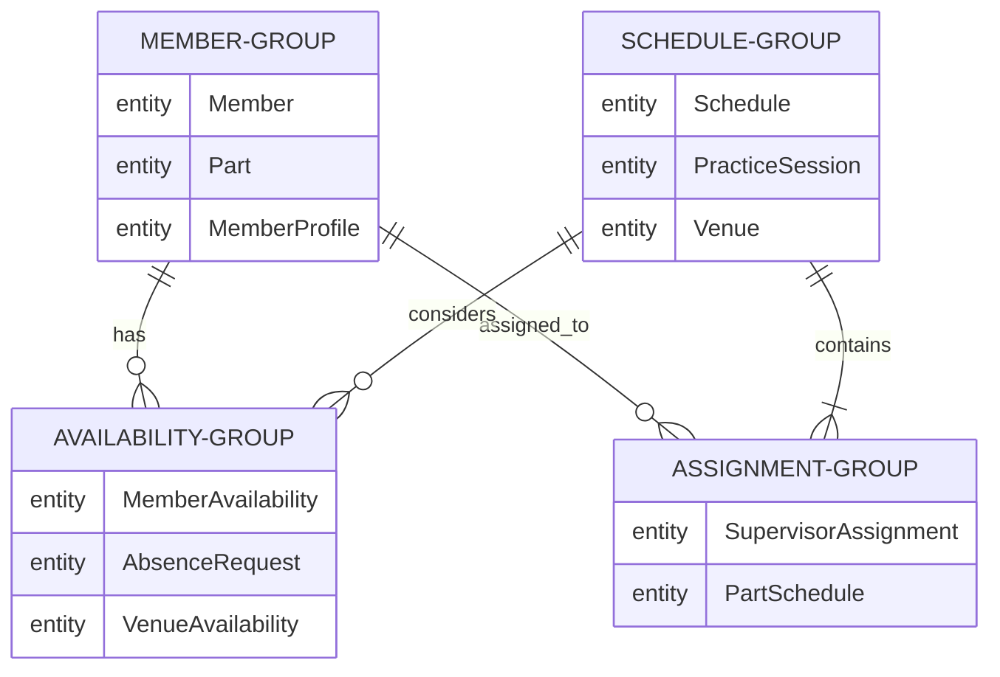
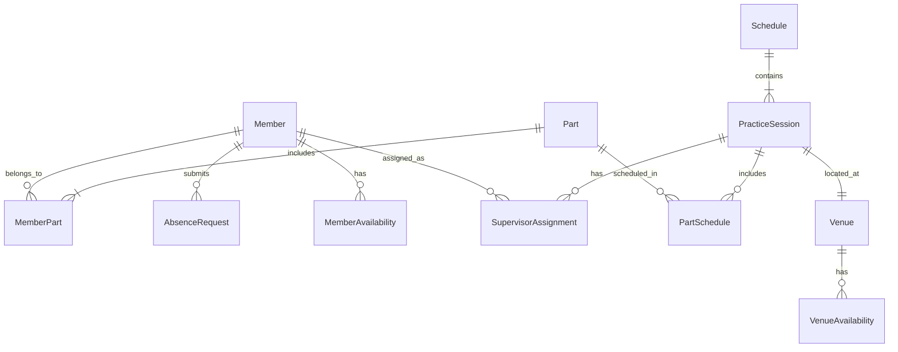

# 練習表自動生成システム 設計書：データモデル（1/3）- 概要と主要エンティティ

本書では、練習表自動生成システムで使用するデータモデルの詳細設計について記述します。システムの中核となるエンティティとその関連性、整合性制約などを明確にし、効率的かつ一貫性のあるデータ管理を実現するための設計を示します。

## 1. データモデル概要

### 1.1 設計方針

データモデル設計における主な方針は以下の通りです：

1. **ドメインモデルとの整合性**：ドメイン駆動設計の考え方に基づき、ドメインモデルを忠実に反映したデータモデルを設計する
2. **拡張性の確保**：将来の機能追加や変更に柔軟に対応できる拡張性の高いモデル構造を採用する
3. **パフォーマンスの最適化**：頻繁にアクセスされるデータの効率的な取得を考慮した設計とする
4. **整合性の保証**：データの一貫性を保証するための制約を適切に定義する
5. **監査証跡の確保**：重要な変更履歴を追跡できるよう考慮する

### 1.2 データモデル全体構造

システム全体のデータモデルは以下の主要カテゴリに分類されます：



### 1.3 主要エンティティ関連図

システムの中核となる主要エンティティとその関連性を以下に示します：



## 2. コアエンティティの詳細設計

システムの中核となる主要エンティティの詳細設計を以下に示します。

### 2.1 メンバー関連エンティティ

#### 2.1.1 Member（メンバー）

メンバーはシステムのユーザーであり、練習の参加者または監督者として登録されます。

| 属性 | 型 | 説明 | 制約 |
|-----|-----|-----|-----|
| member_id | UUID | メンバーの一意識別子 | PK, NOT NULL |
| username | VARCHAR(50) | ユーザー名 | UNIQUE, NOT NULL |
| email | VARCHAR(100) | メールアドレス | UNIQUE, NOT NULL |
| full_name | VARCHAR(100) | 氏名 | NOT NULL |
| is_active | BOOLEAN | アクティブ状態 | DEFAULT TRUE |
| join_date | DATE | 入会日 | NOT NULL |
| can_supervise | BOOLEAN | 監督者資格の有無 | DEFAULT FALSE |
| created_at | TIMESTAMP | 作成日時 | DEFAULT CURRENT_TIMESTAMP |
| updated_at | TIMESTAMP | 更新日時 | DEFAULT CURRENT_TIMESTAMP ON UPDATE |

```sql
CREATE TABLE members (
    member_id UUID PRIMARY KEY,
    username VARCHAR(50) NOT NULL UNIQUE,
    email VARCHAR(100) NOT NULL UNIQUE,
    full_name VARCHAR(100) NOT NULL,
    is_active BOOLEAN DEFAULT TRUE,
    join_date DATE NOT NULL,
    can_supervise BOOLEAN DEFAULT FALSE,
    created_at TIMESTAMP DEFAULT CURRENT_TIMESTAMP,
    updated_at TIMESTAMP DEFAULT CURRENT_TIMESTAMP ON UPDATE CURRENT_TIMESTAMP
);
```

#### 2.1.2 MemberProfile（メンバープロファイル）

メンバーの詳細情報を保持するエンティティです。

| 属性 | 型 | 説明 | 制約 |
|-----|-----|-----|-----|
| profile_id | UUID | プロファイルの一意識別子 | PK, NOT NULL |
| member_id | UUID | メンバーID | FK (Member), NOT NULL |
| phone_number | VARCHAR(20) | 電話番号 | |
| address | VARCHAR(200) | 住所 | |
| skill_level | ENUM | スキルレベル | DEFAULT 'INTERMEDIATE' |
| years_of_experience | INTEGER | 経験年数 | DEFAULT 0 |
| preferred_notification_method | ENUM | 通知方法の設定 | DEFAULT 'EMAIL' |
| biography | TEXT | 自己紹介 | |
| created_at | TIMESTAMP | 作成日時 | DEFAULT CURRENT_TIMESTAMP |
| updated_at | TIMESTAMP | 更新日時 | DEFAULT CURRENT_TIMESTAMP ON UPDATE |

```sql
CREATE TABLE member_profiles (
    profile_id UUID PRIMARY KEY,
    member_id UUID NOT NULL,
    phone_number VARCHAR(20),
    address VARCHAR(200),
    skill_level ENUM('BEGINNER', 'INTERMEDIATE', 'ADVANCED', 'EXPERT') DEFAULT 'INTERMEDIATE',
    years_of_experience INTEGER DEFAULT 0,
    preferred_notification_method ENUM('EMAIL', 'SMS', 'BOTH', 'NONE') DEFAULT 'EMAIL',
    biography TEXT,
    created_at TIMESTAMP DEFAULT CURRENT_TIMESTAMP,
    updated_at TIMESTAMP DEFAULT CURRENT_TIMESTAMP ON UPDATE CURRENT_TIMESTAMP,
    FOREIGN KEY (member_id) REFERENCES members(member_id) ON DELETE CASCADE
);
```

#### 2.1.3 Part（パート）

団体内のパート（楽器、役割など）を表すエンティティです。

| 属性 | 型 | 説明 | 制約 |
|-----|-----|-----|-----|
| part_id | UUID | パートの一意識別子 | PK, NOT NULL |
| name | VARCHAR(50) | パート名 | NOT NULL |
| description | VARCHAR(200) | 説明 | |
| min_required_members | INTEGER | 最小必要人数 | DEFAULT 1 |
| priority | INTEGER | 優先度 | DEFAULT 5 |
| is_active | BOOLEAN | アクティブ状態 | DEFAULT TRUE |
| created_at | TIMESTAMP | 作成日時 | DEFAULT CURRENT_TIMESTAMP |
| updated_at | TIMESTAMP | 更新日時 | DEFAULT CURRENT_TIMESTAMP ON UPDATE |

```sql
CREATE TABLE parts (
    part_id UUID PRIMARY KEY,
    name VARCHAR(50) NOT NULL,
    description VARCHAR(200),
    min_required_members INTEGER DEFAULT 1,
    priority INTEGER DEFAULT 5,
    is_active BOOLEAN DEFAULT TRUE,
    created_at TIMESTAMP DEFAULT CURRENT_TIMESTAMP,
    updated_at TIMESTAMP DEFAULT CURRENT_TIMESTAMP ON UPDATE CURRENT_TIMESTAMP
);
```

#### 2.1.4 MemberPart（メンバーパート）

メンバーとパートの関連を表す中間エンティティです。

| 属性 | 型 | 説明 | 制約 |
|-----|-----|-----|-----|
| member_part_id | UUID | 一意識別子 | PK, NOT NULL |
| member_id | UUID | メンバーID | FK (Member), NOT NULL |
| part_id | UUID | パートID | FK (Part), NOT NULL |
| is_primary | BOOLEAN | 主要パートかどうか | DEFAULT FALSE |
| proficiency_level | ENUM | 習熟度 | DEFAULT 'INTERMEDIATE' |
| assignment_date | DATE | 割り当て日 | NOT NULL |
| created_at | TIMESTAMP | 作成日時 | DEFAULT CURRENT_TIMESTAMP |
| updated_at | TIMESTAMP | 更新日時 | DEFAULT CURRENT_TIMESTAMP ON UPDATE |

```sql
CREATE TABLE member_parts (
    member_part_id UUID PRIMARY KEY,
    member_id UUID NOT NULL,
    part_id UUID NOT NULL,
    is_primary BOOLEAN DEFAULT FALSE,
    proficiency_level ENUM('BEGINNER', 'INTERMEDIATE', 'ADVANCED', 'EXPERT') DEFAULT 'INTERMEDIATE',
    assignment_date DATE NOT NULL,
    created_at TIMESTAMP DEFAULT CURRENT_TIMESTAMP,
    updated_at TIMESTAMP DEFAULT CURRENT_TIMESTAMP ON UPDATE CURRENT_TIMESTAMP,
    FOREIGN KEY (member_id) REFERENCES members(member_id) ON DELETE CASCADE,
    FOREIGN KEY (part_id) REFERENCES parts(part_id) ON DELETE CASCADE,
    UNIQUE (member_id, part_id)
);
```

### 2.2 スケジュール関連エンティティ

#### 2.2.1 Schedule（スケジュール）

練習スケジュール全体を表すエンティティです。

| 属性 | 型 | 説明 | 制約 |
|-----|-----|-----|-----|
| schedule_id | UUID | スケジュールの一意識別子 | PK, NOT NULL |
| title | VARCHAR(100) | スケジュールタイトル | NOT NULL |
| description | TEXT | 説明 | |
| start_date | DATE | 開始日 | NOT NULL |
| end_date | DATE | 終了日 | NOT NULL |
| status | ENUM | 状態（下書き、公開済みなど） | DEFAULT 'DRAFT' |
| creator_id | UUID | 作成者ID | FK (Member), NOT NULL |
| is_template | BOOLEAN | テンプレートかどうか | DEFAULT FALSE |
| created_at | TIMESTAMP | 作成日時 | DEFAULT CURRENT_TIMESTAMP |
| updated_at | TIMESTAMP | 更新日時 | DEFAULT CURRENT_TIMESTAMP ON UPDATE |
| published_at | TIMESTAMP | 公開日時 | NULL |

```sql
CREATE TABLE schedules (
    schedule_id UUID PRIMARY KEY,
    title VARCHAR(100) NOT NULL,
    description TEXT,
    start_date DATE NOT NULL,
    end_date DATE NOT NULL,
    status ENUM('DRAFT', 'PUBLISHED', 'ARCHIVED', 'CANCELLED') DEFAULT 'DRAFT',
    creator_id UUID NOT NULL,
    is_template BOOLEAN DEFAULT FALSE,
    created_at TIMESTAMP DEFAULT CURRENT_TIMESTAMP,
    updated_at TIMESTAMP DEFAULT CURRENT_TIMESTAMP ON UPDATE CURRENT_TIMESTAMP,
    published_at TIMESTAMP NULL,
    FOREIGN KEY (creator_id) REFERENCES members(member_id),
    CHECK (end_date >= start_date)
);
```

#### 2.2.2 PracticeSession（練習セッション）

個々の練習セッションを表すエンティティです。

| 属性 | 型 | 説明 | 制約 |
|-----|-----|-----|-----|
| session_id | UUID | セッションの一意識別子 | PK, NOT NULL |
| schedule_id | UUID | スケジュールID | FK (Schedule), NOT NULL |
| venue_id | UUID | 会場ID | FK (Venue), NOT NULL |
| title | VARCHAR(100) | セッション名 | NOT NULL |
| description | TEXT | 説明 | |
| date | DATE | 日付 | NOT NULL |
| start_time | TIME | 開始時間 | NOT NULL |
| end_time | TIME | 終了時間 | NOT NULL |
| session_type | ENUM | セッションタイプ | DEFAULT 'REGULAR' |
| max_parts | INTEGER | 最大パート数 | DEFAULT 3 |
| min_attendance_required | INTEGER | 最小必要出席人数 | DEFAULT 1 |
| notes | TEXT | 備考 | |
| created_at | TIMESTAMP | 作成日時 | DEFAULT CURRENT_TIMESTAMP |
| updated_at | TIMESTAMP | 更新日時 | DEFAULT CURRENT_TIMESTAMP ON UPDATE |

```sql
CREATE TABLE practice_sessions (
    session_id UUID PRIMARY KEY,
    schedule_id UUID NOT NULL,
    venue_id UUID NOT NULL,
    title VARCHAR(100) NOT NULL,
    description TEXT,
    date DATE NOT NULL,
    start_time TIME NOT NULL,
    end_time TIME NOT NULL,
    session_type ENUM('REGULAR', 'SPECIAL', 'REHEARSAL', 'PERFORMANCE') DEFAULT 'REGULAR',
    max_parts INTEGER DEFAULT 3,
    min_attendance_required INTEGER DEFAULT 1,
    notes TEXT,
    created_at TIMESTAMP DEFAULT CURRENT_TIMESTAMP,
    updated_at TIMESTAMP DEFAULT CURRENT_TIMESTAMP ON UPDATE CURRENT_TIMESTAMP,
    FOREIGN KEY (schedule_id) REFERENCES schedules(schedule_id) ON DELETE CASCADE,
    FOREIGN KEY (venue_id) REFERENCES venues(venue_id),
    CHECK (end_time > start_time)
);
```

#### 2.2.3 Venue（会場）

練習会場を表すエンティティです。

| 属性 | 型 | 説明 | 制約 |
|-----|-----|-----|-----|
| venue_id | UUID | 会場の一意識別子 | PK, NOT NULL |
| name | VARCHAR(100) | 会場名 | NOT NULL |
| address | VARCHAR(200) | 住所 | NOT NULL |
| capacity | INTEGER | 収容人数 | DEFAULT 10 |
| features | JSON | 設備・特徴 | |
| contact_info | VARCHAR(100) | 連絡先 | |
| hourly_cost | DECIMAL(10,2) | 時間あたりのコスト | DEFAULT 0.00 |
| is_active | BOOLEAN | アクティブ状態 | DEFAULT TRUE |
| created_at | TIMESTAMP | 作成日時 | DEFAULT CURRENT_TIMESTAMP |
| updated_at | TIMESTAMP | 更新日時 | DEFAULT CURRENT_TIMESTAMP ON UPDATE |

```sql
CREATE TABLE venues (
    venue_id UUID PRIMARY KEY,
    name VARCHAR(100) NOT NULL,
    address VARCHAR(200) NOT NULL,
    capacity INTEGER DEFAULT 10,
    features JSON,
    contact_info VARCHAR(100),
    hourly_cost DECIMAL(10,2) DEFAULT 0.00,
    is_active BOOLEAN DEFAULT TRUE,
    created_at TIMESTAMP DEFAULT CURRENT_TIMESTAMP,
    updated_at TIMESTAMP DEFAULT CURRENT_TIMESTAMP ON UPDATE CURRENT_TIMESTAMP
);
``` 