# UML図詳細

## 1. 概要

本ドキュメントでは、練習表自動生成システムの設計において使用するUML図について詳細に説明します。UML（Unified Modeling Language）は、システムの構造や振る舞いを視覚的に表現するための標準言語であり、本システムの設計においては主に以下の図を活用します。

- クラス図：システムの静的構造を表現
- シーケンス図：オブジェクト間の相互作用を時系列で表現
- アクティビティ図：処理の流れを表現
- 状態遷移図：オブジェクトの状態変化を表現

各図はMermaid記法を用いて記述し、実装時の参照や関係者間のコミュニケーションに活用します。

## 2. クラス図

### 2.1 ドメインモデル概念図

ドメインモデルの中核となる概念を表現したクラス図です。システムの主要な概念とその関係性を表現しています。

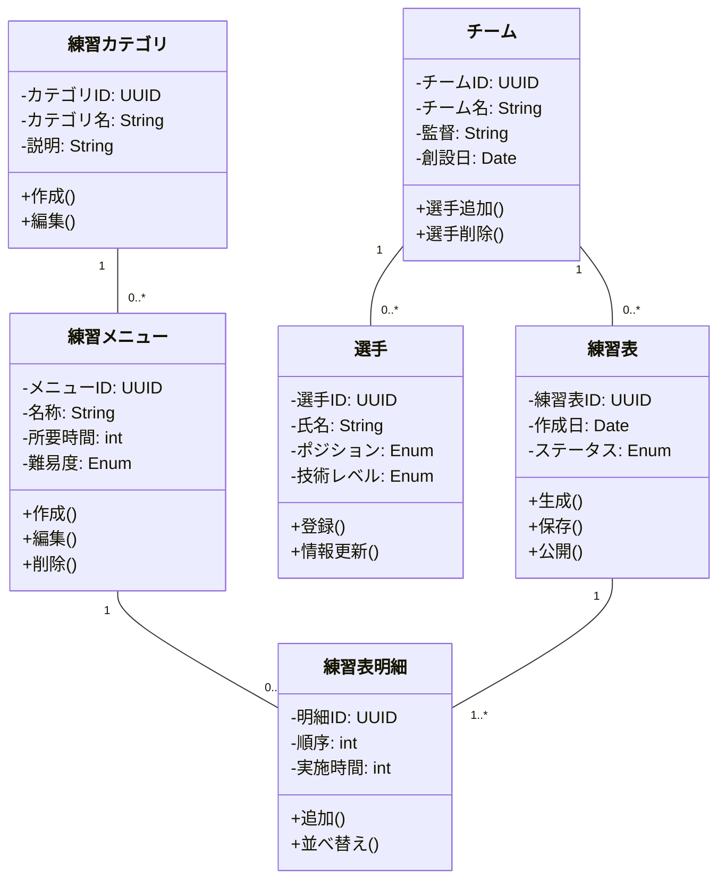

### 2.2 詳細クラス図（練習表管理）

練習表管理に関わるコンポーネントの詳細設計を表現したクラス図です。実装レベルでの設計を示しています。

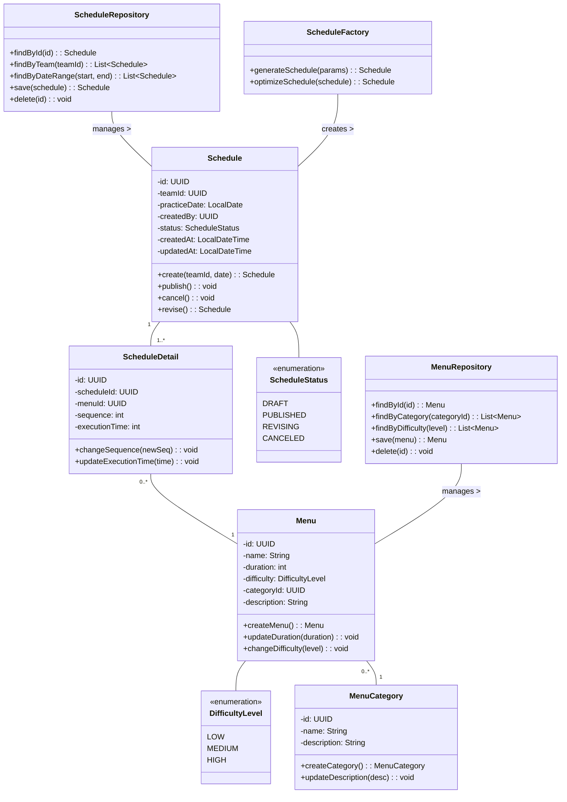

### 2.3 詳細クラス図（ユーザー管理）

ユーザー管理に関わるコンポーネントの詳細設計を表現したクラス図です。

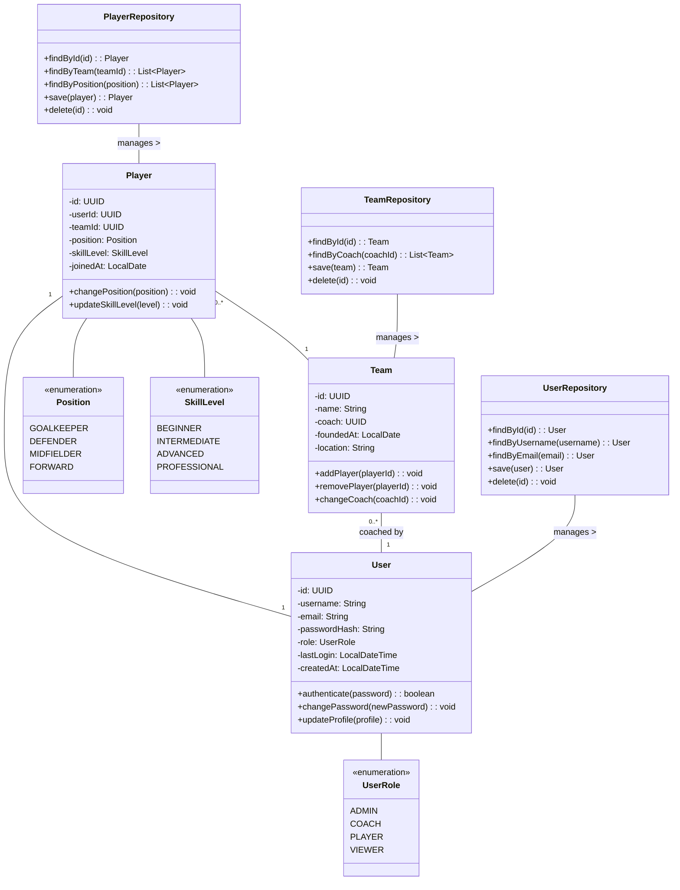

## 3. シーケンス図

### 3.1 練習表生成プロセス

練習表生成の一連の流れを表現したシーケンス図です。ユーザーからの要求がどのように処理されるかを示しています。

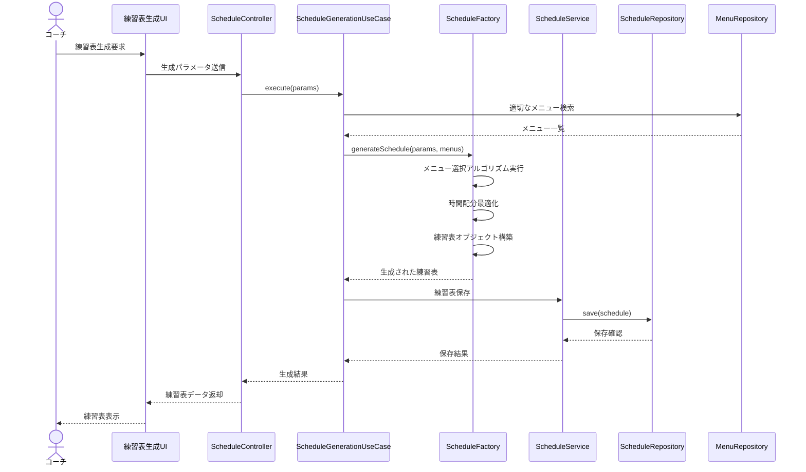

### 3.2 練習表編集プロセス

練習表の編集プロセスを表現したシーケンス図です。

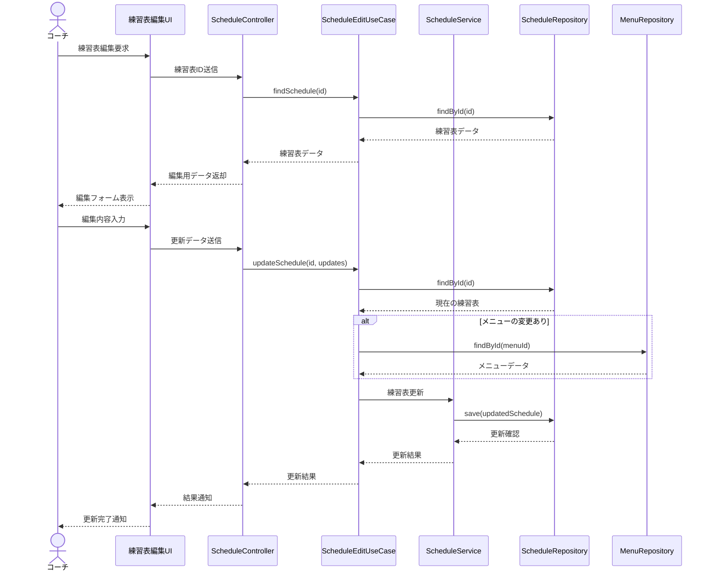

### 3.3 練習表公開プロセス

練習表の公開プロセスを表現したシーケンス図です。

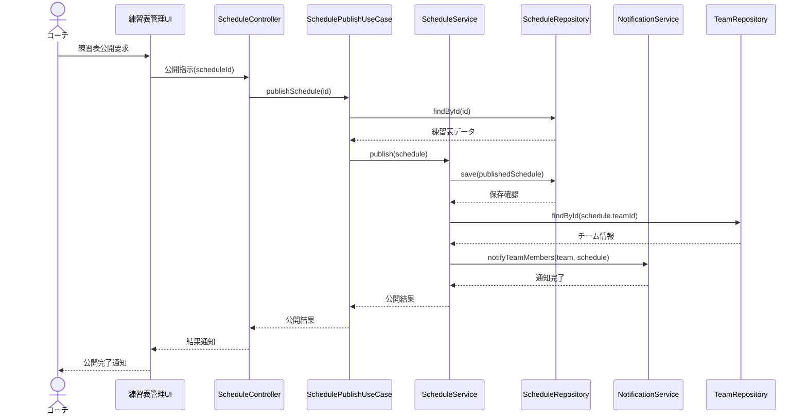

## 4. アクティビティ図

### 4.1 練習表生成アルゴリズム

練習表生成の処理フローを表現したアクティビティ図です。

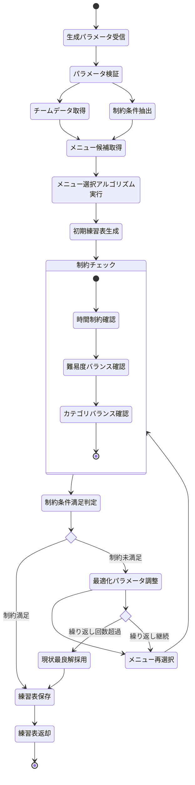

### 4.2 練習メニュー最適化プロセス

練習メニューの最適化プロセスを表現したアクティビティ図です。

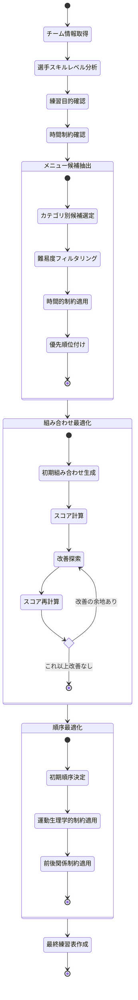

## 5. 状態遷移図

### 5.1 練習表の状態遷移

練習表が持つ状態とその遷移を表現した状態遷移図です。

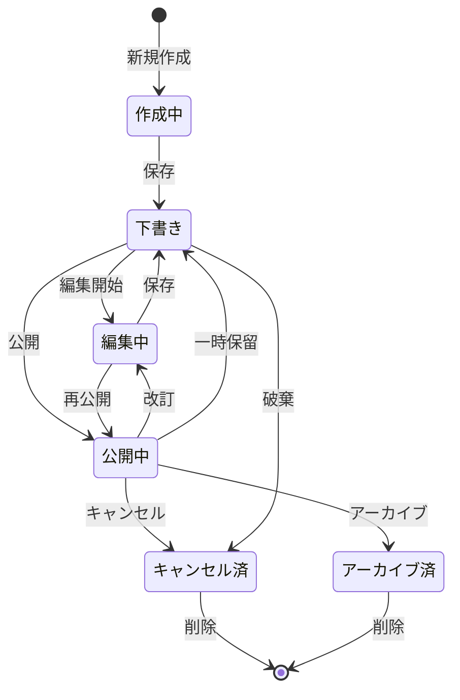

### 5.2 ユーザーアカウントの状態遷移

ユーザーアカウントの状態とその遷移を表現した状態遷移図です。

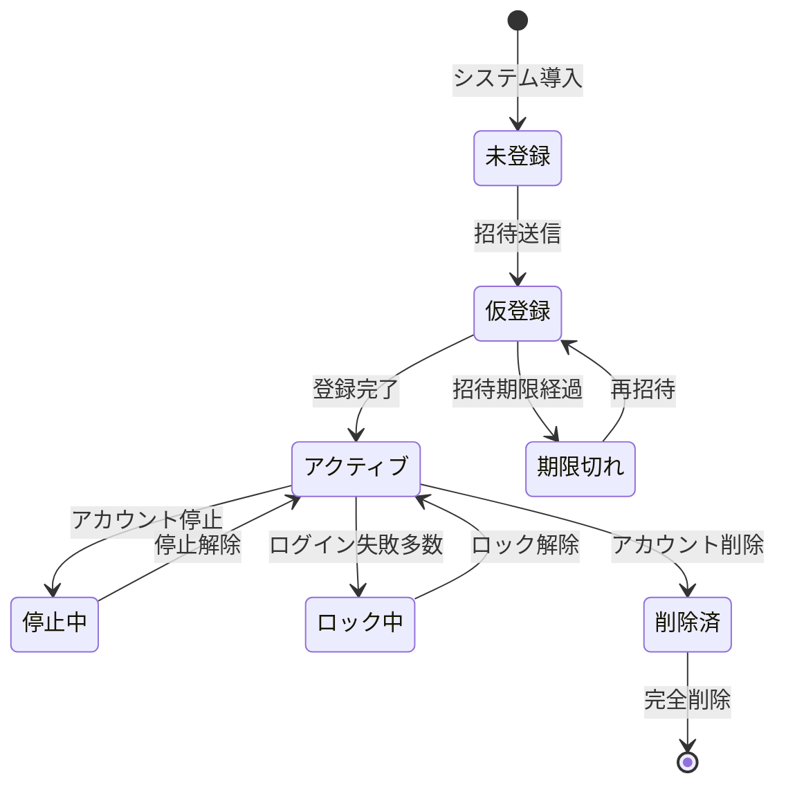

### 5.3 チームメンバーシップの状態遷移

チームメンバーシップの状態とその遷移を表現した状態遷移図です。

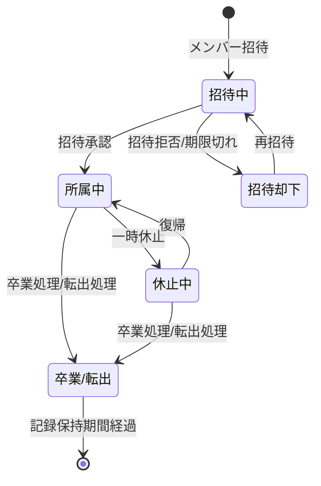