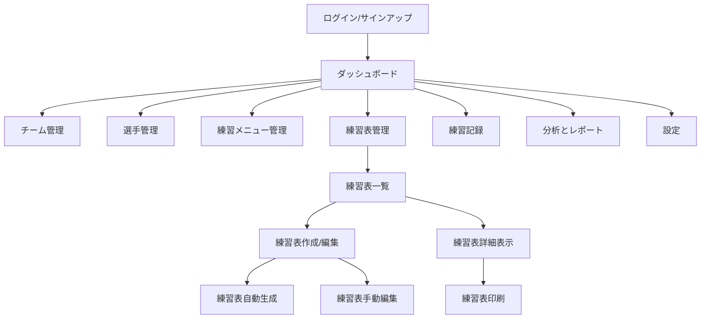
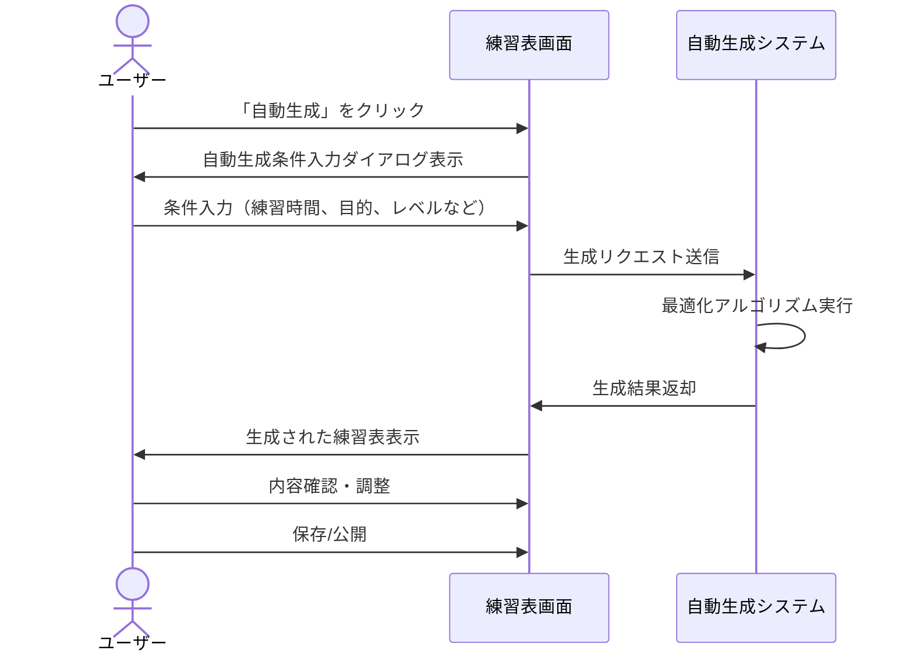
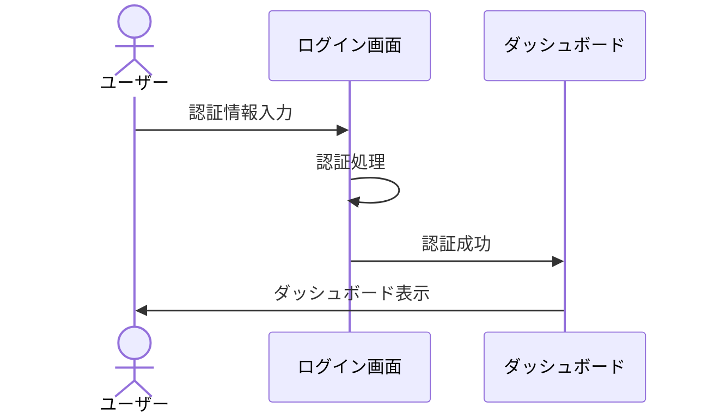
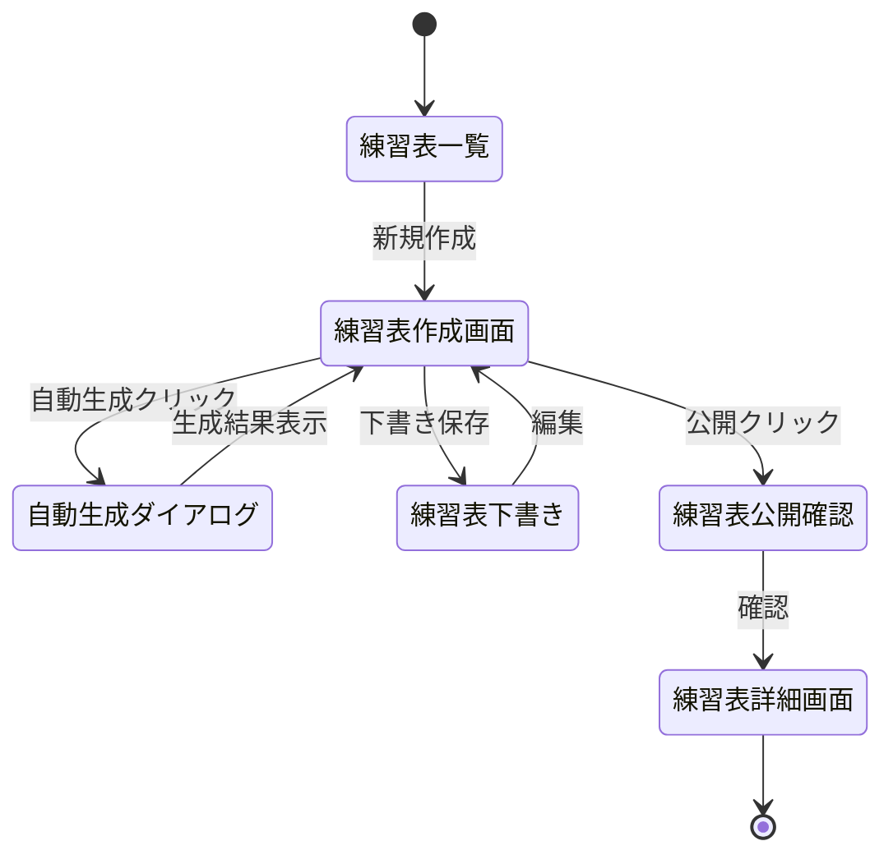
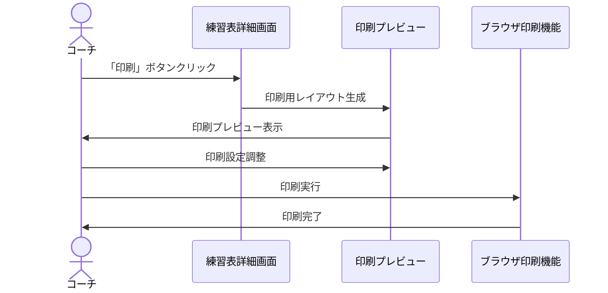

# 画面設計詳細

## 1. 概要

本ドキュメントでは、練習表自動生成システムの画面設計について詳細に説明します。ユーザーインターフェース（UI）は、システムの使いやすさと効率性に直接影響するため、ユーザーのニーズと業務フローに適した設計を行う必要があります。

本システムのUI設計では、以下の点を重視しています：

- **シンプルさ**：必要最小限の情報と操作を画面に表示し、ユーザーの認知負荷を軽減
- **一貫性**：画面間で一貫したデザインパターンを採用し、学習コストを最小化
- **レスポンシブ性**：異なるデバイスやスクリーンサイズに対応した適応性のあるレイアウト
- **アクセシビリティ**：多様なユーザーが使用できるよう、アクセシビリティ基準に準拠した設計

以下では、各画面の詳細設計とフロー、UI/UXガイドラインについて説明します。

## 2. 画面構成

システム全体の画面構成は以下の通りです：



## 3. 主要画面の詳細設計

### 3.1 ログイン/サインアップ画面

#### 目的
ユーザー認証とシステムへのアクセス制御

#### 画面レイアウト

```
+----------------------------------------+
|            システムロゴ                |
|                                        |
|  +----------------------------------+  |
|  |           タブナビゲーション      |  |
|  |   [ログイン]    [サインアップ]   |  |
|  +----------------------------------+  |
|                                        |
|  +----------------------------------+  |
|  |                                  |  |
|  |   メールアドレス:                |  |
|  |   [                         ]    |  |
|  |                                  |  |
|  |   パスワード:                    |  |
|  |   [                         ]    |  |
|  |                                  |  |
|  |   [ パスワードを忘れた場合 ]     |  |
|  |                                  |  |
|  |   [      ログイン        ]       |  |
|  |                                  |  |
|  +----------------------------------+  |
|                                        |
+----------------------------------------+
```

#### 主要コンポーネント
- システムロゴとタイトル
- タブ切り替え（ログイン/サインアップ）
- 入力フォーム（メールアドレス、パスワード）
- パスワード忘れリンク
- ログインボタン
- ソーシャルログインオプション（必要に応じて）

#### バリデーションルール
- メールアドレス：有効なメールアドレス形式
- パスワード：8文字以上、英数字混合

#### エラーメッセージ
- 「メールアドレスまたはパスワードが正しくありません」
- 「このメールアドレスは登録されていません」
- 「パスワードは8文字以上である必要があります」

### 3.2 ダッシュボード画面

#### 目的
ユーザーの主要情報と機能へのアクセスポイントを提供

#### 画面レイアウト

```
+----------------------------------------+
|  ヘッダー [ロゴ]     [ユーザー ▼]     |
+----------------------------------------+
|        |                               |
|        |   今日の練習                  |
|        |   +------------------------+  |
|        |   |                        |  |
|        |   | 練習時間: 13:00-15:00  |  |
|  サイド|   | 場所: 第2体育館        |  |
|  メニュー  | 参加人数: 15人         |  |
|        |   | [詳細を見る]           |  |
|        |   +------------------------+  |
|        |                               |
|        |   最近の練習表                |
|        |   +------------------------+  |
|        |   | 日付 | 状態  | アクション |  |
|        |   |-----|------|-----------|  |
|        |   | 5/1 | 完了 | [詳細]    |  |
|        |   | 5/3 | 予定 | [編集]    |  |
|        |   | 5/5 | 草案 | [編集]    |  |
|        |   +------------------------+  |
|        |   [すべての練習表を見る]     |  |
|        |                               |
|        |   チーム情報                  |
|        |   +------------------------+  |
|        |   | 選手数: 20名            |  |
|        |   | 次回練習: 5/8 13:00    |  |
|        |   | [チーム管理へ]         |  |
|        |   +------------------------+  |
|        |                               |
+----------------------------------------+
|  フッター [お問い合わせ] [利用規約]    |
+----------------------------------------+
```

#### 主要コンポーネント
- グローバルナビゲーション（ヘッダー、サイドメニュー）
- 今日の練習概要カード
- 最近の練習表リスト
- チーム情報サマリー
- クイックアクセスリンク

#### インタラクション
- カード上のボタンクリックで詳細画面へ遷移
- 練習表リストのアクションボタンで該当機能へ遷移
- サイドメニューで主要機能へのナビゲーション

### 3.3 練習表作成/編集画面

#### 目的
練習表の作成と編集機能を提供

#### 画面レイアウト

```
+----------------------------------------+
|  ヘッダー [ロゴ]     [ユーザー ▼]     |
+----------------------------------------+
|        |                               |
|        |  練習表作成                   |
|        |                               |
|        |  +------------------------+   |
|  サイド|  | 基本情報               |   |
|  メニュー | 日付: [2023/05/10    ] |   |
|        |  | 開始時間: [13:00     ] |   |
|        |  | 終了時間: [15:00     ] |   |
|        |  | 場所: [第2体育館     ] |   |
|        |  | 目標: [             ] |   |
|        |  +------------------------+   |
|        |                               |
|        |  +------------------------+   |
|        |  | メニュー設定            |   |
|        |  | [自動生成] [テンプレート] |   |
|        |  +------------------------+   |
|        |                               |
|        |  +------------------------+   |
|        |  | 練習メニュー            |   |
|        |  | +--------------------+ |   |
|        |  | | 順序 | 項目 | 時間 | |   |
|        |  | |-----|------|------| |   |
|        |  | | 1   |準備運動|15分 | |   |
|        |  | | 2   |基礎練習|30分 | |   |
|        |  | | 3   |応用練習|45分 | |   |
|        |  | | 4   |整理運動|15分 | |   |
|        |  | +--------------------+ |   |
|        |  | [項目追加]            |   |
|        |  +------------------------+   |
|        |                               |
|        |  [キャンセル] [下書き保存] [公開] |
|        |                               |
+----------------------------------------+
```

#### 主要コンポーネント
- 練習表基本情報入力フォーム
- 自動生成/テンプレート選択ボタン
- ドラッグ&ドロップ可能な練習メニューリスト
- タイムテーブル表示
- 保存・公開ボタン

#### 自動生成機能の操作フロー



#### バリデーションルール
- 日付：未来の日付であること
- 時間：開始時間 < 終了時間
- 練習メニュー：少なくとも1つ以上のメニューが必要
- 合計時間：設定された練習時間内に収まること

### 3.4 練習表詳細表示画面

#### 目的
作成された練習表の詳細情報を表示し、印刷や共有機能を提供

#### 画面レイアウト

```
+----------------------------------------+
|  ヘッダー [ロゴ]     [ユーザー ▼]     |
+----------------------------------------+
|        |                               |
|        |  練習表詳細                   |
|        |                               |
|        |  +------------------------+   |
|  サイド|  | 基本情報               |   |
|  メニュー | 日付: 2023/05/10       |   |
|        |  | 時間: 13:00-15:00      |   |
|        |  | 場所: 第2体育館        |   |
|        |  | 作成者: 山田コーチ     |   |
|        |  | 状態: 公開済み         |   |
|        |  +------------------------+   |
|        |                               |
|        |  +------------------------+   |
|        |  | タイムテーブル          |   |
|        |  | +--------------------+ |   |
|        |  | | 時間 | メニュー    | |   |
|        |  | |------|------------| |   |
|        |  | |13:00 |準備運動    | |   |
|        |  | |13:15 |基礎練習    | |   |
|        |  | |13:45 |応用練習    | |   |
|        |  | |14:30 |整理運動    | |   |
|        |  | +--------------------+ |   |
|        |  +------------------------+   |
|        |                               |
|        |  +------------------------+   |
|        |  | メニュー詳細            |   |
|        |  | 応用練習               |   |
|        |  | 内容: パス&シュート練習 |   |
|        |  | 目的: 連携強化         |   |
|        |  | 必要器具: ボール10個   |   |
|        |  +------------------------+   |
|        |                               |
|        |  [編集] [複製] [印刷] [共有]  |
|        |                               |
+----------------------------------------+
```

#### 主要コンポーネント
- 練習表基本情報表示
- タイムテーブル表示
- メニュー詳細表示パネル
- アクションボタン（編集、複製、印刷、共有）
- 練習参加記録入力（練習後）

#### インタラクション
- メニュー項目クリックで詳細表示
- 「編集」ボタンで編集画面へ遷移
- 「印刷」ボタンでプリント用レイアウト表示
- 「共有」ボタンで共有オプション表示

## 4. 画面遷移フロー

主要な画面遷移を以下に示します：

### 4.1 ログインからダッシュボードへの遷移



### 4.2 練習表作成から公開までのフロー



### 4.3 練習表印刷フロー



## 5. レスポンシブデザイン

本システムは以下のデバイス環境に対応するレスポンシブデザインを採用します：

### 5.1 デバイスブレークポイント

| デバイス | 画面幅 | レイアウト対応 |
|----------|--------|--------------|
| スマートフォン | 320px-767px | 単一カラム、縦長レイアウト |
| タブレット | 768px-1023px | 2カラム、タッチ操作最適化 |
| デスクトップ | 1024px以上 | 複数カラム、詳細情報表示 |

### 5.2 モバイル対応レイアウト例（練習表詳細）

```
+-------------------------+
| [≡] 練習表詳細  [👤]   |
+-------------------------+
| 日付: 2023/05/10        |
| 時間: 13:00-15:00       |
| 場所: 第2体育館         |
+-------------------------+
| タイムテーブル          |
| +---------------------+ |
| | 時間 | メニュー     | |
| |------|-------------| |
| |13:00 |準備運動     | |
| |13:15 |基礎練習     | |
| |13:45 |応用練習     | |
| |14:30 |整理運動     | |
| +---------------------+ |
+-------------------------+
| [編集] [印刷] [共有]    |
+-------------------------+
```

## 6. UI/UXガイドライン

### 6.1 色彩計画

システム全体で使用する基本色彩を定義します：

| 用途 | カラーコード | 説明 |
|------|------------|------|
| プライマリカラー | #3498db | ヘッダー、主要ボタン、アクセント |
| セカンダリカラー | #2ecc71 | 成功メッセージ、アクションボタン |
| ベースカラー | #f5f5f5 | 背景色 |
| テキストカラー | #333333 | 主要テキスト |
| サブテキストカラー | #7f8c8d | 補足情報 |
| 警告色 | #e74c3c | エラーメッセージ、警告表示 |

### 6.2 タイポグラフィ

| 用途 | フォント | サイズ | ウェイト |
|------|---------|--------|---------|
| 見出し（H1） | Noto Sans JP | 24px | Bold |
| 見出し（H2） | Noto Sans JP | 20px | Bold |
| 見出し（H3） | Noto Sans JP | 16px | Bold |
| 本文 | Noto Sans JP | 14px | Regular |
| 補足テキスト | Noto Sans JP | 12px | Regular |
| ボタンテキスト | Noto Sans JP | 14px | Medium |

### 6.3 コンポーネント設計

#### ボタン

```css
/* プライマリボタン */
.btn-primary {
  background-color: #3498db;
  color: white;
  padding: 8px 16px;
  border-radius: 4px;
  font-weight: 500;
}

/* セカンダリボタン */
.btn-secondary {
  background-color: white;
  color: #3498db;
  border: 1px solid #3498db;
  padding: 8px 16px;
  border-radius: 4px;
  font-weight: 500;
}

/* アクションボタン */
.btn-action {
  background-color: #2ecc71;
  color: white;
  padding: 8px 16px;
  border-radius: 4px;
  font-weight: 500;
}
```

#### フォーム要素

```css
/* 入力フィールド */
.form-input {
  border: 1px solid #ddd;
  border-radius: 4px;
  padding: 8px;
  font-size: 14px;
  width: 100%;
}

/* フォーカス状態 */
.form-input:focus {
  border-color: #3498db;
  box-shadow: 0 0 0 2px rgba(52, 152, 219, 0.2);
  outline: none;
}

/* エラー状態 */
.form-input.error {
  border-color: #e74c3c;
}
```

#### カード

```css
/* 情報カード */
.card {
  background-color: white;
  border-radius: 6px;
  box-shadow: 0 2px 4px rgba(0, 0, 0, 0.1);
  padding: 16px;
  margin-bottom: 16px;
}

/* カードヘッダー */
.card-header {
  font-weight: bold;
  font-size: 16px;
  padding-bottom: 8px;
  border-bottom: 1px solid #eee;
  margin-bottom: 12px;
}
```

### 6.4 アクセシビリティガイドライン

- テキストコントラスト比：WCAG 2.1のAA基準（4.5:1以上）を満たす
- フォーカス可視化：すべてのインタラクティブ要素は、キーボード操作時に明確なフォーカス表示
- 代替テキスト：すべての意味を持つ画像に適切なalt属性を提供
- スクリーンリーダー対応：ARIA属性を適切に使用し、スクリーンリーダーのユーザーをサポート
- キーボード操作：すべての機能はキーボードのみで操作可能

### 6.5 エラー処理ガイドライン

- エラーメッセージは具体的かつ簡潔に表示
- エラーが発生した入力フィールドを視覚的に強調
- ユーザーが問題を修正する方法を明示
- システムエラーは技術的詳細を隠し、ユーザーにとって理解しやすいメッセージに変換

## 7. 画面プロトタイプ

主要画面のプロトタイプは以下のツールで作成・確認可能です：

- 低忠実度プロトタイプ：Figma（デザインシステム定義用）
- 高忠実度プロトタイプ：Adobe XD（ユーザーテスト用）
- インタラクティブプロトタイプ：Invision（操作フロー確認用）

## 8. ユーザビリティテスト計画

### 8.1 テスト対象画面

- ログイン
- ダッシュボード
- 練習表作成（特に自動生成機能）
- 練習表閲覧・印刷

### 8.2 テスト方法

- タスク完了テスト：特定のタスクを完了するまでの時間と成功率を測定
- 思考発話法：ユーザーが操作中に考えていることを声に出してもらう
- 事後アンケート：SUS（System Usability Scale）を用いた満足度評価

### 8.3 参加者構成

- コーチ/監督：5名
- 選手：3名
- 保護者：2名

## 9. イテレーション計画

UI/UX設計はアジャイル開発プロセスに沿って、以下のサイクルで継続的に改善します：

1. 初期プロトタイプ設計
2. ユーザーフィードバック収集
3. 問題点の特定と優先順位付け
4. 設計改善
5. 改善版のテスト

各スプリントで少なくとも1回のユーザビリティテストを実施し、発見された問題に対応します。 