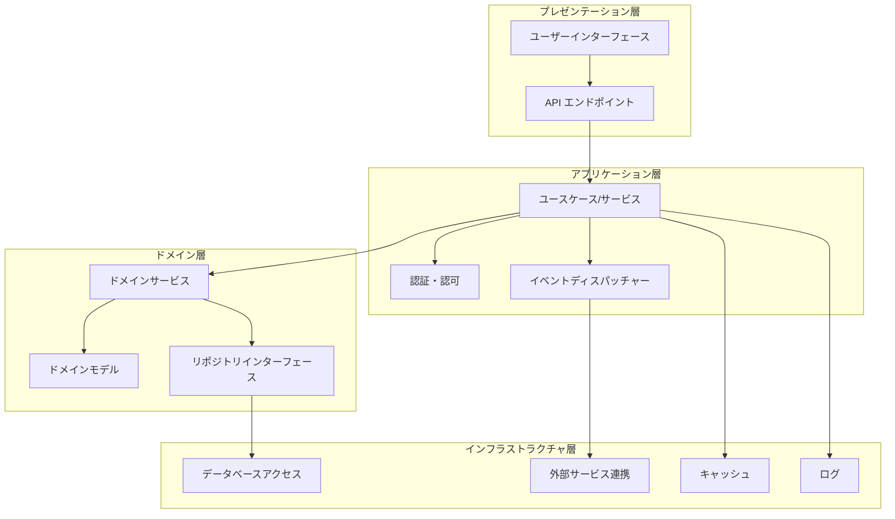
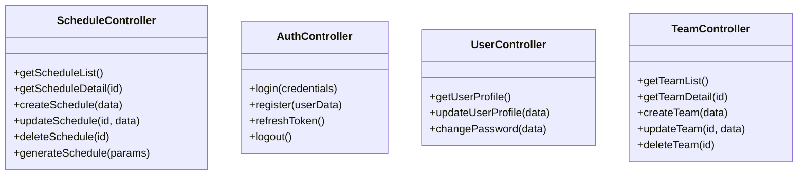
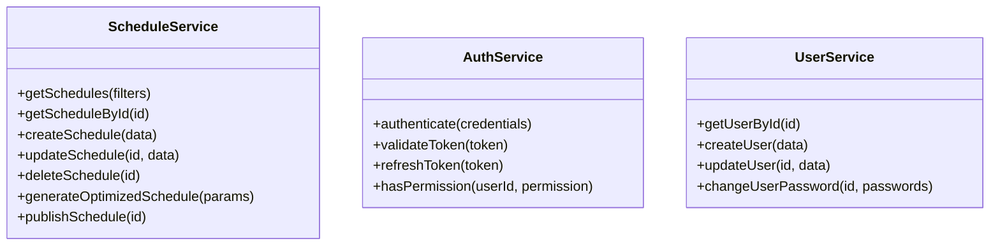
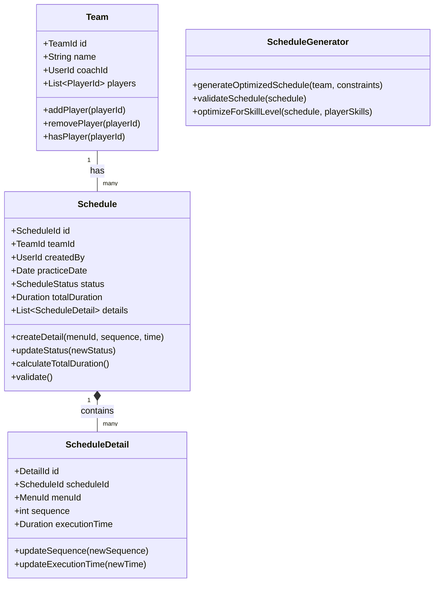
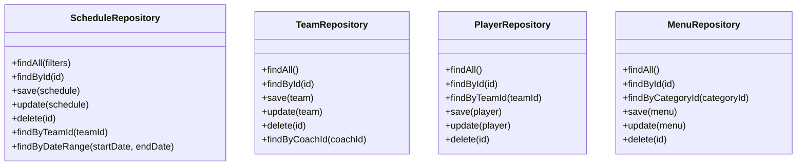
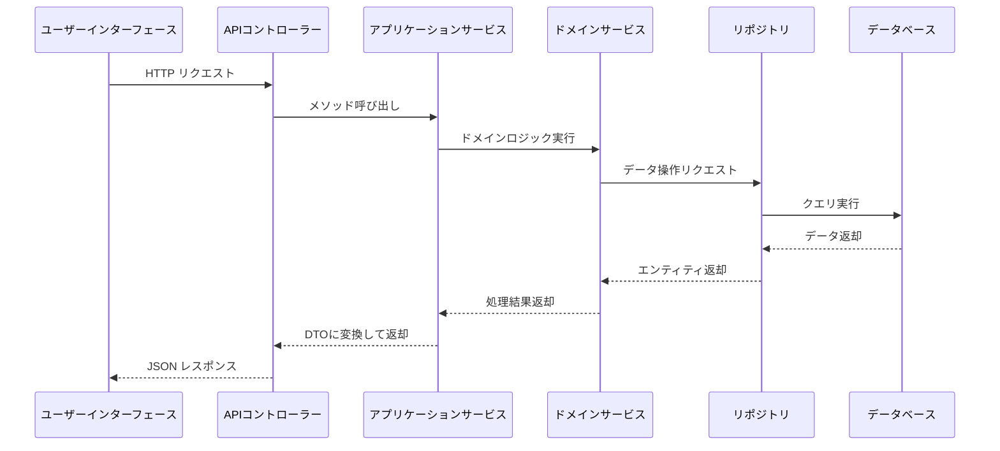
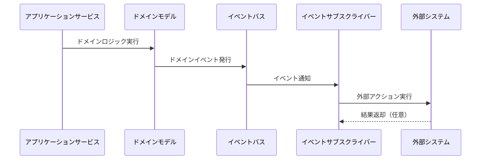
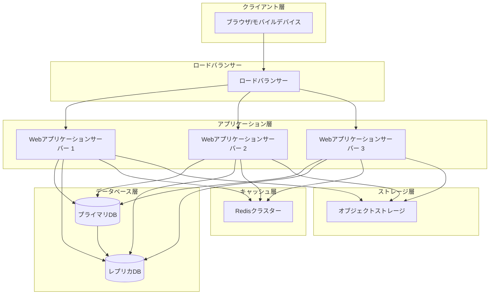
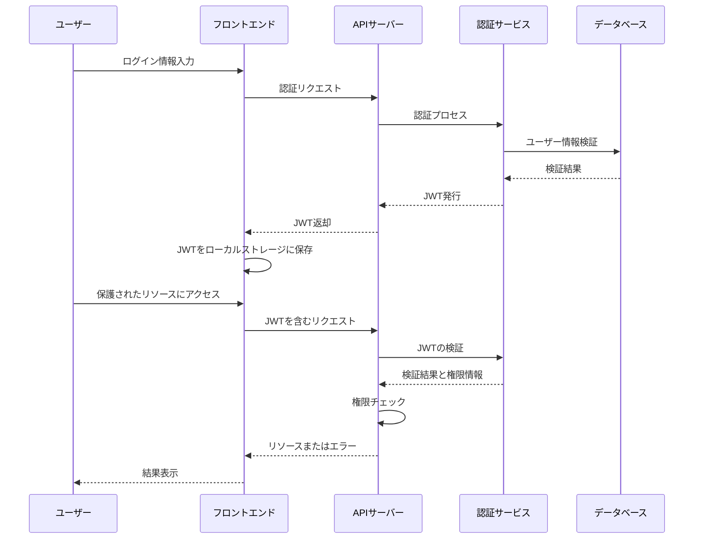

# アーキテクチャモデル詳細

## 1. 概要

本ドキュメントでは、練習表自動生成システムのアーキテクチャモデルについて詳細に説明します。システムアーキテクチャは、システムの構造的基盤であり、コンポーネント間の関係や相互作用、配置、制約を定義します。適切なアーキテクチャ設計により、品質要件（スケーラビリティ、パフォーマンス、セキュリティなど）を満たしつつ、保守性やテスト容易性を確保します。

本システムでは、以下のアーキテクチャ原則を採用しています：

- **関心の分離**: 機能ごとに責任を明確に分離し、コンポーネントの独立性を高める
- **レイヤード構造**: 適切な抽象化レベルでレイヤーを分割し、上位レイヤーは下位レイヤーに依存
- **モジュール性**: 疎結合・高凝集なモジュール設計により、保守性と拡張性を確保
- **テスタビリティ**: 各コンポーネントが独立してテスト可能な設計
- **スケーラビリティ**: 将来の負荷増加に対応できる設計

## 2. アーキテクチャ全体像

システム全体のアーキテクチャは、クリーンアーキテクチャとドメイン駆動設計の原則に基づいており、以下の図のように構成されています。

## 3. レイヤー設計

システムは4つの主要レイヤーから構成されており、各レイヤーは特定の責任を持ちます。

### 3.1 プレゼンテーション層

ユーザーインターフェースとAPIエンドポイントを提供するレイヤー。

#### 主要コンポーネント

- **Webインターフェース**: React/Vue.jsベースのSPA（シングルページアプリケーション）
- **モバイルインターフェース**: レスポンシブWebデザイン + PWA対応
- **API コントローラー**: RESTful APIエンドポイントの実装
- **バリデーター**: 入力データの検証

#### 依存関係

- アプリケーション層のユースケース/サービスに依存
- UIコンポーネントはステート管理（Redux/Vuex）を通じてデータを共有

#### 設計パターン

- MVC/MVVM パターン
- Presentational and Container Component パターン

### 3.2 アプリケーション層

業務ロジックを実現するためのユースケースやサービスを提供するレイヤー。

#### 主要コンポーネント

- **ユースケース/サービス**: 特定の業務機能を実現する処理の集合
- **認証・認可サービス**: ユーザー認証と権限管理
- **イベントディスパッチャー**: ドメインイベント処理と発行
- **DTOマッパー**: データ変換

#### 依存関係

- ドメイン層のサービスとモデルに依存
- インフラストラクチャ層には直接依存せず、抽象（インターフェース）に依存

#### 設計パターン

- CQRS（コマンドクエリ責務分離）
- メディエーターパターン
- ファサードパターン

### 3.3 ドメイン層

システムのコアとなるビジネスロジックとドメインモデルを定義するレイヤー。

#### 主要コンポーネント

- **エンティティ**: ビジネス概念を表現するオブジェクト（ID持つ）
- **値オブジェクト**: 属性の集合として表現されるオブジェクト
- **ドメインサービス**: 複数のエンティティに跨るロジック
- **アグリゲート**: 関連するエンティティと値オブジェクトの集合
- **リポジトリインターフェース**: 永続化の抽象化

#### 依存関係

- 他のどのレイヤーにも依存しない（最も内側のレイヤー）

#### 設計パターン

- エンティティ-値オブジェクトパターン
- アグリゲートパターン
- リポジトリパターン
- ドメインサービスパターン

### 3.4 インフラストラクチャ層

外部システムとの連携や技術的関心事を担当するレイヤー。

#### 主要コンポーネント

- **データアクセス**: リポジトリの実装、ORマッパー
- **外部サービス連携**: APIクライアント、メール送信など
- **キャッシュ**: データキャッシュの実装
- **ロギング**: システムログの記録
- **設定管理**: 環境設定の読み込みと管理

#### 依存関係

- ドメイン層で定義されたインターフェースを実装
- 外部ライブラリやフレームワークに依存

#### 設計パターン

- リポジトリパターンの実装
- アダプターパターン
- デコレーターパターン
- ファクトリーパターン

## 4. コンポーネント間コミュニケーション

システム内のコンポーネント間のコミュニケーションパターンを定義します。

### 4.1 同期通信

### 4.2 非同期通信（イベント駆動）

## 5. 展開アーキテクチャ

システムの展開（デプロイメント）構成を示します。

## 6. 技術スタック

システムで使用される主要な技術スタックを定義します。

### 6.1 フロントエンド

- **フレームワーク**: React.js
- **状態管理**: Redux + Redux Toolkit
- **UIライブラリ**: Material-UI
- **ビルドツール**: Webpack, Babel
- **テストツール**: Jest, React Testing Library

### 6.2 バックエンド

- **言語**: Node.js / TypeScript
- **Webフレームワーク**: Express.js
- **ORマッパー**: TypeORM
- **認証**: JSON Web Token (JWT)
- **バリデーション**: Joi / class-validator

### 6.3 データベース

- **RDBMS**: MySQL 8.0
- **キャッシュ**: Redis
- **検索エンジン**: Elasticsearch (オプション)

### 6.4 インフラストラクチャ

- **コンテナ化**: Docker
- **オーケストレーション**: Kubernetes
- **CI/CD**: GitHub Actions
- **モニタリング**: Prometheus + Grafana
- **ログ管理**: ELK Stack

## 7. セキュリティアーキテクチャ

システムのセキュリティ設計について説明します。

### 7.1 認証・認可フロー

### 7.2 データ保護

- **転送中データ保護**: TLS 1.3によるすべての通信の暗号化
- **保存データ保護**: センシティブデータの暗号化（パスワードはbcryptでハッシュ化）
- **アクセス制御**: ロールベースアクセス制御（RBAC）の実装

### 7.3 セキュリティ対策

- **入力検証**: すべてのユーザー入力に対するバリデーション
- **CSRF対策**: トークンベースの保護
- **XSS対策**: 出力エスケープ、CSP（Content Security Policy）
- **レート制限**: APIリクエストに対するレート制限の実装
- **監査ログ**: セキュリティ関連イベントの記録と監視

## 8. スケーラビリティと高可用性

システムのスケーラビリティと高可用性を確保するための設計について説明します。

### 8.1 水平スケーリング

- **ステートレスアプリケーション設計**: セッション状態をRedisに保存
- **ロードバランシング**: リクエストの分散処理
- **オートスケーリング**: 負荷に応じたインスタンス数の自動調整

### 8.2 データベースのスケーリング

- **リードレプリケーション**: 読み取り負荷の分散
- **シャーディング**: 将来的なデータ量増加に対応
- **バックアップと復旧計画**: 定期的なバックアップと復旧手順の確立

### 8.3 高可用性設計

- **複数アベイラビリティゾーン**: 地理的な冗長性
- **フェイルオーバー**: 自動的な障害検知と切り替え
- **サーキットブレーカー**: 依存サービスの障害伝播防止

## 9. パフォーマンス最適化

システムのパフォーマンスを最適化するための設計と戦略について説明します。

### 9.1 キャッシング戦略

- **アプリケーションキャッシュ**: 頻繁にアクセスされるデータのメモリキャッシュ
- **データベースクエリキャッシュ**: 共通クエリの結果をキャッシュ
- **CDN**: 静的アセットのキャッシュと配信

### 9.2 データベース最適化

- **インデックス設計**: 
  - 検索・ソートの頻度が高いフィールド（日付、会場ID、メンバーID、ステータスなど）に適切なインデックスを設定
  - 複合インデックスの戦略的適用
  - インデックスメンテナンス計画の策定
- **クエリ最適化**: 
  - 実行計画の分析と最適化
  - N+1問題を回避するための結合クエリの最適化
  - 大量データに対するページネーション実装
  - 不要なカラム取得の回避
- **データパーティショニング**:
  - 時系列データのパーティショニング（練習スケジュール、履歴データ）
  - 効率的なクエリとメンテナンス
- **非正規化戦略**:
  - スケジュール関連の集計データは非正規化テーブルに保持
  - 頻繁に参照される設定値はキャッシュに保持
- **コネクションプーリング**: 
  - データベース接続の効率的な再利用
  - コネクションリソースの適切な設定
- **読み書き分離パターン**:
  - 読み取り専用クエリと更新クエリの分離
  - 負荷分散と並列処理の効率化

### 9.3 フロントエンド最適化

- **バンドルサイズ最適化**: コード分割とレイジーローディング
- **画像最適化**: WebPフォーマットと適切なサイズ設定
- **APIレスポンス最適化**: 必要なデータのみを返却

## 10. アーキテクチャの評価

設計されたアーキテクチャの評価と成熟度について説明します。

### 10.1 品質特性評価

| 品質特性 | 評価 | コメント |
|---------|-----|---------|
| パフォーマンス | 高 | キャッシング戦略と最適化により応答性が高い |
| スケーラビリティ | 高 | 水平スケーリングに対応した設計 |
| 安全性 | 高 | 多層防御と最新のセキュリティプラクティスを採用 |
| 保守性 | 中〜高 | モジュール化された設計だが、依存関係の管理に注意が必要 |
| テスト容易性 | 高 | 責任の分離により単体テストが容易 |
| 拡張性 | 高 | プラグイン可能なアーキテクチャにより新機能追加が容易 |

### 10.2 主要なトレードオフ

- **複雑性 vs 柔軟性**: クリーンアーキテクチャの採用により、初期の複雑性は増加するが長期的な柔軟性と保守性が向上
- **パフォーマンス vs 安全性**: セキュリティ対策による若干のオーバーヘッドが存在するが、最適化により相殺
- **開発速度 vs 品質**: アーキテクチャの厳格さにより初期開発は遅くなる可能性があるが、長期的な品質と保守性は向上

### 10.3 今後の進化

- **マイクロサービス化**: 将来的な成長に応じて、一部の機能をマイクロサービスとして分離することを検討
- **サーバーレスアーキテクチャ**: 特定の計算集約的な処理（練習表最適化など）をサーバーレス関数に移行する可能性
- **AIの統合**: 練習表生成の高度な最適化のためのAIモデルの組み込み 