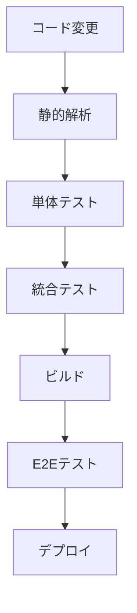

# 実装指針：テスト戦略

## 1. 概要

本ドキュメントでは、練習表自動生成システムのテスト戦略について説明します。品質を確保し、バグを早期に発見するための包括的なテスト手法を定義します。

## 2. テストピラミッド

テスト戦略は、以下のテストピラミッドに基づいて構築します：

```
    /\
   /E2E\
  /-----\
 /統合テスト\
/-------------\
/   単体テスト   \
-----------------
```

- **単体テスト**: 個々の関数、クラス、コンポーネントが期待通りに動作するか検証
- **統合テスト**: 複数のモジュールやシステムコンポーネント間の相互作用を検証
- **E2Eテスト**: ユーザーの視点からシステム全体の動作を検証

## 3. テスト種類と範囲

### 3.1 単体テスト

| 対象 | ツール | カバレッジ目標 |
|------|--------|--------------|
| フロントエンド | Vitest + Testing Library | 80% |
| バックエンド | Jest | 90% |

#### 3.1.1 フロントエンド単体テスト

- **コンポーネントテスト**: UIコンポーネントの表示と動作
- **Hooksテスト**: カスタムフックの動作
- **Utilsテスト**: ユーティリティ関数の動作

#### 3.1.2 バックエンド単体テスト

- **Serviceテスト**: ビジネスロジックのテスト
- **Repositoryテスト**: データアクセス層のテスト
- **Middlewareテスト**: ミドルウェアの動作検証

### 3.2 統合テスト

| 対象 | ツール | カバレッジ目標 |
|------|--------|--------------|
| フロントエンド | Vitest + Testing Library | 60% |
| バックエンド | Jest + Supertest | 70% |

#### 3.2.1 フロントエンド統合テスト

- **ページテスト**: 複数のコンポーネントが統合されたページの動作
- **ストアテスト**: Redux状態管理とコンポーネントの連携
- **APIテスト**: APIクライアントとモックサーバーの連携

#### 3.2.2 バックエンド統合テスト

- **API Routeテスト**: エンドポイントの動作検証
- **データフローテスト**: リクエストからレスポンスまでの一連の流れ
- **依存サービステスト**: 外部サービスとの連携

### 3.3 E2Eテスト

| 対象 | ツール | テスト範囲 |
|------|--------|----------|
| アプリケーション全体 | Cypress | 主要ユーザーフロー |

- **ユーザーフロー**: 重要なユーザーシナリオをカバー
- **クロスブラウザテスト**: 主要ブラウザでの動作検証
- **レスポンシブネステスト**: 様々な画面サイズでの表示確認

## 4. テスト自動化戦略

### 4.1 CI/CDパイプラインとの統合



### 4.2 テスト実行タイミング

| テスト種類 | 実行タイミング |
|-----------|--------------|
| 静的解析 | pre-commit, CI |
| 単体テスト | 開発中, pre-push, CI |
| 統合テスト | pre-push, CI |
| E2Eテスト | CI (プルリクエスト, main/master) |

### 4.3 テスト環境

- **開発環境**: ローカル開発マシン
- **CI環境**: GitHub Actions / Jenkins
- **ステージング環境**: 本番に近い環境でのE2Eテスト
- **プレプロダクション環境**: 最終検証

## 5. フロントエンドテスト実装の概要

### 5.1 コンポーネントテスト

コンポーネントテストでは、以下の点を検証します：

1. **レンダリングの正確性**：
   - 渡されたpropsに基づいてUIが正しく表示されるかを検証
   - 日付、時間、場所などのテキスト表示が意図したとおりに行われるか

2. **ユーザーインタラクション**：
   - ボタンクリックなどのイベントが適切に処理されるか
   - クリック時にコールバック関数が正しい引数で呼び出されるか

3. **条件付きレンダリング**：
   - 特定の条件下でUI要素が表示/非表示になるかを検証
   - エラー状態や空のデータなどのエッジケースの処理

React Testing Libraryを使用し、実際のDOMツリーに対して検証を行うことで、ユーザー視点での動作を保証します。モックやスタブを活用して、外部依存を隔離し、テストの信頼性と再現性を確保します。

### 5.2 カスタムフックテスト

カスタムフックのテストでは、以下の点を検証します：

1. **ステート管理**：
   - フックが状態を正しく管理するか
   - 初期状態から状態遷移が適切に行われるか

2. **API連携**：
   - データ取得が正しく行われるか
   - ローディング状態やエラー状態が適切に処理されるか
   - 取得したデータが正しくフォーマットされるか

3. **副作用と依存関係**：
   - 依存値の変更に応じて処理が再実行されるか
   - クリーンアップ関数が適切に実行されるか

renderHook関数を使用して、フックの内部動作をライフサイクル全体を通じてテストします。React Queryなどのライブラリを使用している場合は、適切なProviderでラップして、実際の使用環境に近い状態でテストを行います。

### 5.3 統合テスト

フロントエンドの統合テストでは、以下の点を検証します：

1. **コンポーネントの連携**：
   - 複数のコンポーネントが連携して正しく動作するか
   - データの受け渡しやイベントの伝播が適切に行われるか

2. **状態管理との連携**：
   - グローバル状態の変更がUIに反映されるか
   - UIの操作によってグローバル状態が適切に更新されるか

3. **ルーティングとナビゲーション**：
   - 適切なルーティング設定で画面遷移が行われるか
   - URLパラメータを含む動的ルーティングが機能するか

複雑なコンポーネント階層をテストするために、Reduxストア、React Queryクライアント、ルーターなどの依存関係を適切にセットアップし、実際のアプリケーション環境に近い状態でテストを実行します。APIリクエストはモック化して、テストの信頼性と速度を確保します。

## 6. バックエンドテスト実装の概要

### 6.1 サービス単体テスト

サービスレイヤーの単体テストでは、以下の点を検証します：

1. **ビジネスロジック**：
   - 入力データに対して正しく処理が行われるか
   - 例外や特殊なケースが適切に処理されるか

2. **リポジトリとの連携**：
   - データアクセス層への正しいパラメータでの呼び出し
   - リポジトリから返された結果の適切な処理

3. **例外処理**：
   - 無効なIDや存在しないリソースへのアクセス時に適切な例外が発生するか
   - エラー状態が適切に処理されるか

テスト実行時には、サービスが依存するリポジトリやその他のサービスをモック化し、テストの範囲を対象のサービスに限定します。NestJSのTestingModuleを使用して、依存関係の注入を管理し、クリーンなテスト環境を準備します。

### 6.2 コントローラー統合テスト

コントローラーの統合テストでは、以下の点を検証します：

1. **エンドポイントの動作**：
   - 各エンドポイントが期待通りのレスポンスを返すか
   - リクエストパラメータやボディが正しく解析されるか

2. **サービスとの連携**：
   - コントローラーがサービスを正しいパラメータで呼び出すか
   - サービスからの戻り値が適切にレスポンスに変換されるか

3. **バリデーション**：
   - 無効なリクエストデータが適切に拒否されるか
   - バリデーションエラーが適切なレスポンス形式で返されるか

コントローラーが依存するサービスをモック化し、特定のシナリオに対する戻り値を定義します。これにより、コントローラーのリクエスト処理ロジックとレスポンス生成ロジックを、サービスの実際の実装から独立してテストできます。

### 6.3 E2Eテスト

バックエンドのE2Eテストでは、以下の点を検証します：

1. **エンドツーエンドの動作**：
   - 実際のデータベースとの連携を含むAPIエンドポイントの動作
   - リクエストからレスポンスまでの全処理フロー

2. **認証と認可**：
   - 保護されたエンドポイントへのアクセス制御
   - JWTトークンベースの認証フロー

3. **データの永続化**：
   - データが正しくデータベースに保存されるか
   - 取得したデータが期待通りの形式で返されるか

NestJSアプリケーション全体を初期化し、実際のHTTPリクエストを送信して応答を検証します。テスト前にテスト用のユーザーとデータを準備し、テスト後にはクリーンアップを行い、テスト環境を初期状態に戻します。SupertestライブラリによるHTTPリクエスト送信とレスポンス検証を行います。

## 7. Cypressによる E2Eテスト

### 7.1 テスト実装の概要

Cypressを使用したE2Eテストでは、以下のユーザーフローを検証します：

1. **ユーザー認証**：
   - ログインプロセスの正常な動作
   - 認証状態の適切な保持

2. **スケジュール管理**：
   - スケジュールの作成、表示、編集、削除の一連の流れ
   - フォーム入力と送信の動作
   - 成功/エラーメッセージの表示

3. **ナビゲーション**：
   - アプリケーション内の画面遷移
   - チーム選択からスケジュール管理への流れ

実際のブラウザ上でアプリケーションを実行し、ユーザーの操作をシミュレートすることで、フロントエンドとバックエンドの連携を含めた総合的な機能検証を行います。各ステップでは要素の表示確認や状態変化の検証を行い、エンドユーザー視点での品質を保証します。

### 7.2 カスタムコマンドの活用

Cypressテストの効率化と可読性向上のために、以下のようなカスタムコマンドを活用します：

1. **認証関連コマンド**：
   - ログイン処理を共通化し、セッション保持によるテスト高速化
   - ユーザーロールに応じた認証状態の設定

2. **データ操作コマンド**：
   - APIを直接呼び出してテストデータの作成や削除
   - データベース初期化やシード処理の効率化

カスタムコマンドを使用することで、テストコード内の重複を減らし、メンテナンス性を向上させます。また、複雑な前提条件の設定をAPI呼び出しで効率化し、テスト実行時間を短縮します。セッション機能を活用して、同一ユーザーでの複数テスト間で認証状態を共有することで、パフォーマンスを最適化します。

## 8. テスト可能なコードの作成ガイドライン

### 8.1 フロントエンド

- **関心の分離**: 表示（UI）とロジックを分離する
- **純粋コンポーネント**: props のみに依存する再利用可能なコンポーネントを作成
- **フックの分離**: ロジックを独立したカスタムフックに分離
- **テスト可能な状態管理**: グローバル状態へのアクセスをラップして依存性を隔離

### 8.2 バックエンド

- **依存性の注入**: 外部依存を注入可能にして、モックを容易にする
- **インターフェースの活用**: 具象クラスではなくインターフェースに依存する
- **ドメインロジックの分離**: ビジネスロジックをインフラストラクチャから分離
- **副作用の制限**: 副作用を特定のレイヤーに制限する

## 9. テスト計画とレポート

### 9.1 テスト実施計画

- **定期的なテスト実行**: CI/CD パイプラインでの自動実行
- **回帰テスト**: 主要機能の変更時に実施
- **パフォーマンステスト**: 月次で実施
- **セキュリティテスト**: 四半期ごとに実施

### 9.2 テストレポート

- **カバレッジレポート**: Jest/Vitest + Istanbul によるコードカバレッジ
- **テスト結果ダッシュボード**: テスト成功率とトレンド
- **バグトラッキング**: 発見されたバグとその状態

## 10. まとめ

本テスト戦略は、以下のポイントを重視しています：

1. **階層的アプローチ**: テストピラミッドに基づく効率的なテスト構造
2. **自動化**: CI/CDと統合された自動テスト
3. **カバレッジ**: 重要な機能と高リスク領域の優先的なカバー
4. **保守性**: テスト自体の保守性を確保する設計

この戦略に従うことで、高品質なソフトウェアの提供と、効率的な開発プロセスの両立を実現します。 