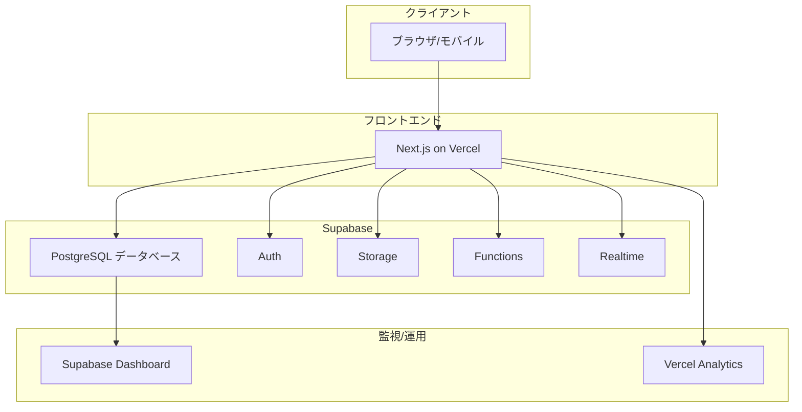
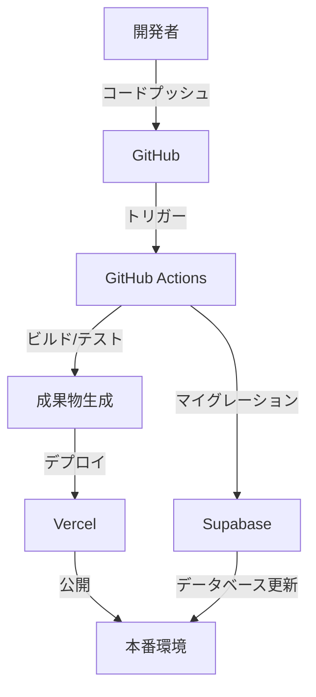

# 実装指針：デプロイとインフラストラクチャ

## 1. 概要

本ドキュメントでは、練習表自動生成システムのデプロイとインフラストラクチャに関する指針について説明します。Supabaseを活用したサーバーレスアーキテクチャによる安定性、コスト効率、保守性の向上を目指します。

## 2. デプロイアーキテクチャ

### 2.1 全体構成

システムは以下の環境で構成されます：

- **開発環境**: 開発者のローカル環境およびCI/CD環境
- **テスト環境**: QAテスト用の環境
- **本番環境**: エンドユーザーが使用する実運用環境（同志社大学能部、約100人規模）

### 2.2 デプロイアーキテクチャ図



## 3. インフラストラクチャ技術スタック

### 3.1 クラウドプラットフォーム

- **フロントエンド**: Vercel
- **バックエンド**: Supabase

### 3.2 主要サービス

| カテゴリ | サービス | 用途 |
|---------|--------|------|
| フロントエンドホスティング | Vercel | Next.jsアプリケーションのホスティング |
| データベース | Supabase PostgreSQL | メインデータベース |
| 認証 | Supabase Auth | ユーザー認証・認可 |
| ストレージ | Supabase Storage | ファイルストレージ |
| API | Supabase REST/GraphQL | 自動生成されたAPI |
| サーバーレス関数 | Supabase Edge Functions | カスタムビジネスロジック |
| リアルタイム機能 | Supabase Realtime | リアルタイムデータ更新 |
| CI/CD | GitHub Actions | 継続的デリバリー |

## 4. インフラストラクチャ設計

### 4.1 Supabaseプロジェクト設計

Supabaseは以下の機能を一元的に提供します：

- **PostgreSQL**: スケールアップ可能なデータベース
- **自動生成API**: RESTとGraphQLエンドポイント
- **認証・認可**: JWTベースの認証
- **ストレージ**: ファイル保存と管理
- **リアルタイム更新**: WebSocketを活用した更新通知
- **Edge Functions**: サーバーレスロジックの実行

### 4.2 セキュリティ設計

- **認証セキュリティ**:
  - JWTベースのセッション管理
  - ロールベースのアクセス制御
  - MFA（多要素認証）のオプション設定

- **データベースセキュリティ**:
  - Row Level Security (RLS)によるきめ細かなアクセス制御
  - データベースレベルでの権限制御
  - 保存時の暗号化

- **APIセキュリティ**:
  - APIキー管理
  - レート制限
  - CORSポリシー設定

### 4.3 高可用性設計

- **Supabaseの高可用性**:
  - Supabaseプラットフォームの冗長性に依存
  - 自動バックアップ
  - ポイントインタイムリカバリの利用

- **Vercelの高可用性**:
  - グローバルCDN
  - エッジケーシング
  - 自動スケーリング

### 4.4 スケーラビリティ設計

- **データベーススケーリング**:
  - 適切なSupabaseプランの選択
  - パフォーマンス監視と必要に応じたアップグレード
  - 接続プール最適化

- **フロントエンドスケーリング**:
  - Vercelによる自動スケーリング
  - 静的生成とISRの活用
  - クライアントサイドキャッシュ戦略

## 5. デプロイパイプライン

### 5.1 CI/CDフロー



### 5.2 デプロイ戦略

- **フロントエンド (Vercel)**:
  - プレビューデプロイメント（PR毎）
  - 本番デプロイ（main/masterブランチ）
  - ロールバック機能

- **バックエンド (Supabase)**:
  - マイグレーションベースのデータベース更新
  - スキーマの段階的変更
  - テストプロジェクトでの検証

### 5.3 GitHub Actionsワークフロー例

```yaml
# .github/workflows/deploy.yml
name: Deploy

on:
  push:
    branches: [main]
  pull_request:
    branches: [main]

jobs:
  test:
    runs-on: ubuntu-latest
    steps:
      - uses: actions/checkout@v3
      - name: Set up Node.js
        uses: actions/setup-node@v3
        with:
          node-version: '18'
      - name: Install dependencies
        run: npm ci
      - name: Run tests
        run: npm test

  deploy:
    needs: test
    if: github.event_name == 'push' && github.ref == 'refs/heads/main'
    runs-on: ubuntu-latest
    steps:
      - uses: actions/checkout@v3
      
      # Supabaseマイグレーション
      - name: Supabase Migration
        uses: supabase/cli-action@v1
        with:
          command: db push
        env:
          SUPABASE_ACCESS_TOKEN: ${{ secrets.SUPABASE_ACCESS_TOKEN }}
          SUPABASE_DB_PASSWORD: ${{ secrets.SUPABASE_DB_PASSWORD }}
          SUPABASE_PROJECT_ID: ${{ secrets.SUPABASE_PROJECT_ID }}

      # Vercelデプロイ (自動化されているためスキップ可能)
      # Vercelはデフォルトでデプロイを自動化しています
```

## 6. データ管理とバックアップ

### 6.1 バックアップ戦略

- **Supabaseバックアップ**:
  - 自動日次バックアップの活用
  - ポイントインタイムリカバリの設定
  - 重要データの手動エクスポート

- **データ保持ポリシー**:
  - バックアップの30日保持
  - アーカイブデータの長期保存戦略
  - ログの管理と保持期間設定

### 6.2 データ移行と同期

- **開発環境と本番環境の同期**:
  - 匿名化されたデータのローカルコピー
  - マイグレーションスクリプトの管理
  - スキーマの一貫性確保

## 7. モニタリングと運用

### 7.1 監視戦略

- **Supabaseダッシュボード**:
  - データベースパフォーマンスモニタリング
  - APIリクエスト統計
  - エラーログ

- **Vercelモニタリング**:
  - パフォーマンスメトリクス
  - エラーレポート
  - ユーザー体験データ

### 7.2 アラート設定

- **Eメールアラート**:
  - クリティカルエラー
  - リソース使用率の閾値超過
  - セキュリティイベント

### 7.3 運用手順

- **定期メンテナンス**:
  - パフォーマンス評価（月次）
  - データベース最適化
  - 機能更新と計画

- **インシデント対応**:
  - エスカレーションプロセス
  - 障害復旧手順
  - コミュニケーション計画

## 8. コスト最適化

### 8.1 リソース計画

- **適切なプランの選択**:
  - 同志社大学能部の約100ユーザー向けに最適なプラン
  - 使用量に応じた段階的なスケールアップ計画

- **コスト監視**:
  - 月次使用量レビュー
  - 異常検知と対応

### 8.2 最適化戦略

- **データベース最適化**:
  - インデックス戦略
  - クエリ最適化
  - キャッシュの活用

- **フロントエンド最適化**:
  - 静的生成の最大活用
  - APIコール最小化
  - クライアントキャッシュ戦略

## 9. セキュリティコンプライアンス

### 9.1 データ保護

- **個人情報保護**:
  - 教育機関のデータ取り扱いポリシーの遵守
  - 最小権限の原則適用
  - データアクセス監査

### 9.2 セキュリティレビュー

- **定期セキュリティレビュー**:
  - 四半期ごとのセキュリティ評価
  - 脆弱性スキャン
  - アクセス権限の見直し

## 10. 災害復旧計画

### 10.1 復旧戦略

- **RTO (Recovery Time Objective)**:
  - 目標: 24時間以内

- **RPO (Recovery Point Objective)**:
  - 目標: 24時間以内のデータ損失許容

### 10.2 復旧手順

- **データベース復旧**:
  - Supabaseバックアップからの復元
  - データ整合性検証

- **アプリケーション復旧**:
  - Vercelデプロイメント履歴からのロールバック
  - 設定の再適用 