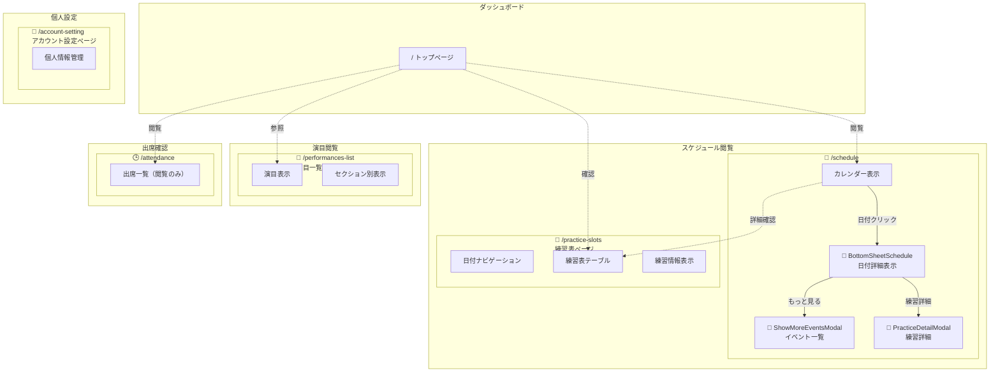
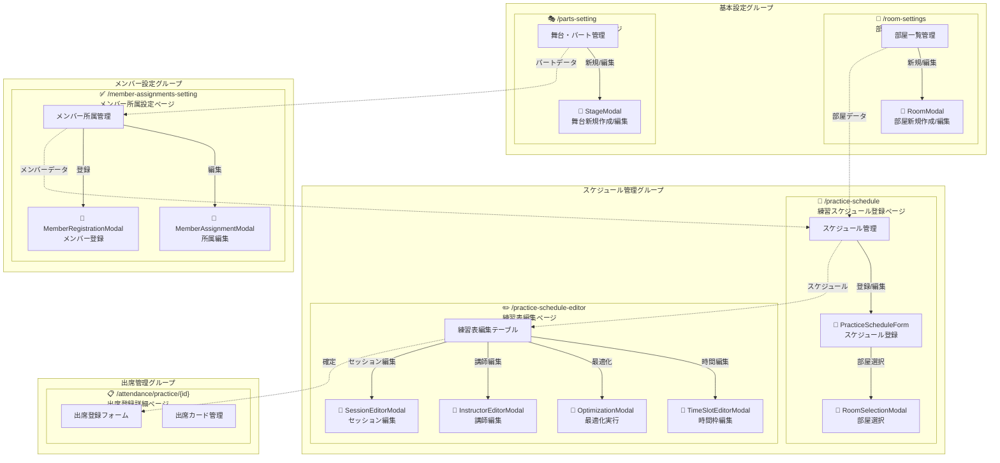

# フロントエンドルーティング構造図

> **トモシゴト 能楽部練習表** - ページ＆モーダル依存関係マップ  
> バージョン: 3.0.0（ER図のみ） | 最終更新: 2025-11-01

---

## 👤 一般ユーザー向けマップ

**アクセス可能な機能**: 閲覧、確出席認、個人設定

---

## 👨‍💼 管理者向けマップ

**アクセス可能な機能**: 全機能（設定、編集、登録、削除、閲覧）

