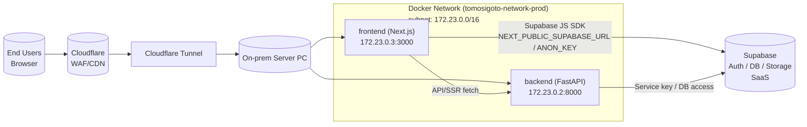

# 本番インフラ構成図

以下に、Cloudflare から社内サーバー上の Docker コンテナ群へ到達する経路を示します。

- Cloudflare が最前段（WAF/CDN）に位置し、Cloudflare Tunnel 経由でオンプレミスのサーバー PC に到達します。
- サーバー側では `docker-compose.prod.yml` により `tomosigoto-network-prod` 上で FastAPI バックエンド（172.23.0.2:8000）と Next.js フロントエンド（172.23.0.3:3000）が起動します。
- フロントエンドは Cloudflare 経由で公開され、API コールや SSR の際にバックエンドへ到達します。
- フロントエンドは `NEXT_PUBLIC_SUPABASE_URL` / `NEXT_PUBLIC_SUPABASE_ANON_KEY` で Supabase（SaaS）へ直接アクセスし、バックエンドもサービスキーで Supabase を利用します。
- `.env.production` をコンテナにマウントし、Supabase/API 向けの接続情報を各サービスに渡しています。
