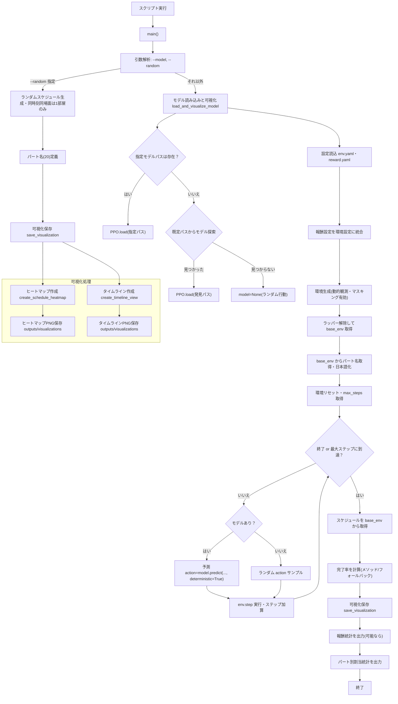

## visualize_assignments.py フロー図（Mermaid）

`scripts/visualize_assignments.py` の処理フローを日本語で図示しています。ランダム実行パスとモデル使用パス、環境生成、推論ループ、画像保存までをカバーします。

- 出力先: `outputs/visualizations`
  - ヒートマップ: `schedule_heatmap_YYYYMMDD_HHMMSS.png`
  - タイムライン: `schedule_timeline_YYYYMMDD_HHMMSS.png`
