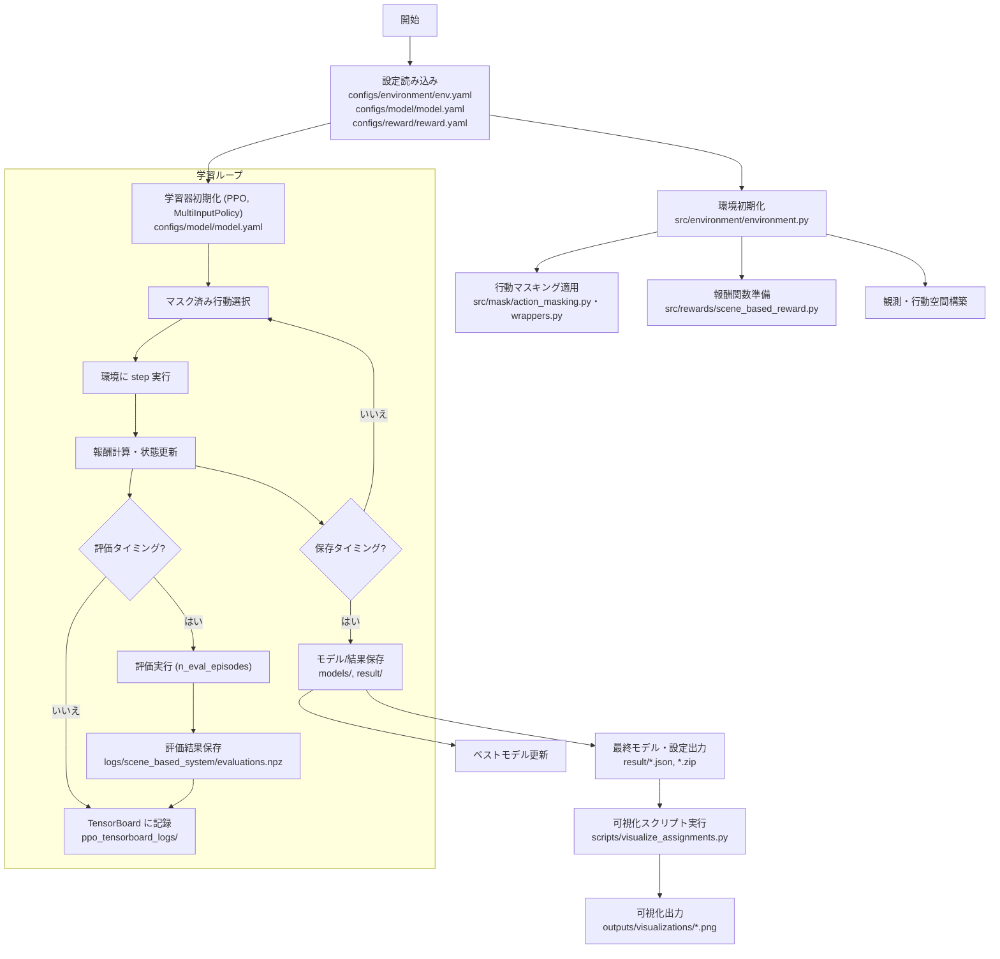
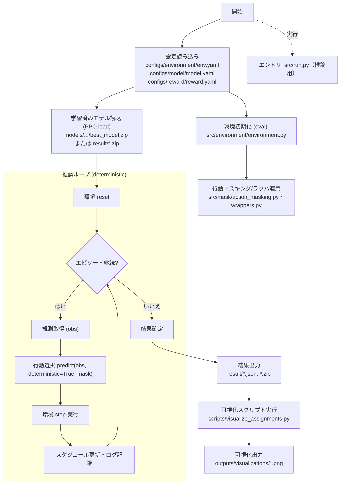

# 能の練習表作成システム 設計書

## 1. システム概要

### 1.1 目的
能の練習における効率的なスケジュール作成を支援するAIシステム。従来の「人」を割り当てる方式から「場面」を割り当てる方式に変更し、より柔軟で実用的な練習スケジュールの生成を実現する。

### 1.2 主要変更点
- **割り当て対象の変更**: 人 → 場面（シーン・役柄・楽器・歌など）
- **柔軟性の向上**: 同じ場面を複数の人が担当可能
- **練習効率の最適化**: 場面別の練習時間配分の最適化

## 2. 要件定義

### 2.1 機能要件

#### 2.1.1 基本機能
- 場面別の練習スケジュール作成
- 部屋・時間帯の最適な割り当て
- 監督者の配置と管理
- 練習の進行度管理

#### 2.1.2 場面管理
- 場面の種類定義（シテ、ワキ、地謡、囃子方など）
- 場面の優先度設定
- 場面別の練習時間要件
- 場面の組み合わせ制約

#### 2.1.3 スケジュール最適化
- 部屋容量の最適活用
- 時間帯の重複回避
- 監督者の効率的な配置
- 練習の連続性の確保

### 2.2 非機能要件
- リアルタイムでのスケジュール更新
- 柔軟な設定変更への対応
- 直感的なUI/UX
- 高パフォーマンスな計算処理

## 3. データモデル

### 3.1 場面（Scene）
```yaml
scene:
  id: string
  name: string          # 場面名（例：シテ、ワキ、地謡）
  category: string      # カテゴリ（役柄、楽器、歌）
  priority: int         # 優先度（1-5）
  min_practice_time: int # 最小練習時間（分）
  max_practice_time: int # 最大練習時間（分）
  required_skills: list # 必要なスキル
  compatible_scenes: list # 同時練習可能な場面
  is_supervisor: bool   # 監督者としての役割を持つか
  supervision_scenes: list # 監督可能な場面（空の場合は自身のみ）
```

### 3.2 練習セッション（Practice Session）
```yaml
session:
  id: string
  scene_id: string      # 場面ID
  room_id: string       # 部屋ID
  timeslot: int         # 時間帯
  duration: int         # 練習時間（分）
  participants: list    # 参加者リスト
  status: string        # ステータス（予定、進行中、完了）
```

### 3.3 部屋（Room）
```yaml
room:
  id: string
  name: string          # 部屋名
  capacity: int         # 部屋容量
  priority: int         # 部屋の優先度
  equipment: list       # 設備・機材
  special_requirements: list # 特殊要件
```

### 3.4 環境設定

#### 3.4.1 基本設定
```yaml
environment:
  max_rooms: 10         # 最大部屋数
  max_scenes: 20        # 最大場面数
  max_timeslots: 4      # 最大時間帯数
  max_people: 60        # 最大人数
  session_duration: 60  # 基本セッション時間（分）
```

#### 3.4.2 動的範囲設定
```yaml
dynamic_ranges:
  scenes:
    min: 19             # 場面数の最小値
    max: 20             # 場面数の最大値
  rooms:
    min: 6              # 部屋数の最小値
    max: 8              # 部屋数の最大値
  people:
    min: 55             # 人数の最小値
    max: 60             # 人数の最大値
```

#### 3.4.3 場面設定例（19-20場面）
```yaml
scene_templates:
  # 主要役柄
  - name: "シテ"
    category: "役柄"
    priority: 5
    
  - name: "ワキ"
    category: "役柄"
    priority: 4
    
  - name: "舞囃子"
    category: "舞"
    priority: 4
    
  # 歌・謡
  - name: "地謡"
    category: "歌"
    priority: 3
    
  - name: "謡"
    category: "歌"
    priority: 3
    
  # 楽器
  - name: "笛"
    category: "楽器"
    priority: 3
    
  - name: "小鼓"
    category: "楽器"
    priority: 2
    
  - name: "大鼓"
    category: "楽器"
    priority: 2
    
  - name: "太鼓"
    category: "楽器"
    priority: 2
    
  - name: "囃子"
    category: "楽器"
    priority: 3
    
  - name: "地拍子"
    category: "楽器"
    priority: 2
    
  # 調子別謡
  - name: "一調"
    category: "歌"
    priority: 2
    
  - name: "二調"
    category: "歌"
    priority: 2
    
  - name: "三調"
    category: "歌"
    priority: 2
    
  - name: "四調"
    category: "歌"
    priority: 2
    
  - name: "五調"
    category: "歌"
    priority: 2
    
  - name: "六調"
    category: "歌"
    priority: 2
    
  - name: "七調"
    category: "歌"
    priority: 2
    
  - name: "八調"
    category: "歌"
    priority: 2
    
  # 舞
  - name: "仕舞"
    category: "舞"
    priority: 3
```

#### 3.4.4 部屋設定例
```yaml
room_templates:
  - name: "大ホール"
    capacity: 30
    priority: 5
    
  - name: "中ホール"
    capacity: 20
    priority: 4
    
  - name: "稽古場"
    capacity: 25
    priority: 4
    
  - name: "リハーサル室"
    capacity: 22
    priority: 4
    
  - name: "練習室A"
    capacity: 15
    priority: 3
    
  - name: "練習室B"
    capacity: 15
    priority: 3
    
  - name: "練習室C"
    capacity: 15
    priority: 3
    
  - name: "小ホール"
    capacity: 12
    priority: 3
    
  - name: "多目的室"
    capacity: 18
    priority: 3
    
  - name: "楽器練習室"
    capacity: 10
    priority: 2
```

## 4. 報酬設計

### 4.1 報酬関数の基本方針
- **シンプルな報酬構造**: 複雑な報酬計算を避け、明確な目標指向
- **ステップベースの抑制**: 過度なステップ報酬を避け、目標達成重視
- **制約の段階的制御**: 監督制約や設備制約を段階的に適用

### 4.2 報酬構成

#### 4.2.1 基本報酬
```yaml
basic_rewards:
  new_assignment: 1.0      # 新規場面割り当て
  reassignment: -1.0       # 再割り当て（移動）
  repeat_action: -8.0      # 重複行動ペナルティ
  step_penalty: -0.05      # 毎ステップの軽微ペナルティ
```

#### 4.2.2 完了報酬
```yaml
completion_rewards:
  scene_completion: 1.0    # 場面完了ボーナス
```

#### 4.2.3 制約報酬
```yaml
person_constraints:
  person_conflict: -0.05   # 人物重複ペナルティ
  no_move_bonus_per_person: 3  # 同一部屋滞在ボーナス
```

### 4.3 報酬計算ロジック
```python
def calculate_reward(self, state, action, done):
    reward = 0.0
    
    # 基本報酬
    if self.is_new_assignment(action):
        reward += self.rewards.basic.new_assignment
    elif self.is_reassignment(action):
        reward += self.rewards.basic.reassignment
    
    # 重複行動ペナルティ
    if self.is_repeat_action(action):
        reward += self.rewards.basic.repeat_action
    
    # 制約違反チェック
    reward += self.check_person_constraints(state)
    
    # 完了報酬
    if done and self.is_all_scenes_assigned(state):
        reward += self.rewards.completion.scene_completion
    
    # ステップペナルティ
    reward += self.rewards.basic.step_penalty
    
    return reward
```

## 5. 行動マスキング設計

### 5.1 マスキング戦略
- **制約ベース**: 物理的・論理的制約を厳格に適用
- **柔軟性**: 適切な範囲での行動選択を許可
- **重複制御**: 重複行動の防止

### 5.2 マスキングルール

#### 5.2.1 基本制約
```python
def get_action_mask(self):
    mask = np.ones(self.action_space.n, dtype=bool)
    
    for action in range(self.action_space.n):
        time, scene, room = self.unravel_action(action)
        
        # 1. 範囲チェック
        if not self.is_valid_indices(time, scene, room):
            mask[action] = False
            continue
            
        # 2. 部屋要件チェック
        if not self.meets_room_requirements(scene, room):
            mask[action] = False
            continue
            
        # 3. 時間重複チェック
        if self.has_time_conflict(time, scene):
            mask[action] = False
            continue
            
        # 4. 重複行動チェック
        if self.is_repeat_action(action):
            mask[action] = False
            continue
    
    return mask
```

## 6. 環境設計

### 6.1 観測空間
```python
observation_space = spaces.Dict({
    "schedule": spaces.MultiBinary((num_timeslots, num_scenes, num_rooms)),
    "scene_status": spaces.Box(low=0, high=1, shape=(num_scenes,)),
    "room_occupancy": spaces.Box(low=0, high=max_people, shape=(num_rooms,)),
    "scene_priorities": spaces.Box(low=0, high=5, shape=(num_scenes,)),
    "action_history": spaces.MultiBinary((max_action_history,))
})
# 時間帯数: num_timeslots = ceil(max_scenes / max_rooms)
```

### 6.2 行動空間
```python
action_space = spaces.Discrete(num_timeslots * num_scenes * num_rooms)
# 行動の展開: (time, scene, room)
# 時間帯数: num_timeslots = ceil(max_scenes / max_rooms)
```

### 6.3 状態遷移
```python
def step(self, action):
    # 1. 行動の実行
    time, scene, room = self.unravel_action(action)
    
    # 2. 制約チェック
    if not self.is_valid_action(time, scene, room):
        return self._get_invalid_action_response()
    
    # 3. 状態更新
    self.schedule[time, scene, room] = 1
    self.update_scene_status(scene)
    self.update_action_history(action)
    
    # 4. 報酬計算
    reward = self.calculate_reward()
    
    # 5. 終了判定
    done = self.is_episode_complete()
    
    return self._get_observation(), reward, done, self._get_info()
```

## 7. 学習設定

### 7.1 モデル設定
```yaml
model:
  type: "PPO"
  policy: "MultiInputPolicy"
  learning_rate: 0.0003
  total_timesteps: 20000000
  n_steps: 512
  batch_size: 2048
  n_epochs: 6
  n_envs: 32
  device: "cuda"
  gamma: 0.99
  gae_lambda: 0.95
  clip_range: 0.2
  ent_coef: 0.01
  vf_coef: 0.5
  target_kl: 0.1
```

### 7.2 ネットワーク構造
```yaml
policy_kwargs:
  net_arch:
    pi: [256, 128]            # ポリシーネットワーク
    vf: [256, 128]            # 価値関数ネットワーク
```

### 7.3 学習パラメータ
```yaml
training:
  total_timesteps: 20000000   # 2000万ステップ
  save_freq: 250000           # 25万ステップ毎に保存
  eval_freq: 250000           # 25万ステップ毎に評価
  n_eval_episodes: 5          # 評価エピソード数
  tb_log_name: "ppo_20M_run"  # TensorBoardログ名
```

## 8. 評価指標

### 8.1 スケジュール品質指標
- **場面割り当て完了率**: 全場面の割り当て完了度
- **時間効率**: 練習時間の最適化度
- **部屋利用率**: 部屋の効率的な使用率

### 8.2 学習効率指標
- **収束速度**: 目標達成までの学習ステップ数
- **安定性**: 学習過程での報酬の安定性
- **汎化性**: 異なる設定での性能

## 9. 実装計画

### 9.1 Phase 1: 基本環境構築 ✅
- 場面ベースの環境クラス実装
- 基本的な報酬関数実装
- 行動マスキング実装

### 9.2 Phase 2: 最適化機能 ✅
- 高度な報酬関数実装
- 学習アルゴリズムの調整
- 評価システムの構築

### 9.3 Phase 3: 統合・テスト 🔄
- システム統合
- 性能テスト・最適化
- ドキュメント整備

## 10. 技術スタック

### 10.1 バックエンド
- **Python 3.8+**: メイン言語
- **Gymnasium**: 強化学習環境
- **Stable-Baselines3**: 学習アルゴリズム
- **PyTorch**: ディープラーニングフレームワーク

### 10.2 インフラ
- **CUDA**: GPU学習対応
- **TensorBoard**: 学習可視化
- **YAML**: 設定ファイル形式

## 11. リスク・課題

### 11.1 技術的課題
- **状態空間の複雑性**: 場面数増加による計算量増大
- **制約の複雑性**: 能特有の制約の適切なモデル化
- **学習の安定性**: 複雑な環境での学習収束

### 11.2 対策
- **段階的学習**: 簡単な環境から段階的に複雑化
- **制約の段階的適用**: 重要度に応じた制約の段階的導入
- **ハイパーパラメータ最適化**: 自動化された最適化手法の活用

## 12. 今後の拡張

### 12.1 短期拡張
- 複数日スケジュール対応
- 動的な制約変更対応
- リアルタイム調整機能

### 12.2 長期拡張
- 他伝統芸能への応用
- 学習データの蓄積・活用
- ユーザー適応型システム

## 13. 処理フロー図

現在の処理の全体像をフロー図で示します。



## 14. モデル利用（推論）フロー図

学習済みモデルを用いてスケジュールを生成・可視化する際のフローを示します。



---
*この設計書は、能の練習表作成システムの包括的な設計を示すものです。実装の進行に応じて継続的に更新・改善を行います。*
