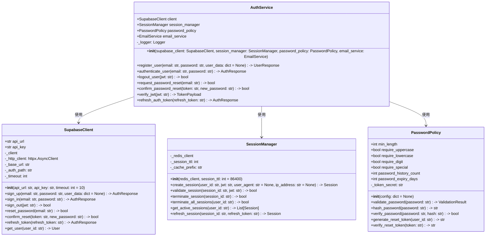

# BACK-API-001.1: メールアドレス・パスワードによるログイン/ログアウトAPI実装

## 概要
練習表自動生成システムの認証基盤となるメールアドレスとパスワードによる認証システムをPythonで実装します。Supabase Authを活用したAPIエンドポイントを開発し、安全なログイン/ログアウト機能とトークン管理を提供します。

## 詳細
- Supabase認証プロバイダの設定とPythonラッパーの実装
- メールアドレス認証のセットアップとPython APIの開発
- パスワードポリシーと要件の設定
- ログイン/ログアウトAPIエンドポイントの実装
- セッション管理とトークン有効期限のPython実装

## 依存関係
- 親タスク: BACK-API-001
- BACK-DB-001.1: ユーザー・メンバー管理テーブルの設計と実装

## 参照ファイル
- [設計書/07_権限・ロール設計.md](../../../../設計書/07_権限・ロール設計.md)
- [設計書/11g_実装指針_バックエンド.md](../../../../設計書/11g_実装指針_バックエンド.md)

## 成果物
- Supabase Auth設定ファイル
- Python認証クライアントライブラリ
- メール認証テンプレート
- 認証関連APIのエンドポイント定義
- 認証フロー実装コード
- 認証テスト仕様書

## ステータス
- [x] 未開始
- [ ] 進行中
- [ ] レビュー中
- [ ] 完了

## 担当者
未割り当て

## 主要機能
1. **認証プロバイダ設定**
   - メールアドレス認証の有効化
   - パスワード認証の設定
   - SupabaseクライアントのPythonラッパー
   - FastAPI連携用のSupabase Auth APIの実装

2. **パスワードポリシー**
   - 最小文字数要件の実装
   - 文字種の複雑さ要件の検証ロジック
   - パスワード有効期限管理
   - Pythonによるパスワードリセットフロー

3. **認証APIエンドポイント**
   - ユーザー登録エンドポイント
   - ログインエンドポイント
   - ログアウトエンドポイント
   - パスワードリセットエンドポイント
   - トークン検証エンドポイント

## 実装予定ファイル
以下は実装予定の全ファイルのリストです。各ファイルの役割と目的を簡潔に記載します。

- `app/auth/client.py` - Supabase認証機能のPythonラッパー
- `app/auth/service.py` - 認証サービスの主要クラス
- `app/auth/password_policy.py` - パスワードポリシー実装
- `app/auth/session.py` - セッション管理機能
- `app/api/auth/routes.py` - 認証関連APIエンドポイント
- `app/api/auth/schemas.py` - 認証関連のPydanticスキーマ
- `app/templates/emails/confirmation.html` - メール確認テンプレート
- `app/templates/emails/reset_password.html` - パスワードリセットテンプレート
- `config/auth.json` - Supabase Auth設定ファイル
- `tests/auth/test_auth_service.py` - 認証サービスのテスト
- `tests/auth/test_password_policy.py` - パスワードポリシーのテスト
- `tests/auth/test_session.py` - セッション管理のテスト

## 設計図
### クラス図


## 実装アプローチ
### 認証プロバイダ設定
1. **Supabase APIラッパー実装**
   - httpxを使用した非同期HTTPクライアントの実装
   - Supabase Auth APIとのインターフェース設計
   - エラーハンドリングと再試行メカニズムの実装
   - レスポンスデータのモデル化とPydanticの活用

2. **認証サービス実装**
   - 認証フローの抽象化とビジネスロジックの実装
   - トークン管理と検証メカニズムの設計
   - セッションと連携した認証状態管理
   - ロギングと監査機能の統合

## 実装するすべてのファイル構成詳細
以下は全ての実装予定ファイルの詳細です。各ファイルごとに目的とクラス/インターフェース、メソッド、依存関係などを詳しく記載します。

### `app/auth/client.py`
**目的**: Supabase認証APIとの通信を担当するクライアントクラスを実装

**クラス/インターフェース**:
- `SupabaseClient`: Supabase Auth APIのPythonラッパー
  - **継承/実装**: なし
  - **主要メソッド**: 
    - `__init__(api_url: str, api_key: str, timeout: int = 10)`: クライアントの初期化
    - `sign_up(email: str, password: str, user_data: dict = None) -> AuthResponse`: ユーザー登録
    - `sign_in(email: str, password: str) -> AuthResponse`: ログイン処理
    - `sign_out(jwt: str) -> bool`: ログアウト処理
    - `reset_password(email: str) -> bool`: パスワードリセット要求
    - `confirm_reset(token: str, new_password: str) -> bool`: パスワードリセット確認
    - `refresh_token(refresh_token: str) -> AuthResponse`: トークン更新
  - **依存クラス**: なし

**依存関係**:
- `httpx`: 非同期HTTP通信ライブラリ
- `pydantic`: データ検証ライブラリ
- `logging`: ロギングライブラリ

### `app/auth/service.py`
**目的**: 認証関連のビジネスロジックを提供するサービスクラスを実装

**クラス/インターフェース**:
- `AuthService`: 認証サービスの中核クラス
  - **継承/実装**: なし
  - **主要メソッド**: 
    - `__init__(supabase_client: SupabaseClient, session_manager: SessionManager, password_policy: PasswordPolicy, email_service: EmailService)`: サービスの初期化
    - `register_user(email: str, password: str, user_data: dict = None) -> UserResponse`: ユーザー登録処理
    - `authenticate_user(email: str, password: str) -> AuthResponse`: ユーザー認証
    - `logout_user(jwt: str) -> bool`: ログアウト処理
    - `request_password_reset(email: str) -> bool`: パスワードリセット要求処理
    - `verify_jwt(jwt: str) -> TokenPayload`: JWTトークン検証
  - **依存クラス**: `SupabaseClient`, `SessionManager`, `PasswordPolicy`, `EmailService`

**依存関係**:
- `app.auth.client`: Supabaseクライアント
- `app.auth.session`: セッション管理
- `app.auth.password_policy`: パスワードポリシー
- `pydantic`: データ検証ライブラリ
- `logging`: ロギングライブラリ

### `app/auth/password_policy.py`
**目的**: パスワードポリシーと関連機能を実装

**クラス/インターフェース**:
- `PasswordPolicy`: パスワードポリシー管理クラス
  - **継承/実装**: なし
  - **主要メソッド**: 
    - `__init__(config: dict = None)`: ポリシー設定の初期化
    - `validate_password(password: str) -> ValidationResult`: パスワード検証
    - `hash_password(password: str) -> str`: パスワードハッシュ化
    - `verify_password(password: str, hash: str) -> bool`: パスワード検証
    - `generate_reset_token(user_id: str) -> str`: リセットトークン生成
    - `verify_reset_token(token: str) -> str`: リセットトークン検証
  - **依存クラス**: なし

- `ValidationResult`: パスワード検証結果を表すクラス
  - **継承/実装**: なし
  - **主要メソッド**: 
    - `__init__(is_valid: bool = True, errors: List[str] = None, message: str = "")`: 結果の初期化
    - `add_error(error: str) -> None`: エラー追加
    - `has_errors() -> bool`: エラー有無確認
  - **依存クラス**: なし

**依存関係**:
- `passlib`: パスワードハッシュライブラリ
- `pydantic`: データ検証ライブラリ
- `jwt`: JWTライブラリ
- `datetime`: 日付時間ライブラリ

### `app/auth/session.py`
**目的**: セッション管理機能を実装

**クラス/インターフェース**:
- `SessionManager`: セッション管理クラス
  - **継承/実装**: なし
  - **主要メソッド**: 
    - `__init__(redis_client, session_ttl: int = 86400)`: マネージャーの初期化
    - `create_session(user_id: str, jwt: str, user_agent: str = None, ip_address: str = None) -> Session`: セッション作成
    - `validate_session(session_id: str, jwt: str) -> bool`: セッション検証
    - `terminate_session(session_id: str) -> bool`: セッション終了
    - `terminate_all_sessions(user_id: str) -> bool`: ユーザーの全セッション終了
    - `get_active_sessions(user_id: str) -> List[Session]`: アクティブセッション取得
  - **依存クラス**: なし

- `Session`: セッション情報を表すクラス
  - **継承/実装**: なし
  - **主要メソッド**: 
    - `__init__(user_id: str, jwt: str)`: セッションの初期化
    - `is_expired() -> bool`: 有効期限確認
    - `time_until_expiry() -> timedelta`: 残り有効時間取得
    - `extend(additional_time: int) -> None`: 有効期間延長
  - **依存クラス**: なし

**依存関係**:
- `redis`: Redisクライアントライブラリ
- `pydantic`: データ検証ライブラリ
- `uuid`: UUID生成ライブラリ
- `datetime`: 日付時間ライブラリ
- `json`: JSONシリアライズライブラリ

### `app/api/auth/routes.py`
**目的**: 認証関連のAPIエンドポイントを定義

**クラス/インターフェース**:
- `AuthRouter`: 認証ルーターのクラス
  - **継承/実装**: なし
  - **主要メソッド**: 
    - `register_user(user_data: UserCreate) -> UserResponse`: ユーザー登録エンドポイント
    - `login_user(credentials: UserLogin) -> AuthResponse`: ログインエンドポイント
    - `logout_user(token: str = Depends(oauth2_scheme)) -> dict`: ログアウトエンドポイント
    - `request_password_reset(email_data: EmailRequest) -> dict`: パスワードリセット要求エンドポイント
    - `refresh_token(refresh_data: RefreshRequest) -> AuthResponse`: トークン更新エンドポイント
  - **依存クラス**: `AuthService`

**依存関係**:
- `fastapi`: FastAPIフレームワーク
- `app.auth.service`: 認証サービス
- `app.api.auth.schemas`: APIスキーマ
- `fastapi.security`: OAuth2セキュリティスキーム
- `logging`: ロギングライブラリ

## ファイル間クラス連携図
```mermaid
graph TD
    subgraph "認証クライアント"
        CL[client.py]
    end
    
    subgraph "認証サービス"
        SV[service.py]
        PP[password_policy.py]
        SM[session.py]
    end
    
    subgraph "APIエンドポイント"
        RT[routes.py]
        SC[schemas.py]
    end
    
    CL --> SV
    PP --> SV
    SM --> SV
    
    SV --> RT
    SC --> RT
    
    classDef client fill:#bbf,stroke:#33f,stroke-width:2px;
    classDef service fill:#fbb,stroke:#f33,stroke-width:2px;
    classDef api fill:#bfb,stroke:#3f3,stroke-width:2px;
    
    class CL client;
    class SV,PP,SM service;
    class RT,SC api;