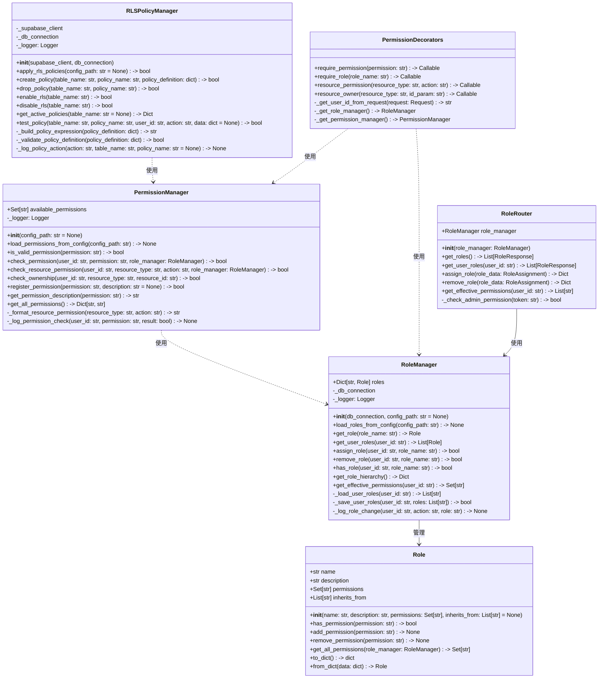
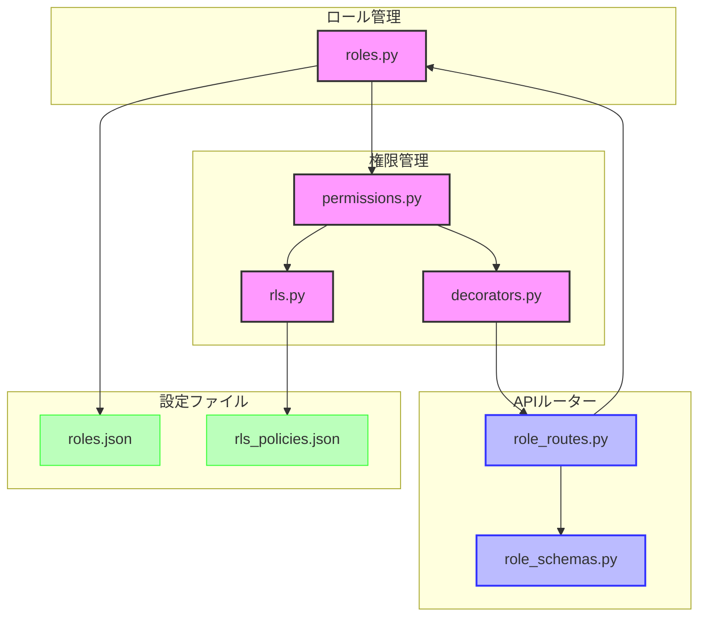

# BACK-API-001.2: 管理者/一般ユーザー/閲覧専用の基本権限設定

## 概要
練習表自動生成システムにおけるユーザー権限管理の基本設定をPythonで実装します。管理者、一般ユーザー、閲覧専用の各ロールに応じたアクセス制御機能を開発し、システム全体のセキュリティと適切な情報アクセスを実現します。

## 詳細
- ロールベースのアクセス制御（RBAC）システムの実装
- 管理者/一般ユーザー/閲覧専用の基本権限設計と実装
- Pythonデコレータを使用した権限チェックメカニズム
- RLSポリシーとの連携による行レベルセキュリティの実装
- ロールの動的割り当てと変更機能の実装

## 依存関係
- 親タスク: BACK-API-001
- BACK-API-001.1: メールアドレス・パスワードによるログイン/ログアウトAPI実装
- BACK-DB-001.1: ユーザー・メンバー管理テーブルの設計と実装

## 参照ファイル
- [設計書/07_権限・ロール設計.md](../../../../設計書/07_権限・ロール設計.md)
- [設計書/11g_実装指針_バックエンド.md](../../../../設計書/11g_実装指針_バックエンド.md)

## 成果物
- 権限管理サービスPythonモジュール
- ロール定義設定ファイル
- 権限チェックデコレータ
- APIエンドポイント権限設定
- RLSポリシー連携モジュール
- 権限テスト仕様書と実装

## ステータス
- [x] 未開始
- [ ] 進行中
- [ ] レビュー中
- [ ] 完了

## 担当者
未割り当て

## 主要機能
1. **ロールシステム**
   - 基本ロール（管理者/一般ユーザー/閲覧専用）の定義
   - ロール階層と継承関係の実装
   - ユーザーへのロール割り当て機能
   - ロール変更の監査ログ記録

2. **権限管理**
   - 機能単位の権限定義
   - リソース別アクセス制御の実装
   - ロールごとの権限マッピング
   - 権限チェックユーティリティの実装

3. **アクセス制御統合**
   - FastAPIエンドポイントとの権限連携
   - Supabase RLSポリシーとの統合
   - 動的権限チェックメカニズム
   - リソースオーナーシップの検証

## 実装予定ファイル
以下は実装予定の全ファイルのリストです。各ファイルの役割と目的を簡潔に記載します。

- `app/auth/roles.py` - ロール定義と管理機能の実装
- `app/auth/permissions.py` - 権限定義と検証機能の実装
- `app/auth/decorators.py` - 権限チェックデコレータの実装
- `app/auth/rls.py` - Row Level Security連携機能
- `app/api/auth/role_routes.py` - ロール管理APIエンドポイント
- `app/api/auth/role_schemas.py` - ロール関連のPydanticスキーマ
- `config/roles.json` - ロールと権限の定義ファイル
- `config/rls_policies.json` - RLSポリシー設定ファイル
- `tests/auth/test_roles.py` - ロール管理機能のテスト
- `tests/auth/test_permissions.py` - 権限管理機能のテスト
- `tests/auth/test_rls.py` - RLS連携機能のテスト

## 設計図
### クラス図


## 実装アプローチ
### ロールベースアクセス制御システム構築
1. **ロール定義と管理**
   - JSONファイルベースのロール設定システムの実装
   - ロール階層と継承関係のグラフ実装
   - データベース連携によるユーザーロール割り当て
   - ロール変更の監査ログ記録メカニズム

2. **権限検証システム**
   - 効率的な権限チェックアルゴリズムの実装
   - キャッシュを活用した権限検証の最適化
   - リソースタイプとアクションに基づく権限構造
   - オーナーシップ検証のデータベース連携

## 実装するすべてのファイル構成詳細
以下は全ての実装予定ファイルの詳細です。各ファイルごとに目的とクラス/インターフェース、メソッド、依存関係などを詳しく記載します。

### `app/auth/roles.py`
**目的**: ロールの定義と管理機能を実装

**クラス/インターフェース**:
- `RoleManager`: ロール管理の中核クラス
  - **継承/実装**: なし
  - **主要メソッド**: 
    - `__init__(db_connection, config_path: str = None)`: マネージャの初期化
    - `load_roles_from_config(config_path: str) -> None`: 設定ファイルからロードする
    - `get_role(role_name: str) -> Role`: 特定ロールを取得する
    - `get_user_roles(user_id: str) -> List[Role]`: ユーザーのロールを取得する
    - `assign_role(user_id: str, role_name: str) -> bool`: ロールを割り当てる
    - `has_role(user_id: str, role_name: str) -> bool`: ロール所持を確認する
  - **依存クラス**: `Role`

- `Role`: ロールを表すクラス
  - **継承/実装**: なし
  - **主要メソッド**: 
    - `__init__(name: str, description: str, permissions: Set[str], inherits_from: List[str] = None)`: ロールの初期化
    - `has_permission(permission: str) -> bool`: 権限所持を確認する
    - `add_permission(permission: str) -> None`: 権限を追加する
    - `get_all_permissions(role_manager: RoleManager) -> Set[str]`: すべての権限（継承含む）を取得する
  - **依存クラス**: なし

**依存関係**:
- `sqlalchemy`: データベース操作ライブラリ
- `pydantic`: データ検証ライブラリ
- `logging`: ロギングライブラリ
- `json`: JSONパースライブラリ

### `app/auth/permissions.py`
**目的**: 権限の定義と検証機能を実装

**クラス/インターフェース**:
- `PermissionManager`: 権限管理クラス
  - **継承/実装**: なし
  - **主要メソッド**: 
    - `__init__(config_path: str = None)`: マネージャの初期化
    - `load_permissions_from_config(config_path: str) -> None`: 設定からロードする
    - `is_valid_permission(permission: str) -> bool`: 権限の有効性を確認する
    - `check_permission(user_id: str, permission: str, role_manager: RoleManager) -> bool`: 権限所持を確認する
    - `check_resource_permission(user_id: str, resource_type: str, action: str, role_manager: RoleManager) -> bool`: リソース操作権限を確認する
    - `check_ownership(user_id: str, resource_type: str, resource_id: str) -> bool`: リソース所有権を確認する
  - **依存クラス**: `RoleManager`

**依存関係**:
- `sqlalchemy`: データベース操作ライブラリ
- `pydantic`: データ検証ライブラリ
- `logging`: ロギングライブラリ
- `app.auth.roles`: ロール管理モジュール

### `app/auth/decorators.py`
**目的**: 権限チェックのデコレータを実装

**クラス/インターフェース**:
- `PermissionDecorators`: 権限デコレータを提供するクラス
  - **継承/実装**: なし
  - **主要メソッド**: 
    - `require_permission(permission: str) -> Callable`: 特定権限を要求するデコレータ
    - `require_role(role_name: str) -> Callable`: 特定ロールを要求するデコレータ
    - `resource_permission(resource_type: str, action: str) -> Callable`: リソース操作権限を要求するデコレータ
    - `resource_owner(resource_type: str, id_param: str) -> Callable`: リソース所有権を確認するデコレータ
  - **依存クラス**: `RoleManager`, `PermissionManager`

**依存関係**:
- `fastapi`: FastAPIフレームワーク
- `app.auth.roles`: ロール管理モジュール
- `app.auth.permissions`: 権限管理モジュール
- `logging`: ロギングライブラリ

### `app/auth/rls.py`
**目的**: Row Level Security連携機能を実装

**クラス/インターフェース**:
- `RLSPolicyManager`: RLSポリシー管理クラス
  - **継承/実装**: なし
  - **主要メソッド**: 
    - `__init__(supabase_client, db_connection)`: マネージャの初期化
    - `apply_rls_policies(config_path: str = None) -> bool`: ポリシーを適用する
    - `create_policy(table_name: str, policy_name: str, policy_definition: dict) -> bool`: ポリシーを作成する
    - `drop_policy(table_name: str, policy_name: str) -> bool`: ポリシーを削除する
    - `enable_rls(table_name: str) -> bool`: RLSを有効化する
    - `disable_rls(table_name: str) -> bool`: RLSを無効化する
    - `test_policy(table_name: str, policy_name: str, user_id: str, action: str, data: dict = None) -> bool`: ポリシーをテストする
  - **依存クラス**: なし

**依存関係**:
- `supabase`: Supabaseクライアントライブラリ
- `sqlalchemy`: データベース操作ライブラリ
- `logging`: ロギングライブラリ
- `json`: JSONパースライブラリ

### `app/api/auth/role_routes.py`
**目的**: ロール管理のAPIエンドポイントを定義

**クラス/インターフェース**:
- `RoleRouter`: ロール管理ルーターのクラス
  - **継承/実装**: なし
  - **主要メソッド**: 
    - `__init__(role_manager: RoleManager)`: ルーターの初期化
    - `get_roles() -> List[RoleResponse]`: 全ロール取得エンドポイント
    - `get_user_roles(user_id: str) -> List[RoleResponse]`: ユーザーロール取得エンドポイント
    - `assign_role(role_data: RoleAssignment) -> Dict`: ロール割り当てエンドポイント
    - `remove_role(role_data: RoleAssignment) -> Dict`: ロール削除エンドポイント
  - **依存クラス**: `RoleManager`

**依存関係**:
- `fastapi`: FastAPIフレームワーク
- `app.auth.roles`: ロール管理モジュール
- `app.auth.decorators`: 権限デコレータモジュール
- `app.api.auth.role_schemas`: ロールスキーマモジュール
- `logging`: ロギングライブラリ

### `config/roles.json`
**目的**: ロールと権限の定義ファイル

**主要構造**:
```json
{
  "roles": [
    {
      "name": "admin",
      "description": "システム管理者",
      "permissions": ["users:read", "users:write", "roles:read", "roles:write", "schedule:read", "schedule:write"],
      "inherits_from": []
    },
    {
      "name": "user",
      "description": "一般ユーザー",
      "permissions": ["users:read:self", "schedule:read", "schedule:write:self"],
      "inherits_from": []
    },
    {
      "name": "viewer",
      "description": "閲覧専用ユーザー",
      "permissions": ["schedule:read"],
      "inherits_from": []
    }
  ],
  "permissions": {
    "users:read": "ユーザー情報の閲覧",
    "users:read:self": "自身のユーザー情報の閲覧",
    "users:write": "ユーザー情報の編集",
    "roles:read": "ロール情報の閲覧",
    "roles:write": "ロール情報の編集",
    "schedule:read": "スケジュールの閲覧",
    "schedule:write": "スケジュールの編集",
    "schedule:write:self": "自身に関するスケジュールの編集"
  }
}
```

## ファイル間クラス連携図
