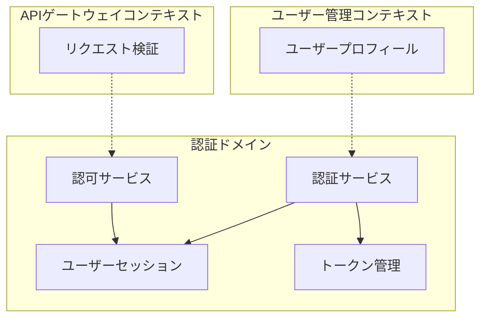
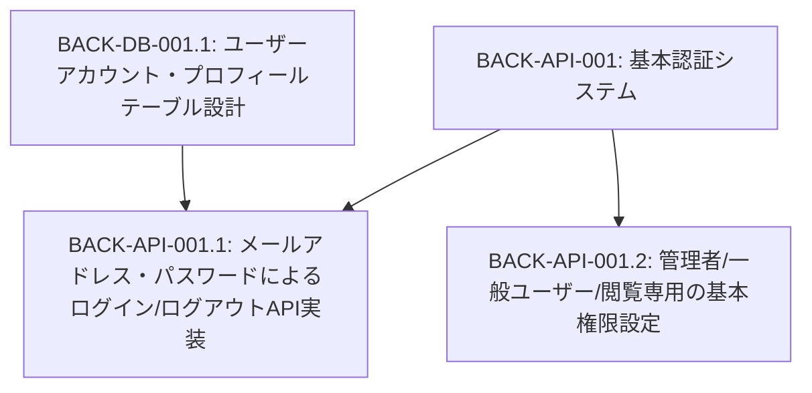
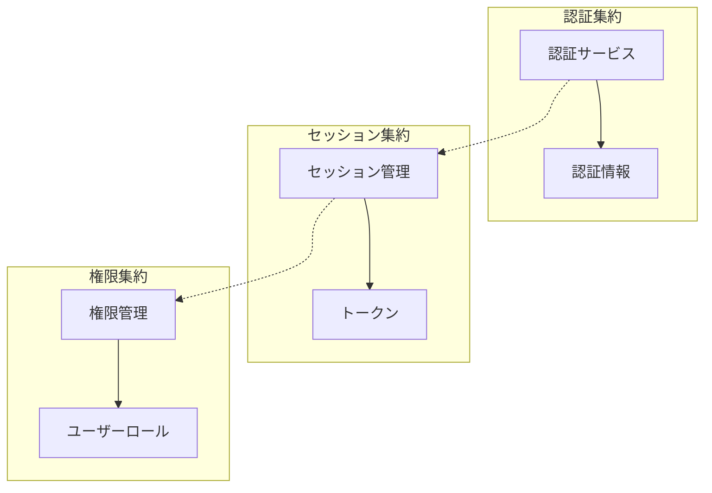
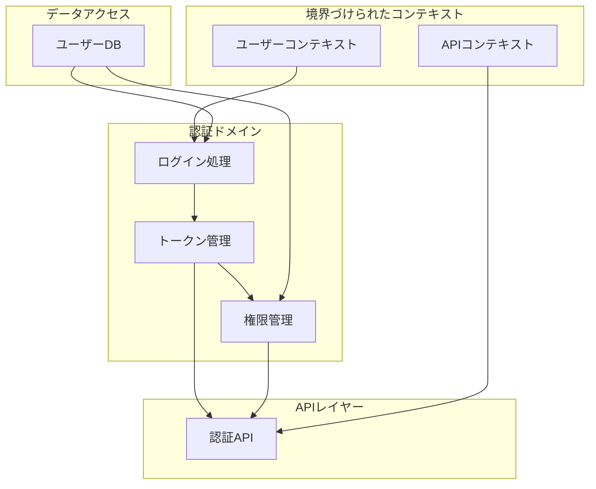
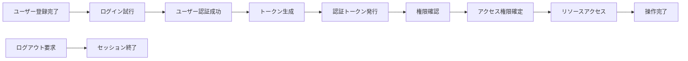

# BACK-API-001: 基本認証システム

## ドメインの概要
基本認証システムドメインは、ユーザーの認証と認可を管理し、システムへの安全なアクセスを提供します。メールアドレスとパスワードによるログイン/ログアウト機能の実装と、管理者、一般ユーザー、閲覧専用など異なる権限レベルのアクセス制御を担当します。

## ドメインモデルと境界づけられたコンテキスト

## ユビキタス言語

| 用語 | 定義 |
|------|------|
| 認証 | ユーザーの身元を確認するプロセス |
| 認可 | 認証されたユーザーに適切な権限を付与するプロセス |
| トークン | ユーザーの認証状態と権限を示す一時的な認証情報 |
| セッション | ユーザーのログイン状態を維持する期間 |
| RBAC | Role-Based Access Control（役割ベースのアクセス制御） |
| 管理者 | システム全体を管理できる最高権限を持つユーザー |
| 一般ユーザー | 標準的な機能を利用できる権限を持つユーザー |
| 閲覧専用 | 情報の閲覧のみが許可された限定的な権限 |

## サブドメイン構成

## サブドメイン詳細

### BACK-API-001.1: メールアドレス・パスワードによるログイン/ログアウトAPI実装
**ドメイン責務**: メールアドレスとパスワードを使用した認証システムを構築し、トークン管理を実装する

**ドメインサービス**:
- 認証サービス（ユーザー認証処理）
- トークン管理サービス（JWTトークン生成・検証）
- セッション管理（ログイン状態の維持と終了）

**ステータス**: 未開始

### BACK-API-001.2: 管理者/一般ユーザー/閲覧専用の基本権限設定
**ドメイン責務**: 異なるユーザー役割に基づいた権限システムを構築し、適切なアクセス制御を実現する

**ドメインサービス**:
- 権限管理サービス（ユーザーロールと権限の管理）
- アクセス制御サービス（リソースへのアクセス判定）

**ステータス**: 未開始

## コマンド・クエリ責務分離（CQRS）

### コマンド（書き込み操作）
- ユーザーログイン処理
- ユーザーログアウト処理
- パスワードリセット
- 権限設定変更
- トークン無効化

### クエリ（読み取り操作）
- 現在のユーザー情報取得
- トークン検証
- 権限確認
- セッション状態確認

## 集約と整合性境界

## 開発コンテキスト図

## 進捗管理

| サブドメイン | ステータス | 担当者 | 開始日 | 完了予定 | 実際の完了日 |
|------------|-----------|--------|-------|---------|------------|
| BACK-API-001.1 | 未開始 | | | | |
| BACK-API-001.2 | 未開始 | | | | |

## イベントストーミング

## 課題・リスク

- セキュリティ脆弱性（パスワード管理、トークン漏洩など）
- 過度に複雑な権限システムによる管理の難しさ
- パフォーマンスへの影響（トークン検証の頻度）
- セッション管理の複雑さ（複数デバイスでのログイン）
- パスワードリセットフローの安全性確保

## レビューポイント

- 認証プロセスのセキュリティ強度
- トークン管理の適切さ（有効期限、更新方法）
- 権限モデルの柔軟性と拡張性
- エラーハンドリングの完全性
- ユーザー体験への配慮（ログイン維持、セッションタイムアウト）

## リファレンス

- [設計書/07_権限・ロール設計.md](../../../設計書/07_権限・ロール設計.md)
- [設計書/11g_実装指針_バックエンド.md](../../../設計書/11g_実装指針_バックエンド.md) 