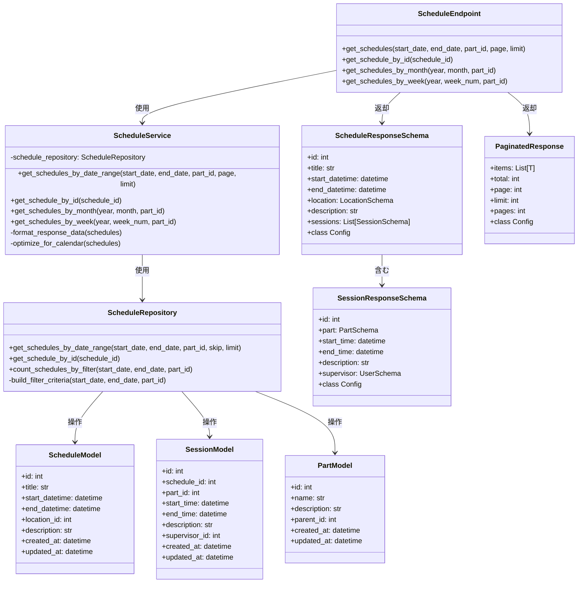
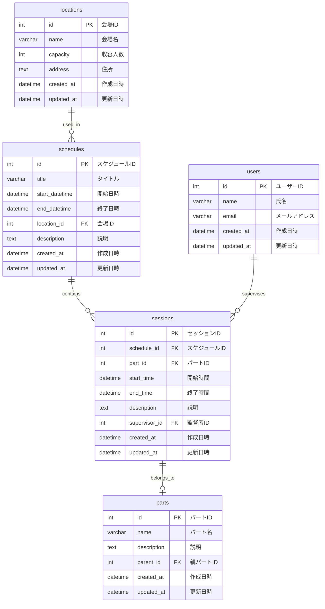

# BACK-API-002.1: 日付範囲・パート別スケジュール取得APIエンドポイント実装

## 概要
練習表自動生成システムにおける日付範囲やパート別のスケジュール情報を取得するAPIエンドポイントをPythonで実装します。指定された期間やパートに基づいて練習スケジュールをフィルタリングし、フロントエンドで表示するために最適化されたフォーマットで返却します。

## 詳細
- 日付範囲（開始日〜終了日）によるスケジュール取得エンドポイント実装
- パートIDに基づくフィルタリング機能実装
- 日付とパートの複合条件によるフィルタリング機能実装
- 取得結果の適切なページネーション処理
- 各種クエリパラメータによるソート機能（日付昇順・降順など）
- スケジュールデータの整形と最適化（不要なデータの削除、関連データの結合）

## 依存関係
- 親タスク: BACK-API-002
- BACK-DB-001.3: 練習スケジュール・セッションテーブル設計
- BACK-API-001: 基本認証システム

## 参照ファイル
- [設計書/06_インターフェース設計.md](../../../../設計書/06_インターフェース設計.md)
- [設計書/11g_実装指針_バックエンド.md](../../../../設計書/11g_実装指針_バックエンド.md)

## 成果物
- スケジュール取得APIエンドポイント実装
- クエリパラメータ処理ロジック
- レスポンスフォーマット最適化機能
- APIドキュメント（OpenAPI/Swagger形式）
- 単体テストコード

## ステータス
- [x] 未開始
- [ ] 進行中
- [ ] レビュー中
- [ ] 完了

## 担当者
未割り当て

## 主要機能
1. **日付範囲フィルタリング**
   - 開始日から終了日までのスケジュール取得
   - 単一日指定によるスケジュール取得
   - 月単位、週単位でのスケジュール一括取得
   - 特定の年月指定によるカレンダー表示用データ取得

2. **パートフィルタリング**
   - 特定パート（謡、踊りなど）に関連するスケジュールのみ取得
   - 複数パート指定による横断的なスケジュール取得
   - パート階層構造を考慮したフィルタリング
   - パート関連属性（レベル、種類など）によるフィルタリング

3. **レスポンスフォーマット**
   - カレンダー表示用の日付ベース構造化データ
   - リスト表示用の時系列ソート済みデータ
   - 詳細表示用の関連情報を含む拡張データ
   - フロントエンドの表示最適化のためのデータ変換

4. **パフォーマンス最適化**
   - クエリの効率化とインデックス最適化
   - レスポンスデータのキャッシュ機構
   - 大量データ取得時のページネーション処理
   - 複雑なJOIN操作の最適化と結果整形

## 実装予定ファイル
以下は実装予定の全ファイルのリストです。各ファイルの役割と目的を簡潔に記載します。

- `app/api/v1/endpoints/schedules.py` - スケジュール取得APIエンドポイント定義
- `app/services/schedule_service.py` - スケジュール取得ビジネスロジック
- `app/repositories/schedule_repository.py` - スケジュールデータアクセス層
- `app/models/schedule.py` - スケジュールデータモデル定義
- `app/schemas/schedule.py` - リクエスト/レスポンススキーマ定義
- `app/core/filtering.py` - 共通フィルタリングロジック
- `app/core/pagination.py` - ページネーション共通ロジック
- `tests/api/test_schedule_endpoints.py` - APIエンドポイントテスト
- `tests/services/test_schedule_service.py` - サービス層テスト
- `tests/repositories/test_schedule_repository.py` - リポジトリ層テスト

## 設計図
### クラス図


### データベース構造図


## 実装アプローチ
### APIエンドポイント実装
1. **FastAPIエンドポイント定義**
   - FastAPIルーターの設定とスケジュールエンドポイント登録
   - 日付範囲、パートIDなどのクエリパラメータ定義
   - OpenAPIドキュメントのためのエンドポイント説明追加
   - 認証要件の設定（JWT認証など）
   - エラーハンドリングとレスポンスコード設定

2. **サービス層実装**
   - リポジトリからのデータ取得とビジネスロジック適用
   - 日付計算（月初から月末、週の開始日から終了日など）
   - レスポンスデータの加工と最適化
   - フロントエンド表示用のデータ変換処理
   - 潜在的なエラーケースの処理とエラーメッセージの定義

3. **データアクセス層実装**
   - SQLAlchemyを使用したORMベースのデータアクセス
   - 効率的なクエリ構築（適切なJOINとWHERE条件）
   - Supabaseとの連携実装
   - パフォーマンスを考慮したクエリ最適化
   - 並行処理に対する考慮（行ロック、トランザクション）

4. **スキーマとバリデーション実装**
   - Pydanticモデルを使用したリクエスト/レスポンススキーマ定義
   - 日付形式、ページネーションパラメータの検証ロジック
   - レスポンスデータの一貫性確保
   - 不適切なリクエストに対するバリデーションエラー処理

## 実装するすべてのファイル構成詳細
以下は全ての実装予定ファイルの詳細です。各ファイルごとに目的とクラス/インターフェース、メソッド、依存関係などを詳しく記載します。

### `app/api/v1/endpoints/schedules.ts`

**目的**: スケジュール取得用のREST APIエンドポイントを定義する

**クラス/関数**:

* **ルーター定義**: `const router = Router()`
* **エンドポイント関数**:

  * `router.get("/schedules/", getSchedulesByDateRange)`
  * `router.get("/schedules/:scheduleId", getScheduleById)`
  * `router.get("/schedules/month/:year/:month", getSchedulesByMonth)`
  * `router.get("/schedules/week/:year/:weekNum", getSchedulesByWeek)`
* **依存関係**:

  * `ScheduleService`: スケジュールサービス（DI）
  * `getCurrentUser`: 認証ユーザー取得（オプション）

### `app/services/schedule_service.ts`

**目的**: スケジュール取得のビジネスロジックを実装する

**クラス**:

* `ScheduleService`:

  * `constructor(private readonly scheduleRepository: ScheduleRepository)`
  * `getSchedulesByDateRange(startDate: Date, endDate: Date, partId?: number, page = 1, limit = 20)`
  * `getScheduleById(scheduleId: number)`
  * `getSchedulesByMonth(year: number, month: number, partId?: number)`
  * `getSchedulesByWeek(year: number, weekNum: number, partId?: number)`
  * `_formatResponseData(schedules: Schedule[]): ScheduleResponse[]`
  * `_optimizeForCalendar(schedules: Schedule[], year: number, month: number): ScheduleResponse[]`
  * `_calculateWeekDates(year: number, weekNum: number): { start: Date, end: Date }`
  * 例外: `ScheduleNotFoundError`, `InvalidDateRangeError`

### `app/repositories/schedule_repository.ts`

**目的**: スケジュールデータへのアクセスロジック

**クラス**:

* `ScheduleRepository`:

  * `constructor(private readonly db: DatabaseSession)`
  * `getSchedulesByDateRange(startDate: Date, endDate: Date, partId?: number, skip = 0, limit = 20)`
  * `getScheduleById(scheduleId: number)`
  * `countSchedulesByFilter(startDate: Date, endDate: Date, partId?: number)`
  * `_buildFilterCriteria(...)`
  * `_joinRelatedTables(query: SelectQueryBuilder<ScheduleModel>)`

### `app/models/schedule.ts`

**目的**: ORMモデル定義

**クラス**:

* `ScheduleModel` (extends `BaseEntity`):

  * `id: number`
  * `title: string`
  * `startDatetime: Date`
  * `endDatetime: Date`
  * `locationId: number`
  * `description?: string`
  * `createdAt: Date`
  * `updatedAt: Date`
  * 関連: `sessions: SessionModel[]`, `location: LocationModel`

* `SessionModel`:

  * `id: number`
  * `scheduleId: number`
  * `partId: number`
  * `startTime: Date`
  * `endTime: Date`
  * `description?: string`
  * `supervisorId?: number`
  * `createdAt: Date`
  * `updatedAt: Date`
  * 関連: `schedule`, `part`, `supervisor`

### `app/schemas/schedule.ts`

**目的**: スケジュール関連のスキーマ

**インターフェース**:

* `ScheduleResponseSchema`:

  * `id: number`
  * `title: string`
  * `startDatetime: Date`
  * `endDatetime: Date`
  * `location: LocationSchema`
  * `description?: string`
  * `sessions: SessionResponseSchema[]`

* `SessionResponseSchema`:

  * `id: number`
  * `part: PartSchema`
  * `startTime: Date`
  * `endTime: Date`
  * `description?: string`
  * `supervisor?: UserSchema`

* `ScheduleQueryParams`:

  * `startDate?: Date`
  * `endDate?: Date`
  * `partId?: number`
  * `page?: number`
  * `limit?: number`

### `app/core/filtering.ts`

**目的**: フィルタロジック

**関数**:

* `applyDateRangeFilter<T>(query: SelectQueryBuilder<T>, fieldStart: string, fieldEnd: string, startDate?: Date, endDate?: Date): SelectQueryBuilder<T>`
* `applyPartFilter<T>(query: SelectQueryBuilder<T>, partId?: number): SelectQueryBuilder<T>`

### `app/core/pagination.ts`

**目的**: ページネーションロジック

**ジェネリック型・関数**:

* `PaginatedResponse<T>`:

  * `items: T[]`
  * `total: number`
  * `page: number`
  * `limit: number`
  * `pages: number`

* `paginate<T>(query: SelectQueryBuilder<T>, page: number, limit: number): Promise<[T[], number]>`


## ファイル間クラス連携図
```mermaid
graph TD
    subgraph "API層"
        EP[schedules.py]
    end
    
    subgraph "サービス層"
        SVC[schedule_service.py]
    end
    
    subgraph "リポジトリ層"
        REPO[schedule_repository.py]
    end
    
    subgraph "モデル層"
        MDL[schedule.py]
    end
    
    subgraph "スキーマ層"
        SCH[schedule.py スキーマ]
    end
    
    subgraph "共通ユーティリティ"
        FLT[filtering.py]
        PAG[pagination.py]
    end
    
    EP --> SVC
    SVC --> REPO
    REPO --> MDL
    EP --> SCH
    REPO --> FLT
    REPO --> PAG
    
    MDL --> SCH: 変換
    
    classDef api fill:#bbf,stroke:#333,stroke-width:2px;
    classDef service fill:#ddf,stroke:#333,stroke-width:1px;
    classDef repo fill:#ffd,stroke:#333,stroke-width:1px;
    classDef model fill:#bfb,stroke:#333,stroke-width:1px;
    classDef util fill:#fdb,stroke:#333,stroke-width:1px;
    
    class EP api;
    class SVC service;
    class REPO repo;
    class MDL,SCH model;
    class FLT,PAG util;
``` 
