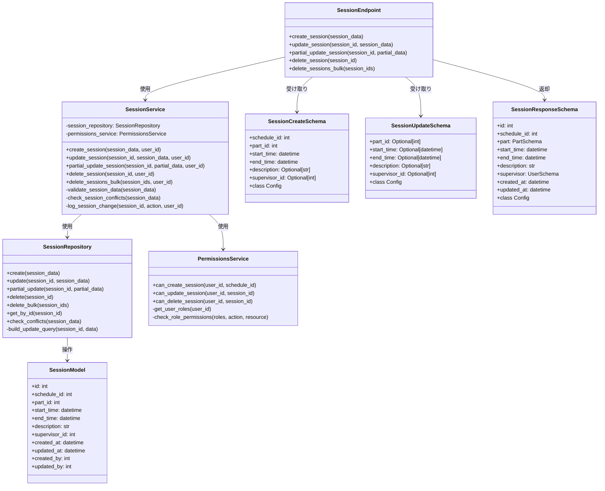
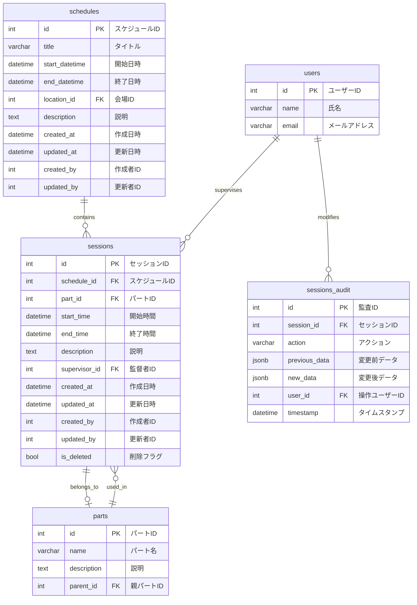
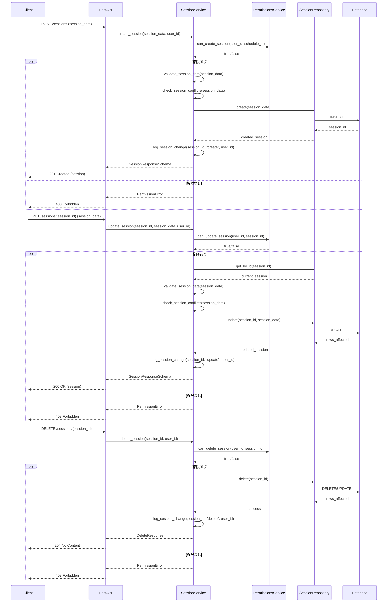
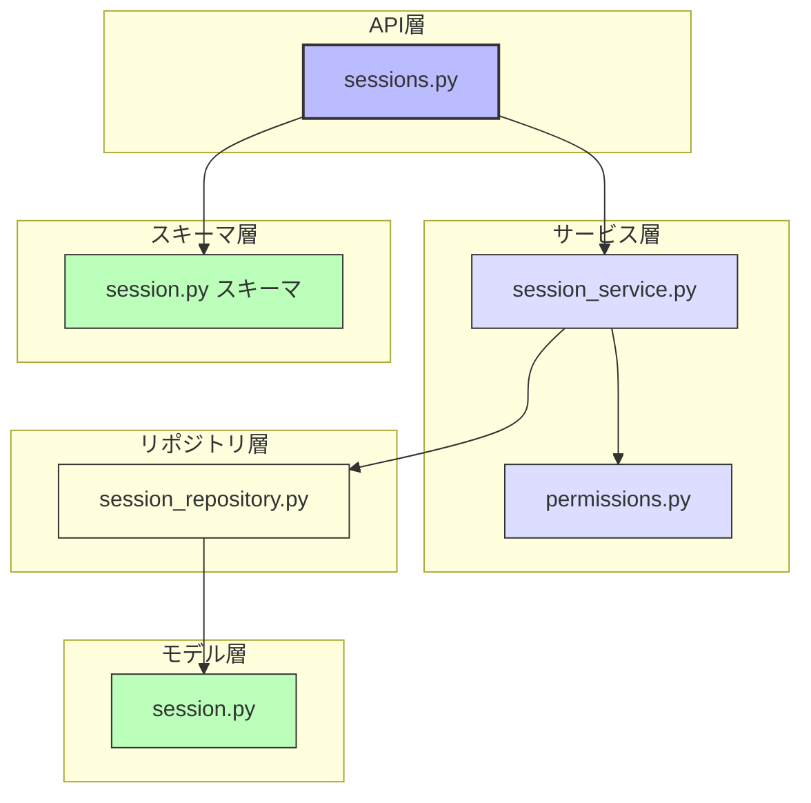

# BACK-API-002.2: 練習セッション作成・更新・削除APIエンドポイント実装

## 概要
練習表自動生成システムにおいて、練習セッションの基本CRUD操作（作成・読取・更新・削除）を行うAPIエンドポイントをPythonで実装します。これにより、ユーザーが練習スケジュールを管理し、セッションの詳細を調整できるようになります。

## 詳細
- 練習セッション作成API（POST）の実装
- 練習セッション更新API（PUT/PATCH）の実装
- 練習セッション削除API（DELETE）の実装
- リクエストデータの検証と整合性チェック機能
- 権限に基づいたアクセス制御の実装
- トランザクション管理による一貫性の確保

## 依存関係
- 親タスク: BACK-API-002
- BACK-DB-001.3: 練習スケジュール・セッションテーブル設計
- BACK-API-001: 基本認証システム

## 参照ファイル
- [設計書/06_インターフェース設計.md](../../../../設計書/06_インターフェース設計.md)
- [設計書/11g_実装指針_バックエンド.md](../../../../設計書/11g_実装指針_バックエンド.md)

## 成果物
- セッション作成・更新・削除APIエンドポイント実装
- リクエスト検証とエラーハンドリング機能
- 権限制御の実装
- APIドキュメント（OpenAPI/Swagger形式）
- 単体テストコード

## ステータス
- [x] 未開始
- [ ] 進行中
- [ ] レビュー中
- [ ] 完了

## 担当者
未割り当て

## 主要機能
1. **セッション作成機能**
   - 新規練習セッションの基本情報登録
   - パート、時間枠、内容、監督者の設定
   - 親スケジュールとの関連付け
   - 作成に関する権限チェック
   - 重複チェックとバリデーション

2. **セッション更新機能**
   - 既存セッションの基本情報更新
   - 部分更新（PATCHメソッド）による効率的な変更
   - 更新に関する権限チェック
   - 更新履歴の記録（監査証跡）
   - バージョン管理の実装（競合解決）

3. **セッション削除機能**
   - 既存セッションの論理削除/物理削除
   - 関連データの整合性確保
   - 削除に関する権限チェック
   - 一括削除機能
   - 復元機能（オプション）

4. **共通機能**
   - 詳細なエラーメッセージと適切なHTTPステータスコード
   - トランザクション管理による一貫性確保
   - パフォーマンス最適化
   - 監査ログ記録
   - 通知機能連携

## 実装予定ファイル
以下は実装予定の全ファイルのリストです。各ファイルの役割と目的を簡潔に記載します。

- `app/api/v1/endpoints/sessions.py` - セッションCRUD APIエンドポイント定義
- `app/services/session_service.py` - セッションCRUDビジネスロジック
- `app/repositories/session_repository.py` - セッションデータアクセス層
- `app/models/session.py` - セッションデータモデル定義
- `app/schemas/session.py` - リクエスト/レスポンススキーマ定義
- `app/core/validation.py` - セッションデータ検証ロジック
- `app/core/permissions.py` - セッション操作権限チェック
- `tests/api/test_session_endpoints.py` - APIエンドポイントテスト
- `tests/services/test_session_service.py` - サービス層テスト
- `tests/repositories/test_session_repository.py` - リポジトリ層テスト

## 設計図
### クラス図

### データベース構造図

### シーケンス図

## 実装アプローチ
### CRUD機能実装
1. **作成（Create）機能**
   - リクエストデータのバリデーション
   - データ整合性の確認（日時の重複、スケジュール範囲内かなど）
   - トランザクション内でのデータ挿入
   - 監査ログの記録
   - 成功/エラー応答の適切な形式化

2. **更新（Update）機能**
   - 既存データの取得と存在確認
   - 更新権限の確認
   - 部分更新（PATCH）と完全更新（PUT）の区別
   - 楽観的ロックによる競合防止
   - 変更履歴の記録

3. **削除（Delete）機能**
   - 論理削除と物理削除の実装
   - 関連データの整合性確保
   - 削除権限の確認
   - 一括削除の効率的実装
   - 削除通知の実装

4. **権限管理**
   - ロールベースのアクセス制御（RBAC）実装
   - きめ細かいアクセス権限設定
   - パート責任者/一般ユーザーの権限差別化
   - 自身が担当するセッションへの特別権限

## 実装するすべてのファイル構成詳細
以下は全ての実装予定ファイルの詳細です。各ファイルごとに目的とクラス/インターフェース、メソッド、依存関係などを詳しく記載します。

### `app/api/v1/endpoints/sessions.py`
**目的**: セッションのCRUD操作を行うREST APIエンドポイントを定義する

**クラス/関数**:
- **ルーター定義**: `router = APIRouter()`
- **エンドポイント関数**:
  - `@router.post("/sessions/", response_model=SessionResponseSchema, status_code=201)`: 新規セッション作成
  - `@router.put("/sessions/{session_id}", response_model=SessionResponseSchema)`: セッション完全更新
  - `@router.patch("/sessions/{session_id}", response_model=SessionResponseSchema)`: セッション部分更新
  - `@router.delete("/sessions/{session_id}", status_code=204)`: セッション削除
  - `@router.post("/sessions/bulk-delete", status_code=204)`: セッション一括削除
- **エラーハンドリング**:
  - `@router.exception_handler(SessionNotFoundError)`: セッション未発見エラー処理
  - `@router.exception_handler(SessionConflictError)`: セッション競合エラー処理
  - `@router.exception_handler(PermissionError)`: 権限エラー処理
- **依存関係**:
  - `SessionService`: セッションサービス（DI）
  - `get_current_user`: 認証ユーザー取得（必須）

### `app/services/session_service.py`
**目的**: セッションのCRUD操作に関するビジネスロジックを実装する

**クラス/インターフェース**:
- `SessionService`: セッション操作サービス
  - **初期化**: `def __init__(self, session_repository: SessionRepository, permissions_service: PermissionsService)`
  - **主要メソッド**:
    - `create_session(session_data: SessionCreateSchema, user_id: int) -> SessionModel`: 新規セッション作成
    - `update_session(session_id: int, session_data: SessionUpdateSchema, user_id: int) -> SessionModel`: セッション完全更新
    - `partial_update_session(session_id: int, partial_data: Dict, user_id: int) -> SessionModel`: セッション部分更新
    - `delete_session(session_id: int, user_id: int) -> bool`: セッション削除
    - `delete_sessions_bulk(session_ids: List[int], user_id: int) -> int`: セッション一括削除
  - **補助メソッド**:
    - `_validate_session_data(session_data: Dict) -> None`: セッションデータのバリデーション
    - `_check_session_conflicts(session_data: Dict) -> None`: セッションの時間的競合チェック
    - `_log_session_change(session_id: int, action: str, user_id: int) -> None`: セッション変更の監査ログ記録
  - **例外処理**:
    - `SessionNotFoundError`: セッションが見つからない場合
    - `SessionConflictError`: セッションの競合がある場合
    - `SessionValidationError`: セッションデータが無効な場合
  - **依存クラス**: `SessionRepository`, `PermissionsService`

### `app/repositories/session_repository.py`
**目的**: セッションデータへのCRUDアクセスロジックを提供する

**クラス/インターフェース**:
- `SessionRepository`: セッションデータアクセス層
  - **初期化**: `def __init__(self, db_session: Session)`
  - **主要メソッド**:
    - `create(session_data: Dict) -> SessionModel`: 新規セッション作成
    - `update(session_id: int, session_data: Dict) -> SessionModel`: セッション完全更新
    - `partial_update(session_id: int, partial_data: Dict) -> SessionModel`: セッション部分更新
    - `delete(session_id: int) -> bool`: セッション削除
    - `delete_bulk(session_ids: List[int]) -> int`: セッション一括削除
    - `get_by_id(session_id: int) -> Optional[SessionModel]`: IDによるセッション取得
    - `check_conflicts(session_data: Dict) -> List[SessionModel]`: 時間的競合チェック
  - **補助メソッド**:
    - `_build_update_query(session_id: int, data: Dict)`: 更新クエリの構築
    - `_log_audit(session_id: int, action: str, prev_data: Dict, new_data: Dict, user_id: int)`: 監査ログ記録
  - **依存クラス**: `SQLAlchemy Session`, `SessionModel`, `SessionAuditModel`

### `app/core/permissions.py`
**目的**: セッション操作の権限チェックロジックを提供する

**クラス/インターフェース**:
- `PermissionsService`: 権限管理サービス
  - **初期化**: `def __init__(self, db_session: Session)`
  - **主要メソッド**:
    - `can_create_session(user_id: int, schedule_id: int) -> bool`: セッション作成権限チェック
    - `can_update_session(user_id: int, session_id: int) -> bool`: セッション更新権限チェック
    - `can_delete_session(user_id: int, session_id: int) -> bool`: セッション削除権限チェック
  - **補助メソッド**:
    - `_get_user_roles(user_id: int) -> List[str]`: ユーザーのロール取得
    - `_check_role_permissions(roles: List[str], action: str, resource: str) -> bool`: ロールベースの権限チェック
    - `_is_part_manager(user_id: int, part_id: int) -> bool`: パート責任者かどうかのチェック
    - `_is_session_supervisor(user_id: int, session_id: int) -> bool`: セッション監督者かどうかのチェック
  - **依存クラス**: `SQLAlchemy Session`, `UserModel`, `RoleModel`, `PartModel`

### `app/schemas/session.py`
**目的**: セッション関連のリクエスト/レスポンススキーマを定義する

**クラス/インターフェース**:
- `SessionCreateSchema`: セッション作成リクエストのPydanticモデル
  - **継承/実装**: `BaseModel` (Pydantic)
  - **フィールド定義**:
    - `schedule_id: int`: スケジュールID
    - `part_id: int`: パートID
    - `start_time: datetime`: 開始時間
    - `end_time: datetime`: 終了時間
    - `description: Optional[str] = None`: 説明
    - `supervisor_id: Optional[int] = None`: 監督者ID
  - **バリデーション**:
    - `@validator('end_time')`: 終了時間が開始時間より後であることを確認
    - `@validator('schedule_id')`: 存在するスケジュールIDであることを確認
    - `@validator('part_id')`: 存在するパートIDであることを確認

- `SessionUpdateSchema`: セッション更新リクエストのPydanticモデル
  - **継承/実装**: `BaseModel` (Pydantic)
  - **フィールド定義**:
    - `part_id: Optional[int] = None`: パートID
    - `start_time: Optional[datetime] = None`: 開始時間
    - `end_time: Optional[datetime] = None`: 終了時間
    - `description: Optional[str] = None`: 説明
    - `supervisor_id: Optional[int] = None`: 監督者ID
  - **バリデーション**:
    - `@validator('end_time')`: 設定される場合、開始時間より後であることを確認
    - `@validator('part_id')`: 設定される場合、存在するパートIDであることを確認

- `SessionResponseSchema`: セッションレスポンスのPydanticモデル
  - **継承/実装**: `BaseModel` (Pydantic)
  - **フィールド定義**:
    - `id: int`: セッションID
    - `schedule_id: int`: スケジュールID
    - `part: PartSchema`: パート情報
    - `start_time: datetime`: 開始時間
    - `end_time: datetime`: 終了時間
    - `description: Optional[str]`: 説明
    - `supervisor: Optional[UserSchema]`: 監督者情報
    - `created_at: datetime`: 作成日時
    - `updated_at: datetime`: 更新日時
  - **設定クラス**: `Config` (ORM対応設定)

- `SessionDeleteMultipleSchema`: セッション一括削除リクエストのPydanticモデル
  - **継承/実装**: `BaseModel` (Pydantic)
  - **フィールド定義**:
    - `session_ids: List[int]`: 削除するセッションIDリスト
  - **バリデーション**:
    - `@validator('session_ids')`: 少なくとも1つのIDが含まれていることを確認

## ファイル間クラス連携図
