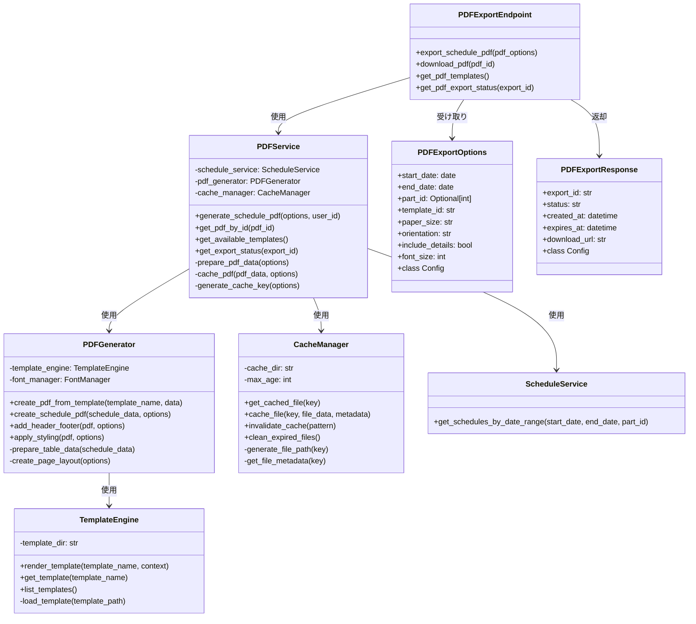
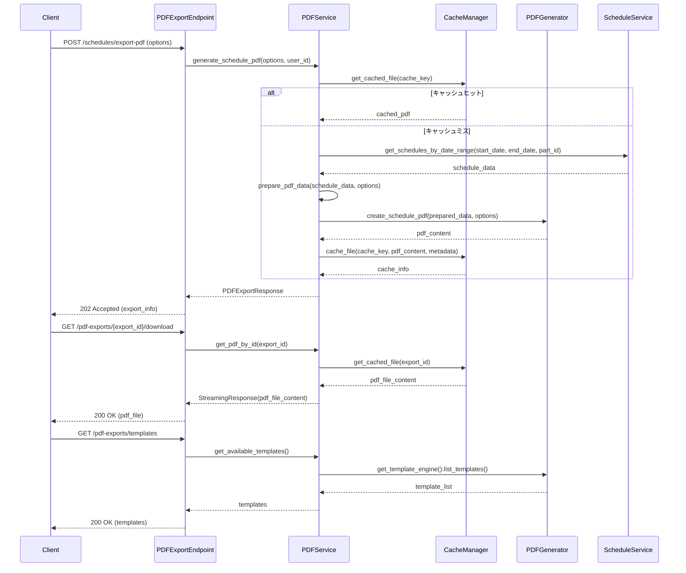
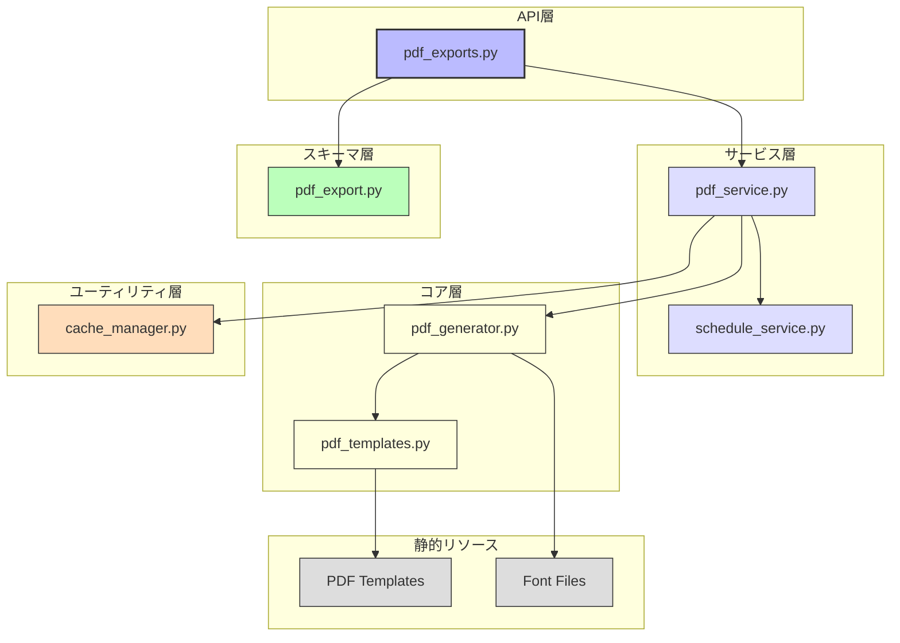

# BACK-API-002.3: スケジュールPDF出力機能とダウンロードAPIエンドポイント実装

## 概要
練習表自動生成システムにおけるスケジュール情報をPDF形式で出力・ダウンロードするためのAPIエンドポイントをPythonで実装します。指定された期間やパートのスケジュールデータを整形し、見やすく印刷可能なPDFに変換して提供します。

## 詳細
- スケジュールデータのPDF変換機能実装
- PDF生成時の各種オプション指定機能（期間、パート、レイアウトなど）
- PDF出力用テンプレート設計と実装
- 生成したPDFファイルのダウンロード用APIエンドポイント実装
- キャッシュ機構による高速なPDF提供

## 依存関係
- 親タスク: BACK-API-002
- BACK-API-002.1: 日付範囲・パート別スケジュール取得APIエンドポイント実装
- BACK-DB-001.3: 練習スケジュール・セッションテーブル設計
- BACK-API-001: 基本認証システム

## 参照ファイル
- [設計書/06_インターフェース設計.md](../../../../設計書/06_インターフェース設計.md)
- [設計書/11g_実装指針_バックエンド.md](../../../../設計書/11g_実装指針_バックエンド.md)

## 成果物
- スケジュールPDF生成機能
- PDF出力用テンプレート
- PDFダウンロードAPIエンドポイント
- PDFキャッシュ管理機能
- 単体テストコード

## ステータス
- [x] 未開始
- [ ] 進行中
- [ ] レビュー中
- [ ] 完了

## 担当者
未割り当て

## 主要機能
1. **PDF生成機能**
   - スケジュールデータのPDF形式への変換
   - 見やすいテーブルレイアウト生成
   - パート別色分け表示
   - ヘッダー・フッター・ページ番号の追加
   - 印刷に最適化された設定

2. **PDFカスタマイズオプション**
   - 日付範囲（開始日〜終了日）指定
   - パート別フィルタリング
   - 表示項目の選択（詳細情報の有無など）
   - 紙のサイズと向き（縦/横）の選択
   - フォントサイズの調整

3. **PDFダウンロード機能**
   - 生成したPDFのストリーミング配信
   - ファイル名とメタデータの適切な設定
   - 適切なMIMEタイプと配信ヘッダーの設定
   - 認証と権限チェック
   - エラーハンドリングとフォールバック

4. **キャッシュ管理**
   - 生成済みPDFのキャッシュ保存
   - キャッシュの有効期限設定
   - キャッシュキーの効率的な生成
   - スケジュール変更時のキャッシュ無効化
   - キャッシュヒット率の最適化

## 実装予定ファイル
以下は実装予定の全ファイルのリストです。各ファイルの役割と目的を簡潔に記載します。

- `app/api/v1/endpoints/pdf_exports.py` - PDF出力・ダウンロードAPIエンドポイント定義
- `app/services/pdf_service.py` - PDF生成と管理のサービス
- `app/core/pdf_generator.py` - PDFファイル生成エンジン
- `app/core/pdf_templates.py` - PDF出力用テンプレート定義
- `app/utils/cache_manager.py` - PDFキャッシュ管理ユーティリティ
- `app/schemas/pdf_export.py` - PDFエクスポート用リクエスト/レスポンススキーマ
- `app/static/templates/pdf/` - PDFテンプレートファイル格納ディレクトリ
- `app/static/fonts/` - PDF用フォントファイル格納ディレクトリ
- `tests/api/test_pdf_export_endpoints.py` - PDF出力APIのテスト
- `tests/services/test_pdf_service.py` - PDFサービスのテスト

## 設計図
### クラス図

### シーケンス図

## 実装アプローチ
### PDF生成機能実装
1. **ライブラリ選定と設定**
   - ReportLabまたはWeasyPrintなどのPDF生成ライブラリ選定
   - Jinja2テンプレートエンジンとの連携設定
   - 日本語フォント設定と文字化け対策
   - パフォーマンス最適化設定
   - エラーハンドリング設定

2. **テンプレート作成**
   - 基本レイアウト設計（マージン、ヘッダー、フッター）
   - テーブル・グリッドデザイン（罫線、セル結合など）
   - スタイル定義（フォント、サイズ、色、強調表示）
   - 複数ページにわたる表の継続表示
   - レスポンシブデザイン（異なる用紙サイズへの対応）

3. **APIエンドポイント実装**
   - リクエストパラメータ定義と検証
   - 非同期処理による大規模PDF生成のサポート
   - ステータス確認エンドポイントの実装
   - エラー状態の通知と処理
   - ファイルダウンロードセキュリティ対策

4. **キャッシュ戦略**
   - キャッシュキーの効率的な生成（パラメータハッシュなど）
   - Redis/ファイルシステムを使用したPDFキャッシュ
   - TTL（Time To Live）によるキャッシュ有効期限設定
   - 参照カウントによるキャッシュクリーンアップ
   - データ変更時のキャッシュ無効化ロジック

## 実装するすべてのファイル構成詳細
以下は全ての実装予定ファイルの詳細です。各ファイルごとに目的とクラス/インターフェース、メソッド、依存関係などを詳しく記載します。

### `app/api/v1/endpoints/pdf_exports.py`
**目的**: スケジュールのPDF出力とダウンロードのためのAPIエンドポイントを定義する

**クラス/関数**:
- **ルーター定義**: `router = APIRouter()`
- **エンドポイント関数**:
  - `@router.post("/schedules/export-pdf", response_model=PDFExportResponse)`: スケジュールPDF出力リクエスト
  - `@router.get("/pdf-exports/{export_id}/download")`: 生成済みPDFダウンロード
  - `@router.get("/pdf-exports/{export_id}", response_model=PDFExportResponse)`: PDF出力ステータス確認
  - `@router.get("/pdf-exports/templates", response_model=List[PDFTemplateInfo])`: 利用可能なPDFテンプレート一覧取得
- **エラーハンドリング**:
  - `@router.exception_handler(PDFExportError)`: PDF出力エラー処理
  - `@router.exception_handler(PDFNotFoundError)`: PDF未発見エラー処理
- **依存関係**:
  - `PDFService`: PDFサービス（DI）
  - `get_current_user`: 認証ユーザー取得

### `app/services/pdf_service.py`
**目的**: PDFの生成、管理、キャッシュなどビジネスロジックを実装する

**クラス/インターフェース**:
- `PDFService`: PDF操作サービス
  - **初期化**: `def __init__(self, schedule_service: ScheduleService, pdf_generator: PDFGenerator, cache_manager: CacheManager)`
  - **主要メソッド**:
    - `generate_schedule_pdf(options: PDFExportOptions, user_id: int) -> PDFExportResponse`: スケジュールPDF生成
    - `get_pdf_by_id(export_id: str) -> Tuple[BytesIO, str]`: 生成済みPDFの取得
    - `get_available_templates() -> List[PDFTemplateInfo]`: 利用可能なテンプレート一覧取得
    - `get_export_status(export_id: str) -> PDFExportResponse`: PDF出力ステータス確認
  - **補助メソッド**:
    - `_prepare_pdf_data(schedule_data: List[Dict], options: PDFExportOptions) -> Dict`: PDF生成用データ準備
    - `_cache_pdf(pdf_data: BytesIO, options: PDFExportOptions, user_id: int) -> PDFExportResponse`: PDF保存とキャッシュ
    - `_generate_cache_key(options: PDFExportOptions, user_id: int) -> str`: キャッシュキー生成
    - `_check_existing_export(cache_key: str) -> Optional[PDFExportResponse]`: 既存出力の確認
  - **例外処理**:
    - `PDFExportError`: PDF生成エラー
    - `PDFNotFoundError`: PDF未発見エラー
  - **依存クラス**: `ScheduleService`, `PDFGenerator`, `CacheManager`

### `app/core/pdf_generator.py`
**目的**: スケジュールデータを使用してPDFファイルを実際に生成する

**クラス/インターフェース**:
- `PDFGenerator`: PDF生成エンジン
  - **初期化**: `def __init__(self, template_engine: TemplateEngine, config: Dict = None)`
  - **主要メソッド**:
    - `create_pdf_from_template(template_name: str, data: Dict) -> BytesIO`: テンプレートからPDF生成
    - `create_schedule_pdf(schedule_data: Dict, options: PDFExportOptions) -> BytesIO`: スケジュール専用PDF生成
    - `add_header_footer(pdf: BytesIO, options: Dict) -> BytesIO`: ヘッダー・フッター追加
    - `apply_styling(pdf: BytesIO, options: Dict) -> BytesIO`: スタイル適用
  - **補助メソッド**:
    - `_prepare_table_data(schedule_data: Dict) -> List[List]`: テーブルデータ準備
    - `_create_page_layout(options: Dict) -> Dict`: ページレイアウト設定
    - `_register_fonts() -> None`: フォント登録
    - `_create_table_style(options: Dict) -> List`: テーブルスタイル定義
  - **依存クラス**: `TemplateEngine`, `reportlab.platypus`, `reportlab.lib`

### `app/core/pdf_templates.py`
**目的**: PDF生成に使用するテンプレートエンジンとテンプレート管理

**クラス/インターフェース**:
- `TemplateEngine`: テンプレートエンジン
  - **初期化**: `def __init__(self, template_dir: str = None)`
  - **主要メソッド**:
    - `render_template(template_name: str, context: Dict) -> str`: テンプレートレンダリング
    - `get_template(template_name: str) -> Template`: テンプレート取得
    - `list_templates() -> List[PDFTemplateInfo]`: 利用可能テンプレート一覧
  - **補助メソッド**:
    - `_load_template(template_path: str) -> Template`: テンプレート読み込み
    - `_get_template_metadata(template_name: str) -> Dict`: テンプレートメタデータ取得
  - **依存クラス**: `jinja2.Environment`, `jinja2.FileSystemLoader`

### `app/utils/cache_manager.py`
**目的**: 生成されたPDFファイルのキャッシュを管理する

**クラス/インターフェース**:
- `CacheManager`: キャッシュ管理
  - **初期化**: `def __init__(self, cache_dir: str = None, max_age: int = 3600)`
  - **主要メソッド**:
    - `get_cached_file(key: str) -> Optional[Tuple[BytesIO, Dict]]`: キャッシュされたファイル取得
    - `cache_file(key: str, file_data: BytesIO, metadata: Dict) -> Dict`: ファイルをキャッシュに保存
    - `invalidate_cache(pattern: str) -> int`: 指定パターンのキャッシュを無効化
    - `clean_expired_files() -> int`: 期限切れファイルの削除
  - **補助メソッド**:
    - `_generate_file_path(key: str) -> str`: キャッシュファイルパス生成
    - `_get_file_metadata(key: str) -> Optional[Dict]`: ファイルメタデータ取得
    - `_save_metadata(key: str, metadata: Dict) -> None`: メタデータ保存
    - `_is_expired(metadata: Dict) -> bool`: 期限切れ確認
  - **依存クラス**: `os`, `time`, `json`

### `app/schemas/pdf_export.py`
**目的**: PDF出力関連のリクエスト/レスポンススキーマを定義する

**クラス/インターフェース**:
- `PDFExportOptions`: PDFエクスポートオプションのPydanticモデル
  - **継承/実装**: `BaseModel` (Pydantic)
  - **フィールド定義**:
    - `start_date: date`: 開始日
    - `end_date: date`: 終了日
    - `part_id: Optional[int] = None`: パートID
    - `template_id: str = "default"`: テンプレートID
    - `paper_size: str = "A4"`: 用紙サイズ
    - `orientation: str = "portrait"`: 向き（縦/横）
    - `include_details: bool = True`: 詳細情報を含めるか
    - `font_size: int = 10`: フォントサイズ
  - **バリデーション**:
    - `@validator('end_date')`: 終了日が開始日以降であることを確認
    - `@validator('paper_size')`: サポートされている用紙サイズであることを確認
    - `@validator('orientation')`: "portrait"または"landscape"であることを確認
    - `@validator('font_size')`: 8〜14の範囲内であることを確認

- `PDFExportResponse`: PDFエクスポートレスポンスのPydanticモデル
  - **継承/実装**: `BaseModel` (Pydantic)
  - **フィールド定義**:
    - `export_id: str`: エクスポートID
    - `status: str`: ステータス（"processing", "completed", "failed"）
    - `created_at: datetime`: 作成日時
    - `expires_at: datetime`: 有効期限
    - `download_url: Optional[str]`: ダウンロードURL
    - `error_message: Optional[str]`: エラーメッセージ

- `PDFTemplateInfo`: PDFテンプレート情報のPydanticモデル
  - **継承/実装**: `BaseModel` (Pydantic)
  - **フィールド定義**:
    - `id: str`: テンプレートID
    - `name: str`: テンプレート名
    - `description: str`: 説明
    - `preview_url: Optional[str]`: プレビューURL
    - `supported_options: Dict[str, Any]`: サポートされているオプション

## ファイル間クラス連携図
