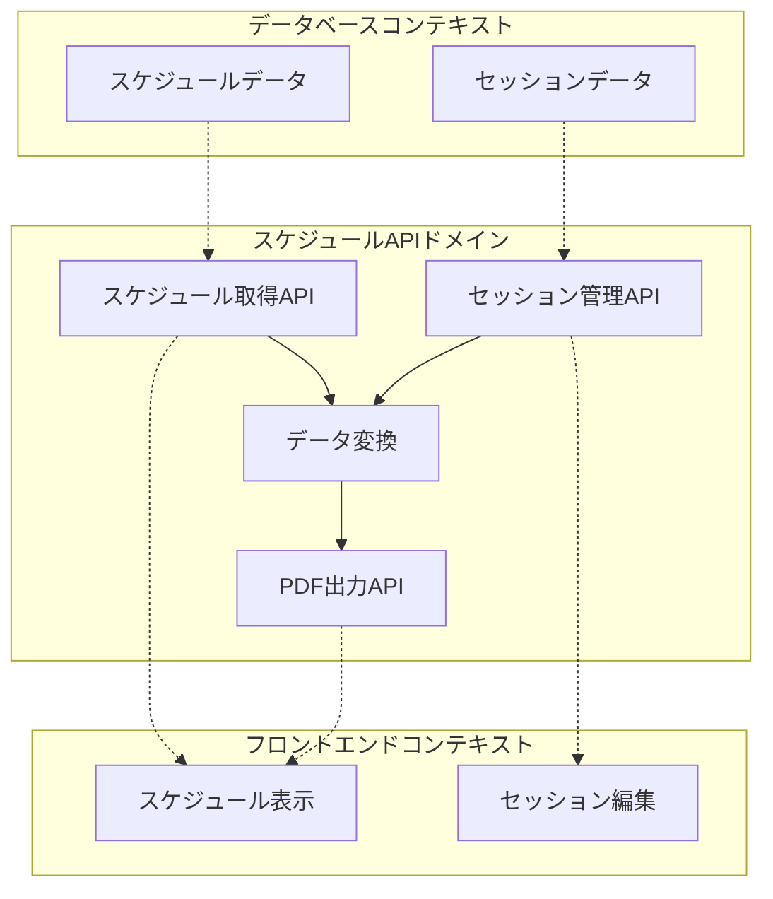
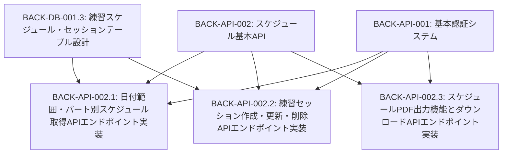
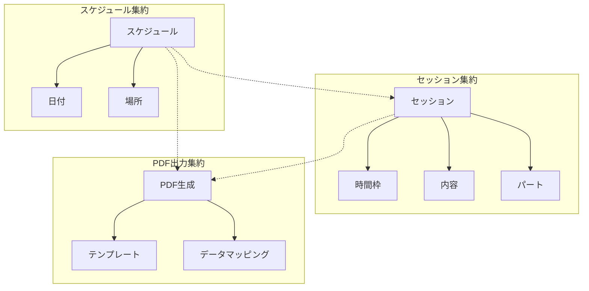
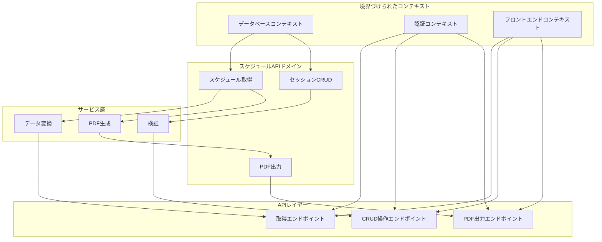

# BACK-API-002: スケジュール基本API

## ドメインの概要
スケジュール基本APIドメインは、練習表に関する基本的な操作を提供するインターフェースを実装します。日付範囲やパート別のスケジュール取得、練習セッションの作成・更新・削除機能、およびスケジュールのPDF出力機能を提供し、フロントエンドとの連携を実現します。

## ドメインモデルと境界づけられたコンテキスト

## ユビキタス言語

| 用語 | 定義 |
|------|------|
| 練習スケジュール | 特定の日時、場所、内容を持つ練習の予定 |
| セッション | 個別の練習単位（時間枠と内容） |
| 日付範囲 | スケジュール取得の際に指定する期間 |
| パート別スケジュール | 特定のパート（謡・踊など）に関連する練習予定 |
| PDF出力 | スケジュール情報を印刷可能なPDFフォーマットに変換する機能 |
| API | アプリケーションプログラミングインターフェース |
| エンドポイント | 特定の機能を提供するAPIのURLパス |
| CRUD | Create, Read, Update, Delete（作成・読取・更新・削除）の基本操作 |

## サブドメイン構成

## サブドメイン詳細

### BACK-API-002.1: 日付範囲・パート別スケジュール取得APIエンドポイント実装
**ドメイン責務**: 日付範囲やパートを指定して練習スケジュールを取得するAPIエンドポイントを実装する

**ドメインサービス**:
- スケジュール検索サービス（日付範囲・パートによるフィルタリング）
- データ整形サービス（取得データの構造化・最適化）

**ステータス**: 未開始

### BACK-API-002.2: 練習セッション作成・更新・削除APIエンドポイント実装
**ドメイン責務**: 練習セッションのCRUD操作を提供するAPIエンドポイントを実装する

**ドメインサービス**:
- セッション管理サービス（セッションの作成・更新・削除処理）
- 整合性検証サービス（セッションデータの有効性確認）

**ステータス**: 未開始

### BACK-API-002.3: スケジュールPDF出力機能とダウンロードAPIエンドポイント実装
**ドメイン責務**: スケジュールデータをPDF形式に変換し、ダウンロード可能なAPIエンドポイントを実装する

**ドメインサービス**:
- PDF生成サービス（スケジュールデータのPDF変換）
- ファイル配信サービス（生成したPDFのダウンロード提供）

**ステータス**: 未開始

## コマンド・クエリ責務分離（CQRS）

### コマンド（書き込み操作）
- 練習セッション作成
- 練習セッション更新
- 練習セッション削除
- PDFファイル生成

### クエリ（読み取り操作）
- 日付範囲によるスケジュール取得
- パート別スケジュール取得
- 個別セッション詳細取得
- PDFファイルダウンロード

## 集約と整合性境界

## 開発コンテキスト図

## 進捗管理

| サブドメイン | ステータス | 担当者 | 開始日 | 完了予定 | 実際の完了日 |
|------------|-----------|--------|-------|---------|------------|
| BACK-API-002.1 | 未開始 | | | | |
| BACK-API-002.2 | 未開始 | | | | |
| BACK-API-002.3 | 未開始 | | | | |

## イベントストーミング

## 課題・リスク

- パフォーマンス（大量のスケジュールデータ取得時の応答速度）
- 複雑なフィルタリング条件への対応
- PDF生成時の書式・レイアウト対応
- 並行編集による競合問題
- セッション削除時の参照整合性確保

## レビューポイント

- APIインターフェースの一貫性と使いやすさ
- 認証と権限チェックの適切な実装
- 大量データ処理時のパフォーマンス
- エラーハンドリングの網羅性
- PDF出力のレイアウトと表示品質

## リファレンス

- [設計書/06_インターフェース設計.md](../../../設計書/06_インターフェース設計.md)
- [設計書/11g_実装指針_バックエンド.md](../../../設計書/11g_実装指針_バックエンド.md) 