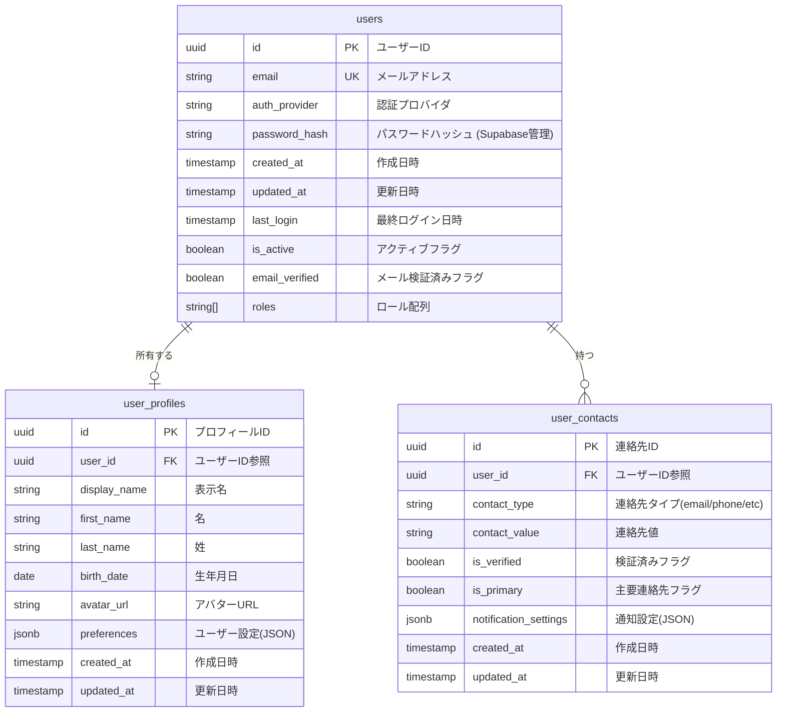

# BACK-DB-001.1: ユーザーアカウント・プロフィールテーブル設計

## 概要
練習表自動生成システムのユーザー情報を管理するデータベース構造をPythonとSupabaseを用いて設計・実装します。ユーザーの認証情報、個人プロフィール、連絡先情報を適切に管理し、システム全体のユーザー管理基盤を構築します。

## 詳細
- ユーザーアカウントテーブル設計と実装（認証情報管理）
- ユーザープロフィールテーブル設計と実装（個人情報管理）
- ユーザー連絡先テーブル設計と実装（連絡手段の管理）
- 外部キー制約と参照整合性の設定
- インデックス設計とパフォーマンス最適化

## 依存関係
- 親タスク: BACK-DB-001
- BACK-API-001.1: メールアドレス・パスワードによるログイン/ログアウトAPI実装

## 参照ファイル
- [設計書/10_データモデル_1_概要と主要エンティティ.md](../../../../../設計書/10_データモデル_1_概要と主要エンティティ.md)
- [設計書/11b_ER図詳細.md](../../../../../設計書/11b_ER図詳細.md)
- [設計書/11g_実装指針_バックエンド.md](../../../../../設計書/11g_実装指針_バックエンド.md)

## 成果物
- ユーザーアカウントテーブルSQL定義
- ユーザープロフィールテーブルSQL定義
- 連絡先テーブルSQL定義
- マイグレーションスクリプト
- Pythonデータモデル（Pydanticモデル）
- データアクセスレイヤーコード

## ステータス
- [x] 未開始
- [ ] 進行中
- [ ] レビュー中
- [ ] 完了

## 担当者
未割り当て

## 主要機能
1. **ユーザーアカウント管理**
   - ユーザーID管理（一意識別子）
   - 認証情報管理（ログイン資格情報）
   - アカウント状態管理（有効/無効/ロック等）
   - 最終ログイン情報の追跡

2. **プロフィール情報管理**
   - 基本情報管理（氏名、生年月日など）
   - 表示名と公開情報の設定
   - プロフィール画像のメタデータ管理
   - ユーザー設定の保存

3. **連絡先情報管理**
   - 複数連絡手段の登録と管理
   - 通知設定と配信設定
   - 優先連絡手段の設定
   - 連絡先検証状態の管理

## 実装予定ファイル
以下は実装予定の全ファイルのリストです。各ファイルの役割と目的を簡潔に記載します。

- `migrations/user_account.sql` - ユーザーアカウントテーブル定義SQL
- `migrations/user_profile.sql` - ユーザープロフィールテーブル定義SQL
- `migrations/user_contact.sql` - ユーザー連絡先テーブル定義SQL
- `app/models/user.py` - ユーザー関連Pydanticモデル定義
- `app/repositories/user_repository.py` - ユーザーデータアクセスレイヤー
- `app/schemas/user_schemas.py` - ユーザーAPI用スキーマ定義
- `app/services/user_service.py` - ユーザーサービスロジック
- `tests/models/test_user_models.py` - ユーザーモデルのテスト
- `tests/repositories/test_user_repository.py` - リポジトリのテスト

## 設計図
### データベース構造図

## 実装アプローチ
### データベース設計と実装
1. **テーブル構造設計**
   - 正規化レベルの決定（第3正規形を基本）
   - 列タイプとデフォルト値の決定
   - 制約条件の定義（PK, FK, UK, Check制約）
   - インデックス戦略の設計

2. **マイグレーションスクリプト作成**
   - テーブル作成SQLの記述
   - インデックス作成SQLの記述
   - RLSポリシー設定
   - Supabase用マイグレーションファイル構成

### Pythonモデル実装
1. **データモデル設計**
   - Pydanticベースモデルの実装
   - バリデーションルールの定義
   - モデル間の関連付け
   - シリアル化/デシリアル化の実装

## 実装するすべてのファイル構成詳細
以下は全ての実装予定ファイルの詳細です。各ファイルごとに目的とクラス、メソッド、依存関係などを詳しく記載します。

### `migrations/user_account.sql`
**目的**: ユーザーアカウント情報を格納するテーブルを定義するSQL

**主要内容**:
- `users`テーブルの作成
- 主キー、一意制約、インデックスの設定
- RLSポリシー（行レベルセキュリティ）の設定
- コメントと説明の追加

### `migrations/user_profile.sql`
**目的**: ユーザーの個人プロフィール情報を格納するテーブルを定義するSQL

**主要内容**:
- `user_profiles`テーブルの作成
- 外部キー制約の設定
- インデックスの設定
- RLSポリシーの設定

### `migrations/user_contact.sql`
**目的**: ユーザーの連絡先情報を格納するテーブルを定義するSQL

**主要内容**:
- `user_contacts`テーブルの作成
- 外部キー制約の設定
- 一意制約の設定
- インデックスの設定
- RLSポリシーの設定

### `app/models/user.py`
**目的**: ユーザー関連のドメインモデルを定義するPythonファイル

**クラス/インターフェース**:
- `User`: ユーザーアカウントのドメインモデル
  - **継承/実装**: `pydantic.BaseModel`
  - **主要属性**:
    - `id: UUID` - ユーザーID
    - `email: str` - メールアドレス
    - `auth_provider: str` - 認証プロバイダ
    - `created_at: datetime` - 作成日時
    - `updated_at: datetime` - 更新日時
    - `last_login: Optional[datetime]` - 最終ログイン日時
    - `is_active: bool` - アクティブフラグ
    - `email_verified: bool` - メール検証済みフラグ
    - `roles: List[str]` - ロール配列
  - **主要メソッド**: 
    - `is_admin() -> bool` - 管理者かどうかを確認
    - `has_role(role: str) -> bool` - 特定のロールを持っているか確認
    - `to_dict() -> dict` - 辞書形式に変換
  - **依存クラス**: なし

- `UserProfile`: ユーザープロフィールのドメインモデル
  - **継承/実装**: `pydantic.BaseModel`
  - **主要属性**:
    - `id: UUID` - プロフィールID
    - `user_id: UUID` - ユーザーID参照
    - `display_name: str` - 表示名
    - `first_name: Optional[str]` - 名
    - `last_name: Optional[str]` - 姓
    - `birth_date: Optional[date]` - 生年月日
    - `avatar_url: Optional[str]` - アバターURL
    - `preferences: Dict[str, Any]` - ユーザー設定
    - `created_at: datetime` - 作成日時
    - `updated_at: datetime` - 更新日時
  - **主要メソッド**: 
    - `full_name() -> str` - フルネームを取得
    - `age() -> Optional[int]` - 年齢を計算
    - `to_dict() -> dict` - 辞書形式に変換
  - **依存クラス**: なし

- `UserContact`: ユーザー連絡先のドメインモデル
  - **継承/実装**: `pydantic.BaseModel`
  - **主要属性**:
    - `id: UUID` - 連絡先ID
    - `user_id: UUID` - ユーザーID参照
    - `contact_type: str` - 連絡先タイプ
    - `contact_value: str` - 連絡先値
    - `is_verified: bool` - 検証済みフラグ
    - `is_primary: bool` - 主要連絡先フラグ
    - `notification_settings: Dict[str, bool]` - 通知設定
    - `created_at: datetime` - 作成日時
    - `updated_at: datetime` - 更新日時
  - **主要メソッド**: 
    - `format_contact() -> str` - 連絡先を整形
    - `can_notify(notification_type: str) -> bool` - 通知可能か確認
    - `to_dict() -> dict` - 辞書形式に変換
  - **依存クラス**: なし

### `app/repositories/user_repository.py`
**目的**: ユーザー関連データのデータアクセス層を実装するPythonファイル

**クラス/インターフェース**:
- `UserRepository`: ユーザーデータにアクセスするリポジトリクラス
  - **継承/実装**: なし
  - **主要属性**:
    - `_db_client` - データベースクライアント
    - `_logger` - ロガー
  - **主要メソッド**: 
    - `__init__(db_client)` - コンストラクタ
    - `get_by_id(user_id: UUID) -> Optional[User]` - IDでユーザーを取得
    - `get_by_email(email: str) -> Optional[User]` - メールでユーザーを取得
    - `create(user_data: dict) -> User` - ユーザーを作成
    - `update(user_id: UUID, update_data: dict) -> User` - ユーザーを更新
    - `delete(user_id: UUID) -> bool` - ユーザーを削除
    - `get_profile(user_id: UUID) -> Optional[UserProfile]` - プロフィールを取得
    - `update_profile(user_id: UUID, profile_data: dict) -> UserProfile` - プロフィール更新
    - `get_contacts(user_id: UUID) -> List[UserContact]` - 連絡先リスト取得
    - `add_contact(user_id: UUID, contact_data: dict) -> UserContact` - 連絡先追加
    - `delete_contact(contact_id: UUID) -> bool` - 連絡先削除
  - **依存クラス**: `User`, `UserProfile`, `UserContact`

### `app/schemas/user_schemas.py`
**目的**: API通信用のユーザー関連データスキーマを定義するPythonファイル

**クラス/インターフェース**:
- `UserCreate`: ユーザー作成リクエストスキーマ
  - **継承/実装**: `pydantic.BaseModel`
  - **主要属性**:
    - `email: EmailStr` - メールアドレス
    - `password: str` - パスワード
    - `display_name: str` - 表示名
    - `first_name: Optional[str]` - 名
    - `last_name: Optional[str]` - 姓
  - **主要メソッド**: 
    - `validate_password(cls, v) -> str` - パスワード検証

- `UserResponse`: ユーザー情報レスポンススキーマ
  - **継承/実装**: `pydantic.BaseModel`
  - **主要属性**:
    - `id: UUID` - ユーザーID
    - `email: str` - メールアドレス
    - `is_active: bool` - アクティブ状態
    - `email_verified: bool` - メール検証状態
    - `roles: List[str]` - ロール
    - `created_at: datetime` - 作成日時
    - `profile: Optional[ProfileResponse]` - プロフィール情報

- `ProfileResponse`: プロフィール情報レスポンススキーマ
  - **継承/実装**: `pydantic.BaseModel`
  - **主要属性**:
    - `display_name: str` - 表示名
    - `first_name: Optional[str]` - 名
    - `last_name: Optional[str]` - 姓
    - `avatar_url: Optional[str]` - アバターURL
    - `preferences: Dict[str, Any]` - 設定

- `ContactResponse`: 連絡先情報レスポンススキーマ
  - **継承/実装**: `pydantic.BaseModel`
  - **主要属性**:
    - `id: UUID` - 連絡先ID
    - `contact_type: str` - 連絡先タイプ
    - `contact_value: str` - 連絡先値
    - `is_verified: bool` - 検証状態
    - `is_primary: bool` - 主要連絡先かどうか

### `app/services/user_service.py`
**目的**: ユーザー関連のビジネスロジックを実装するサービスクラスのPythonファイル

**クラス/インターフェース**:
- `UserService`: ユーザー関連のビジネスロジックを実装するサービス
  - **継承/実装**: なし
  - **主要属性**:
    - `_user_repository: UserRepository` - ユーザーリポジトリ
    - `_auth_service` - 認証サービス
    - `_logger` - ロガー
  - **主要メソッド**: 
    - `__init__(user_repository: UserRepository, auth_service)` - コンストラクタ
    - `register_user(user_data: UserCreate) -> UserResponse` - ユーザー登録
    - `get_user_by_id(user_id: UUID) -> Optional[UserResponse]` - ユーザー取得
    - `update_user_profile(user_id: UUID, profile_data: dict) -> ProfileResponse` - プロフィール更新
    - `add_user_contact(user_id: UUID, contact_data: dict) -> ContactResponse` - 連絡先追加
    - `verify_contact(user_id: UUID, contact_id: UUID, verification_code: str) -> bool` - 連絡先検証
    - `update_user_preferences(user_id: UUID, preferences: dict) -> ProfileResponse` - 設定更新
    - `deactivate_user(user_id: UUID) -> bool` - ユーザー無効化
    - `reactivate_user(user_id: UUID) -> bool` - ユーザー再有効化
    - `assign_role(user_id: UUID, role: str) -> bool` - ロール付与
    - `remove_role(user_id: UUID, role: str) -> bool` - ロール削除
  - **依存クラス**: `UserRepository`, `UserCreate`, `UserResponse`, `ProfileResponse`, `ContactResponse`

### `tests/models/test_user_models.py`
**目的**: ユーザーモデルのユニットテストを実装するPythonファイル

**クラス/インターフェース**:
- `TestUserModel`: ユーザーモデルのテストクラス
  - **継承/実装**: `unittest.TestCase`
  - **主要メソッド**: 
    - `setUp()` - テスト準備
    - `test_create_user()` - ユーザー作成テスト
    - `test_user_roles()` - ユーザーロールテスト
    - `test_is_admin()` - 管理者判定テスト
    - `test_to_dict()` - 辞書変換テスト

- `TestUserProfileModel`: ユーザープロフィールモデルのテストクラス
  - **継承/実装**: `unittest.TestCase`
  - **主要メソッド**: 
    - `setUp()` - テスト準備
    - `test_create_profile()` - プロフィール作成テスト
    - `test_full_name()` - フルネームテスト
    - `test_age_calculation()` - 年齢計算テスト

- `TestUserContactModel`: ユーザー連絡先モデルのテストクラス
  - **継承/実装**: `unittest.TestCase`
  - **主要メソッド**: 
    - `setUp()` - テスト準備
    - `test_create_contact()` - 連絡先作成テスト
    - `test_format_contact()` - 連絡先整形テスト
    - `test_notification_settings()` - 通知設定テスト

### `tests/repositories/test_user_repository.py`
**目的**: ユーザーリポジトリのユニットテストを実装するPythonファイル

**クラス/インターフェース**:
- `TestUserRepository`: ユーザーリポジトリのテストクラス
  - **継承/実装**: `unittest.TestCase`
  - **主要メソッド**: 
    - `setUp()` - テスト準備
    - `tearDown()` - テスト後処理
    - `test_get_by_id()` - ID取得テスト
    - `test_get_by_email()` - メール取得テスト
    - `test_create_user()` - ユーザー作成テスト
    - `test_update_user()` - ユーザー更新テスト
    - `test_get_profile()` - プロフィール取得テスト
    - `test_update_profile()` - プロフィール更新テスト
    - `test_get_contacts()` - 連絡先取得テスト
    - `test_add_contact()` - 連絡先追加テスト
    - `test_delete_contact()` - 連絡先削除テスト 